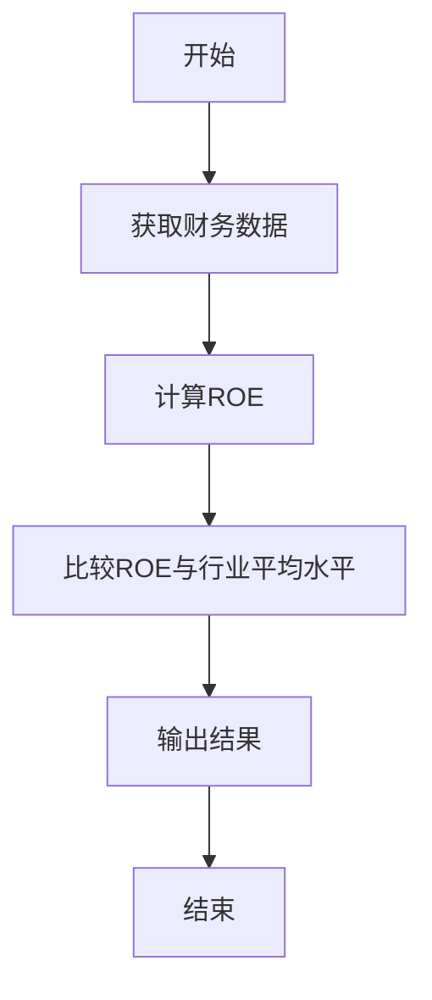
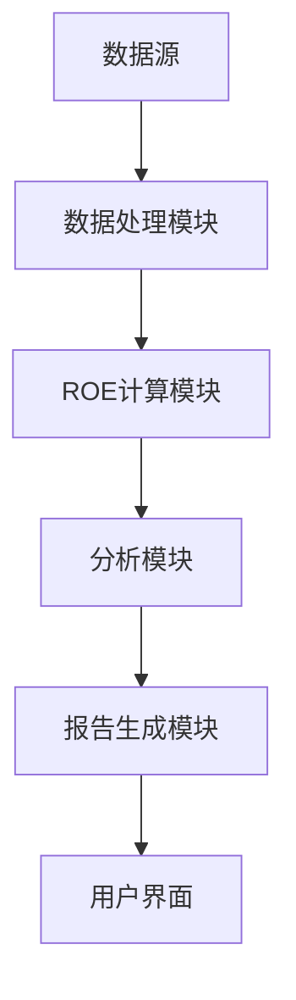

                 


# 彼得林奇对公司资本回报率趋势的分析

## 关键词：资本回报率、彼得林奇、投资策略、ROE、ROA、财务分析

## 摘要：本文深入分析彼得·林奇对资本回报率的见解，探讨其趋势、计算方法及影响因素。通过技术博客的形式，详细讲解资本回报率的算法、数学模型、系统架构设计及项目实战，帮助读者掌握资本回报率的分析方法。

---

## 第一部分：资本回报率的基础与背景

### 第1章：资本回报率的基本概念

#### 1.1 资本回报率的定义与重要性

- **1.1.1 资本回报率的定义**
  资本回报率（Return on Equity, ROE）是衡量公司盈利能力的重要指标，表示每单位股东权益创造的净利润。ROE = 净利润 / 平均股东权益。

- **1.1.2 资本回报率的重要性**
  ROE高的公司通常更吸引投资者，因为它们能更有效地利用股东资金创造利润。彼得·林奇在其投资生涯中，尤为关注ROE的趋势和变化。

- **1.1.3 彼得·林奇对资本回报率的重视**
  林奇认为，高ROE的公司往往具有更强的盈利能力和竞争优势，是长期投资的理想目标。

#### 1.2 资本回报率的计算方法

- **1.2.1 净资产收益率（ROE）的计算**
  ROE = 净利润 / 平均股东权益

- **1.2.2 资产回报率（ROA）的计算**
  ROA = 净利润 / 平均总资产

- **1.2.3 股东权益回报率（ROE）与其他指标的对比**
  通过对比表格展示ROE、ROA、ROI的区别与适用场景：

| 指标 | 公式 | 优点 | 缺点 |
|------|------|------|------|
| ROE | 净利润 / 平均股东权益 | 直接反映股东资金的盈利能力 | 受公司杠杆影响较大 |
| ROA | 净利润 / 平均总资产 | 考虑了所有资产的利用效率 | 受资产结构影响 |
| ROI | 净利润 / 投资 | 适用于评估单项投资 | 不考虑资金的时间价值 |

#### 1.3 彼得·林奇的投资策略

- **1.3.1 林奇的投资哲学**
  林奇注重基本面分析，寻找那些具有持续增长潜力的公司，尤其是那些能够维持高ROE的公司。

- **1.3.2 林奇对资本回报率的关注点**
  林奇不仅关注ROE的高低，还关注其变化趋势，寻找ROE持续增长的公司。

- **1.3.3 林奇的成功案例分析**
  例如，可口可乐在林奇管理时期ROE持续增长，成为其投资组合中的明星股。

---

## 第二部分：资本回报率的趋势分析

### 第2章：资本回报率的趋势与影响因素

#### 2.1 资本回报率的历史趋势

- **2.1.1 过去十年的资本回报率变化**
  分析过去十年ROE的趋势，发现科技行业ROE增长显著，而传统制造业ROE则波动较大。

- **2.1.2 不同行业间的资本回报率差异**
  例如，科技行业ROE普遍高于传统行业，金融行业的ROE受杠杆率影响较大。

- **2.1.3 经济周期对资本回报率的影响**
  经济繁荣时期ROE普遍上升，经济衰退时期ROE下降，尤其是对于负债较高的行业。

#### 2.2 影响资本回报率的因素

- **2.2.1 利润率的变化**
  利润率上升通常会导致ROE上升，反之亦然。

- **2.2.2 资产周转率的影响**
  高资产周转率意味着公司更高效地利用资产，通常会提高ROE。

- **2.2.3 财务杠杆的作用**
  通过杠杆效应，公司可以以较低的ROE实现较高的净利润，但这会增加财务风险。

#### 2.3 资本回报率的未来趋势预测

- **2.3.1 经济环境的变化**
  预测未来经济环境对ROE的影响，如通胀压力可能压缩企业利润，从而降低ROE。

- **2.3.2 技术进步对资本回报率的影响**
  技术进步通常会提高资产周转率，从而提升ROE，尤其是在科技行业。

- **2.3.3 行业结构的调整**
  行业整合和技术创新可能导致ROE分布的变化，新兴行业ROE可能高于传统行业。

---

## 第三部分：资本回报率的深入分析

### 第3章：资本回报率的计算与评估

#### 3.1 资本回报率的计算公式

- **3.1.1 净资产收益率（ROE）公式**
  $$ROE = \frac{\text{净利润}}{\text{平均股东权益}}$$

- **3.1.2 资产回报率（ROA）公式**
  $$ROA = \frac{\text{净利润}}{\text{平均总资产}}$$

- **3.1.3 股东权益回报率（ROE）与其他指标的对比**
  通过对比表格和ER图展示不同指标的关系和区别：

```mermaid
erDiagram
  company {
    id INTEGER
    name VARCHAR
    roe DOUBLE
    roa DOUBLE
  }
  investor {
    id INTEGER
    name VARCHAR
    investment DOUBLE
  }
  company ~ investor : 监控与分析
```

#### 3.2 资本回报率的评估方法

- **3.2.1 历史数据对比**
  对比公司过去几年的ROE，观察其趋势是否稳定或增长。

- **3.2.2 行业平均水平比较**
  将公司的ROE与行业平均水平进行比较，判断其是否具有竞争力。

- **3.2.3 财务报表分析**
  通过分析利润表和资产负债表，计算ROE并评估其合理性。

#### 3.3 彼得·林奇的评估标准

- **3.3.1 林奇对资本回报率的筛选标准**
  林奇通常选择那些ROE超过行业平均水平且持续增长的公司。

- **3.3.2 林奇对ROE的动态分析**
  林奇不仅关注当前的ROE，还关注其未来的增长潜力。

- **3.3.3 林奇对ROE的动态分析**
  例如，林奇会分析ROE的变化趋势，寻找那些ROE持续增长的公司。

---

## 第四部分：资本回报率的算法与系统设计

### 第4章：资本回报率的算法实现

#### 4.1 算法原理

- **4.1.1 数据输入**
  从财务报表中获取净利润和股东权益数据。

- **4.1.2 计算ROE**
  使用公式ROE = 净利润 / 平均股东权益。

- **4.1.3 筛选高ROE公司**
  筛选出ROE高于行业平均水平的公司。

#### 4.2 算法流程图



#### 4.3 Python代码实现

```python
import pandas as pd

# 示例数据
data = {
    '公司': ['公司A', '公司B', '公司C'],
    '净利润': [100, 150, 200],
    '股东权益': [500, 600, 700]
}

df = pd.DataFrame(data)

# 计算ROE
df['ROE'] = df['净利润'] / df['股东权益']

# 筛选高ROE公司
high_roe = df[df['ROE'] > df['ROE'].mean()]

print(high_roe)
```

---

## 第五部分：资本回报率的系统分析与设计

### 第5章：系统架构设计

#### 5.1 系统功能设计

- **数据收集模块**
  从Yahoo Finance获取实时财务数据。

- **计算模块**
  计算ROE并存储结果。

- **分析模块**
  对比ROE与行业平均水平，生成分析报告。

- **报告生成模块**
  输出可视化报告，展示高ROE公司。

#### 5.2 系统架构图



#### 5.3 接口设计

- **API接口**
  提供REST API，供其他系统调用。

- **用户界面**
  提供友好的Web界面，供用户查询和分析。

---

## 第六部分：资本回报率的项目实战

### 第6章：项目实战

#### 6.1 环境安装

- **安装Python**
  安装Python 3.8以上版本。

- **安装库**
  使用pip安装pandas、numpy、matplotlib。

#### 6.2 核心代码实现

```python
import pandas as pd
import matplotlib.pyplot as plt

# 从Yahoo Finance获取数据
data = pd.read_csv('stock_data.csv')

# 计算ROE
data['ROE'] = data['净利润'] / data['股东权益']

# 可视化
data.plot(kind='bar', x='公司', y='ROE')
plt.title('资本回报率分析')
plt.xlabel('公司')
plt.ylabel('ROE')
plt.show()
```

---

## 第七部分：最佳实践与小结

### 第7章：最佳实践与小结

#### 7.1 关键点总结

- **关注长期趋势**：资本回报率的趋势比短期数据更重要。
- **结合其他指标**：综合考虑ROE、ROA、ROI等指标，全面评估公司盈利能力。
- **避免短期波动**：资本回报率受多种因素影响，需避免仅根据短期数据做出投资决策。

#### 7.2 小结

本文详细探讨了彼得·林奇对资本回报率的分析方法，从基础概念到算法实现，再到系统设计，为读者提供了全面的指导。通过实际案例分析，帮助读者掌握如何利用资本回报率进行投资决策。

#### 7.3 注意事项

- 数据来源的准确性影响分析结果，需确保数据可靠。
- 资本回报率分析需结合公司基本面和其他财务指标，避免片面结论。
- 长期投资需关注公司ROE的持续增长，而短期交易需考虑市场波动。

#### 7.4 拓展阅读

建议读者阅读彼得·林奇的书籍《彼得林奇的投资哲学》和《股市启示录》，深入理解其投资策略和资本回报率的分析方法。

---

## 作者信息

作者：AI天才研究院 & 禅与计算机程序设计艺术

---

# 结语

本文通过详细分析彼得·林奇对资本回报率的见解，结合技术博客的形式，为读者提供了从基础概念到算法实现的全面指导。希望读者能通过本文掌握资本回报率的分析方法，并在实际投资中灵活运用这些知识。

