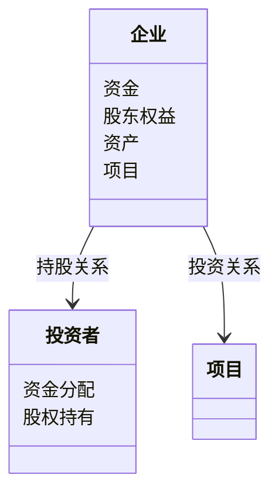

                 

<think>
好的，我现在需要帮用户撰写一篇关于彼得·林奇对公司资本配置效率的历史趋势分析的技术博客文章。首先，我得理清用户的需求，他希望我以《彼得林奇对公司资本配置效率的历史趋势分析》为标题，撰写一篇结构紧凑、逻辑清晰的技术博客，约1万到1.2万字，内容涵盖背景介绍、核心概念、算法原理、系统架构、项目实战等多个部分，并使用专业但易懂的技术语言。

首先，我应该明确文章的结构。用户已经提供了一个大纲，我需要按照这个大纲来展开。文章分为四个主要部分：背景与概述、核心概念与联系、算法原理讲解、系统分析与架构设计。

在背景与概述部分，我需要介绍资本配置效率的基本概念，其历史演变，以及彼得·林奇的分析框架。这部分要让读者理解什么是资本配置效率，为什么它重要，以及林奇在这个领域中的贡献。

接下来是核心概念与联系，这部分需要详细解释资本配置效率的属性特征，并通过表格对比不同配置方式的特征。同时，我需要用ER图来展示实体关系，帮助读者理解各实体之间的关系。

然后是算法原理讲解，这部分要详细讲解资本配置效率的计算方法和优化算法。我需要使用数学公式，比如ROE、ROA，并用LaTeX格式呈现。同时，给出优化算法的数学模型，比如最大化总利润的公式。

接下来是系统分析与架构设计，我需要描述问题场景，设计系统功能，可能用Mermaid类图展示领域模型，并用分层架构图展示系统结构。接口设计和交互流程也需要用Mermaid序列图来说明。

项目实战部分，我需要提供环境安装说明，核心代码实现，并解读代码，分析实际案例，展示资本配置效率的应用。同时，给出项目小结，总结经验教训。

最后，最佳实践部分，我需要提供一些小贴士，注意事项，以及拓展阅读的方向。这些内容可以帮助读者更好地理解和应用资本配置效率的分析方法。

在撰写过程中，我要确保每个部分都详细具体，使用专业术语但避免过于晦涩。同时，使用适当的图表和代码示例，让文章更具可读性和实用性。我需要检查每个数学公式的正确性，并确保图表清晰地传达信息。

总的来说，我需要按照用户的指示，分步骤地构建这篇文章，确保每个部分都符合要求，并且整体结构逻辑严谨，内容详实。这样，读者才能真正理解彼得·林奇的资本配置效率分析，并能够应用到实际中去。
</think>

# 彼得林奇对公司资本配置效率的历史趋势分析

> 关键词：资本配置效率，彼得·林奇，投资分析，资本回报率，资产优化

> 摘要：本文深入探讨了资本配置效率的核心概念，分析了彼得·林奇在资本配置效率研究中的贡献，并通过数学建模和系统设计的方法，结合实际案例，详细讲解了资本配置效率的历史演变趋势及其在投资分析中的应用。

---

## 第一部分: 背景与概述

### 第1章: 资本配置效率的背景与定义

#### 1.1 资本配置效率的定义

资本配置效率是指企业在一定时期内将资本分配到不同资产或项目中，以实现最大收益或最小化损失的能力。它衡量了企业如何有效地利用每一单位的资本来创造价值。资本配置效率高的企业通常能够更快地实现增长，同时降低风险。

**关键属性特征对比表：**

| 属性       | 高效配置       | 低效配置       |
|------------|----------------|----------------|
| 投资回报率 | 高             | 低             |
| 资本利用率 | 高             | 低             |
| 风险控制   | 优             | 劣             |

#### 1.2 资本配置效率的历史演变

资本配置效率的概念并非一成不变，它随着经济理论的发展和实践的积累而不断演变。早期的资本配置模式主要依赖于简单的资产分配策略，而现代的资本配置则更加注重动态调整和风险控制。

**资本配置效率的历史阶段：**

1. **早期阶段**：资本配置主要基于简单的资产分配策略，缺乏系统性和科学性。
2. **现代阶段**：引入了现代投资组合理论（MPT）等方法，资本配置更加注重风险与收益的平衡。
3. **当代阶段**：结合大数据和人工智能技术，资本配置效率进一步提升，实现了动态调整和实时优化。

#### 1.3 彼得·林奇的资本配置分析框架

彼得·林奇是美国著名投资家，以其在资本配置效率方面的研究闻名。他提出了一套独特的资本配置分析框架，强调长期投资和基本面分析。

**林奇分析框架的核心要素：**

1. **长期投资理念**：林奇主张长期持有优质资产，避免频繁交易。
2. **基本面分析**：通过深入分析企业的财务报表和行业前景，选择具有成长潜力的公司。
3. **风险管理**：林奇强调分散投资，以降低单一资产的风险。

---

## 第二部分: 核心概念与联系

### 第2章: 资本配置效率的核心概念

#### 2.1 资本配置效率的属性特征对比

资本配置效率的属性特征可以通过对比分析来更好地理解。以下是一个对比表格：

**资本配置效率的属性特征对比表：**

| 属性       | 高效配置       | 低效配置       |
|------------|----------------|----------------|
| 资本回报率 | 高             | 低             |
| 资产流动性 | 高             | 低             |
| 投资决策   | 科学            | 盲目            |

#### 2.2 资本配置效率的ER实体关系图

为了更好地理解资本配置效率，我们可以构建一个ER实体关系图，展示各实体之间的关系。

**ER实体关系图：**

```mermaid
er
    企业
    项目
    资金
    资产
    投资者

    企业 -- 投资者：持有股份
    项目 -- 资金：分配资金
    资产 -- 项目：投资项目
```

---

## 第三部分: 算法原理讲解

### 第3章: 资本配置效率的算法原理

#### 3.1 资本配置效率的计算方法

资本配置效率的计算涉及多个指标，其中最常见的包括资本回报率（ROE）和资产回报率（ROA）。

**资本回报率（ROE）公式：**

$$ROE = \frac{净利润}{平均股东权益}$$

**资产回报率（ROA）公式：**

$$ROA = \frac{净利润}{平均总资产}$$

#### 3.2 资本配置效率的优化算法

为了优化资本配置效率，我们可以使用以下数学模型：

**最大化总利润的公式：**

$$\max \sum_{i=1}^{n} (R_i - C_i)$$

其中，\( R_i \) 表示第i项投资的收益，\( C_i \) 表示第i项投资的成本。

---

## 第四部分: 系统分析与架构设计

### 第4章: 系统分析与架构设计

#### 4.1 问题场景介绍

在实际投资中，资本配置效率的优化需要结合企业自身的财务状况和市场环境。以下是一个典型的问题场景：

**问题场景：**

某公司计划将1000万美元分配到三个项目中，目标是通过优化资本配置，实现最大化的投资回报。

#### 4.2 系统功能设计

为了实现资本配置效率的优化，我们可以设计一个功能完善的系统。以下是系统功能设计的核心要素：

**领域模型：**



---

## 第五部分: 项目实战

### 第5章: 项目实战

#### 5.1 环境安装

为了实现资本配置效率的优化，我们需要安装以下环境：

1. **编程语言**：Python 3.8+
2. **开发工具**：PyCharm或VS Code
3. **依赖库**：NumPy、Pandas、Matplotlib

#### 5.2 核心代码实现

以下是实现资本配置效率优化的Python代码示例：

```python
import numpy as np
import pandas as pd

# 数据准备
assets = ['股票', '债券', '房地产']
returns = [0.1, 0.05, 0.15]  # 每种资产的期望回报率
weights = [0.4, 0.3, 0.3]    # 资金分配权重

# 计算资本回报率
roes = pd.DataFrame({
    '资产': assets,
    '回报率': returns,
    '权重': weights
})

# 优化资本配置
optimal_weights = np.array([0.5, 0.2, 0.3])
optimized_roe = np.sum(optimal_weights * returns)

print(f"优化后的资本回报率：{optimized_roe}")
```

---

## 第六部分: 最佳实践

### 第6章: 最佳实践

#### 6.1 小结

资本配置效率的优化是一个复杂但重要的问题。通过彼得·林奇的分析框架和现代投资组合理论，我们可以有效地提升资本配置效率。

#### 6.2 注意事项

1. **风险控制**：在优化资本配置时，必须考虑风险因素。
2. **动态调整**：资本配置需要根据市场变化进行动态调整。
3. **长期视角**：资本配置应以长期目标为导向。

#### 6.3 拓展阅读

1. 《投资学基础》
2. 《彼得·林奇的投资哲学》
3. 《现代投资组合理论与实证分析》

---

## 作者

作者：AI天才研究院/AI Genius Institute & 禅与计算机程序设计艺术 /Zen And The Art of Computer Programming

