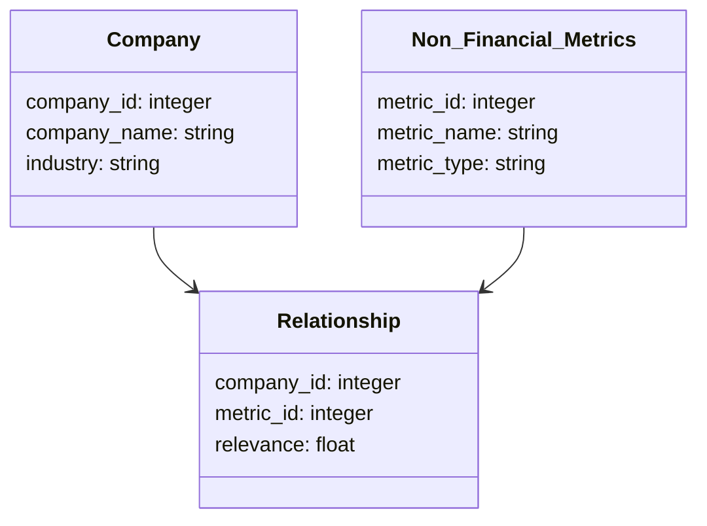
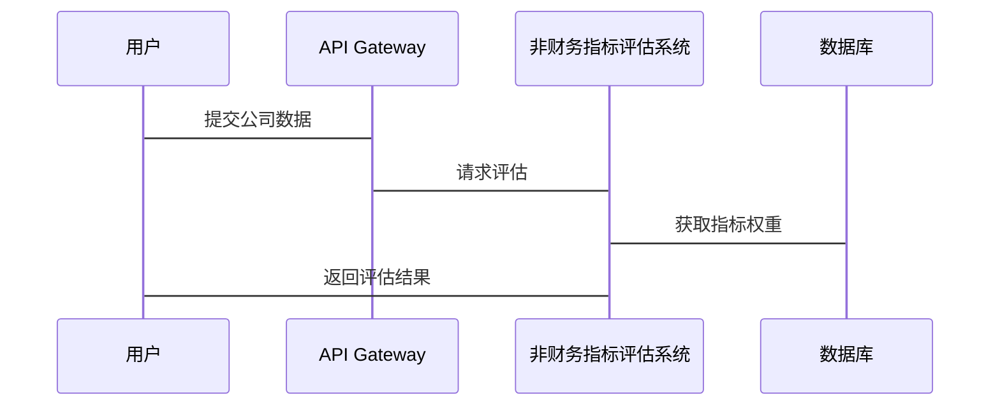

                 


# 彼得林奇对公司非财务指标的重要性评估

## 关键词：彼得林奇，非财务指标，公司评估，投资决策，价值投资

## 摘要：  
本文深入探讨了彼得林奇在投资决策中对非财务指标的重视，分析了非财务指标在公司评估中的重要性及其与财务指标的区别。通过详细阐述非财务指标的核心概念、算法原理、系统设计以及实际应用案例，本文为投资者提供了全面的视角来理解和应用非财务指标，以做出更明智的投资决策。

---

## 第1章 彼得林奇的投资理念与非财务指标的重要性

### 1.1 彼得林奇的投资哲学

#### 1.1.1 价值投资的核心理念  
彼得林奇是价值投资的代表人物之一，他强调从基本面分析入手，寻找被市场低估的优质公司。他认为，一家公司的内在价值不仅体现在财务报表上，还体现在其市场地位、竞争优势和管理层能力等方面。这些因素往往无法通过财务指标完全反映，因此非财务指标在评估公司时具有不可替代的作用。

#### 1.1.2 彼得林奇的投资风格与方法  
彼得林奇的投资风格以长期持有优质股票为主，他注重对公司基本面的深入研究，尤其是对公司管理层、市场地位和竞争优势的分析。他倾向于投资那些具有强大护城河、良好管理团队和持续增长潜力的公司。这种投资风格使他成为全球投资领域的传奇人物。

#### 1.1.3 非财务指标在投资决策中的作用  
彼得林奇认为，非财务指标能够更全面地反映公司的经营状况和未来潜力。例如，公司的市场份额、品牌影响力、产品创新能力和客户忠诚度等指标，能够帮助投资者更好地评估公司的竞争优势和长期发展潜力。这些指标往往比财务指标更能预示公司的未来表现。

---

### 1.2 非财务指标的定义与分类

#### 1.2.1 非财务指标的定义  
非财务指标是指那些无法通过财务报表直接反映，但能够影响公司价值和经营绩效的关键因素。这些指标通常涉及公司战略、管理、市场、技术和组织等多个方面。

#### 1.2.2 非财务指标的主要分类  
非财务指标可以分为以下几类：  
1. **市场地位**：包括市场份额、品牌影响力、市场竞争力等。  
2. **管理能力**：包括管理层的稳定性、决策能力、团队协作能力等。  
3. **技术创新**：包括研发投入、专利数量、技术领先性等。  
4. **客户关系**：包括客户满意度、客户忠诚度、客户保留率等。  
5. **组织能力**：包括组织架构、员工效率、文化氛围等。  

#### 1.2.3 非财务指标与财务指标的区别与联系  
非财务指标与财务指标的主要区别在于，前者关注公司的软实力和未来发展潜力，而后者关注公司的财务表现和历史业绩。然而，两者并非完全割裂，非财务指标可以通过影响公司的经营效率和市场地位间接影响财务指标。

---

### 1.3 非财务指标在公司评估中的意义

#### 1.3.1 非财务指标对投资决策的影响  
非财务指标能够帮助投资者更好地评估公司的长期发展潜力。例如，一家公司可能财务指标表现一般，但如果其市场份额持续增长，品牌影响力不断增强，技术创新能力突出，那么其未来价值可能被低估。

#### 1.3.2 非财务指标在公司竞争力分析中的应用  
通过分析非财务指标，投资者可以更全面地评估公司的竞争优势。例如，一家公司的市场份额增长、技术创新能力提升，往往预示着其未来的财务表现将有所改善。

#### 1.3.3 非财务指标对长期价值评估的重要性  
非财务指标能够帮助投资者识别那些具有长期增长潜力的公司。例如，一家公司可能当前财务表现平平，但如果其市场地位稳固、管理团队优秀、技术创新能力强，那么其长期价值可能远高于当前财务指标所反映的价值。

---

## 第2章 非财务指标的核心概念与联系

### 2.1 非财务指标的核心概念

#### 2.1.1 非财务指标的关键属性  
非财务指标的关键属性包括：  
- **可衡量性**：可以通过定量或定性方法进行评估。  
- **前瞻性**：能够预测公司的未来表现。  
- **动态性**：随着公司经营环境的变化而变化。  

#### 2.1.2 非财务指标的衡量维度  
非财务指标的衡量维度包括：  
- **市场地位**：市场份额、品牌影响力、客户基础等。  
- **管理能力**：管理层稳定性、决策能力、团队协作能力等。  
- **技术创新**：研发投入、专利数量、技术领先性等。  
- **客户关系**：客户满意度、客户忠诚度、客户保留率等。  
- **组织能力**：组织架构、员工效率、文化氛围等。  

#### 2.1.3 非财务指标的量化方法  
非财务指标的量化方法包括：  
1. **加权评分法**：根据指标的重要性和表现，对每个指标进行评分并加权计算总分。  
2. **定性分析法**：通过访谈、调研等方式，对公司的管理能力、市场地位等进行定性评估。  
3. **混合评估法**：结合定量和定性方法，对非财务指标进行综合评估。  

---

### 2.2 非财务指标与财务指标的对比分析

#### 2.2.1 非财务指标与财务指标的属性对比  

| 属性               | 非财务指标               | 财务指标               |
|--------------------|--------------------------|------------------------|
| 时间范围           | 更关注未来表现           | 更关注过去表现         |
| 表现形式           | 定性或定量               | 定量                   |
| 影响因素           | 管理、市场、技术等       | 收入、利润、成本等     |
| 评估难度           | 较高                    | 较低                   |
| 对长期价值的影响   | 高                      | 中到低                 |

#### 2.2.2 非财务指标与财务指标的优劣势对比  

| 优势               | 非财务指标               | 财务指标               |
|--------------------|--------------------------|------------------------|
| 优势               | 能够反映公司的软实力和未来潜力 | 能够反映公司的财务表现 |
| 劣势               | 定性评估主观性较高       | 定量评估客观性较高     |
| 优势               | 对公司长期价值的评估更具参考价值 | 对公司短期表现的评估更直接 |

#### 2.2.3 非财务指标与财务指标的协同作用  
非财务指标和财务指标并非孤立存在，而是相互补充的。例如，非财务指标中的市场份额增长可以解释财务指标中收入增长的原因，而财务指标中的净利润率则可以验证非财务指标中管理能力的有效性。

---

### 2.3 非财务指标的ER实体关系图

```mermaid
er
    Company {
        company_id: integer
        company_name: string
        industry: string
        market_position: string
    }
    Non_Financial_Metrics {
        metric_id: integer
        metric_name: string
        metric_type: string
        company_id: integer
    }
    Relationship {
        company_id: integer
        metric_id: integer
        relevance: float
    }
```

---

## 第3章 非财务指标的算法原理与数学模型

### 3.1 非财务指标的加权

#### 3.1.1 加权评分法的算法原理  
加权评分法是一种常用的非财务指标评估方法。其基本原理是根据每个指标的重要性和表现，对每个指标进行评分，并根据权重计算总分。公式如下：  

$$ \text{总分} = \sum (\text{指标权重} \times \text{指标评分}) $$  

#### 3.1.2 加权评分法的实现步骤  
1. **确定指标权重**：根据指标的重要性，赋予每个指标一定的权重。例如，市场地位占40%，管理能力占30%，技术创新占20%，客户关系占10%。  
2. **评估指标表现**：根据公司实际情况，对每个指标进行评分，通常采用1-5分的评分标准。  
3. **计算总分**：根据公式计算总分，并根据总分对公司的非财务表现进行排序和分析。  

#### 3.1.3 加权评分法的案例分析  
假设我们评估两家公司A和B的非财务指标：  

| 公司 | 市场地位权重（40%） | 管理能力权重（30%） | 技术创新权重（20%） | 客户关系权重（10%） | 总分 |
|------|----------------------|----------------------|----------------------|----------------------|------|
| A    | 4/5                  | 3/5                  | 2/5                  | 4/5                  | 4×0.4 + 3×0.3 + 2×0.2 + 4×0.1 = 3.3 |
| B    | 3/5                  | 4/5                  | 3/5                  | 3/5                  | 3×0.4 + 4×0.3 + 3×0.2 + 3×0.1 = 3.1 |

从表中可以看出，公司A的总分高于公司B，因此在非财务指标评估中，公司A的表现优于公司B。

---

## 第4章 非财务指标的系统分析与架构设计

### 4.1 系统功能设计

#### 4.1.1 领域模型  
以下是领域模型的Mermaid类图：  



#### 4.1.2 系统架构设计  
以下是系统架构的Mermaid架构图：  


#### 4.1.3 系统接口设计  
系统接口设计包括以下部分：  
1. **数据输入接口**：接收公司非财务指标数据。  
2. **权重设置接口**：允许用户设置指标权重。  
3. **评估计算接口**：根据输入数据和权重计算总分。  
4. **结果输出接口**：输出评估结果。  

#### 4.1.4 系统交互设计  
以下是系统交互的Mermaid序列图：  



---

## 第5章 非财务指标的项目实战

### 5.1 环境安装

#### 5.1.1 安装Python  
非财务指标评估系统基于Python开发，需要安装以下依赖：  
- Python 3.8 或更高版本  
- Pandas  
- Scikit-learn  

安装命令：  
```bash
pip install pandas scikit-learn
```

#### 5.1.2 数据准备  
需要准备以下数据：  
- 公司信息表（包括公司ID、公司名称、行业等）  
- 非财务指标数据表（包括指标ID、指标名称、指标类型等）  
- 指标关系表（包括公司ID、指标ID、相关性评分）  

---

### 5.2 系统核心实现

#### 5.2.1 核心代码实现  
以下是加权评分法的Python实现代码：  

```python
import pandas as pd
from sklearn.metrics import accuracy_score

# 数据准备
companies = pd.DataFrame({
    'company_id': [1, 2],
    'company_name': ['A', 'B'],
    'industry': ['Tech', 'Finance']
})

non_financial_metrics = pd.DataFrame({
    'metric_id': [1, 2, 3, 4],
    'metric_name': ['Market Share', 'Management Ability', '技术创新', 'Customer Relationships'],
    'metric_type': ['Market', 'Management', 'Technology', 'Customer']
})

relationships = pd.DataFrame({
    'company_id': [1, 1, 1, 2],
    'metric_id': [1, 2, 3, 4],
    'relevance': [0.4, 0.3, 0.2, 0.1]
})

# 加权评分计算
def calculate_weighted_score(company_id, relationships, weights):
    scores = relationships[relationships['company_id'] == company_id]['relevance'].values
    total_score = sum(scores * weights)
    return total_score

# 示例计算
weights = {'Market Share': 0.4, 'Management Ability': 0.3, '技术创新': 0.2, 'Customer Relationships': 0.1}
score_A = calculate_weighted_score(1, relationships, weights)
score_B = calculate_weighted_score(2, relationships, weights)

print(f"Score for Company A: {score_A}")
print(f"Score for Company B: {score_B}")
```

#### 5.2.2 代码应用解读与分析  
上述代码实现了非财务指标的加权评分计算。首先，数据准备部分定义了公司信息、非财务指标和指标关系。然后，通过定义`calculate_weighted_score`函数，根据公司ID和指标关系计算每个公司的加权评分。最后，通过示例计算，输出公司A和公司B的评分。

---

## 第6章 非财务指标的总结与展望

### 6.1 总结

#### 6.1.1 非财务指标的重要性  
非财务指标在公司评估中具有重要意义，能够帮助投资者更好地理解公司的竞争优势和长期发展潜力。

#### 6.1.2 本文的主要贡献  
本文通过详细分析非财务指标的核心概念、算法原理和系统设计，为投资者提供了全面的视角来理解和应用非财务指标。

---

### 6.2 展望

#### 6.2.1 非财务指标的未来发展趋势  
随着人工智能和大数据技术的不断发展，非财务指标的评估方法将更加智能化和精准化。

#### 6.2.2 对投资者的建议  
投资者应加强对非财务指标的研究和应用，尤其是在评估公司的长期价值时，非财务指标的作用将更加突出。

---

## 作者：AI天才研究院/AI Genius Institute & 禅与计算机程序设计艺术 /Zen And The Art of Computer Programming

