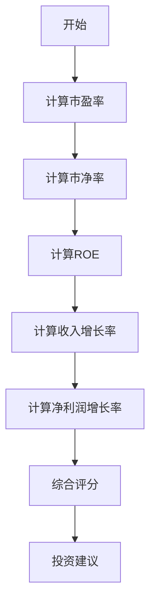

                 

# 彼得林奇对小盘股的态度

> 关键词：彼得·林奇，小盘股，投资策略，选股标准，风险管理，成长潜力

> 摘要：本文深入分析了彼得·林奇对小盘股的投资态度，探讨了他如何通过基本面分析、分散投资和风险控制等策略，在小盘股市场中寻找成长机会。文章详细阐述了他的选股标准，包括市盈率、市净率、盈利能力等指标，并结合实际案例，展示了他如何构建和管理投资组合，以实现长期收益。

---

## 第一章：彼得·林奇的投资背景与小盘股基础

### 1.1 彼得·林奇的生平与投资哲学

彼得·林奇（Peter Lynch）是全球投资界的一位传奇人物，曾担任富达投资麦哲伦基金的经理，管理该基金长达13年，期间基金规模从1800万美元增长至140亿美元。他的投资哲学以价值投资和成长投资相结合为核心，特别关注小盘股市场的潜力。

#### 1.1.1 早年经历与职业发展

- **早期经历**：林奇在波士顿大学获得金融学学位，曾在富达投资担任分析师，逐步晋升为基金经理。
- **投资哲学**：他强调基本面分析，认为市场中存在许多被低估的股票，尤其是小盘股，具有较大的成长空间。

#### 1.1.2 投资哲学与理念

- **价值与成长并重**：林奇寻找那些估值合理且具备成长潜力的公司。
- **分散投资**：避免将过多资金集中在少数股票上，以降低风险。
- **行业偏好**：倾向于投资他熟悉的行业，如科技、消费等，确保他对公司基本面有深入了解。

### 1.2 小盘股的定义与特点

#### 1.2.1 小盘股的定义

小盘股通常指市值在10亿至50亿美元之间的公司股票。这类股票流动性较低，但增长潜力较大。

#### 1.2.2 小盘股市场的特点

- **波动性高**：小盘股价格波动较大，容易受市场情绪影响。
- **潜力大**：许多小盘股可能成长为大盘股，带来丰厚回报。
- **信息不透明**：部分小盘股公司信息披露不足，增加了投资难度。

#### 1.2.3 小盘股与大盘股的对比

| 特性      | 小盘股                 | 大盘股                 |
|-----------|------------------------|------------------------|
| 市值      | 较小                   | 较大                   |
| 波动性     | 高                     | 低                     |
| 成长潜力   | 高                     | 中等                   |
| 风险       | 高                     | 较低                   |
| 信息透明度 | 低                     | 高                     |

---

## 第二章：彼得·林奇对小盘股的态度与策略

### 2.1 小盘股投资的机遇与挑战

#### 2.1.1 小盘股市场的潜力

- **成长空间**：小盘股公司可能通过技术创新或市场扩展实现快速增长。
- **估值优势**：相比大盘股，部分小盘股可能被市场低估。

#### 2.1.2 小盘股投资的主要风险

- **流动性风险**：部分小盘股交易量小，变现困难。
- **业绩波动**：小盘股公司业绩容易受经济周期影响，波动较大。

#### 2.1.3 林奇应对挑战的方法

- **分散投资**：通过投资多只小盘股降低风险。
- **深入研究**：通过基本面分析，选择具有持续盈利能力的公司。

### 2.2 林奇的选股标准与方法

#### 2.2.1 选股的基本原则

- **估值合理**：市盈率（P/E）和市净率（P/B）是关键指标。
- **成长性**：关注收入和净利润增长率。

#### 2.2.2 具体的选股标准

- **市盈率（P/E）**：通常选择低于行业平均水平的股票。
- **市净率（P/B）**：低于1.5倍的股票具有吸引力。
- **盈利能力（ROE）**：ROE（净资产收益率）高于行业平均水平。

#### 2.2.3 选股过程中的关键指标

| 指标     | 定义                     | 重要性         |
|----------|--------------------------|----------------|
| P/E      | 市盈率                   | 估值合理性     |
| P/B      | 市净率                   | 资产安全性     |
| ROE      | 净资产收益率             | 盈利能力       |
|收入增长率| 收入同比增长率           | 成长潜力       |
|净利润增长率| 净利润同比增长率         | 盈利增长能力   |

---

## 第三章：小盘股投资的核心策略

### 3.1 价值投资与成长投资的结合

#### 3.1.1 价值投资的基本概念

- **核心理念**：寻找市场价格低于内在价值的股票。
- **关键指标**：低P/E、低P/B。

#### 3.1.2 成长投资的基本概念

- **核心理念**：投资于收入和净利润持续增长的公司。
- **关键指标**：高收入增长率、高净利润增长率。

#### 3.1.3 林奇如何将两者结合

- **选股标准**：选择估值合理且具备成长性的公司。
- **投资策略**：长期持有，等待价值实现。

### 3.2 行业分析与公司基本面评估

#### 3.2.1 行业选择的重要性

- **行业前景**：选择增长潜力大的行业，如科技、消费等。
- **行业风险**：避免高竞争、夕阳行业。

#### 3.2.2 公司基本面分析的关键点

- **财务健康状况**：关注负债率、现金流等指标。
- **管理团队**：管理层的稳定性和能力至关重要。

#### 3.2.3 林奇的行业偏好

- 偏好消费、科技等行业，这些行业的公司更容易通过创新实现增长。

---

## 第四章：彼得·林奇的投资组合管理

### 4.1 投资组合的构建与调整

#### 4.1.1 投资组合构建的原则

- **分散投资**：避免过度集中。
- **动态调整**：根据市场变化和公司基本面调整持仓。

#### 4.1.2 林奇如何调整投资组合

- **定期评估**：每季度评估持仓，剔除表现不佳的股票。
- **仓位调整**：根据市场变化调整个股权重。

#### 4.1.3 组合调整的时机与策略

- **时机**：市场波动较大时进行调整。
- **策略**：卖出表现不佳的股票，买入新的潜力股。

### 4.2 风险控制与投资心态

#### 4.2.1 风险管理的重要性

- **止损点**：设定止损点，控制亏损幅度。
- **分散投资**：通过多样化降低风险。

#### 4.2.2 林奇的投资心态与纪律

- **纪律性**：严格遵守选股标准和投资纪律。
- **耐心**：长期持有优质股票，等待价值实现。

#### 4.2.3 如何避免常见投资错误

- **避免情绪化投资**：不被市场波动影响决策。
- **避免过度分散**：集中投资于优质股票。

---

## 第五章：小盘股投资的数学模型与算法分析

### 5.1 基本面分析的量化指标

#### 5.1.1 常用的估值指标

- **市盈率（P/E）**：公式为 $$\text{P/E} = \frac{\text{股价}}{\text{每股收益}}$$
- **市净率（P/B）**：公式为 $$\text{P/B} = \frac{\text{股价}}{\text{每股净资产}}$$
- **股息率**：公式为 $$\text{股息率} = \frac{\text{每股股息}}{\text{股价}} \times 100\%$$

#### 5.1.2 盈利能力分析

- **净利润率**：公式为 $$\text{净利润率} = \frac{\text{净利润}}{\text{营业收入}} \times 100\%$$
- **ROE**：公式为 $$\text{ROE} = \frac{\text{净利润}}{\text{股东权益}} \times 100\%$$

#### 5.1.3 成长性指标

- **收入增长率**：公式为 $$\text{收入增长率} = \frac{\text{本期收入} - \text{上期收入}}{\text{上期收入}} \times 100\%$$
- **净利润增长率**：公式为 $$\text{净利润增长率} = \frac{\text{本期净利润} - \text{上期净利润}}{\text{上期净利润}} \times 100\%$$

### 5.2 林奇选股模型的构建

#### 5.2.1 模型的输入变量与输出结果

- **输入变量**：市盈率、市净率、ROE、收入增长率、净利润增长率。
- **输出结果**：评分，评分越高表示投资价值越大。

#### 5.2.2 模型的逻辑流程图（使用 Mermaid）

---

## 第六章：项目实战与案例分析

### 6.1 案例分析

#### 6.1.1 选择某小盘股公司

假设选择一家市值为5亿美元的科技公司，具体数据如下：

- 市盈率（P/E）：15
- 市净率（P/B）：2
- ROE：18%
- 收入增长率：20%
- 净利润增长率：25%

#### 6.1.2 评估过程

1. **估值分析**：P/E为15，低于行业平均水平（假设为20）；P/B为2，接近行业平均水平（假设为2.5）。
2. **盈利能力分析**：ROE为18%，高于行业平均水平（假设为12%）。
3. **成长性分析**：收入和净利润增长率均高于行业平均水平（假设收入增长率为15%，净利润增长率为20%）。

#### 6.1.3 投资建议

- 该公司的估值合理，盈利能力强，成长性好，适合投资。

### 6.2 经验总结

- **基本面分析的重要性**：通过量化指标全面评估公司价值。
- **行业选择的策略**：选择增长潜力大的行业。
- **动态调整投资组合**：根据市场变化和公司基本面调整持仓。

---

## 第七章：总结与展望

### 7.1 总结

彼得·林奇通过基本面分析和价值投资，成功在小盘股市场中寻找成长机会。他的选股标准和投资策略为投资者提供了宝贵的借鉴。

### 7.2 展望

随着经济的发展，小盘股市场将涌现出更多具有成长潜力的公司。投资者应继续关注基本面，选择优质股票进行投资。

---

## 作者信息

作者：AI天才研究院/AI Genius Institute & 禅与计算机程序设计艺术/Zen And The Art of Computer Programming

