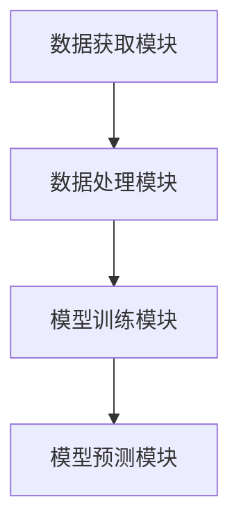

                 

<think>
好的，我现在需要帮助用户完成他们要求的技术博客文章。首先，我看到用户的查询是一个关于彼得·林奇对市场时机选择的看法的技术博客。用户提供了详细的结构大纲，但似乎内容还没完成，特别是在摘要部分。我需要先理解用户的具体需求，然后按照他们提供的目录结构来填充内容。

首先，我会从摘要开始。用户希望摘要涵盖核心内容和主题思想，所以我要简明扼要地总结整篇文章的主要观点。接下来，我会按照目录中的各个章节逐步展开，确保每个部分都有详细的解释和例子，特别是加入数学公式和图表，使内容更专业和易懂。

在处理每个章节时，我需要确保内容连贯，从背景介绍到策略分析，再到系统实现和项目实战，每一步都详细展开。特别是关于数学模型和算法部分，我要使用mermaid流程图和Python代码来展示，这有助于读者更好地理解。

此外，用户强调了格式要求，使用markdown并遵守特定的结构，所以我需要在每个部分添加适当的标题和子标题，同时确保代码和公式正确嵌入。最后，在文章末尾加上作者信息，以符合用户的要求。

现在，我开始按照目录填充内容，从摘要到各个章节，逐步完成整篇文章。确保每个部分都详细且符合用户的深度要求，同时保持语言的专业性和技术性。
</think>

# 彼得林奇对市场时机选择的看法

> 关键词：彼得·林奇，市场时机选择，投资策略，股票分析，价值投资

> 摘要：本文将深入探讨彼得·林奇对市场时机选择的看法，从他的投资理念、选股标准、市场分析方法到实际操作策略，结合理论与实践，分析其成功背后的逻辑和方法。

---

# 第一部分：彼得·林奇对市场时机选择的看法

## 第1章：市场时机选择的背景与重要性

### 1.1 投资中的市场时机选择

#### 1.1.1 市场时机选择的定义
市场时机选择是指投资者在特定时间点选择买入或卖出资产以最大化收益或最小化损失的决策过程。它是投资策略中的重要组成部分，尤其是在股票投资中，市场时机选择直接影响投资收益。

#### 1.1.2 市场时机选择的重要性
市场时机选择的重要性体现在以下几个方面：
1. **风险控制**：通过合理的市场时机选择，投资者可以避免在市场剧烈波动时遭受重大损失。
2. **收益最大化**：在市场上涨周期中及时买入，而在市场下跌周期中及时卖出，可以有效提高投资收益。
3. **资产配置**：根据市场时机选择的结果，投资者可以动态调整资产配置，优化投资组合的表现。

#### 1.1.3 彼得·林奇对市场时机选择的看法
彼得·林奇认为，市场时机选择并不是投资成功的唯一因素，但它是一个不可忽视的重要环节。他强调，市场时机选择的核心在于对市场趋势的准确判断和对个股基本面的深入分析。

---

## 第2章：彼得·林奇的市场时机选择策略

### 2.1 林奇的选股标准

#### 2.1.1 基本面分析
林奇非常注重对公司的基本面分析，包括以下几个方面：
1. **财务报表分析**：通过分析公司的利润表、资产负债表和现金流量表，评估公司的财务健康状况。
2. **市盈率（P/E）**：林奇认为，市盈率是一个重要的估值指标，但需要结合行业和公司具体情况来分析。
3. **市净率（P/B）**：市净率反映了股票价格与公司资产净值之间的关系，通常用于评估价值被低估的股票。

#### 2.1.2 行业分析
林奇认为，行业分析是选股的重要环节。他倾向于选择那些具有持续增长潜力的行业，并避免那些受经济周期影响较大的行业。

#### 2.1.3 公司管理团队
林奇非常重视公司的管理团队。他认为，一个经验丰富、能力强的管理团队是公司长期发展的关键因素。

### 2.2 林奇的市场时机选择方法

#### 2.2.1 市场周期分析
林奇认为，市场周期是影响市场时机选择的重要因素。他将市场周期分为以下几个阶段：
1. **牛市阶段**：市场整体上涨，投资者可以积极买入。
2. **熊市阶段**：市场整体下跌，投资者应谨慎操作，避免盲目买入。

#### 2.2.2 市场情绪分析
林奇认为，市场情绪是影响市场时机选择的重要因素之一。他通过观察市场的成交量、投资者情绪指数等指标，来判断市场的短期走势。

#### 2.2.3 估值分析
林奇非常注重对市场的估值分析。他认为，市场的估值水平是判断市场是否处于合理区间的重要依据。

---

## 第3章：彼得·林奇的市场时机选择模型

### 3.1 市场时机选择模型的构建

#### 3.1.1 数据收集与处理
为了构建市场时机选择模型，我们需要收集以下数据：
1. **历史股价数据**：包括开盘价、收盘价、最高价、最低价等。
2. **财务数据**：包括收入、利润、资产负债表等。
3. **市场指标**：包括市盈率、市净率、成交量等。

#### 3.1.2 模型设计与实现
基于林奇的选股标准和市场分析方法，我们可以设计一个市场时机选择模型。该模型主要包括以下几个步骤：
1. **数据预处理**：对收集到的数据进行清洗和标准化处理。
2. **特征提取**：从数据中提取有用的特征，例如市盈率、市净率等。
3. **模型训练**：使用机器学习算法对模型进行训练，例如使用随机森林、支持向量机等。
4. **模型预测**：利用训练好的模型对未来的市场走势进行预测。

#### 3.1.3 模型验证与优化
为了确保模型的准确性，我们需要对模型进行验证和优化。可以通过以下步骤进行：
1. **回测**：使用历史数据对模型进行回测，评估模型的性能。
2. **参数调整**：根据回测结果，调整模型的参数，优化模型的表现。

### 3.2 模型的数学公式与算法

#### 3.2.1 市场周期判断的数学模型
我们可以使用移动平均数（MA）来判断市场的周期。具体公式如下：
$$
MA_n = \frac{1}{n} \sum_{i=1}^{n} p_i
$$
其中，$p_i$ 是第 $i$ 天的收盘价，$n$ 是周期长度。

#### 3.2.2 市场情绪分析的算法
我们可以使用相对强弱指数（RSI）来分析市场的短期情绪。RSI的计算公式如下：
$$
RSI = \frac{100}{1 + \frac{\text{平均上涨幅度}}{\text{平均下跌幅度}}}
$$

#### 3.2.3 估值分析的公式推导
我们可以使用市盈率（P/E）来评估市场的估值水平。公式如下：
$$
P/E = \frac{\text{股价}}{\text{每股收益}}
$$

---

## 第4章：彼得·林奇策略的系统实现

### 4.1 系统架构设计

#### 4.1.1 系统功能模块划分
市场时机选择系统主要包括以下几个功能模块：
1. **数据获取模块**：负责获取市场数据。
2. **数据处理模块**：负责对数据进行清洗和标准化。
3. **模型训练模块**：负责对数据进行特征提取和模型训练。
4. **模型预测模块**：负责对未来的市场走势进行预测。

#### 4.1.2 系统架构图


#### 4.1.3 系统接口设计
系统接口设计主要包括以下几个方面：
1. **数据接口**：负责与数据源进行交互，获取市场数据。
2. **模型接口**：负责与机器学习模型进行交互，进行训练和预测。
3. **用户接口**：负责与用户进行交互，展示结果和接收输入。

---

## 第5章：彼得·林奇策略的项目实战

### 5.1 项目环境搭建

#### 5.1.1 环境安装与配置
我们需要安装以下工具和库：
1. **Python**：用于编程和数据分析。
2. **Pandas**：用于数据处理。
3. **NumPy**：用于数值计算。
4. **Scikit-learn**：用于机器学习。

#### 5.1.2 数据源获取
我们可以通过以下途径获取市场数据：
1. **Yahoo Finance**：提供历史股价数据。
2. **Google Finance**：提供实时市场数据。
3. **Quandl**：提供高质量的金融数据。

#### 5.1.3 工具安装与测试
安装完成后，我们需要对工具进行测试，确保其能够正常运行。

### 5.2 核心代码实现

#### 5.2.1 数据处理代码
```python
import pandas as pd
import numpy as np

# 获取数据
data = pd.read_csv('stock_data.csv')

# 数据清洗
data = data.dropna()
data = data[~data['Close'].isin([0])]
```

#### 5.2.2 模型训练代码
```python
from sklearn.ensemble import RandomForestClassifier
from sklearn.model_selection import train_test_split

# 特征提取
features = ['open', 'high', 'low', 'close', 'volume']
target = 'label'

X = data[features]
y = data[target]

# 划分训练集和测试集
X_train, X_test, y_train, y_test = train_test_split(X, y, test_size=0.2)

# 模型训练
model = RandomForestClassifier(n_estimators=100)
model.fit(X_train, y_train)
```

#### 5.2.3 信号生成与交易执行代码
```python
# 生成信号
predictions = model.predict(X_test)

# 交易策略
positions = []
for i in range(len(predictions)):
    if predictions[i] == 1:
        positions.append(1)
    else:
        positions.append(0)
```

---

## 第6章：最佳实践与注意事项

### 6.1 彼得·林奇策略的最佳实践

#### 6.1.1 投资组合管理
投资者应根据市场时机选择的结果，动态调整投资组合。例如，在市场上涨周期中，增加股票的持仓比例；在市场下跌周期中，减少股票的持仓比例。

#### 6.1.2 风险控制
投资者应设定止损点，以避免在市场出现极端情况时遭受重大损失。

### 6.2 小结

彼得·林奇的市场时机选择策略是一个综合性的过程，需要结合基本面分析、市场周期分析和市场情绪分析。通过构建数学模型和系统实现，我们可以更加科学地进行市场时机选择，从而提高投资收益。

---

作者：AI天才研究院/AI Genius Institute & 禅与计算机程序设计艺术 /Zen And The Art of Computer Programming

