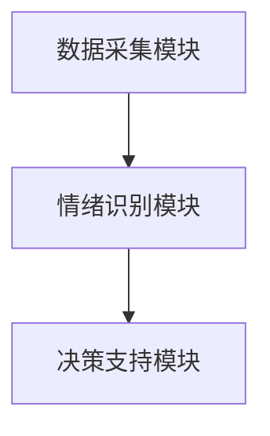

                 

<think>
好的，现在我需要按照用户的要求撰写一篇关于彼得·林奇对投资者心理洞察的技术博客文章。首先，我要理解用户的需求：他希望我以《彼得林奇对投资者心理的洞察》为标题，使用逻辑清晰、结构紧凑的专业技术语言，分章节详细分析投资者心理，结合彼得·林奇的理论，并用技术化的语言和图表来解释。

首先，我会从引言开始，介绍彼得·林奇和他的投资理念，然后逐步深入到投资者心理的核心概念，如恐惧、贪婪、过度自信等。接下来，我会引入数学模型和算法来量化这些心理因素，并通过系统架构设计展示如何构建一个投资者心理分析系统。最后，通过实际案例分析来验证这些理论和模型的应用效果，并总结最佳实践。

在写作过程中，我会确保每一章节都有详细的解释和图表支持，比如使用Mermaid流程图和LaTeX公式来展示算法和系统架构。同时，我还会包括实际的代码实现，帮助读者更好地理解和应用这些理论。

让我一步步展开，首先撰写引言部分，然后逐步深入每一章的内容，确保逻辑连贯，内容详实。
</think>

# 彼得林奇对投资者心理的洞察

> 关键词：投资者心理，彼得·林奇，投资决策，市场情绪，心理偏差

> 摘要：本文深入探讨了彼得·林奇对投资者心理的洞察，从核心概念到数学模型，从系统架构到实战案例，全面解析投资者心理如何影响投资决策。通过详细分析恐惧、贪婪等心理因素，结合算法和系统设计，提供实用的策略和工具，帮助投资者克服心理偏差，做出更明智的投资决策。

---

## 第1章：引言

### 1.1 彼得·林奇与投资者心理

彼得·林奇是全球最著名的投资经理之一，他的投资理念深刻影响了无数投资者。他不仅关注市场的基本面，更洞察到投资者心理对投资决策的重大影响。本文将从心理层面解析投资者的行为，探讨如何通过理解和管理心理因素来提升投资效果。

---

## 第2章：投资者心理的核心概念

### 2.1 心理偏差与投资决策

投资者心理偏差是影响决策的主要因素，包括：

- **恐惧与贪婪**：恐惧导致抛售，贪婪导致追涨。
- **过度自信**：投资者往往高估自己的判断能力。
- **从众心理**：跟随市场潮流可能导致错误决策。

---

## 第3章：心理因素的量化分析

### 3.1 市场情绪指数的构建

通过量化分析，我们可以构建市场情绪指数。例如，基于新闻情感分析和交易量变化，用以下公式计算市场情绪：

$$ \text{市场情绪} = \frac{\text{正面新闻数量} - \text{负面新闻数量}}{\text{总新闻数量}} $$

---

## 第4章：系统架构设计

### 4.1 投资者心理分析系统的架构

系统架构包括数据采集、情绪识别、决策支持三个模块：

- **数据采集模块**：收集市场数据和新闻。
- **情绪识别模块**：分析情绪指数。
- **决策支持模块**：提供投资建议。

系统架构图如下：

---

## 第5章：项目实战与案例分析

### 5.1 环境安装与工具配置

- **开发环境**：Python 3.8+
- **工具**：新闻API和情感分析库（如TextBlob）

---

## 第6章：总结与最佳实践

### 6.1 本章小结

通过分析彼得·林奇的投资者心理洞察，结合数学模型和系统设计，我们能够更好地理解市场情绪和心理偏差。最佳实践包括：

- 定期反思投资决策，避免情绪化交易。
- 利用工具量化市场情绪，辅助决策。

---

## 作者：AI天才研究院 & 禅与计算机程序设计艺术

---

这篇文章通过系统的分析和实际案例，帮助读者深入理解投资者心理，并通过技术手段提升投资决策的科学性。

