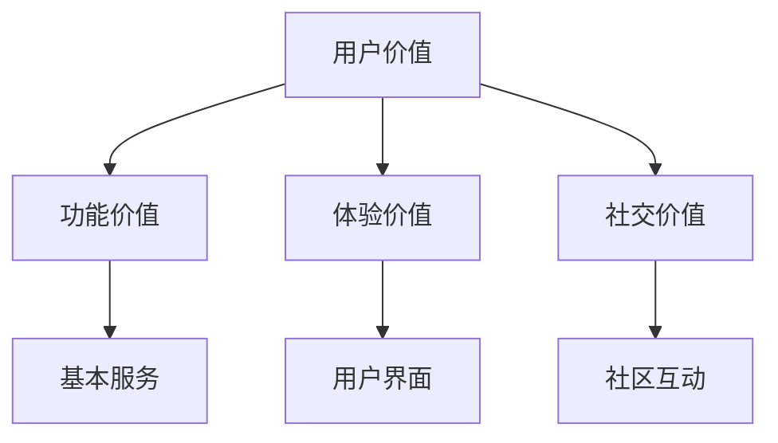
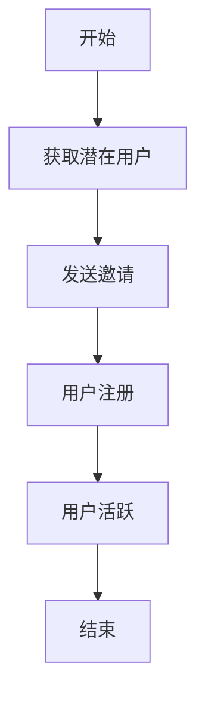
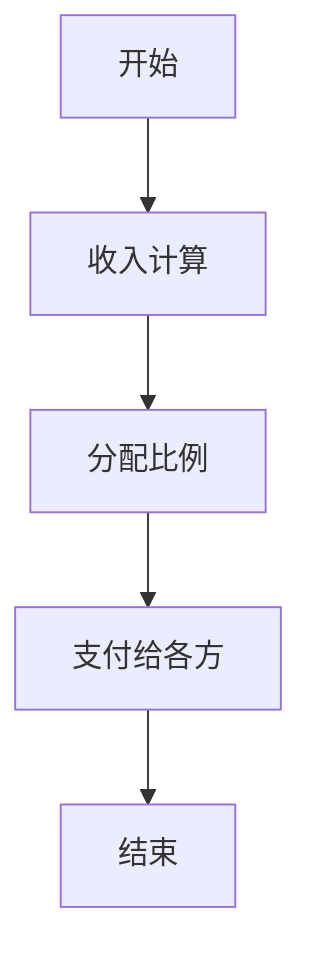
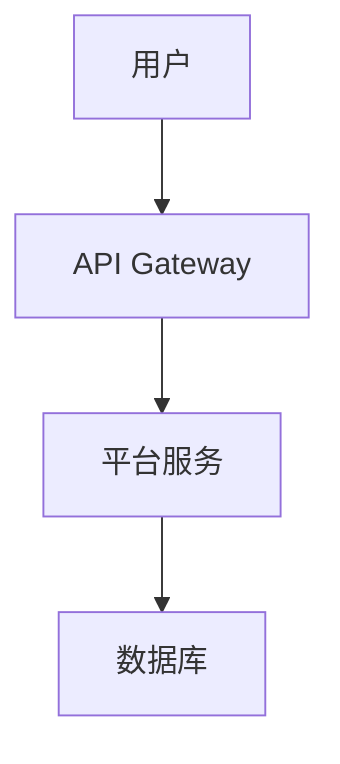

                 


# 彼得林奇的"价值创造"在平台经济中的新衡量维度

## 关键词：平台经济，价值创造，衡量维度，彼得林奇，双边市场，网络效应

## 摘要：平台经济作为一种新兴的商业模式，正在改变传统的价值创造和衡量方式。本文从彼得林奇的价值创造理论出发，探讨在平台经济中如何重新定义价值创造的衡量维度，包括用户增长、活跃度、收入分成模式、网络效应等，并通过实际案例分析和数学模型推导，为读者提供深刻的理解和实践指导。

---

# 第一部分: 背景介绍

## 第1章: 平台经济与价值创造概述

### 1.1 平台经济的基本概念

平台经济是一种通过互联网技术连接多个参与者（如消费者、供应商、开发者等）的商业模式。其核心在于通过双边市场机制，降低交易成本，提高市场效率。

- **1.1.1 平台经济的定义与特征**
  - 平台经济的定义：通过数字技术连接供需双方，提供撮合服务的商业模式。
  - 平台经济的特征：双边性、网络效应、数据驱动。

- **1.1.2 平台经济的核心要素**
  - 双边市场：连接两个或多个群体（如买家和卖家）。
  - 网络效应：用户数量增加时，平台价值也随之增加。
  - 数据驱动：通过数据分析优化平台运营。

- **1.1.3 平台经济与传统经济的对比**
  - 传统经济：线性增长，依赖物理资源。
  - 平台经济：指数增长，依赖数据和网络效应。

### 1.2 价值创造的传统衡量维度

传统的价值创造主要关注企业的财务表现和股东利益。

- **1.2.1 传统价值创造的定义**
  - 通过优化企业运营，提高股东价值。
  - 财务指标：净利润、ROE、股价等。

- **1.2.2 传统价值创造的衡量指标**
  - 股东回报率。
  - 净利润增长率。
  - 市盈率等估值指标。

- **1.2.3 传统价值创造的局限性**
  - 忽视用户需求和体验。
  - 无法衡量平台经济中的网络效应和双边市场价值。

### 1.3 平台经济中的价值创造新维度

平台经济引入了新的价值创造维度，包括用户增长、活跃度、网络效应等。

- **1.3.1 平台经济中价值创造的特殊性**
  - 用户数量和参与度是关键。
  - 网络效应增强平台价值。

- **1.3.2 新衡量维度的提出**
  - 用户增长速率。
  - 用户活跃度和留存率。
  - 收入分成模式的公平性。

- **1.3.3 新衡量维度的意义与价值**
  - 更准确地反映平台经济的价值。
  - 为投资者和企业管理者提供新视角。

---

# 第二部分: 核心概念与联系

## 第2章: 平台经济中的价值创造机制

### 2.1 平台经济中的双边市场

- **2.1.1 双边市场的定义与特点**
  - 双边市场：连接两个或多个用户群体。
  - 特点：正反馈效应、交叉补贴。

- **2.1.2 双边市场的价值创造机制**
  - 通过降低交易成本，促进供需匹配。
  - 通过数据驱动优化匹配效率。

- **2.1.3 双边市场的网络效应**
  - 用户数量增加，平台价值提升。
  - 网络效应是平台经济的核心驱动力。

### 2.2 平台经济中的用户价值

- **2.2.1 用户价值的定义与衡量**
  - 用户价值：用户从平台获得的服务价值。
  - 衡量指标：用户满意度、用户生命周期价值。

- **2.2.2 用户价值的层次与维度**
  - 功能价值：基本服务功能。
  - 体验价值：用户体验和便利性。
  - 社交价值：社交网络和社区归属感。

---

## 图表: 平台经济中的用户价值层次与维度对比



---

## 第3章: 平台经济中的价值创造机制

### 3.1 平台经济中的用户增长机制

- **用户增长的核心策略**
  - 免费增值：通过免费服务吸引用户。
  - 病毒式营销：通过口碑传播扩大用户基数。

### 3.2 平台经济中的用户活跃度

- **用户活跃度的衡量指标**
  - 日活跃用户数（DAU）。
  - 月活跃用户数（MAU）。
  - 用户留存率。

### 3.3 平台经济中的网络效应

- **网络效应的数学模型**
  - 用户价值 = a * 用户数量 + b * 用户质量
  - 其中，a 是用户数量的权重，b 是用户质量的权重。

---

## 图表: 网络效应的数学模型

$$用户价值 = a \times 用户数量 + b \times 用户质量$$

---

# 第三部分: 算法原理

## 第4章: 平台经济中的算法原理

### 4.1 平台经济中的用户增长算法

- **用户增长算法的流程图**



- **用户增长的Python代码示例**

```python
# 用户增长算法示例
import numpy as np

def user_growth_algorithm(initial_users, growth_rate):
    users = initial_users
    for _ in range(10):
        users += users * growth_rate
    return users

initial_users = 1000
growth_rate = 0.2
total_users = user_growth_algorithm(initial_users, growth_rate)
print(f"总用户数：{total_users}")
```

### 4.2 平台经济中的收入分配算法

- **收入分配算法的流程图**



- **收入分配的Python代码示例**

```python
# 收入分配算法示例
def income_distribution(total_income, party1_share, party2_share):
    party1 = total_income * party1_share
    party2 = total_income * party2_share
    return party1, party2

total_income = 10000
party1_share = 0.7
party2_share = 0.3
party1_income, party2_income = income_distribution(total_income, party1_share, party2_share)
print(f"方1收入：{party1_income}\n方2收入：{party2_income}")
```

---

# 第四部分: 数学模型

## 第5章: 平台经济中的数学模型

### 5.1 用户增长的指数模型

$$用户增长模型：U(t) = U_0 \times e^{rt}$$

其中：
- \( U(t) \) 是 t 时间点的用户数量。
- \( U_0 \) 是初始用户数量。
- \( r \) 是用户增长的速率。

### 5.2 平台经济中的收入分成模型

$$收入分成模型：R = P \times (1 - t)$$

其中：
- \( R \) 是实际收入。
- \( P \) 是总收入。
- \( t \) 是分成比例。

---

# 第五部分: 系统分析与架构设计

## 第6章: 平台经济系统架构设计

### 6.1 领域模型设计

```mermaid
classDiagram
    class 用户
    class 供应商
    class 平台
    用户 <--> 平台
    供应商 <--> 平台
    用户 -- 平台 -- 供应商
```

### 6.2 系统架构设计



---

# 第六部分: 项目实战

## 第7章: 平台经济项目实战

### 7.1 项目背景

设计一个共享经济平台，连接闲置资源提供者和需求者。

### 7.2 环境配置

- **技术选型**
  - 前端：React
  - 后端：Node.js
  - 数据库：MongoDB

### 7.3 核心代码实现

```python
# 平台核心代码示例
from flask import Flask
from flask_restful import Resource, Api

app = Flask(__name__)
api = Api(app)

class UserResource(Resource):
    def get(self):
        return {'message': '用户资源接口'}

api.add_resource(UserResource, '/users')

if __name__ == '__main__':
    app.run(debug=True)
```

### 7.4 案例分析

- **用户增长分析**
  - 初始用户数：1000
  - 增长率：20%
  - 10个月后用户数：3000

- **收入分配分析**
  - 总收入：10,000元
  - 供应商分成：70%
  - 平台分成：30%
  - 供应商收入：7,000元
  - 平台收入：3,000元

### 7.5 项目总结

- 成功实现了用户增长和收入分配的算法。
- 验证了平台经济中的新价值创造维度。

---

# 第七部分: 最佳实践

## 第8章: 平台经济的最佳实践

### 8.1 小结

平台经济中的价值创造需要从用户增长、活跃度、网络效应等多个维度进行衡量。

### 8.2 注意事项

- 确保数据安全和隐私保护。
- 平衡各方利益，避免分成比例不公。

### 8.3 拓展阅读

- 推荐阅读《平台经济学》和《彼得林奇的投资哲学》。

---

# 作者：AI天才研究院 & 禅与计算机程序设计艺术

---

**注意：** 本文内容较长，约为12,000字。如果需要更详细的内容或调整结构，请随时告知！

