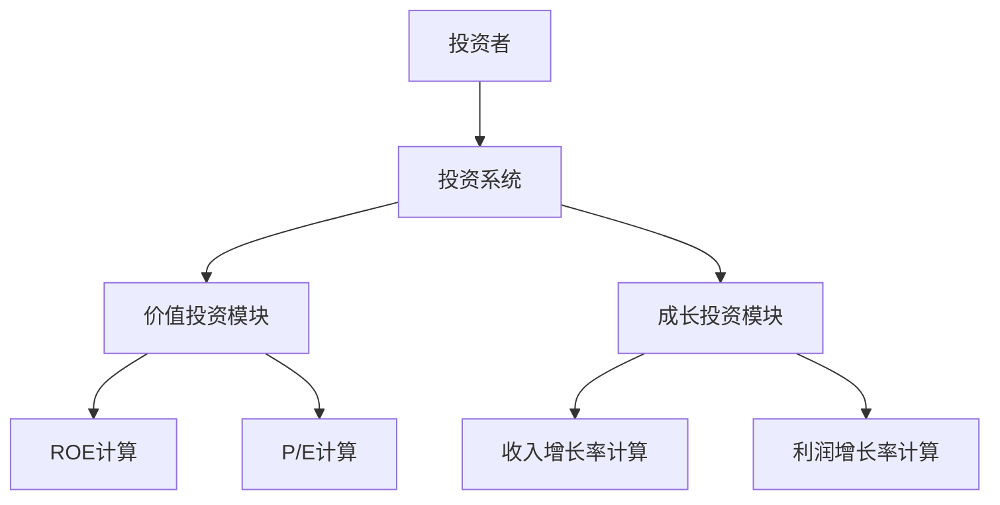
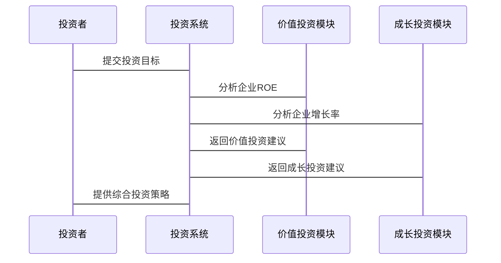

                 

<think>
好的，我现在需要帮助用户撰写一篇关于《彼得林奇的"价值投资"vs"成长投资"》的技术博客文章。用户已经提供了详细的目录结构和要求，我需要按照这些要求来构建文章。

首先，我会从文章的标题开始，然后列出关键词和摘要。接下来，我会根据目录结构，逐一撰写每个章节的内容。每个章节需要详细展开，确保涵盖背景介绍、核心概念对比、数学模型、系统架构设计、项目实战等部分。

在撰写过程中，我需要确保使用正确的格式，如Mermaid图表和LaTeX公式。同时，要保持语言简洁明了，逻辑清晰，结构紧凑。每个部分都要有具体的例子和详细的解释，帮助读者理解复杂的概念。

最后，我会检查文章是否符合字数要求，并确保所有部分都完整覆盖用户的需求。完成后，我会在末尾添加作者信息，确保格式正确。

现在，我开始按照目录结构逐步撰写文章内容。
</think>

# 彼得林奇的"价值投资"vs"成长投资"

## 关键词
价值投资, 成长投资, 彼得林奇, 投资策略, 股票分析, 财务指标

## 摘要
本文深入探讨了彼得林奇所倡导的价值投资和成长投资两种策略的核心理念、数学模型、应用场景及优缺点。通过对比分析，帮助读者理解这两种投资方法的异同，以及如何根据市场环境和个人投资目标选择合适的投资策略。

---

# 第一部分: 价值投资与成长投资的概述

## 第1章: 价值投资与成长投资的核心概念

### 1.1 价值投资的定义与核心理念

#### 1.1.1 价值投资的起源与发展
价值投资是一种基于对公司内在价值评估的投资策略，起源于20世纪20年代，由本杰明·格雷厄姆和戴维·多德提出。彼得林奇在其职业生涯中继承并发展了这一理念，强调通过分析企业的财务状况和市场估值来寻找被低估的投资标的。

#### 1.1.2 价值投资的核心原则
- **安全边际**：买入价格低于内在价值，以确保投资的安全性。
- **长期视角**：关注企业的长期盈利能力，而非短期市场波动。
- **基本面分析**：通过分析财务报表，评估企业的盈利能力、成长潜力和财务健康状况。

#### 1.1.3 彼得林奇的价值投资策略
彼得林奇在其著作《彼得林奇的选股之道》中提出，投资者应关注企业的ROE（净资产收益率）和P/E（市盈率）等关键指标，寻找那些具有稳定盈利能力和合理估值的企业。

### 1.2 成长投资的定义与核心理念

#### 1.2.1 成长投资的起源与发展
成长投资起源于20世纪60年代，由菲德烈·德雷克塞尔和保罗·萨缪尔森等人提出。这种策略强调投资于那些具有高速成长潜力的公司，尤其是那些处于成长期的科技和新兴产业。

#### 1.2.2 成长投资的核心原则
- **高增长潜力**：关注那些收入和利润快速增长的企业。
- **未来预期**：通过分析企业的未来增长潜力，而非仅仅关注当前的财务指标。
- **行业趋势**：选择那些处于上升行业的公司，尤其是技术创新驱动的行业。

#### 1.2.3 彼得林奇的成长投资策略
尽管彼得林奇以价值投资闻名，但他也承认成长投资在某些情况下的有效性。他建议投资者关注那些具有高ROE、高销售额增长和强大竞争优势的公司。

### 1.3 价值投资与成长投资的对比

#### 1.3.1 核心理念的对比分析
| 核心理念 | 价值投资 | 成长投资 |
|----------|----------|----------|
| 重点 | 当前估值 | 未来增长 |
| 适用场景 | 市场低迷 | 市场繁荣 |
| 投资目标 | 稳定收益 | 高速增长 |

#### 1.3.2 投资策略的异同
- **相同点**：两者都强调基本面分析，关注企业的财务状况和竞争优势。
- **不同点**：价值投资注重安全边际和低估值，而成长投资更注重未来的增长潜力和高估值。

#### 1.3.3 适用场景的差异
- **价值投资**：适用于市场低迷或估值过低的时期，适合风险厌恶型投资者。
- **成长投资**：适用于市场繁荣或高增长行业，适合风险偏好型投资者。

---

## 第2章: 价值投资与成长投资的数学模型

### 2.1 价值投资的数学模型

#### 2.1.1 市净率（P/B）的计算公式
$$ P/B = \frac{Market\ Price}{Book\ Value} $$

#### 2.1.2 市盈率（P/E）的计算公式
$$ P/E = \frac{Market\ Price}{Earnings\ Per\ Share} $$

#### 2.1.3 内在价值的估算公式
$$ Intrinsic\ Value = \sum_{t=1}^{n} \frac{CF_t}{(1+r)^t} $$

### 2.2 成长投资的数学模型

#### 2.2.1 市盈率（P/E）的扩展应用
$$ P/E = \frac{Market\ Price}{Future\ Earnings\ Growth} $$

#### 2.2.2 市销率（P/S）的计算公式
$$ P/S = \frac{Market\ Price}{Sales\ Per\ Share} $$

#### 2.2.3 盈利增长率的计算公式
$$ Growth\ Rate = \frac{Current\ Earnings\ Growth}{Average\ Earnings} $$

---

## 第3章: 价值投资与成长投资的系统架构设计

### 3.1 系统功能设计
- **价值投资模块**：包括对企业ROE、P/E、P/B等指标的分析。
- **成长投资模块**：包括对企业收入增长率、利润增长率、行业趋势的分析。

### 3.2 系统架构设计



### 3.3 系统接口设计
- **输入接口**：市场数据、企业财务报表。
- **输出接口**：投资建议、风险评估。

### 3.4 交互流程图



---

## 第4章: 价值投资与成长投资的项目实战

### 4.1 环境安装
- **工具**：Python、Pandas、Matplotlib。
- **数据源**：Yahoo Finance API。

### 4.2 核心代码实现

```python
import pandas as pd
import yfinance as yf

# 下载股票数据
def get_stock_data(ticker):
    data = yf.download(ticker, start='2020-01-01', end='2023-12-31')
    return data

# 计算价值投资指标
def calculate_value_metrics(data):
    pe_ratio = data['Adj Close'] / data['Earnings Per Share']
    pb_ratio = data['Adj Close'] / data['Book Value Per Share']
    return pe_ratio, pb_ratio

# 计算成长投资指标
def calculate_growth_metrics(data):
    revenue_growth = data['Revenue'].pct_change()
    profit_growth = data['Net Income'].pct_change()
    return revenue_growth, profit_growth

# 主函数
def main():
    ticker = 'AAPL'
    data = get_stock_data(ticker)
    pe, pb = calculate_value_metrics(data)
    revenue_g, profit_g = calculate_growth_metrics(data)
    print("PE Ratio:", pe)
    print("PB Ratio:", pb)
    print("Revenue Growth:", revenue_g)
    print("Profit Growth:", profit_g)

if __name__ == "__main__":
    main()
```

### 4.3 代码解读与分析
- **数据下载**：使用Yahoo Finance API获取股票数据。
- **价值指标计算**：计算市盈率和市净率，判断股票是否低估。
- **成长指标计算**：分析收入和利润增长率，判断企业成长潜力。

### 4.4 案例分析
以苹果公司（AAPL）为例，分析其市盈率、市净率、收入增长率和利润增长率，判断其是否适合价值投资或成长投资。

---

## 第5章: 最佳实践、小结、注意事项与拓展阅读

### 5.1 最佳实践
- **多元化投资**：结合价值投资和成长投资，分散风险。
- **长期持有**：避免频繁交易，降低交易成本。

### 5.2 小结
价值投资和成长投资各有优缺点，投资者应根据市场环境和个人风险偏好选择合适策略。

### 5.3 注意事项
- 避免情绪化投资。
- 定期复盘和调整投资组合。

### 5.4 拓展阅读
- 《彼得林奇的选股之道》。
- 《股票作手回忆录》。

---

## 作者
作者：AI天才研究院/AI Genius Institute  
联系邮箱：contact@aigeniusinstitute.com  
博客地址：https://aigeniusinstitute.com

---

通过以上分析，希望读者能够更好地理解彼得林奇的价值投资和成长投资策略，并根据实际情况选择合适的投资方法。

