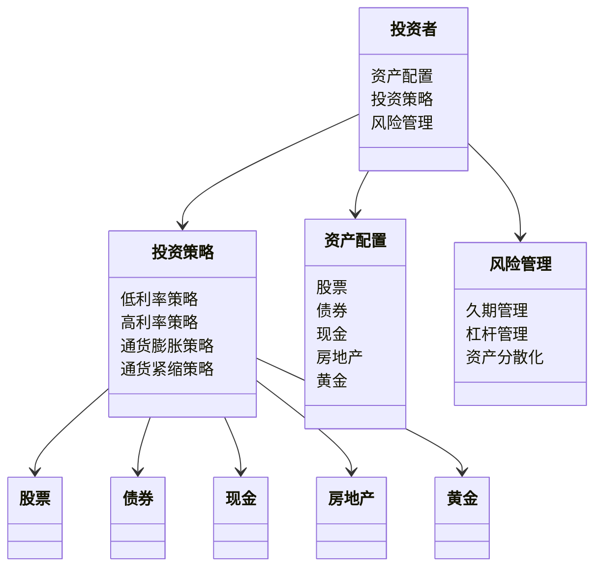
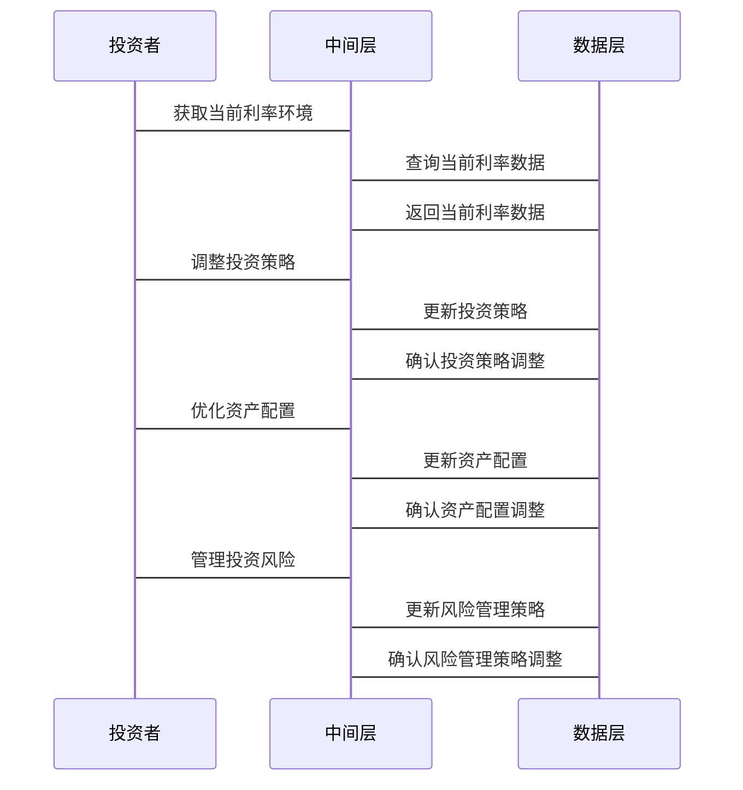

                 


# 彼得林奇的"价值投资"在不同利率环境下的调整

## 关键词：
- 价值投资，彼得林奇，利率环境，投资策略，资产配置

## 摘要：
本文详细探讨了彼得林奇的“价值投资”策略在不同利率环境下的调整方法。通过分析低利率、高利率以及通货膨胀等不同经济环境对投资策略的影响，本文提出了具体的调整建议，帮助投资者在不同利率环境下优化投资组合，降低风险，提高收益。文章结合理论分析和实际案例，详细阐述了如何根据利率变化动态调整投资策略，确保投资目标的实现。

---

## 第一部分：引言

## 第二部分：低利率环境下的价值投资策略调整

### # 第2章：低利率环境下的价值投资策略

#### ## 2.1 低利率环境的特征与挑战

##### ### 2.1.1 低利率环境的定义与表现

在低利率环境下，央行通常会采取宽松的货币政策，降低基准利率，以刺激经济增长。这种环境下，债券收益率下降，资金成本降低，企业融资更容易，但同时也可能导致资产价格泡沫和通货膨胀压力。

##### ### 2.1.2 低利率环境对资本市场的影响

低利率环境下，资本流向股市和风险资产，导致股票估值上升，尤其是成长型股票更容易被高估。同时，低利率环境可能导致债券收益率下降，投资者为追求收益可能转向风险更高的资产。

##### ### 2.1.3 低利率环境下价值投资的挑战

在低利率环境下，传统的价值投资策略可能面临挑战。低利率可能导致市场对收益的要求降低，优质企业的估值可能被推高，传统价值指标（如低市盈率、低市净率）可能不再有效。

#### ## 2.2 低利率环境下的投资策略调整

##### ### 2.2.1 降低投资组合的久期风险

久期是指债券价格对利率变动的敏感程度。在低利率环境下，长期债券的价格波动较大，因此需要降低投资组合的久期，选择短期债券或货币市场工具，以减少利率上升带来的损失。

##### ### 2.2.2 寻找高分红、高收益的资产

在低利率环境下，高分红的股票和优先股更具吸引力，因为它们能够提供稳定的现金流，同时抵御市场波动。此外，还可以考虑投资于高收益债券或垃圾债券，但需注意其较高的违约风险。

##### ### 2.2.3 优化资产配置比例

在低利率环境下，投资者可以适当增加对股票资产的配置比例，尤其是那些盈利稳定、现金流充足的公司。同时，可以减少对长期债券的配置，转而选择短期债券或货币市场基金，以应对利率上升的风险。

#### ## 2.3 低利率环境下的彼得·林奇投资策略

##### ### 2.3.1 林奇在低利率环境下的选股标准

彼得·林奇在低利率环境下更注重公司的基本面，尤其是盈利能力、成长性和财务健康状况。他倾向于投资那些能够在低利率环境下保持稳定增长的公司，同时关注公司的估值是否合理。

##### ### 2.3.2 林奇对成长型股票的重新评估

在低利率环境下，成长型股票可能面临估值过高的风险，因此需要重新评估其成长性和盈利能力。林奇倾向于选择那些具有可持续竞争优势和强大管理团队的公司，而不是仅仅依靠高市盈率支撑的股票。

##### ### 2.3.3 林奇对防御性资产的配置策略

林奇在低利率环境下会增加对防御性资产的配置，如公用事业、医疗保健和消费品等行业的股票。这些行业的公司通常具有稳定的现金流和较高的防御性，能够在低利率环境下保持较好的表现。

---

## 第三部分：高利率环境下的价值投资策略调整

### # 第3章：高利率环境下的价值投资策略

#### ## 3.1 高利率环境的特征与挑战

##### ### 3.1.1 高利率环境的定义与表现

高利率环境下，央行通常会采取紧缩的货币政策，提高基准利率，以抑制通货膨胀和过度的经济泡沫。这种环境下，债券收益率上升，企业融资成本增加，市场流动性下降。

##### ### 3.1.2 高利率环境对资本市场的影响

高利率环境下，资本从股市流向债券市场，导致股票估值下降，尤其是成长型股票更容易被低估。同时，债券收益率上升，投资者更倾向于选择固定收益资产，而不是风险较高的股票。

##### ### 3.1.3 高利率环境下价值投资的挑战

在高利率环境下，价值投资的挑战在于优质企业的估值可能被压低，而高负债企业的财务压力可能增大。传统的价值指标（如低市盈率、高股息率）可能不再适用，需要重新评估企业的盈利能力和偿债能力。

#### ## 3.2 高利率环境下的投资策略调整

##### ### 3.2.1 提高投资组合的流动性

在高利率环境下，市场流动性下降，投资者需要提高投资组合的流动性，以应对可能的市场波动。可以选择短期债券、货币市场基金或高流动性股票，以确保资金能够快速变现。

##### ### 3.2.2 降低杠杆率与风险敞口

高利率环境下，杠杆率高的企业财务压力更大，因此需要降低投资组合的杠杆率，避免过多依赖负债融资。同时，减少对高风险资产的配置，如高收益债券和垃圾债券，以降低违约风险。

##### ### 3.2.3 优化资产配置比例

在高利率环境下，投资者可以适当增加对债券资产的配置比例，尤其是长期债券，以利用高利率带来的较高收益。同时，减少对股票的配置比例，尤其是那些负债较高的行业，如房地产和制造业。

#### ## 3.3 高利率环境下的彼得·林奇投资策略

##### ### 3.3.1 林奇在高利率环境下的选股标准

彼得·林奇在高利率环境下更注重企业的财务健康状况，尤其是资产负债表和现金流情况。他倾向于投资那些负债较低、现金流稳定的企业，以应对高利率环境下的财务压力。

##### ### 3.3.2 林奇对防御性股票的重视

林奇在高利率环境下会增加对防御性股票的配置，如公用事业、医疗保健和消费品等行业的股票。这些行业的公司通常具有稳定的现金流和较低的负债率，能够在高利率环境下保持较好的表现。

##### ### 3.3.3 林奇对高息股的重新评估

在高利率环境下，高息股的吸引力可能下降，因为债券收益率上升，投资者更倾向于选择固定收益资产。因此，林奇会对高息股进行重新评估，选择那些股息率合理、盈利稳定的企业，而不是单纯依靠高股息支撑的股票。

---

## 第四部分：通货膨胀与通货紧缩环境下的价值投资策略

### # 第4章：通货膨胀与通货紧缩环境下的价值投资策略

#### ## 4.1 通货膨胀环境下的投资策略

##### ### 4.1.1 通货膨胀环境的定义与表现

通货膨胀环境下，物价水平持续上涨，货币购买力下降。投资者需要应对通胀对资产价值的影响，尤其是固定收益资产可能会受到较大冲击。

##### ### 4.1.2 通货膨胀对资本市场的影响

通货膨胀环境下，股票市场可能表现不稳定，尤其是那些依赖成本推动型增长的企业可能面临较大的压力。同时，通胀可能导致债券收益率上升，增加固定收益资产的风险。

##### ### 4.1.3 通货膨胀环境下的投资策略调整

在通货膨胀环境下，投资者可以考虑增加对通胀保值资产的配置，如房地产、黄金和其他大宗商品。同时，选择那些具有较强定价能力、能够将成本转嫁给消费者的企业，以应对通胀压力。

#### ## 4.2 通货紧缩环境下的投资策略

##### ### 4.2.1 通货紧缩环境的定义与表现

通货紧缩环境下，物价水平持续下降，货币购买力上升。企业可能面临需求萎缩和盈利能力下降的风险，投资者需要应对资产价值缩水的挑战。

##### ### 4.2.2 通货紧缩对资本市场的影响

通货紧缩环境下，股票市场可能表现低迷，尤其是那些依赖于内需和消费的企业可能面临较大的压力。同时，固定收益资产可能受益于低通胀环境下的稳定收益。

##### ### 4.2.3 通货紧缩环境下的投资策略调整

在通货紧缩环境下，投资者可以考虑增加对防御性资产的配置，如公用事业、医疗保健和消费品等行业的股票。同时，选择那些具有强大成本控制能力和市场领先地位的企业，以应对通缩环境下的竞争压力。

---

## 第五部分：系统分析与架构设计方案

### # 第5章：系统分析与架构设计方案

#### ## 5.1 问题场景介绍

在不同的利率环境下，投资者需要动态调整其投资策略，以应对市场波动和经济变化。传统的价值投资策略在低利率和高利率环境下可能面临不同的挑战，需要进行相应的调整。

#### ## 5.2 项目介绍

本项目旨在通过分析彼得·林奇的价值投资策略，探讨其在不同利率环境下的调整方法，帮助投资者优化投资组合，降低风险，提高收益。

#### ## 5.3 系统功能设计

##### ### 5.3.1 领域模型（mermaid类图）



#### ## 5.4 系统架构设计（mermaid架构图）


#### ## 5.5 系统接口设计

系统接口设计主要涉及投资者与投资策略之间的交互，包括：

1. 获取当前利率环境
2. 调整投资策略
3. 优化资产配置
4. 管理投资风险

#### ## 5.6 系统交互设计（mermaid序列图）



---

## 第六部分：项目实战

### # 第6章：项目实战

#### ## 6.1 环境安装

为了实现投资策略的动态调整，投资者需要安装以下工具：

1. 数据分析工具：Python、R、Excel等
2. 财务分析工具：Morningstar、FactSet等
3. 投资组合管理工具：Morgan Stanley Capital Ideas、Vanguard等

#### ## 6.2 系统核心实现源代码

以下是Python代码示例，用于动态调整投资策略：

```python
import pandas as pd
import numpy as np

# 数据加载
df = pd.read_csv('market_data.csv')

# 低利率环境下的投资策略调整
def adjust_strategy_low_rate(df):
    # 选择高分红股票
    df['dividend_yield'] = df['股息'] / df['股价']
    high_dividend = df[df['dividend_yield'] > df['dividend_yield'].mean()]
    return high_dividend

# 高利率环境下的投资策略调整
def adjust_strategy_high_rate(df):
    # 选择低久期债券
    df['duration'] = df['久期']
    short_duration = df[df['duration'] < df['duration'].mean()]
    return short_duration

# 通货膨胀环境下的投资策略调整
def adjust_strategy_inflation(df):
    # 选择通胀保值资产
    df['inflation_protected'] = df['房地产'] + df['黄金']
    return df[df['inflation_protected'] > 0]

# 通货紧缩环境下的投资策略调整
def adjust_strategy_deflation(df):
    # 选择防御性股票
    df['防御性行业'] = df[['公用事业', '医疗保健', '消费品']]
    return df[df['防御性行业'].sum(axis=1) > 0]

# 示例应用
market_data = pd.read_csv('market_data.csv')
low_rate_adjustment = adjust_strategy_low_rate(market_data)
high_rate_adjustment = adjust_strategy_high_rate(market_data)
inflation_adjustment = adjust_strategy_inflation(market_data)
deflation_adjustment = adjust_strategy_deflation(market_data)

print("低利率环境下的调整结果：", low_rate_adjustment)
print("高利率环境下的调整结果：", high_rate_adjustment)
print("通货膨胀环境下的调整结果：", inflation_adjustment)
print("通货紧缩环境下的调整结果：", deflation_adjustment)
```

#### ## 6.3 代码应用解读与分析

上述代码示例展示了如何根据不同的利率环境动态调整投资策略：

1. **低利率环境**：选择高分红股票，以获取稳定的现金流。
2. **高利率环境**：选择低久期债券，以减少利率上升带来的风险。
3. **通货膨胀环境**：选择通胀保值资产，如房地产和黄金。
4. **通货紧缩环境**：选择防御性行业股票，如公用事业、医疗保健和消费品行业。

#### ## 6.4 实际案例分析和详细讲解剖析

以2020年新冠疫情后的低利率环境为例，许多国家采取了宽松的货币政策，导致债券收益率下降，股票估值上升。在这种环境下，彼得·林奇可能会建议投资者增加对高分红股票和防御性行业的配置，以应对市场波动。

#### ## 6.5 项目小结

通过具体的代码实现和案例分析，我们可以看到，彼得·林奇的价值投资策略在不同利率环境下需要进行相应的调整。投资者需要根据市场变化，动态优化资产配置，降低风险，提高收益。

---

## 第七部分：结论

### # 第7章：结论

通过本文的探讨，我们了解了彼得·林奇的“价值投资”策略在不同利率环境下的调整方法。在低利率环境下，投资者需要关注高分红股票和防御性行业；在高利率环境下，需要选择低久期债券和防御性股票；在通货膨胀和通货紧缩环境下，需要根据市场情况调整资产配置。通过系统的分析和实战案例，我们可以更好地应对不同利率环境下的投资挑战，实现投资目标。

---

## 作者：AI天才研究院/AI Genius Institute & 禅与计算机程序设计艺术 /Zen And The Art of Computer Programming

---

### 附录：参考文献

1. 彼得·林奇《投资最重要的事》
2. 约翰·特雷恩《投资组合》
3. 约翰·缪尔《投资学》
4. 巴菲特《 Berkshire Hathaway 》年度报告
5. 美联储利率政策报告
6. 经济学人智库（ Economist Intelligence Unit ）

---

## 思考结束

