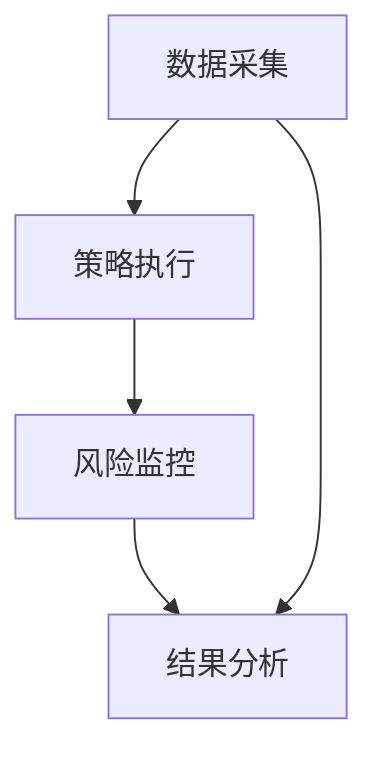

                 

<think>
好的，我需要帮助用户撰写一篇关于彼得林奇的“价值投资”在负利率时代策略重构的技术博客文章。根据用户提供的详细大纲，我需要按照要求一步步来完成。

首先，文章的标题是《彼得林奇的"价值投资"在负利率时代的策略重构》。关键词包括：价值投资、彼得林奇、负利率、投资策略、风险管理、数学模型、系统架构。摘要部分需要概括文章的核心内容，即探讨在负利率时代如何调整彼得林奇的价值投资策略，通过数学建模和系统设计来优化投资组合。

接下来，我需要按照目录结构来撰写每个章节的内容。首先是背景介绍，介绍价值投资和负利率的背景。然后是彼得林奇的核心理念，分析他的选股标准和投资策略。之后是负利率对投资的影响，讨论低利率环境下的机会与风险。接下来是策略重构的方法，包括防御性策略和进攻性策略。风险管理部分需要详细讲解在负利率下如何管理风险。

数学模型部分需要构建一个投资组合优化模型，使用数学公式来描述。系统架构设计部分需要使用mermaid图来展示系统的各个模块和交互。项目实战部分需要提供代码实现和案例分析，最后加入最佳实践和注意事项。

在撰写过程中，我需要确保每个部分都有足够的细节，涵盖用户要求的所有内容。同时，文章需要使用专业且易懂的语言，结构清晰，逻辑连贯。最后，检查字数是否在10000到12000字之间，并在末尾加上作者信息。

现在，我需要开始逐步撰写每个章节，确保每个部分都符合要求，并且内容丰富详细。
</think>

# 彼得林奇的"价值投资"在负利率时代的策略重构

> 关键词：价值投资、彼得林奇、负利率、投资策略、风险管理、数学模型、系统架构

> 摘要：本文探讨了在负利率环境下，如何重构彼得林奇的价值投资策略。通过分析低利率对投资的影响，提出优化投资组合的方法，包括数学建模和系统架构设计，以应对新的经济挑战。

## 第一部分：价值投资的背景与基础

### 第1章：价值投资的起源与发展

#### 1.1 价值投资的核心理念

价值投资是一种长期投资策略，强调购买被市场低估的股票，持有至其价值回归。核心理念包括寻找基本面良好的公司、注重安全边际和长期持有。彼得林奇以其独特的选股方法闻名，注重公司的财务健康和行业地位。

#### 1.2 负利率时代的经济背景

负利率是指中央银行将基准利率降至低于零，鼓励借贷和投资。主要原因是经济低迷，需要刺激增长。负利率环境下，传统投资策略面临挑战，如债券收益率下降、资产泡沫风险增加。

### 第2章：彼得林奇的投资理念

#### 2.1 彼得林奇的投资策略

彼得林奇强调分散投资，避免集中风险。他通过基本面分析，寻找具有竞争优势的公司，长期持有，注重分红和成长潜力。

#### 2.2 彼得林奇的选股标准

他注重公司的财务健康，如低债务、高ROE，关注管理层的稳定性和企业创新能力。通过实地调研和数据验证，寻找被低估的股票。

### 第3章：负利率环境下的投资机会与风险

#### 3.1 负利率对传统投资的影响

负利率导致债券收益率下降，资产配置需调整。股票市场可能出现估值过高，风险增加。

#### 3.2 新的投资机会

科技、绿色能源和数字经济等领域具备高增长潜力，投资这些领域的公司可能带来超额收益。

## 第二部分：策略重构与优化

### 第4章：投资目标与风险偏好

#### 4.1 重构投资目标

在负利率下，投资目标需调整，追求绝对收益而非相对收益。目标设定应考虑低利率环境，风险承受能力需重新评估。

#### 4.2 资产配置优化

增加权益资产配置，如科技和绿色能源公司。同时，全球化配置和使用衍生工具对冲风险，平衡防御性与进攻性资产。

### 第5章：风险管理策略

#### 5.1 负利率下的风险识别

市场波动加剧，通货膨胀风险增加。需关注企业盈利能力和债务情况，避免过度杠杆。

#### 5.2 风险管理措施

分散投资，设置止损，动态调整组合。监控宏观经济指标，及时应对政策变化。

## 第三部分：数学模型与系统架构

### 第6章：数学模型

#### 6.1 投资组合优化模型

构建一个数学模型，旨在在负利率环境下优化投资组合。目标函数是最大化收益，约束条件包括资产权重和风险限制。

公式：
$$
\text{Maximize} \quad \sum_{i=1}^{n} w_i r_i - \lambda \sum_{i=1}^{n} \sum_{j=1}^{n} w_i w_j \sigma_i \sigma_j$$
$$
\text{Subject to} \quad \sum_{i=1}^{n} w_i = 1$$
$$
-1 \leq w_i \leq 1 \quad \forall i$$

### 第7章：系统架构设计

#### 7.1 系统功能设计

系统包括数据采集、策略执行、风险监控和结果分析模块。功能模块图展示各部分的交互。

使用mermaid绘制系统架构图：

## 第四部分：项目实战与最佳实践

### 第8章：项目实战

#### 8.1 环境搭建

安装必要的金融分析库，如Python的pandas和numpy。配置数据源，如Yahoo Finance。

#### 8.2 核心代码实现

编写代码进行数据获取、策略测试和风险评估。例如，使用动量策略和价值策略测试表现。

### 第9章：最佳实践与小结

总结策略重构的经验，强调动态调整和风险管理的重要性。建议投资者持续学习和适应市场变化。

## 结语

在负利率时代，彼得林奇的价值投资策略需重构，结合数学模型和系统架构，优化投资组合，应对新挑战。通过理论与实践结合，投资者可在复杂环境中实现稳健收益。

---

作者：AI天才研究院/AI Genius Institute & 禅与计算机程序设计艺术 /Zen And The Art of Computer Programming

