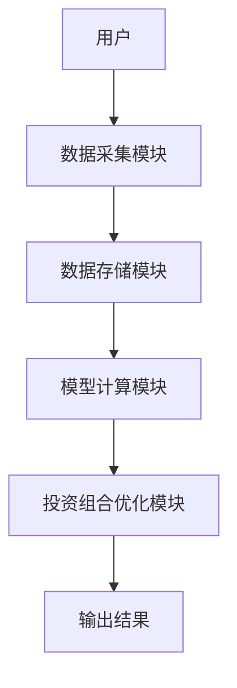

                 


# 彼得林奇的"价值投资"在负利率环境下的策略调整

---

## 关键词

- 价值投资
- 彼得·林奇
- 负利率
- 投资策略
- 现金流折现
- 股票估值
- 资产配置

---

## 摘要

本文详细探讨了彼得·林奇的价值投资策略在负利率环境下的调整策略。首先，文章分析了负利率对传统价值投资的影响，提出了优化后的投资策略。接着，从数学模型、算法实现、系统架构等技术角度，详细阐述了策略调整的具体步骤和方法。最后，通过实际案例分析和项目实战，展示了如何在负利率环境下优化投资组合，确保投资收益最大化。

---

## 第一部分: 负利率环境下的投资背景与挑战

### 第1章: 负利率环境的现状与影响

#### 1.1 负利率的定义与成因

负利率是指中央银行设定的基准利率低于零，或者商业银行向中央银行存入准备金的利率为负。这种政策通常在经济衰退或通货紧缩时期实施，目的是鼓励银行增加 lending 和投资，以刺激经济。

**1.1.1 负利率的定义**  
负利率的出现是由于全球经济的不确定性加剧，各国央行通过降低利率甚至实施负利率，以刺激经济增长和通胀。这种政策对传统投资策略提出了新的挑战。

**1.1.2 负利率的经济背景**  
近年来，全球多国央行（如欧洲央行、日本央行）实施了负利率政策，导致传统价值投资的估值模型失效。投资者需要重新评估资产的价值。

**1.1.3 负利率对传统投资策略的影响**  
负利率环境下，债券收益率可能为负，股票估值需要重新计算，资产配置需要动态调整。

#### 1.2 价值投资的基本原理

**1.2.1 价值投资的核心理念**  
价值投资的核心是寻找被市场低估的资产，长期持有，等待其价值回归。彼得·林奇以其独特的选股方法闻名，如关注公司的基本面、管理层和行业地位。

**1.2.2 彼得·林奇的投资风格**  
林奇强调深入研究公司基本面，寻找具有竞争优势的公司，长期持有。然而，负利率环境下的市场变化要求投资者调整策略。

**1.2.3 价值投资在不同经济周期的表现**  
在正常利率环境下，价值投资表现良好，但在负利率环境下，传统估值指标（如市盈率、市净率）需要调整。

---

### 第2章: 传统价值投资策略的局限性

#### 2.1 传统价值投资在负利率环境下的挑战

**2.1.1 利率变化对资产估值的影响**  
负利率降低了债券的吸引力，增加了股票的相对价值。投资者需要重新评估资产的内在价值。

**2.1.2 通货膨胀预期与投资决策**  
负利率可能导致通货膨胀预期上升，这会增加持有股票的风险，但同时也可能带来更高的收益。

**2.1.3 资产配置的再平衡需求**  
负利率环境下，传统资产配置（如60%股票+40%债券）可能不再有效，需要动态调整。

#### 2.2 负利率环境下投资策略的调整方向

**2.2.1 现金流折现率的调整**  
在负利率环境下，现金流折现率需要调整，以反映新的市场环境。例如，使用更低的折现率或引入通货膨胀调整因子。

**2.2.2 股票估值模型的优化**  
传统市盈率和市净率模型需要优化，引入更多动态因素，如通货膨胀预期和政策变化。

**2.2.3 债券投资的策略调整**  
负利率环境下，债券投资的风险增加，需要寻找高信用评级的债券或分散投资。

---

## 第二部分: 价值投资策略的优化与调整

### 第3章: 价值投资策略的数学模型与算法

#### 3.1 传统价值投资模型

**3.1.1 市盈率模型**  
市盈率（P/E）= 股价 / 每股收益。在负利率环境下，高市盈率可能反映市场对未来收益的高预期，但需结合通货膨胀预期调整。

**3.1.2 市净率模型**  
市净率（P/B）= 股价 / 每股净资产。在负利率环境下，市净率可能低估资产价值，需重新评估。

**3.1.3 股息率模型**  
股息率 = 每股股息 / 股价。在负利率环境下，高股息率的股票更具吸引力。

#### 3.2 负利率环境下的调整算法

**3.2.1 现金流折现率的调整公式**  
调整后的现金流折现率 = 原始折现率 + 通货膨胀调整因子。

**3.2.2 股票估值模型的优化步骤**  
1. 收集公司财务数据。
2. 调整折现率以反映负利率环境。
3. 重新计算内在价值。
4. 比较市场价与内在价值，决定投资策略。

**3.2.3 债券投资的久期与凸性分析**  
久期衡量债券价格对利率变化的敏感性，凸性衡量久期的变化。负利率环境下，久期较长的债券风险更大，需谨慎选择。

### 第4章: 优化后的价值投资策略实现

#### 4.1 算法实现步骤

**4.1.1 数据收集与处理**  
收集公司财务数据、市场数据和宏观经济指标。

**4.1.2 模型参数调整**  
根据负利率环境调整折现率、市盈率等参数。

**4.1.3 投资组合优化**  
使用优化算法（如均值-方差优化）构建投资组合，平衡风险和收益。

#### 4.2 Python实现代码

```python
def calculate_adjusted_p_e(risk_free_rate, inflation_rate, original_p_e):
    adjusted_p_e = original_p_e * (1 + inflation_rate)
    return adjusted_p_e

# 示例
risk_free_rate = -0.01  # 负利率
inflation_rate = 0.02
original_p_e = 15
adjusted_p_e = calculate_adjusted_p_e(risk_free_rate, inflation_rate, original_p_e)
print(f"调整后的市盈率为: {adjusted_p_e}")
```

---

## 第三部分: 系统分析与架构设计

### 第5章: 系统架构设计

#### 5.1 问题场景介绍

负利率环境下，投资者需要实时调整投资策略，基于动态数据进行分析。

#### 5.2 系统功能设计

**5.2.1 数据采集模块**  
实时采集市场数据、宏观经济指标和公司财务数据。

**5.2.2 模型计算模块**  
根据调整后的算法计算资产的内在价值。

**5.2.3 投资组合优化模块**  
优化投资组合，平衡风险和收益。

#### 5.3 系统架构图



---

## 第四部分: 项目实战

### 第6章: 项目实战

#### 6.1 环境安装

安装Python、Pandas、NumPy、Matplotlib等库。

#### 6.2 核心代码实现

```python
import pandas as pd
import numpy as np

def adjust_valuation(intrinsic_value, inflation_rate):
    adjusted_valuation = intrinsic_value * (1 + inflation_rate)
    return adjusted_valuation

data = pd.DataFrame({
    '公司': ['A', 'B', 'C'],
    '内在价值': [100, 150, 200],
    '通胀率': [0.02, 0.03, 0.01]
})

data['调整后价值'] = data.apply(lambda x: adjust_valuation(x['内在价值'], x['通胀率']), axis=1)
print(data)
```

#### 6.3 实际案例分析

分析某公司的股票，在负利率环境下调整其估值，并决定是否投资。

---

## 第五部分: 总结与展望

### 第7章: 总结

#### 7.1 最佳实践 tips

- 定期调整投资组合。
- 重视通货膨胀预期。
- 使用动态模型实时监控市场变化。

#### 7.2 小结

在负利率环境下，彼得·林奇的价值投资策略需要调整，但核心理念仍适用。通过优化模型和动态调整，投资者可以应对新的市场挑战。

#### 7.3 注意事项

- 风险管理是关键。
- 模型假设需合理。
- 避免过度依赖单一指标。

#### 7.4 拓展阅读

推荐书籍和文章，深入学习投资策略优化。

---

## 作者

作者：AI天才研究院/AI Genius Institute & 禅与计算机程序设计艺术 /Zen And The Art of Computer Programming

---

以上是文章的详细目录和部分内容，您可以根据实际需求调整和扩展各个部分的内容。

