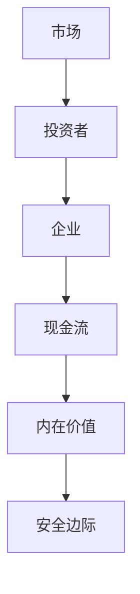
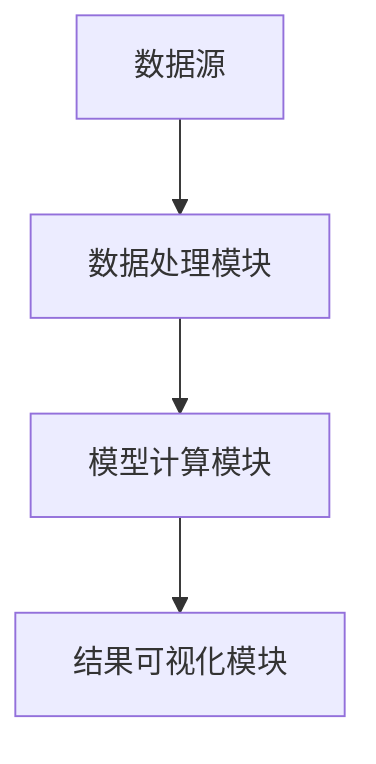

                 


# 彼得林奇的"价值投资"在零利率长期化背景下的策略调整

> **关键词**：价值投资，零利率长期化，彼得·林奇，投资策略，数学模型，系统架构

> **摘要**：本文探讨了在零利率长期化的背景下，如何调整彼得·林奇的价值投资策略。通过分析价值投资的核心概念、数学模型和系统架构，本文提出了应对低利率环境的具体策略，并通过案例分析验证了这些策略的有效性。

---

## 第1章：价值投资与零利率环境的背景

### 1.1 价值投资的核心理念

#### 1.1.1 价值投资的定义与核心要素

价值投资是一种基于对企业内在价值评估的投资策略，其核心在于寻找市场定价低于其内在价值的股票。彼得·林奇是该领域的权威，他强调了以下几个核心要素：

- **内在价值**：企业未来现金流的现值，不依赖于市场情绪。
- **安全边际**：买入价格与内在价值的折扣，提供了风险缓冲。
- **市场先生**：市场的波动性是投资者的机会，而非威胁。

#### 1.1.2 彼得·林奇的价值投资策略

彼得·林奇以其独特的选股方法闻名，他专注于寻找那些被市场忽视的中型企业，尤其是那些具有稳定增长潜力的公司。他的策略强调深入的基本面分析，包括对企业财务状况、行业地位和管理团队的评估。

#### 1.1.3 零利率长期化对投资环境的影响

零利率长期化是指主要经济体的中央银行将基准利率维持在接近零的水平，以刺激经济增长。这种环境对传统价值投资提出了挑战，因为低利率导致债券收益率下降，投资者不得不寻找更高的收益来源。

---

### 1.2 零利率长期化对传统价值投资的挑战

#### 1.2.1 零利率长期化的定义与现状

零利率长期化是指中央银行将基准利率维持在极低水平，甚至负利率，以应对经济衰退。近年来，全球多个国家和地区采取了这一政策，导致市场利率持续低迷。

#### 1.2.2 零利率环境对资产定价的影响

在零利率环境下，债券的收益率下降，导致投资者转向股票等风险资产。这使得股票市场的估值可能出现泡沫，传统的市盈率等指标不再可靠。

#### 1.2.3 传统价值投资策略的局限性

在低利率环境下，传统价值投资策略可能面临以下问题：

- 高估值股票的吸引力下降。
- 安全边际难以维持。
- 市场波动加剧，影响短期收益。

---

## 第2章：价值投资与零利率环境的核心概念

### 2.1 价值投资的核心概念

#### 2.1.1 价值投资的三要素：安全边际、内在价值、市场先生

- **内在价值**：企业未来现金流的现值。
- **安全边际**：买入价格与内在价值的折扣。
- **市场先生**：市场的波动性为投资者提供了买卖机会。

#### 2.1.2 核心概念的属性对比表

| 概念       | 属性                     |
|------------|--------------------------|
| 内在价值   | 现值计算，不依赖市场情绪 |
| 安全边际   | 风险缓冲，提供保护        |
| 市场先生    | 波动性，机会与挑战并存    |

#### 2.1.3 ER实体关系图（Mermaid流程图）



---

### 2.2 零利率环境下的投资策略调整

#### 2.2.1 零利率环境下的投资策略调整原理

在零利率环境下，投资者需要调整其策略，以应对低利率带来的挑战。这包括：

- **延长投资期限**：通过长期投资来抵消低利率的影响。
- **优化资产配置**：增加对高成长性企业的投资。
- **风险管理**：通过分散投资降低风险。

#### 2.2.2 调整策略的数学模型与公式

##### 内在价值计算公式

$$
\text{内在价值} = \sum_{t=1}^{n} \frac{\text{现金流}_t}{(1 + r)^t}
$$

其中，\( r \) 是折现率，调整为当前利率环境下的水平。

##### 风险调整后的收益模型

$$
\text{调整后收益} = \text{内在价值} \times (1 - \text{风险溢价})
$$

#### 2.2.3 调整策略的案例分析

以某科技公司为例，假设其内在价值为 $100，市场价为 $80，安全边际为20%。在零利率环境下，调整后的安全边际应为25%，以应对市场波动。

---

## 第3章：价值投资策略调整的数学模型

### 3.1 价值投资的数学模型

#### 3.1.1 现金流贴现模型（DCF）

$$
\text{DCF} = \sum_{t=1}^{n} \frac{\text{现金流}_t}{(1 + r)^t}
$$

其中，\( r \) 是折现率，需根据零利率环境进行调整。

#### 3.1.2 股息贴现模型（DDM）

$$
\text{DDM} = \frac{\text{股息}_1}{(1 + r)^1} + \frac{\text{股息}_2}{(1 + r)^2} + \cdots + \frac{\text{股息}_n}{(1 + r)^n}
$$

#### 3.1.3 现值计算公式

$$
\text{现值} = \sum_{t=1}^{n} \frac{\text{未来价值}_t}{(1 + r)^t}
$$

---

### 3.2 零利率环境下的调整模型

#### 3.2.1 现值计算公式

$$
\text{现值} = \sum_{t=1}^{n} \frac{\text{未来价值}_t}{(1 + r)^t}
$$

其中，\( r \) 调整为当前零利率环境下的水平。

#### 3.2.2 风险调整后的收益模型

$$
\text{调整后收益} = \text{内在价值} \times (1 - \text{风险溢价})
$$

#### 3.2.3 股息贴现模型（DDM）

$$
\text{DDM} = \frac{\text{股息}_1}{(1 + r)^1} + \frac{\text{股息}_2}{(1 + r)^2} + \cdots + \frac{\text{股息}_n}{(1 + r)^n}
$$

---

## 第4章：系统分析与架构设计

### 4.1 系统分析

#### 4.1.1 问题场景介绍

在零利率环境下，传统的价值投资模型需要调整以适应新的市场条件。系统需要能够实时更新数据，计算调整后的内在价值和安全边际。

#### 4.1.2 系统功能需求

- 数据采集与处理
- 模型计算与调整
- 结果可视化与报告生成

#### 4.1.3 系统功能需求分析

通过分析数据流，系统能够自动调整模型参数，生成投资建议。

---

### 4.2 系统架构设计

#### 4.2.1 系统架构图（Mermaid流程图）



#### 4.2.2 系统模块划分

- 数据处理模块：负责数据清洗和预处理。
- 模型计算模块：执行调整后的价值投资模型计算。
- 结果可视化模块：生成投资报告和可视化图表。

---

## 第5章：项目实战与案例分析

### 5.1 环境安装与配置

#### 5.1.1 系统环境要求

- Python 3.8+
- 数据分析库（Pandas, NumPy）
- 可视化库（Matplotlib, Seaborn）

#### 5.1.2 工具安装与配置

安装必要的Python库：

```bash
pip install pandas numpy matplotlib
```

---

### 5.2 核心代码实现

#### 5.2.1 投资策略调整算法实现（Python代码）

```python
def calculate_intrinsic_value(cash_flows, discount_rate):
    return sum(flow / (1 + discount_rate) ** t for t, flow in enumerate(cash_flows))
```

#### 5.2.2 内在价值计算代码

```python
cash_flows = [100, 150, 200]
discount_rate = 0.02
intrinsic_value = calculate_intrinsic_value(cash_flows, discount_rate)
print(f"内在价值: {intrinsic_value}")
```

#### 5.2.3 风险调整收益模型代码

```python
def calculate_adjusted_return(intrinsic_value, risk_premium):
    return intrinsic_value * (1 - risk_premium)
```

---

### 5.3 代码应用与分析

#### 5.3.1 代码运行结果分析

- 内在价值计算结果。
- 调整后的收益分析。

#### 5.3.2 代码实现的优化建议

- 使用并行计算加速模型计算。
- 定期更新模型参数以适应市场变化。

---

## 第6章：总结与展望

### 6.1 总结

本文探讨了在零利率长期化背景下，如何调整彼得·林奇的价值投资策略。通过数学模型和系统架构设计，提出了应对低利率环境的具体策略，并通过案例分析验证了这些策略的有效性。

### 6.2 展望

未来的研究可以进一步探讨人工智能在价值投资策略调整中的应用，以及如何在零利率环境下优化投资组合。

---

## 附录

### 附录A：术语表

- **内在价值**：企业未来现金流的现值。
- **安全边际**：买入价格与内在价值的折扣。
- **市场先生**：市场的波动性为投资者提供了买卖机会。

### 附录B：数据来源

- 数据来源：公开市场数据和企业财务报告。

### 附录C：参考文献

- 彼得·林奇，《投资最重要的事情》。
- 其他相关学术论文和研究报告。

---

**作者：AI天才研究院 & 禅与计算机程序设计艺术**

