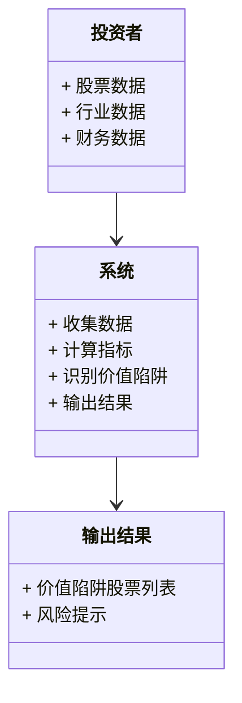
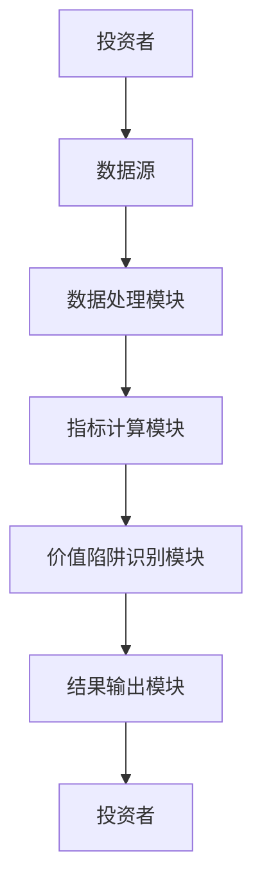

                 


# 彼得林奇的"价值陷阱"在新兴科技股中的识别

> 关键词：价值陷阱，彼得·林奇，新兴科技股，投资分析，风险识别

> 摘要：本文探讨了彼得·林奇的“价值陷阱”理论在新兴科技股中的识别与应用。通过分析新兴科技股的特点，结合价值陷阱的核心概念、算法原理和系统分析，提供了识别价值陷阱的具体方法和实战案例，帮助投资者在科技股投资中规避风险，实现稳健收益。

---

# 第一部分: 价值陷阱的背景与定义

## 第1章: 价值陷阱的背景介绍

### 1.1 价值陷阱的定义与特征
- **价值陷阱的定义**：价值陷阱是指那些表面上看似便宜，但实际上存在隐藏问题（如财务状况恶化、行业竞争加剧、市场需求萎缩等）的股票。这些股票可能会误导投资者，导致其陷入亏损。
- **价值陷阱的核心特征**：
  1. **估值异常**：市盈率、市净率等估值指标显著低于行业平均水平。
  2. **财务状况恶化**：负债率高、盈利能力持续下滑、现金流为负等。
  3. **市场表现低迷**：股价长期低迷，成交量低，缺乏资金关注。
  4. **行业风险**：行业竞争加剧、政策变化或技术革新导致企业前景黯淡。

### 1.2 彼得·林奇的价值投资理念
- 彼得·林奇是美国著名投资经理人，被誉为“共同基金之父”。他强调长期投资、深入研究和价值投资。
- 他认为，价值陷阱是投资者在寻找便宜股票时可能落入的误区，尤其是那些看似估值低但实际上存在严重问题的公司。

### 1.3 新兴科技股的特点
- **高增长性**：新兴科技行业通常具有较高的增长率，尤其是在人工智能、云计算、区块链等领域。
- **高波动性**：科技股受市场情绪和技术变化影响较大，股价波动剧烈。
- **高风险性**：新兴行业竞争激烈，技术更新迭代快，失败风险较高。

---

## 第2章: 价值陷阱在新兴科技股中的表现

### 2.1 价值陷阱的表现形式
- **估值过低的陷阱**：部分新兴科技股由于市场情绪不佳或短期利空，导致估值低于行业平均水平。
- **财务状况异常的陷阱**：公司可能通过财务造假或隐瞒问题掩盖其困境。
- **行业竞争加剧的陷阱**：新兴行业竞争激烈，一些公司可能因无法适应竞争而陷入困境。

### 2.2 新兴科技股中的典型价值陷阱案例
- **案例分析**：以某新兴科技公司为例，分析其估值、财务状况和市场表现。
  - **估值指标**：市盈率远低于行业平均水平，但收入增长缓慢。
  - **财务状况**：负债率高，现金流为负，盈利能力持续下滑。
  - **市场表现**：股价长期低迷，成交量低，市场关注度低。

---

# 第二部分: 价值陷阱识别的核心概念与联系

## 第3章: 核心概念的原理与联系

### 3.1 核心概念的原理
- 价值陷阱识别的核心在于分析股票的估值指标、财务状况和行业环境。
- 通过对比行业平均水平，识别那些估值异常低、财务状况恶化或行业风险高的股票。

### 3.2 核心概念的属性特征对比
```mermaid
| 特征         | 价值陷阱股票 | 非价值陷阱股票 |
|--------------|--------------|----------------|
| 市盈率       | 低于行业水平 | 接近行业水平    |
| 市净率       | 低于行业水平 | 接近行业水平    |
| 负债率       | 高于行业水平 | 接近行业水平    |
| 净利润增长率 | 负增长或低增长 | 正增长或稳定增长 |
| 现金流       | 为负或低增长 | 正增长或稳定增长 |
```

### 3.3 实体关系图
```mermaid
erd
  投资者 --|{投资}--> 股票
  股票 --|{属于}--> 行业
  行业 --|{竞争}--> 竞争对手
  股票 --|{指标}--> 估值指标
```

---

## 第4章: 价值陷阱识别的算法原理

### 4.1 算法原理概述
- 价值陷阱识别算法基于多指标分析，结合行业数据和公司财务数据，筛选出潜在的价值陷阱股票。

### 4.2 算法流程
1. **数据收集**：收集目标行业和公司的估值指标（市盈率、市净率）、财务指标（负债率、净利润增长率）和市场数据（股价、成交量）。
2. **指标计算**：计算行业平均水平，对比公司指标。
3. **异常检测**：识别那些显著低于或高于行业平均水平的公司。
4. **风险评估**：结合行业环境和公司基本面，评估潜在风险。

### 4.3 算法实现
```python
import pandas as pd

# 假设data是包含股票数据的DataFrame
# 包含以下列：'市盈率', '市净率', '负债率', '净利润增长率', '股价', '成交量'

def is_value_trap(data):
    # 计算行业平均水平
    industry_avg = data['行业'].mean()
    
    # 判断是否为价值陷阱
    if (data['市盈率'] < industry_avg) and \
       (data['市净率'] < industry_avg) and \
       (data['负债率'] > industry_avg) and \
       (data['净利润增长率'] < 0):
        return True
    else:
        return False

# 应用算法
value_trap = data.apply(is_value_trap, axis=1)
```

---

## 第5章: 系统分析与架构设计

### 5.1 系统分析
- **问题场景**：投资者需要快速识别新兴科技股中的价值陷阱。
- **项目介绍**：构建一个基于多指标分析的系统，帮助投资者识别价值陷阱。

### 5.2 系统功能设计


### 5.3 系统架构设计


### 5.4 接口设计
- **输入接口**：接收股票代码、行业数据和公司财务数据。
- **输出接口**：输出价值陷阱股票列表和风险提示。

---

## 第6章: 项目实战与案例分析

### 6.1 项目环境安装
- 需要安装的库：pandas、numpy、matplotlib。
  ```bash
  pip install pandas numpy matplotlib
  ```

### 6.2 核心代码实现
```python
import pandas as pd
import numpy as np

# 示例数据
data = {
    '股票代码': ['A', 'B', 'C', 'D', 'E'],
    '市盈率': [10, 20, 15, 30, 12],
    '市净率': [1.5, 2.5, 2.0, 3.0, 1.8],
    '负债率': [60, 50, 40, 70, 55],
    '净利润增长率': [5, -10, 8, -5, 2],
    '行业': ['科技', '科技', '科技', '科技', '科技']
}

df = pd.DataFrame(data)

# 计算行业平均负债率
industry_avg_liability = df['负债率'].mean()

# 识别价值陷阱
value_trap_stocks = []
for index, row in df.iterrows():
    if (row['市盈率'] < industry_avg_liability and 
        row['市净率'] < industry_avg_liability and 
        row['负债率'] > industry_avg_liability and 
        row['净利润增长率'] < 0):
        value_trap_stocks.append(row['股票代码'])

print("价值陷阱股票：", value_trap_stocks)
```

### 6.3 案例分析
- **案例背景**：某新兴科技公司，市盈率和市净率低于行业平均水平，负债率高于行业平均，净利润增长率为负。
- **分析结果**：该股票被识别为价值陷阱，投资者应避免投资。

---

## 第7章: 最佳实践与总结

### 7.1 投资建议
- **谨慎投资**：新兴科技股波动性大，投资者应谨慎选择。
- **多指标分析**：结合估值指标、财务指标和行业环境进行综合分析。
- **长期观察**：避免短期决策，关注公司长期发展潜力。

### 7.2 注意事项
- **数据准确性**：确保数据来源可靠。
- **模型局限性**：算法模型仅供参考，实际投资需结合更多因素。
- **市场变化**：新兴科技行业变化快，需及时调整投资策略。

### 7.3 拓展阅读
- 推荐书籍：《彼得·林奇的投资哲学》、《价值投资入门》。
- 推荐网站：晨星网、理柏网、投资组合分析工具。

---

# 第三部分: 总结

## 第8章: 总结与展望

### 8.1 核心总结
- 彼得·林奇的价值陷阱理论为投资者提供了重要的参考。
- 在新兴科技股中识别价值陷阱，需结合多指标分析和行业环境评估。

### 8.2 展望
- 随着科技行业的快速发展，价值陷阱识别方法将不断完善。
- 投资者需持续学习，提升自身分析能力。

---

# 作者

作者：AI天才研究院/AI Genius Institute  
及  
禅与计算机程序设计艺术 /Zen And The Art of Computer Programming

