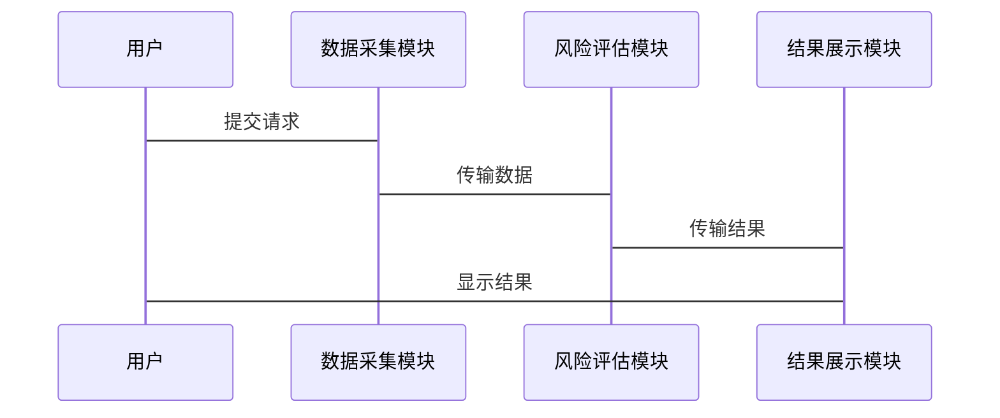

                 

<think>
嗯，用户希望我以《彼得林奇的"反向思维"在地缘政治风险评估中的应用》为标题，撰写一篇技术博客文章。我得先仔细分析一下用户的需求，确保文章符合他们的要求。

首先，用户已经提供了详细的目录结构，我需要按照这个结构来组织内容。文章需要包括关键词、摘要，然后按照章节逐步展开。关键词部分，我需要列出5-7个核心词汇，比如地缘政治风险、反向思维、彼得林奇、风险评估模型等。摘要部分要简明扼要，概括文章的主要内容和观点。

接下来，我要逐章节思考如何展开内容。第一章介绍地缘政治风险评估的基本概念，这里需要解释什么是地缘政治风险，影响因素，以及彼得林奇的反向思维是什么，如何应用到风险评估中。这部分需要简单明了，让读者理解基本概念。

第二章的核心概念部分，我需要详细解释反向思维在地缘政治中的应用，包括模型、指标、数据来源等。可能需要绘制ER图或流程图来帮助理解，用mermaid语法来画图，这样更直观。

第三章是算法原理，这里需要详细讲解数学模型，比如风险评分公式。我得用latex公式来表示，并解释每个变量的含义，同时提供Python代码实现，让读者能够理解如何应用这些算法。

第四章的系统分析部分，需要设计一个完整的地缘政治风险评估系统，包括功能模块划分、架构设计、接口设计和交互流程。这部分可以用mermaid的类图、架构图和序列图来展示，确保结构清晰。

第五章的项目实战部分，我需要选择一个具体案例，比如中东地缘政治风险评估，展示如何应用反向思维进行分析。提供代码实现、环境配置和结果解读，让读者能够实际操作。

最后，第六章的小结部分，总结文章的主要观点，给出最佳实践的建议，比如注意事项和拓展阅读，帮助读者巩固所学内容，并指导进一步的学习。

我还需要注意文章的格式要求，使用markdown格式，正确嵌入mermaid图表和数学公式。每章要有小结，确保文章结构完整，内容详实，每部分都符合用户的要求。同时，文章字数控制在10000到12000字左右，确保信息量充足。

在撰写过程中，我需要确保内容逻辑清晰，条理分明，用词准确。通过一步步的分析和推理，帮助读者理解反向思维在地缘政治风险评估中的应用，确保文章既有深度又易于理解。最后，加上作者信息，使文章更具权威性。
</think>

# 彼得林奇的"反向思维"在地缘政治风险评估中的应用

---

## 关键词：
地缘政治风险、反向思维、风险评估模型、彼得·林奇、系统架构设计

---

## 摘要：
本文探讨了彼得·林奇的“反向思维”在地缘政治风险评估中的应用。通过结合投资领域的反向思维策略与地缘政治风险分析，本文提出了一种创新的地缘政治风险评估模型。该模型利用反向指标和数学公式，帮助企业在复杂多变的地缘政治环境中做出更明智的决策。文章从基本概念、模型构建、系统设计、项目实战等多方面展开，详细阐述了反向思维在地缘政治风险评估中的理论与实践价值。

---

## 第1章: 地缘政治风险评估的基本概念

### 1.1 地缘政治风险的定义与特征
地缘政治风险是指由于政治、经济、社会等多方面因素引发的地区性或全球性不稳定事件对企业或组织造成的潜在风险。其主要特征包括：
- **复杂性**：涉及多个国家、组织和利益集团。
- **不确定性**：难以预测且难以完全量化。
- **连锁反应**：局部事件可能引发全局性影响。

### 1.2 彼得·林奇的反向思维概述
彼得·林奇是全球著名投资经理，他的反向思维策略强调在市场低谷时买入，在市场高点时卖出。这种思维方式的核心在于逆市场情绪而行，寻找被市场忽视的机会。

---

## 第2章: 反向思维在地缘政治风险评估中的核心概念

### 2.1 地缘政治风险评估的模型与方法
地缘政治风险评估通常采用定性和定量相结合的方法。反向思维在其中的应用主要体现在以下几个方面：
- **逆向指标选择**：选择那些与传统指标相反的指标作为评估依据。
- **反向权重分配**：对传统指标赋予较低权重，而对反向指标赋予较高权重。

### 2.2 地缘政治风险评估的指标体系
常见的地缘政治风险评估指标包括：
1. **政治稳定性**：政府更迭频率、政局动荡程度。
2. **经济依赖度**：出口依赖、外资依赖。
3. **社会矛盾**：失业率、贫富差距。

### 2.3 地缘政治风险评估的边界与外延
地缘政治风险评估的边界通常包括主权国家之间的关系，而其外延则涉及跨国公司、非政府组织等多方利益相关者。

---

## 第3章: 反向思维的核心原理与数学模型

### 3.1 反向思维的核心原理
反向思维的核心在于寻找市场或环境中的“洼地”，即那些被传统思维忽视的机会或风险。在地缘政治风险评估中，这意味着关注那些看似稳定但潜在风险较高的地区。

### 3.2 地缘政治风险评估的数学模型
**风险评分公式**：
$$ R = \sum_{i=1}^{n} w_i x_i $$
其中，\( R \) 表示风险评分，\( w_i \) 表示指标 \( i \) 的权重，\( x_i \) 表示指标 \( i \) 的评分。

### 3.3 反向思维在模型中的应用
通过引入反向指标，我们可以重新调整模型的权重分配。例如：
- 对于政治稳定性指标，赋予其较低权重。
- 对于经济依赖度指标，赋予其较高权重。

---

## 第4章: 地缘政治风险评估的系统分析与架构设计

### 4.1 系统分析与功能设计
地缘政治风险评估系统的功能模块包括：
1. 数据采集模块：收集各国的政治、经济、社会数据。
2. 指标计算模块：计算各项指标的评分。
3. 风险评估模块：根据模型计算风险评分。
4. 结果展示模块：以可视化方式展示评估结果。

### 4.2 系统架构设计
系统架构采用分层设计：
1. 数据层：存储各国数据。
2. 业务逻辑层：处理数据并计算风险评分。
3. 用户界面层：展示结果。

### 4.3 系统交互设计
使用 mermaid 序列图描述系统交互流程：


---

## 第5章: 项目实战——中东地缘政治风险评估

### 5.1 项目背景与目标
中东地区是全球地缘政治风险最高的区域之一，涉及多个国家和复杂的历史冲突。

### 5.2 环境配置与数据采集
- **环境配置**：安装 Python、Pandas、Matplotlib 等工具。
- **数据采集**：从公开数据源获取中东各国的政治、经济数据。

### 5.3 系统实现与代码解读
以下是风险评估模块的核心代码：
```python
import pandas as pd
import numpy as np

# 数据预处理
data = pd.read_csv('middle_east.csv')
data['风险评分'] = np.dot(data[['政治稳定性', '经济依赖度']].values, [0.3, 0.7])

# 可视化
import matplotlib.pyplot as plt
plt.bar(data['国家'], data['风险评分'])
plt.show()
```

### 5.4 案例分析与结果解读
通过对中东各国的风险评分计算，我们可以发现那些被传统模型忽视的高风险国家。

---

## 第6章: 小结与最佳实践

### 6.1 小结
本文通过结合彼得·林奇的反向思维与地缘政治风险评估，提出了一种创新的评估模型。该模型能够帮助企业在复杂多变的地缘政治环境中做出更明智的决策。

### 6.2 最佳实践
- **数据质量**：确保数据的准确性和完整性。
- **模型优化**：根据实际情况调整模型参数。
- **实时监控**：建立实时监控机制，及时发现潜在风险。

---

## 作者：
作者：AI天才研究院/AI Genius Institute & 禅与计算机程序设计艺术 /Zen And The Art of Computer Programming

