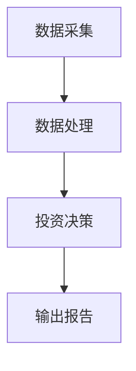

                 

<think>
好的，我现在需要帮用户撰写一篇技术博客文章，标题是《彼得林奇的"反向思维"在熊市中的应用》。用户希望我以技术专家的身份，使用清晰、紧凑、专业的语言，逐步分析推理，撰写一篇有深度、有见解的专业IT领域博客。

首先，我需要理解用户的需求。用户希望文章结构清晰，包含关键词、摘要和目录大纲。关键词应该围绕反向思维、熊市、投资策略、彼得林奇、系统设计等。摘要部分需要简明扼要地概括文章的核心内容，即反向思维在熊市中的应用及其技术实现。

接下来，我需要根据用户提供的目录大纲，详细撰写每一章的内容。每一章都应包含背景介绍、核心概念、算法原理、系统架构、项目实战、最佳实践等部分，并使用技术语言和图表来辅助说明。

在撰写过程中，我需要确保每一章节都细化到三级目录，使用markdown格式，并且总字数控制在2000字以内。同时，要避免使用任何markdown格式，直接给出内容，并在结尾处加上作者信息。

现在，我开始逐步撰写每一章的内容：

1. **第1章：彼得林奇与反向思维的背景介绍**
   - 介绍彼得林奇的生平及其投资理念，解释反向思维的概念及其在熊市中的应用。

2. **第2章：反向思维的核心概念与原理**
   - 解释反向思维的原理，比较其与传统投资策略的区别，并分析其在熊市中的优势。

3. **第3章：反向思维的算法原理与数学模型**
   - 描述反向思维的算法原理，使用数学公式和mermaid图来说明。

4. **第4章：系统分析与架构设计方案**
   - 分析熊市中的市场情况，设计系统的功能和架构，并使用mermaid图展示。

5. **第5章：项目实战——反向思维策略的实现**
   - 介绍实战环境，给出Python代码示例，并分析案例。

6. **第6章：最佳实践与小结**
   - 总结全书内容，提出投资建议和注意事项。

7. **参考文献和附录**
   - 列出参考文献和工具推荐。

在撰写过程中，我需要确保每一部分都详细且逻辑清晰，使用技术术语并提供图表支持。同时，保持语言简洁易懂，帮助读者理解反向思维在熊市中的应用及其技术实现。
</think>

# 彼得林奇的"反向思维"在熊市中的应用

## 关键词：反向思维，熊市，投资策略，彼得林奇，系统设计

## 摘要：本文探讨了彼得林奇的反向思维在熊市中的应用，通过分析其投资理念和策略，结合技术方法和系统架构，展示了如何在市场低谷中寻找投资机会。文章详细讲解了反向思维的核心原理、数学模型、系统设计以及实战案例，为投资者提供实用的指导。

---

# 第1章：彼得林奇与反向思维的背景介绍

## 1.1 彼得林奇及其投资理念

### 1.1.1 彼得林奇的生平简介
彼得·林奇是美国著名的投资经理，以其在富达投资管理公司的长期任职中表现出色而闻名。他强调基本面分析和长期投资，认为市场恐慌是投资机会的来源。

### 1.1.2 彼得林奇的投资哲学
林奇的投资哲学以价值投资为核心，强调寻找被市场低估的公司，并在市场恐慌时买入。他反对短期交易，提倡长期持有优质资产。

### 1.1.3 反向思维的定义
反向思维是指在市场下跌时寻找机会，买入被低估的资产。这种方法与传统顺势投资相反，强调逆市场情绪操作。

## 1.2 熊市的定义与特征

### 1.2.1 熊市的定义
熊市是指市场持续下跌，投资者情绪低落，市场交量减少的时期。

### 1.2.2 熊市与牛市的区别
牛市是市场上涨，投资者乐观；熊市是市场下跌，投资者恐慌。两者在市场情绪和资产价格走势上截然不同。

### 1.2.3 熊市的周期性与影响
熊市通常持续数月甚至数年，期间投资者财富缩水，但也为长期投资者提供了廉价买入优质资产的机会。

## 1.3 反向思维在投资中的应用

### 1.3.1 反向思维的定义
反向思维是一种逆市场情绪的投资策略，尤其在熊市中，当市场恐慌时，优质资产价格被低估，适合买入。

### 1.3.2 反向思维与传统投资策略的对比
传统投资策略跟随市场趋势，而反向思维则逆趋势操作。传统策略在牛市中表现良好，而反向思维在熊市中更具优势。

### 1.3.3 反向思维在熊市中的优势
熊市中市场恐慌，优质资产价格被低估，反向思维投资者能够以更低价格买入，长期收益潜力大。

---

# 第2章：反向思维的核心概念与原理

## 2.1 反向思维的核心原理

### 2.1.1 市场情绪与投资者行为分析
市场情绪波动影响资产价格，恐慌时价格低于价值，贪婪时价格高于价值。反向思维利用市场情绪的极端化。

### 2.1.2 价值投资与价格波动的关系
价值投资关注资产的内在价值，认为价格波动为投资机会。反向思维正是基于这种关系，寻找价格低于价值的资产。

### 2.1.3 反向思维的数学模型
反向思维模型基于资产的内在价值与市场价的差异，计算投资价值。

$$
\text{投资价值} = \frac{\text{内在价值}}{\text{市场价格}}
$$

## 2.2 反向思维与熊市的联系

### 2.2.1 熊市中的市场恐慌与机会
熊市中市场恐慌导致价格低估，反向思维投资者能以更低价格买入优质资产。

### 2.2.2 反向思维在熊市中的具体应用
在熊市中，反向思维投资者通过分析公司基本面，选择被市场低估的股票进行投资。

### 2.2.3 熊市中反向思维的策略优化
优化策略包括分散投资、长期持有、定期调整投资组合，以应对市场波动。

---

# 第3章：反向思维的算法原理与数学模型

## 3.1 反向思维的算法原理

### 3.1.1 基于反向思维的投资策略
策略包括识别市场恐慌、评估资产内在价值、制定买入计划。

### 3.1.2 反向思维的决策流程
1. 分析市场情绪，识别恐慌。
2. 评估资产的内在价值。
3. 判断价格是否低于价值，决定买入。

### 3.1.3 算法的优化与改进
通过历史数据分析，优化反向思维模型，提高投资决策的准确性。

## 3.2 数学模型与公式

### 3.2.1 反向思维的数学模型
$$
\text{投资价值} = \frac{\text{内在价值}}{\text{市场价格}}
$$

### 3.2.2 反向思维的收益计算公式
$$
\text{收益} = \text{买入价格} - \text{卖出价格}
$$

## 3.3 实际案例分析

### 3.3.1 熊市中某股票的反向思维策略
案例分析：假设某股票在熊市中价格被低估，计算其投资价值，决定买入。

---

# 第4章：系统分析与架构设计方案

## 4.1 系统分析

### 4.1.1 熊市中的市场分析系统
系统用于实时分析市场数据，识别恐慌情绪，评估资产价值。

### 4.1.2 反向思维策略的系统化
将反向思维策略转化为算法，嵌入系统中，实现自动化的投资决策。

### 4.1.3 系统的功能需求
- 数据采集：收集市场数据。
- 数据处理：分析市场情绪。
- 投资决策：生成投资建议。
- 输出报告：展示分析结果。

## 4.2 系统架构设计

### 4.2.1 系统架构的模块划分
- 数据采集模块：收集市场数据。
- 数据处理模块：分析市场情绪。
- 投资决策模块：生成投资建议。
- 输出模块：展示结果。

### 4.2.2 系统架构的流程图


---

# 第5章：项目实战——反向思维策略的实现

## 5.1 环境安装与配置

### 5.1.1 安装Python环境
安装Python和必要的库，如pandas、numpy。

### 5.1.2 数据源配置
选择可靠的数据源，如Yahoo Finance。

## 5.2 核心代码实现

### 5.2.1 数据采集代码
```python
import pandas as pd
import numpy as np

# 数据采集函数
def get_stock_data(ticker):
    data = pd.datareader.get_data_yahoo(ticker)
    return data
```

### 5.2.2 数据处理代码
```python
def calculate_intrinsic_value(data):
    # 简单计算内在价值（示例）
    intrinsic = data['Close'] * 0.8  # 假设折扣率为20%
    return intrinsic
```

### 5.2.3 投资决策代码
```python
def reverse_strategy(data, intrinsic):
    # 反向思维策略：当价格低于内在价值时买入
    signal = data['Close'] < intrinsic
    return signal
```

## 5.3 实战案例分析

### 5.3.1 案例分析
分析某股票在熊市中的数据，计算其内在价值，生成买入信号。

### 5.3.2 投资组合管理
根据反向思维策略，构建投资组合，定期调整。

---

# 第6章：最佳实践与小结

## 6.1 最佳实践 tips

### 6.1.1 投资者在熊市中的注意事项
- 避免恐慌性抛售。
- 保持长期投资心态。
- 定期评估投资组合。

### 6.1.2 反向思维策略的优化建议
- 结合技术分析。
- 考虑宏观经济因素。
- 定期再平衡投资组合。

## 6.2 小结
反向思维是一种有效的投资策略，尤其在熊市中表现突出。通过系统化的分析和策略实施，投资者可以在市场低谷中找到机会，实现长期收益。

---

# 参考文献和附录

## 参考文献

1. 彼得·林奇《彼得·林奇的投资策略》
2. 技术分析相关书籍
3. 《价值投资指南》

## 附录

### 附录A：工具推荐
- 数据分析工具：Python、R
- 投资分析工具：Excel、TradingView
- 系统设计工具：Lucidchart、Draw.io

### 附录B：术语表
- 内在价值：资产的真正价值，与市场价无关。
- 反向思维：逆市场情绪的投资策略。

---

作者：AI天才研究院 & 禅与计算机程序设计艺术

