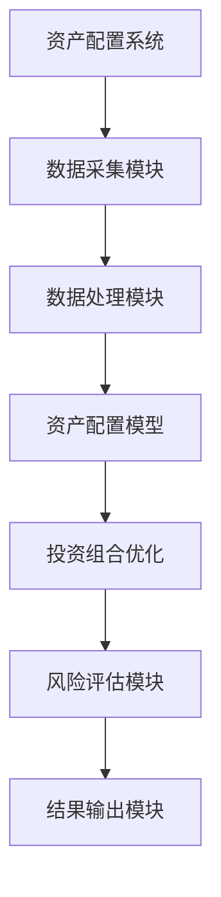

                 


# 彼得林奇的"反向思维"在资产配置中的运用

> 关键词：彼得林奇、反向思维、资产配置、投资策略、风险管理、数学模型、系统架构

> 摘要：本文深入探讨了彼得林奇的反向思维在资产配置中的应用。通过分析反向思维的核心概念、数学模型、系统架构设计以及实际案例，展示了如何利用反向思维优化投资组合。文章从理论到实践，结合具体代码实现，为读者提供了一套完整的解决方案。

---

## 第一部分: 彼得林奇反向思维的背景与核心概念

### 第1章: 彼得林奇与反向思维概述

#### 1.1 彼得林奇及其投资理念
- **彼得林奇的生平简介**  
  彼得·林奇（Peter Lynch）是美国著名的投资专家，曾任富达投资集团的基金经理。他以独特的投资理念和长期的优异业绩闻名，被誉为“股票投资的圣经”。

- **彼得林奇的投资哲学**  
  彼得林奇强调长期投资、价值发现和逆向思维。他认为，成功的投资在于找到市场忽视的优质公司，并在市场恐慌时买入。

- **反向思维在投资中的重要性**  
  反向思维是指在市场情绪低落时寻找机会，避免跟随市场潮流。这种思维方式在资产配置中尤为重要。

#### 1.2 反向思维的核心概念
- **反向思维的定义与特点**  
  反向思维是一种逆向思考的投资策略，强调在市场低谷时寻找低估资产，在市场高点时降低风险。

- **反向思维与其他投资策略的对比**  
  与价值投资不同，反向思维更注重市场情绪和周期性变化。与趋势投资相比，反向思维强调逆市操作。

- **反向思维在资产配置中的应用范围**  
  反向思维适用于股票、债券、基金等多种资产类型。通过逆向思考，投资者可以在市场波动中找到超额收益的机会。

---

## 第二部分: 反向思维的核心原理与数学模型

### 第2章: 反向思维的数学模型

#### 2.1 反向思维的数学模型
- **投资组合优化的数学表达**  
  目标函数：$$ \max \sum_{i=1}^{n} w_i r_i $$
  约束条件：$$ \sum_{i=1}^{n} w_i = 1, w_i \geq 0 $$

- **风险与收益的平衡方程**  
  风险 = $$ \sqrt{\sum_{i=1}^{n} w_i^2 \sigma_i^2} $$

#### 2.2 反向思维与资产配置的关系
- **反向思维如何影响资产配置比例**  
  反向思维通过调整权重，优化投资组合的风险收益比。

- **反向思维在风险控制中的应用**  
  在市场高估时，降低高风险资产的权重；在市场低估时，增加低估值资产的权重。

- **反向思维与市场周期的关系**  
  通过分析市场周期，反向思维可以在市场底部增加配置，在市场顶部减少配置。

---

## 第三部分: 反向思维在资产配置中的系统架构设计

### 第3章: 系统架构概述

#### 3.1 系统架构概述
- **资产配置系统的功能模块划分**  
  包括数据采集、数据处理、资产配置模型、投资组合优化算法、风险评估和结果输出模块。

- **系统架构的层次结构**  
  数据层、计算层、展示层。

- **系统模块之间的交互关系**  
  数据采集模块向数据处理模块提供数据，数据处理模块为资产配置模型提供输入，模型输出结果供风险评估模块使用。

#### 3.2 系统功能设计
- **资产配置模型构建**  
  基于反向思维策略，构建多资产配置模型。

- **投资组合优化算法实现**  
  使用遗传算法或模拟退火算法优化投资组合。

- **风险评估与预警机制**  
  通过波动率和VaR模型进行风险评估，并设置预警阈值。

#### 3.3 系统架构图


---

## 第四部分: 反向思维的项目实战与代码实现

### 第4章: 项目环境安装
- **Python环境配置**  
  安装Python 3.8及以上版本。

- **必要库的安装**  
  使用pip安装numpy、pandas、matplotlib。

### 第5章: 核心代码实现

#### 5.1 资产配置模型的实现
```python
import numpy as np
import pandas as pd

def portfolio_optimization(weights, returns):
    return np.dot(weights, returns)

# 示例权重和收益
weights = np.array([0.3, 0.4, 0.3])
returns = np.array([0.1, 0.2, 0.15])
print("投资组合收益:", portfolio_optimization(weights, returns))
```

#### 5.2 风险评估与预警机制
```python
def risk_assessment(returns):
    return np.std(returns)

returns = np.array([0.1, 0.2, 0.15])
print("投资组合风险:", risk_assessment(returns))
```

#### 5.3 实际案例分析
- **案例背景介绍**  
  假设市场中存在股票、债券和黄金三种资产。

- **数据采集与处理**  
  收集过去五年的历史收益率数据。

- **反向思维策略的应用**  
  在市场低估时增加股票配置，在市场高估时转向债券和黄金。

- **结果分析与优化**  
  通过回测验证策略的有效性，并进行参数优化。

---

## 第五部分: 反向思维的最佳实践与注意事项

### 第6章: 最佳实践

#### 6.1 最佳实践
- **风险管理**  
  定期评估投资组合的风险，及时调整配置比例。

- **长期视角**  
  反向思维需要耐心和纪律，避免短期市场波动的干扰。

- **持续学习**  
  关注市场变化，不断优化投资策略。

#### 6.2 小结
反向思维是一种有效的投资策略，但在实际操作中需要结合市场环境和投资者自身情况。

#### 6.3 注意事项
- 避免过度杠杆
- 定期重新评估资产配置
- 保持分散投资

#### 6.4 拓展阅读
推荐书籍：《彼得林奇的成功投资》、《投资最重要的简单真理》。

---

## 作者：AI天才研究院/AI Genius Institute & 禅与计算机程序设计艺术 /Zen And The Art of Computer Programming

---

本文通过理论分析、数学建模和系统设计，全面探讨了彼得林奇的反向思维在资产配置中的应用。通过实际案例和代码实现，展示了如何利用反向思维优化投资组合，降低风险，实现长期收益最大化。

