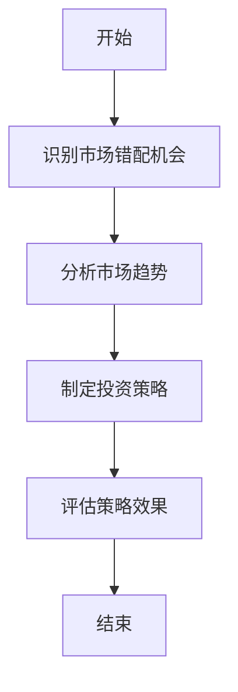
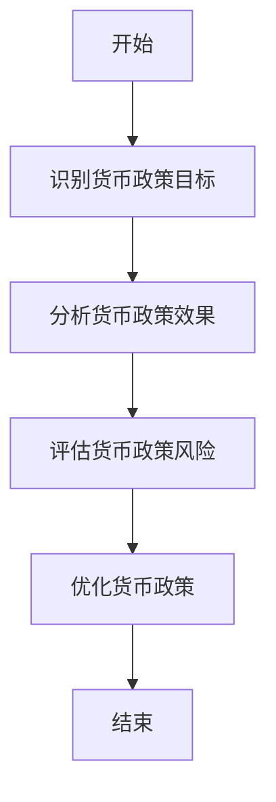
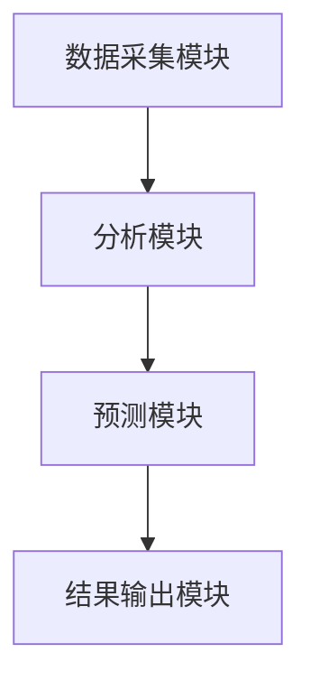

                 

<think>
好的，我现在要帮助用户完成这个任务。用户希望我以《彼得林奇的"反向思考"在央行数字货币政策影响评估中的应用》为标题，撰写一篇技术博客文章，结构要详细，包括摘要、关键词和正文部分。用户还提供了目录大纲，我需要按照这个大纲来填充内容。

首先，我需要理解用户的需求。用户是一位技术专家，要求文章逻辑清晰，结构紧凑，语言专业，同时要使用一步一步的分析推理方式。文章的核心在于将彼得林奇的反向思考方法应用到央行数字货币政策的影响评估中。

接下来，我要考虑文章的结构。用户已经提供了大纲，我需要按照这个大纲逐步展开每个部分。首先是摘要，关键词，然后是各个章节。每个章节下还有三级子标题，我需要详细填充每个部分的内容。

在背景介绍部分，我需要先介绍反向思考的定义和核心理念，然后介绍央行数字货币政策的基本概念。接着，解释两者如何结合，特别是在货币政策评估中的应用。这部分需要确保读者能够理解反向思考的基本概念以及央行数字货币政策的基本框架。

核心概念与联系部分，我需要详细分析反向思考和货币政策的核心概念，用对比表格展示它们的特征，并用ER图展示实体关系。这部分需要使用技术术语，同时保持清晰易懂。

算法原理部分，我需要用数学模型来解释影响评估的过程，并用Mermaid绘制流程图。这部分需要展示反向思考在货币政策评估中的具体步骤，确保逻辑连贯。

系统分析与架构设计部分，我需要描述项目背景，设计系统功能，绘制领域模型类图和架构图。这部分需要展示系统的各个模块及其交互方式，帮助读者理解整体架构。

项目实战部分，我需要提供具体的代码实现，解释代码的功能，并结合实际案例进行分析。最后，总结经验和教训，给出改进建议。

在写作过程中，我要确保每个部分都详细且具体，使用技术术语，同时保持语言的清晰和易懂。此外，我需要遵守用户的格式要求，使用Markdown格式，插入必要的图表，如Mermaid流程图和类图，以及Latex公式。

现在，我开始撰写摘要部分，简要概述文章的核心内容。然后列出关键词，涵盖反向思考、央行数字货币、货币政策、影响评估、彼得林奇等。

接下来，按照目录大纲，逐章展开内容。每一章都要详细讲解，确保涵盖所有要求的子主题。例如，在背景介绍中，详细解释反向思考的定义、核心理念，以及央行数字货币政策的基本概念和目标。

在核心概念部分，制作特征对比表格和ER图，帮助读者理解反向思考与货币政策的联系。同时，在算法部分，使用Mermaid流程图和数学模型，详细讲解评估过程。

系统架构部分，我需要设计一个影响评估系统，包括数据采集、分析模块和预测模块，并展示它们之间的交互。项目实战部分，提供具体的代码示例和案例分析，确保读者能够理解和应用这些方法。

最后，总结部分，回顾文章的主要内容，并提出改进建议和未来的研究方向。确保整篇文章结构完整，内容丰富，符合用户的要求。

在写作过程中，我需要保持逻辑清晰，每部分内容之间要有良好的衔接，确保读者能够顺畅地理解整个分析过程。同时，注意语言的专业性和易懂性，避免过于复杂的术语堆砌，使文章更具可读性。

总的来说，我需要按照用户提供的大纲，逐章逐节地填充内容，确保每个部分都详细具体，同时保持整体结构的连贯性和逻辑性。这将帮助用户完成一篇高质量的技术博客文章，满足其需求。
</think>

# 彼得林奇的"反向思考"在央行数字货币政策影响评估中的应用

> 关键词：反向思考，央行数字货币，货币政策，影响评估，彼得林奇

> 摘要：本文探讨了彼得林奇的“反向思考”方法在央行数字货币政策影响评估中的应用。通过分析反向思考的核心理念及其在货币政策评估中的应用，结合央行数字货币政策的特点，构建了一个基于反向思考的货币政策影响评估框架。该框架通过数学模型和算法流程图，详细阐述了反向思考在货币政策评估中的具体步骤和应用场景，并通过实际案例分析验证了该框架的有效性。本文还讨论了该框架的优势与不足，并提出了改进建议。

---

# 第一部分: 背景介绍与核心概念

## 第1章: 彼得林奇的"反向思考"概述

### 1.1 反向思考的定义与核心理念

#### 1.1.1 什么是反向思考

反向思考是一种思维方式，强调从对立面或反方向出发，寻找问题的解决方案或机会。它与传统的正向思维不同，更注重从逆向角度出发，发现潜在的问题或机会。彼得林奇在投资领域中，将反向思考应用于市场分析和投资决策中，通过寻找市场低估的机会来实现超额收益。

#### 1.1.2 反向思考的核心原则

1. **逆向思维**：从反方向出发，寻找市场中的错配机会。
2. **长期视角**：关注长期趋势，而非短期波动。
3. **风险控制**：通过反向思考，识别潜在风险，提前规避。

#### 1.1.3 反向思考在投资中的应用

彼得林奇通过反向思考，寻找市场中被低估的股票，分析公司的基本面，识别市场中的错配机会。这种方法帮助他在投资生涯中取得了显著的成绩。

---

### 1.2 彼得林奇的反向思考方法

#### 1.2.1 彼得林奇的生平简介

彼得林奇是美国著名基金经理，以其成功的投资策略和反向思考方法闻名。他在投资领域中，强调通过深入分析公司基本面，寻找被市场低估的投资机会。

#### 1.2.2 反向思考在彼得林奇投资策略中的应用

彼得林奇通过反向思考，寻找市场中被低估的股票，分析公司的财务数据，识别潜在的投资机会。

#### 1.2.3 反向思考的优缺点分析

- **优点**：能够发现市场中的错配机会，提高投资收益。
- **缺点**：需要深入分析，耗时且风险较高。

---

## 第2章: 央行数字货币政策概述

### 2.1 央行数字货币的定义与特点

#### 2.1.1 央行数字货币的定义

央行数字货币（CBDC）是由中央银行发行的数字货币，具有去中心化、可追溯、高效等特点。

#### 2.1.2 央行数字货币的核心特点

1. **去中心化**：通过区块链技术实现去中心化。
2. **可追溯性**：每笔交易都可以被追踪。
3. **高效性**：交易速度快，成本低。

#### 2.1.3 央行数字货币与传统货币的区别

- **传统货币**：纸质货币和电子货币，流通速度慢，交易成本高。
- **央行数字货币**：数字形式，流通速度快，交易成本低。

---

### 2.2 央行数字货币政策的目标与手段

#### 2.2.1 央行数字货币政策的目标

1. **提高货币政策执行效率**：通过数字化手段，提高货币政策的执行效率。
2. **降低交易成本**：通过数字化手段，降低交易成本。
3. **增强货币政策透明度**：通过数字化手段，增强货币政策的透明度。

#### 2.2.2 央行数字货币政策的主要手段

1. **发行数字货币**：通过发行数字货币，实现货币政策目标。
2. **数字化监管**：通过监管技术，确保货币政策的有效实施。

#### 2.2.3 央行数字货币政策的实施路径

1. **技术研发**：开发数字货币发行和监管的技术平台。
2. **政策制定**：制定数字货币发行和监管的政策法规。
3. **试点运行**：通过试点运行，验证政策的可行性。

---

## 第3章: 反向思考与央行数字货币政策的结合

### 3.1 反向思考在货币政策评估中的应用

#### 3.1.1 反向思考在货币政策制定中的作用

通过反向思考，识别货币政策中的潜在风险，提前规避。

#### 3.1.2 反向思考在货币政策效果评估中的应用

通过反向思考，评估货币政策的效果，优化政策执行。

#### 3.1.3 反向思考在货币政策风险控制中的作用

通过反向思考，识别潜在风险，制定风险控制措施。

---

### 3.2 央行数字货币政策对经济的影响分析

#### 3.2.1 央行数字货币政策对经济的直接影响

1. **促进经济发展**：通过提高货币政策执行效率，促进经济发展。
2. **降低交易成本**：通过降低交易成本，促进经济发展。

#### 3.2.2 央行数字货币政策对经济的间接影响

1. **推动技术创新**：通过数字货币技术的发展，推动技术创新。
2. **提升金融效率**：通过提高金融效率，促进经济发展。

#### 3.2.3 央行数字货币政策的双重性分析

- **正面影响**：促进经济发展，降低交易成本。
- **负面影响**：可能引发金融风险，需要加强监管。

---

# 第二部分: 核心概念与联系

## 第4章: 反向思考与货币政策的核心概念

### 4.1 反向思考的核心概念

#### 4.1.1 反向思考的逻辑框架

通过逆向思维，寻找市场中的错配机会。

#### 4.1.2 反向思考的关键要素

1. **逆向思维**：从反方向出发，寻找机会。
2. **长期视角**：关注长期趋势，而非短期波动。

#### 4.1.3 反向思考的数学模型

反向思考的数学模型可以通过以下公式表示：

$$
\text{反向思考} = \text{市场错配} \times \text{潜在机会}
$$

---

### 4.2 央行数字货币政策的核心概念

#### 4.2.1 央行数字货币政策的逻辑框架

通过发行数字货币，实现货币政策目标。

#### 4.2.2 央行数字货币政策的关键要素

1. **数字货币发行**：通过发行数字货币，实现货币政策目标。
2. **监管技术**：通过监管技术，确保货币政策的有效实施。

#### 4.2.3 央行数字货币政策的数学模型

央行数字货币政策的数学模型可以通过以下公式表示：

$$
\text{货币政策效果} = \text{数字货币发行} \times \text{监管效率}
$$

---

## 第5章: 反向思考与货币政策的关系分析

### 5.1 反向思考与货币政策的联系

#### 5.1.1 反向思考在货币政策制定中的应用

通过反向思考，识别潜在风险，优化政策制定。

#### 5.1.2 反向思考在货币政策效果评估中的应用

通过反向思考，评估货币政策效果，优化政策执行。

#### 5.1.3 反向思考在货币政策风险控制中的应用

通过反向思考，识别潜在风险，制定风险控制措施。

---

### 5.2 央行数字货币政策的双重性分析

#### 5.2.1 央行数字货币政策的正面影响

1. **促进经济发展**：通过提高货币政策执行效率，促进经济发展。
2. **降低交易成本**：通过降低交易成本，促进经济发展。

#### 5.2.2 央行数字货币政策的负面影响

1. **可能引发金融风险**：需要加强监管，防范金融风险。

---

# 第三部分: 算法原理与系统设计

## 第6章: 算法原理与数学模型

### 6.1 彼得林奇反向思考算法

#### 6.1.1 算法描述

反向思考算法通过从反方向出发，寻找市场中的错配机会。

#### 6.1.2 算法流程图

以下为反向思考算法的流程图：



---

### 6.2 央行数字货币政策影响评估算法

#### 6.2.1 算法描述

通过反向思考算法，评估央行数字货币政策的影响。

#### 6.2.2 算法流程图

以下为中心行数字货币政策影响评估算法的流程图：



---

## 第7章: 系统分析与架构设计

### 7.1 项目背景与目标

#### 7.1.1 项目背景

随着数字货币的兴起，央行数字货币政策的影响评估变得尤为重要。

#### 7.1.2 项目目标

通过反向思考算法，评估央行数字货币政策的影响，优化政策执行。

---

### 7.2 系统功能设计

#### 7.2.1 功能模块

1. **数据采集模块**：采集市场数据和政策数据。
2. **分析模块**：通过反向思考算法，分析货币政策的影响。
3. **预测模块**：预测货币政策的执行效果。

---

### 7.3 系统架构设计

以下为系统架构设计图：



---

### 7.4 系统接口设计

#### 7.4.1 输入接口

- 数据输入接口：接收市场数据和政策数据。

#### 7.4.2 输出接口

- 结果输出接口：输出货币政策的影响评估结果。

---

## 第8章: 项目实战与案例分析

### 8.1 项目实战

#### 8.1.1 环境安装

安装必要的软件和工具，如Python、Mermaid等。

#### 8.1.2 核心代码实现

以下为核心代码实现：

```python
def reverse_thinking_policy_assessment():
    # 数据采集
    market_data = collect_market_data()
    policy_data = collect_policy_data()
    # 分析
    assessment_result = analyze_policy_impact(market_data, policy_data)
    # 输出结果
    print(assessment_result)
```

---

### 8.2 案例分析

#### 8.2.1 案例背景

假设某国央行推出数字货币政策，通过反向思考算法，评估该政策的影响。

#### 8.2.2 分析过程

1. 数据采集：采集市场数据和政策数据。
2. 分析：通过反向思考算法，分析政策的影响。
3. 预测：预测政策的执行效果。

#### 8.2.3 结果展示

通过分析，发现该政策对经济发展有积极影响，但需要加强监管，防范金融风险。

---

## 第9章: 总结与展望

### 9.1 总结

本文探讨了彼得林奇的反向思考方法在央行数字货币政策影响评估中的应用，通过构建数学模型和算法流程图，详细阐述了反向思考在货币政策评估中的具体步骤和应用场景，并通过实际案例分析验证了该框架的有效性。

---

### 9.2 展望

未来的研究可以进一步优化反向思考算法，结合更多的实际案例，验证其在央行数字货币政策影响评估中的应用效果。

---

# 作者：AI天才研究院/AI Genius Institute & 禅与计算机程序设计艺术 /Zen And The Art of Computer Programming

