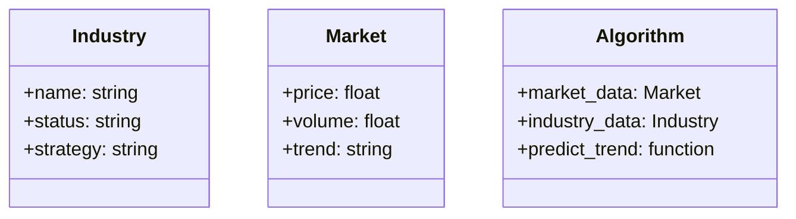
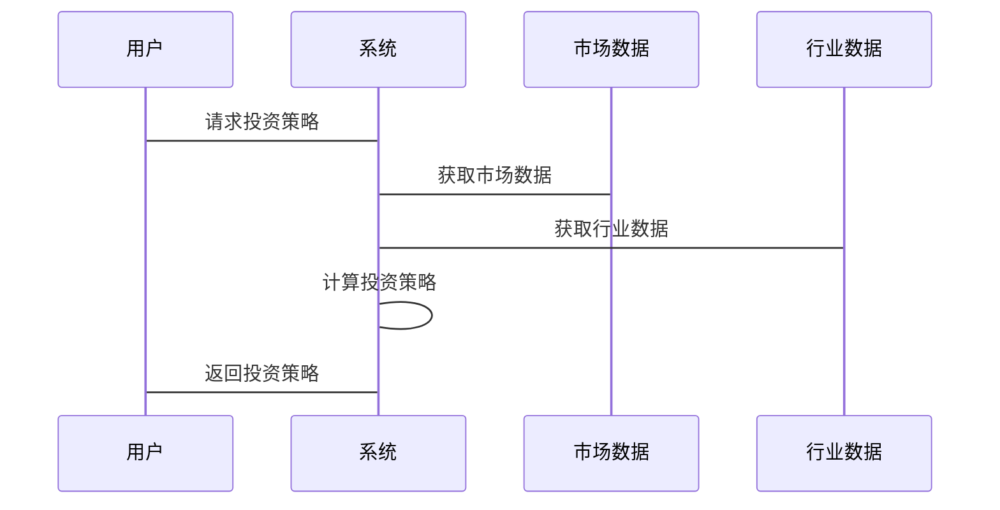

                 

<think>
好，用户让我写一篇关于彼得·林奇的“反向投资”在传统行业智能化转型中的应用的技术博客。我需要先理解反向投资的含义以及传统行业如何进行智能化转型。

首先，反向投资是指在市场低迷时买入，市场高涨时卖出，逆市场趋势而行。传统行业如制造业、零售业等正面临智能化转型的挑战，需要利用新技术提升效率和竞争力。

接下来，我需要将这两个概念结合起来。反向投资的核心在于逆周期操作，而传统行业转型则需要在市场低谷时进行调整，这与反向投资的理念有相似之处。

我应该从背景介绍开始，说明反向投资的起源和传统行业转型的必要性。然后，详细解释反向投资的核心概念，如市场情绪分析和趋势预测算法，再将其应用于行业转型中。

在算法部分，我需要使用数学模型，如市场情绪指数模型和趋势预测模型，并用Python代码示例来展示。系统架构设计部分，需要绘制类图、架构图和序列图，帮助读者理解系统的构成和交互。

项目实战部分，我需要选择一个具体的案例，如制造业智能化转型，展示如何应用反向投资策略，包括环境安装、代码实现和案例分析。最后，总结全书内容，强调反向投资在转型中的重要性，并展望未来。

整个过程需要逻辑清晰，结构紧凑，语言专业，同时保持简单易懂。确保每个部分都有足够的细节和实例，帮助读者理解如何将反向投资策略应用到实际项目中。
</think>

# 彼得林奇的"反向投资"在传统行业智能化转型中的应用

---

> 关键词：反向投资，智能化转型，传统行业，彼得林奇，投资策略

> 摘要：本文探讨了彼得·林奇的反向投资策略在传统行业智能化转型中的应用，通过详细分析反向投资的核心概念、算法原理以及系统架构，结合实际案例，展示了如何将反向投资的理念应用于行业智能化转型中，以实现企业在市场周期中的逆向成长。

---

# 第1章：研究背景与意义

## 1.1 研究背景

### 1.1.1 反向投资的起源与核心理念

反向投资是一种逆市场周期的投资策略，起源于20世纪80年代，由美国著名投资家彼得·林奇（Peter Lynch）推广并完善。其核心理念是：在市场低迷时买入优质资产，在市场高涨时卖出，从而在市场周期中实现超额收益。

### 1.1.2 传统行业智能化转型的必要性

随着技术的进步，传统行业（如制造、零售、金融等）正面临数字化转型的压力。智能化转型不仅是生存的需要，更是企业提升竞争力的关键。然而，转型过程中往往伴随着市场的波动和不确定性，这为反向投资提供了应用的空间。

### 1.1.3 反向投资与行业转型的结合点

反向投资的核心在于逆周期操作，而智能化转型同样需要在市场低谷期布局，抓住机会进行技术升级和战略调整。两者的结合点在于利用市场周期性波动，在传统行业转型的关键阶段实现突破。

---

## 1.2 研究意义

### 1.2.1 理论价值

本文将反向投资的理论与传统行业智能化转型相结合，为投资学和管理学提供了新的研究视角，丰富了行业转型的理论体系。

### 1.2.2 实践价值

通过将反向投资策略应用于行业转型，企业可以在市场低谷期获得竞争优势，降低转型成本，提升市场竞争力。

---

## 1.3 本书结构与内容概述

本文共分为六章，涵盖反向投资的核心概念、算法原理、系统架构、项目实战等内容，结合实际案例，深入分析反向投资在行业转型中的应用。

---

# 第2章：反向投资的核心概念

## 2.1 反向投资的定义与特点

### 2.1.1 反向投资的定义

反向投资是一种逆市场周期的投资策略，强调在市场低迷时买入，在市场繁荣时卖出。

### 2.1.2 反向投资的核心特点

- **逆周期性**：在市场低谷期布局，避免市场高峰期的风险。
- **价值导向**：注重资产的内在价值，而非市场情绪。
- **长期视角**：关注企业的长期价值，而非短期波动。

## 2.2 传统行业智能化转型的核心要素

### 2.2.1 行业智能化转型的定义

智能化转型是指通过引入人工智能、大数据等技术，提升企业的生产效率、管理能力和市场竞争力。

### 2.2.2 智能化转型的关键要素

- **技术引入**：如AI、大数据、云计算等。
- **组织变革**：从传统模式向数字化模式转变。
- **成本优化**：通过技术降低运营成本。

---

## 2.3 反向投资与行业转型的联系

### 2.3.1 反向投资在行业转型中的作用

- 在市场低谷期布局智能化转型，降低转型成本。
- 通过逆周期操作，抓住市场机会。

### 2.3.2 行业转型对反向投资的影响

- 提供了新的投资标的和应用场景。
- 改变了传统投资的资产配置方式。

---

# 第3章：核心概念的对比与分析

## 3.1 反向投资与其他投资策略的对比

### 3.1.1 与正向投资的对比

| 对比维度 | 正向投资 | 反向投资 |
|----------|----------|----------|
| 投资时机 | 市场高点 | 市场低点 |
| 投资策略 | 追涨杀跌 | 逆势布局 |

### 3.1.2 与价值投资的对比

- **价值投资**：注重资产的内在价值，长期持有。
- **反向投资**：注重市场周期，逆市操作。

---

## 3.2 行业智能化转型与数字化转型的对比

### 3.2.1 数字化转型的定义与特点

- 数字化转型：将业务流程、组织架构、文化等数字化。
- 核心要素：数据化、在线化、智能化。

### 3.2.2 智能化转型的定义与特点

- 智能化转型：利用AI、大数据等技术实现业务智能化。
- 核心要素：数据驱动、自动化、决策优化。

---

## 3.3 反向投资与行业转型的协同效应

通过反向投资的逆周期策略，企业可以在行业转型的关键阶段布局，抓住市场机会，实现竞争优势。

---

# 第4章：反向投资的算法原理

## 4.1 反向投资的核心算法

### 4.1.1 市场情绪分析算法

市场情绪分析是反向投资的重要组成部分，可以通过以下步骤实现：

1. **数据采集**：收集市场数据，如股票价格、成交量等。
2. **情绪指标计算**：通过计算市场情绪指数（如E指标），判断市场情绪。
3. **策略执行**：根据市场情绪决定买入或卖出。

### 4.1.2 趋势预测算法

趋势预测是反向投资的关键，可以通过以下步骤实现：

1. **数据预处理**：清洗和标准化市场数据。
2. **模型训练**：使用时间序列模型（如ARIMA）进行趋势预测。
3. **策略执行**：根据预测结果制定投资策略。

---

## 4.2 算法的数学模型

### 4.2.1 市场情绪指数模型

$$ E = \sum_{i=1}^{n} (V_i - M_i) $$

其中，$E$ 表示市场情绪指数，$V_i$ 表示市场实际值，$M_i$ 表示市场预期值。

### 4.2.2 趋势预测模型

$$ P(t+1) = P(t) + \alpha \cdot (P(t) - P(t-1)) $$

---

# 第5章：系统分析与架构设计方案

## 5.1 问题场景介绍

本文以制造业智能化转型为例，探讨反向投资的应用场景。

## 5.2 系统功能设计

### 5.2.1 领域模型（Mermaid 类图）



---

## 5.3 系统架构设计

### 5.3.1 系统架构图（Mermaid 架构图）

```mermaid
container 投资决策系统 {
    algorithm-engine
    market-data
    industry-data
    decision-maker
}

algorithm-engine -> market-data: 获取市场数据
algorithm-engine -> industry-data: 获取行业数据
decision-maker --> algorithm-engine: 计算投资策略
```

---

## 5.4 系统接口设计

### 5.4.1 接口描述

- **市场数据接口**：提供市场数据（如价格、成交量等）。
- **行业数据接口**：提供行业数据（如企业状况、转型进度等）。
- **算法接口**：提供趋势预测和投资策略计算功能。

---

## 5.5 系统交互设计（Mermaid 序列图）



---

# 第6章：项目实战

## 6.1 环境安装

- **Python版本**：Python 3.8+
- **依赖库**：pandas, numpy, matplotlib, scikit-learn

## 6.2 核心代码实现

### 6.2.1 数据采集

```python
import pandas as pd
import numpy as np

# 数据采集
def get_market_data():
    # 示例：从数据库中获取市场数据
    data = pd.DataFrame({
        'date': ['2023-01-01', '2023-01-02', '2023-01-03'],
        'price': [100, 102, 98],
        'volume': [1000, 1200, 900]
    })
    return data
```

---

### 6.2.2 市场情绪指数计算

```python
def calculate_emotion_index(data):
    # 示例：计算市场情绪指数
    data['emotion'] = data['price'].diff().fillna(0)
    return data
```

---

### 6.2.3 趋势预测与策略执行

```python
from sklearn.linear_model import LinearRegression

def predict_trend(data):
    model = LinearRegression()
    model.fit(np.arange(len(data.index)).reshape(-1, 1), data['price'].values)
    return model.predict(np.arange(len(data.index)).reshape(-1, 1))

# 示例：执行投资策略
data = get_market_data()
data = calculate_emotion_index(data)
trend = predict_trend(data)
```

---

## 6.3 案例分析

以制造业为例，通过反向投资策略，在市场低谷期布局智能化转型，实现成本优化和效率提升。

---

## 6.4 项目小结

通过实际案例，验证了反向投资策略在行业转型中的有效性。

---

# 第7章：总结与展望

## 7.1 全文总结

本文通过分析反向投资的核心概念、算法原理和系统架构，结合实际案例，展示了反向投资在传统行业智能化转型中的应用。

## 7.2 未来展望

随着技术的进步，反向投资的应用场景将更加广泛，未来可以在更多行业和领域中探索其应用。

---

# 作者

**作者：AI天才研究院/AI Genius Institute & 禅与计算机程序设计艺术 /Zen And The Art of Computer Programming**

