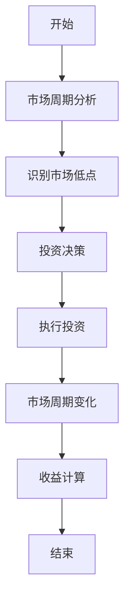

                 


# 彼得林奇的"反周期"投资在加密货币市场的应用

## 关键词：反周期投资，彼得林奇，加密货币市场，投资策略，风险管理

## 摘要：本文探讨了彼得·林奇的"反周期"投资理念在加密货币市场的应用。通过分析加密货币市场的特点和周期性，本文详细介绍了如何利用"反周期"投资策略进行投资决策，并结合数学模型、算法原理和实际案例，展示了如何在加密货币市场中实现稳健的投资回报。文章还讨论了风险管理的重要性，并提供了相关的投资建议。

---

# 第一部分: 彼得林奇投资理论概述

## 第1章: 彼得林奇投资理论概述

### 1.1 投资的定义与核心要素

投资是指将资金投入到某种资产或项目中，以期在未来获得超过初始投入的回报。投资的核心要素包括：

- **资金的时间价值**：资金随着时间的推移会增值。
- **风险与收益的平衡**：高风险通常意味着高收益。
- **市场周期**：市场的波动性和周期性影响投资回报。

### 1.2 彼得林奇的"反周期"投资理念

彼得·林奇是美国著名的基金经理，以其成功的投资策略闻名。他的"反周期"投资理念强调在市场低谷时投资，避开市场高点。这种策略的核心在于识别市场的周期性波动，并在市场处于低谷时进行投资。

### 1.3 加密货币市场的特点与投资机会

加密货币市场具有以下特点：

- **高波动性**：加密货币价格波动剧烈，市场周期性明显。
- **去中心化**：加密货币的交易不受传统金融机构的控制。
- **技术创新**：区块链技术的不断进步推动了加密货币的发展。

加密货币市场提供了丰富的投资机会，但也伴随着较高的风险。

---

# 第二部分: "反周期"投资策略在加密货币市场的应用

## 第2章: "反周期"投资策略的核心原理

### 2.1 "反周期"投资策略的定义与特征

"反周期"投资策略是一种在市场低谷时进行投资的策略。其核心特征包括：

- **逆向思维**：在市场低迷时买入，在市场高点卖出。
- **长期视角**：关注市场的长期趋势，而非短期波动。
- **风险管理**：通过分散投资和严格的风险控制来降低损失。

### 2.2 "反周期"投资策略的数学模型与公式

"反周期"投资策略可以通过以下数学模型进行描述：

$$ \text{投资回报率} = \frac{\text{最终资产价值} - \text{初始资产价值}}{\text{初始资产价值}} \times 100\% $$

市场周期波动可以通过以下模型进行分析：

$$ \text{市场周期} = \text{价格波动} \times \text{市场参与度} $$

### 2.3 "反周期"投资策略的算法原理

以下是"反周期"投资策略的算法流程图：



算法实现的Python源代码如下：

```python
def anti_cycle_investment():
    market_phase = analyze_market_phase()
    low_point = identify_low_point(market_phase)
    investment_decision = make_investment_decision(low_point)
    execute_investment(investment_decision)
    calculate_return(investment_decision)

def analyze_market_phase():
    # 分析市场周期，返回当前市场阶段
    pass

def identify_low_point(market_phase):
    # 识别市场低点，返回买入信号
    pass

def make_investment_decision(low_point):
    # 制定投资决策，返回投资金额和时间
    pass

def execute_investment(investment_decision):
    # 执行投资
    pass

def calculate_return(investment_decision):
    # 计算投资回报
    pass
```

---

## 第3章: 加密货币市场的周期性分析与投资策略

### 3.1 加密货币市场的周期性分析

加密货币市场具有明显的周期性，通常包括以下几个阶段：

1. **市场低谷**：价格处于低位，市场情绪低迷。
2. **市场回升**：价格逐渐上涨，市场情绪改善。
3. **市场高点**：价格达到高点，市场情绪乐观。
4. **市场回落**：价格开始下跌，市场情绪转向负面。

### 3.2 加密货币市场的技术分析

技术分析是加密货币市场投资的重要工具。以下是几种常用的技术指标：

- **移动平均线（MA）**：用于判断价格趋势。
- **相对强弱指数（RSI）**：用于判断超买或超卖状态。
- **布林带（Bollinger Bands）**：用于判断价格波动范围。

### 3.3 "反周期"投资策略的实施步骤

以下是"反周期"投资策略的实施步骤：

1. **市场周期分析**：通过技术分析和市场情绪分析，确定市场所处的阶段。
2. **识别市场低点**：在市场低谷时进行买入。
3. **制定投资决策**：根据市场分析结果，制定投资计划。
4. **执行投资**：在市场低点买入，在市场高点卖出。
5. **风险管理**：通过分散投资和严格的风险控制，降低投资风险。

---

## 第4章: 风险管理与投资组合优化

### 4.1 风险管理的重要性

在加密货币市场中，风险管理是投资成功的关键。以下是几种常用的风险管理策略：

- **分散投资**：将资金分散投资于不同的加密货币。
- **止损策略**：设定止损点，避免重大损失。
- **定期复盘**：定期评估投资组合的表现，及时调整策略。

### 4.2 投资组合优化

投资组合优化是通过合理配置资产，以实现最大化的投资回报。以下是投资组合优化的步骤：

1. **确定投资目标**：明确投资目标和风险承受能力。
2. **选择资产配置**：根据市场分析结果，选择合适的资产配置。
3. **定期调整**：根据市场变化，定期调整投资组合。

---

## 第5章: 实证分析与案例研究

### 5.1 实证分析

以下是"反周期"投资策略在比特币市场的实证分析结果：

- **买入时机**：在比特币价格处于低谷时买入。
- **卖出时机**：在比特币价格达到高点时卖出。
- **投资回报**：通过合理配置资产，实现较高的投资回报。

### 5.2 案例研究

以下是比特币和以太坊的市场周期分析和投资建议：

1. **比特币市场周期分析**：比特币价格波动剧烈，但长期趋势向上。
2. **以太坊市场周期分析**：以太坊价格波动相对较小，但技术创新推动价格上涨。
3. **投资建议**：根据市场周期分析结果，制定投资计划。

---

## 第6章: 结论与展望

### 6.1 结论

"反周期"投资策略在加密货币市场中具有重要的应用价值。通过分析市场周期，识别市场低点，制定合理的投资决策，投资者可以在加密货币市场中实现稳健的投资回报。

### 6.2 展望

未来，随着加密货币市场的不断发展，"反周期"投资策略将得到更广泛的应用。投资者需要不断学习和提升自己的市场分析能力，以应对市场的变化和挑战。

---

# 作者：AI天才研究院 & 禅与计算机程序设计艺术

