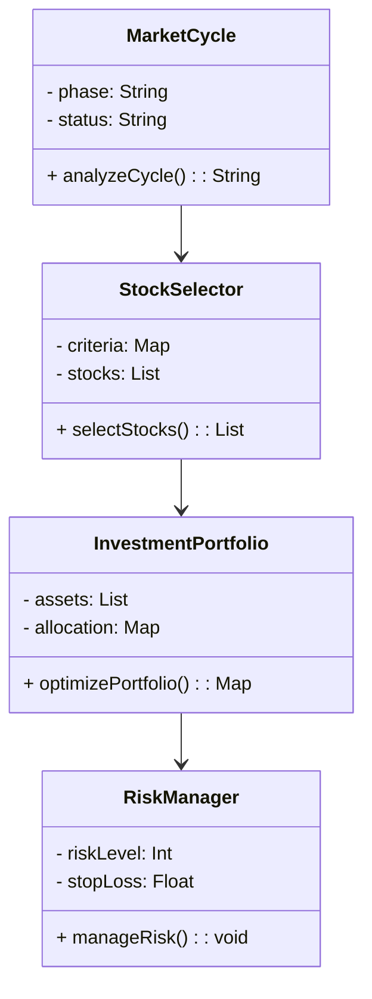
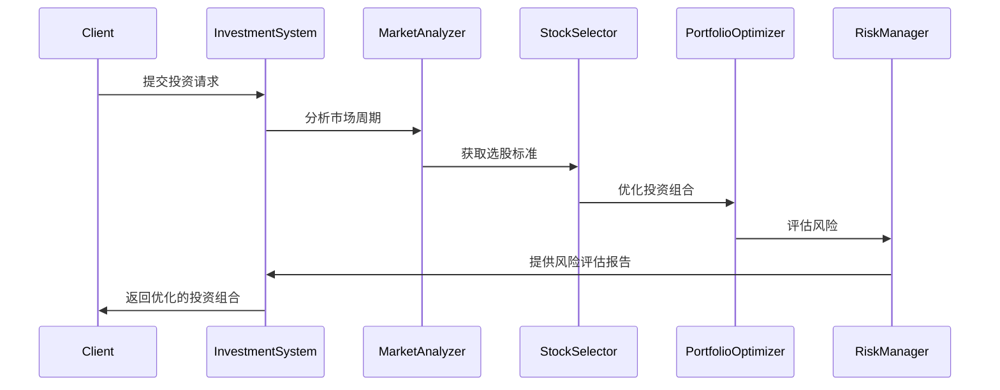

                 

<think>
嗯，我现在需要帮用户撰写一篇关于彼得·林奇反周期投资策略的技术博客文章。用户已经给出了一个详细的大纲，看起来结构很清晰。我得先理清每个部分的重点，确保内容深入且符合技术博客的要求。

首先，用户强调文章需要逻辑清晰、结构紧凑，用专业的技术语言，同时结合彼得·林奇的投资理念。这意味着我需要将投资策略与技术分析结合起来，可能需要使用图表和数学模型。

文章的摘要部分已经给出，强调在新兴与成熟市场的配置策略，彼得·林奇的策略如何应用。接下来，我需要详细展开每个章节，确保每个部分都涵盖必要的技术细节和投资策略。

在第一部分，市场周期与反周期投资概述，我需要解释市场周期的定义和特征，对比不同周期的市场情况，然后引出反周期投资的概念。这里可能需要使用图表来展示不同市场的波动情况。

第二部分，新兴市场与成熟市场的特征对比，需要详细分析两者的区别，包括增长潜力、波动性、风险因素等。这部分可能需要数据支持，比如GDP增长率、波动率等指标的对比。

第三部分，彼得·林奇的反周期投资策略，需要深入探讨他的选股标准和投资组合管理方法。可能需要引用他的经典案例，如他在 downturn 期间的投资策略，以及他如何选择价值被低估的股票。

系统分析与架构设计部分，可能需要构建一个数学模型，使用Python代码实现，展示如何根据市场周期调整投资组合。这部分需要详细解释代码的功能，以及如何应用到实际投资中。

最后，实战案例分析部分，需要选取实际的市场数据，展示彼得·林奇策略的应用效果。这部分需要详细的计算和数据分析，可能涉及回归分析、风险评估等技术。

总结部分，我需要回顾整篇文章的内容，强调反周期投资的重要性，并给出读者在实际操作中的建议和注意事项。

在撰写过程中，我需要确保每个部分都包含足够的技术细节，同时语言要通俗易懂，适合技术背景的读者阅读。可能需要多次检查，确保逻辑连贯，内容准确。

总的来说，我需要系统地按照用户提供的大纲，逐步展开每个部分的内容，确保文章全面、深入，并且符合技术博客的高标准。
</think>

# 彼得林奇的"反周期"投资在新兴与成熟市场间的配置策略

## 关键词：彼得·林奇，反周期投资，新兴市场，成熟市场，投资策略

## 摘要：
本文深入探讨了彼得·林奇的反周期投资策略在新兴市场与成熟市场之间的配置策略。通过分析市场周期、投资理念、策略实施和系统设计，结合实际案例和代码实现，为投资者提供系统化的投资方法。

---

# 第一部分: 反周期投资与市场周期分析

## 第1章: 市场周期与反周期投资概述

### 1.1 市场周期的定义与特征
- **1.1.1 市场周期的定义**  
  市场周期是指经济和市场活动在不同阶段的变化，包括繁荣、衰退、萧条和复苏。

- **1.1.2 不同市场周期的特征**  
  - **繁荣期**：经济增长快，市场活跃，资产价格上升。  
  - **衰退期**：经济增长放缓，市场下跌，资产价格下降。  
  - **萧条期**：经济低迷，市场底部，资产价格低。  
  - **复苏期**：经济逐渐恢复，市场回升，资产价格反弹。  

- **1.1.3 市场周期与投资策略的关系**  
  投资策略应根据市场周期的变化进行调整，避免在高点追高，低点抄底。

### 1.2 反周期投资的概念与核心理念
- **1.2.1 反周期投资的定义**  
  反周期投资是指在市场周期低谷时投资，以期在市场回升时获得超额收益。

- **1.2.2 反周期投资的核心理念**  
  - 逆向思维：在市场低迷时寻找被低估的机会。  
  - 风险控制：通过分散投资和严格选股降低风险。  
  - 长期视角：关注企业的基本面，而非短期市场波动。  

- **1.2.3 反周期投资与周期性行业的关联**  
  周期性行业（如能源、材料、金融）在市场周期低谷时往往被低估，是反周期投资的重点。

### 1.3 彼得·林奇投资理念的背景与核心思想
- **1.3.1 彼得·林奇的生平简介**  
  彼得·林奇是美国著名投资经理，以管理麦哲伦基金闻名，强调价值投资和长期持有。

- **1.3.2 彼得·林奇投资理念的核心思想**  
  - 价值投资：寻找基本面良好、估值合理的股票。  
  - 分散投资：避免过度集中，降低风险。  
  - 长期视角：注重企业长期增长潜力。  

- **1.3.3 彼得·林奇与反周期投资的关联**  
  彼得·林奇在市场低谷时积极寻找被低估的股票，正是反周期投资的典型应用。

### 1.4 反周期投资的有效性与边界
- **1.4.1 反周期投资的有效性分析**  
  在市场低谷时投资，往往能在市场回升时获得超额收益。

- **1.4.2 反周期投资的边界与限制**  
  - 市场周期难以精准预测，存在不确定性。  
  - 需要较强的心理承受能力，面对市场低迷时的恐慌情绪。  

- **1.4.3 反周期投资与其他投资策略的对比**  
  - 相比于趋势投资，反周期投资更注重逆向思维。  
  - 相比于价值投资，反周期投资更强调市场周期的影响。  

---

## 第2章: 新兴市场与成熟市场的特征对比

### 2.1 新兴市场的定义与特点
- **2.1.1 新兴市场的定义**  
  新兴市场是指经济快速发展但尚未完全工业化的国家，如中国、印度等。

- **2.1.2 新兴市场的核心特征**  
  - 经济增长快，但波动性大。  
  - 市场流动性较好，但不够成熟。  
  - 估值波动大，存在较大波动性。  

- **2.1.3 新兴市场与成熟市场的对比**  
  - 经济增长潜力：新兴市场 > 成熟市场。  
  - 市场稳定性：成熟市场 > 新兴市场。  
  - 投资风险：新兴市场 > 成熟市场。  

### 2.2 成熟市场的定义与特点
- **2.2.1 成熟市场的定义**  
  成熟市场是指经济发达、市场结构完善的国家，如美国、欧洲等。

- **2.2.2 成熟市场的核心特征**  
  - 经济增长稳定，波动性小。  
  - 市场流动性强，价格波动小。  
  - 估值稳定，风险较低。  

- **2.2.3 成熟市场与新兴市场的对比**  
  - 经济增长潜力：成熟市场 < 新兴市场。  
  - 市场稳定性：成熟市场 > 新兴市场。  
  - 投资风险：成熟市场 < 新兴市场。  

### 2.3 新兴市场与成熟市场的投资机会与风险
- **2.3.1 新兴市场投资机会与风险**  
  - 机会：经济增长快，企业盈利高。  
  - 风险：市场波动大，政策风险高。  

- **2.3.2 成熟市场投资机会与风险**  
  - 机会：市场稳定，风险可控。  
  - 风险：经济增长慢，收益有限。  

- **2.3.3 不同市场周期下投资策略的调整**  
  - 在新兴市场衰退期，积极寻找被低估的机会。  
  - 在成熟市场衰退期，注重防御性投资。  

---

## 第3章: 彼得·林奇的反周期投资策略

### 3.1 反周期投资的核心策略
- **3.1.1 反周期投资的核心策略概述**  
  在市场周期低谷时，寻找基本面良好、估值被低估的股票进行投资。

- **3.1.2 反周期投资的具体实施步骤**  
  - 识别市场周期：判断当前市场所处的周期阶段。  
  - 选股标准：选择基本面良好、估值合理的股票。  
  - 投资组合构建：分散投资，避免过度集中。  
  - 动态调整：定期评估投资组合，根据市场变化进行调整。  

- **3.1.3 反周期投资的数学模型与公式**  
  反周期投资的收益可以通过以下公式计算：

  $$ \text{收益} = \sum_{i=1}^{n} (P_i - P_{i-1}) \times Q_i $$

  其中，\( P_i \) 是第 \( i \) 期的价格，\( Q_i \) 是投资数量。

### 3.2 彼得·林奇的选股标准与投资组合构建
- **3.2.1 彼得·林奇的选股标准**  
  - 企业基本面良好：关注盈利能力、财务状况和管理团队。  
  - 估值合理：市盈率、市净率等指标低于行业平均水平。  
  - 行业地位：选择行业龙头或具有竞争优势的企业。  

- **3.2.2 投资组合的构建方法**  
  - 分散投资：将资金分配到不同行业和市场。  
  - 价值投资：注重企业的长期增长潜力。  
  - 定期调整：根据市场变化和企业基本面进行调整。  

- **3.2.3 投资组合的动态调整策略**  
  - 在市场低谷时，增加对被低估股票的投资。  
  - 在市场高位时，适当降低仓位，锁定收益。  

---

## 第4章: 系统分析与架构设计方案

### 4.1 问题场景介绍
- 投资者希望根据市场周期和彼得·林奇的策略，制定新兴市场与成熟市场的投资组合。

### 4.2 项目介绍
- 项目目标：构建一个基于彼得·林奇反周期策略的投资系统，实现市场周期分析、股票筛选和投资组合优化。

### 4.3 系统功能设计（领域模型 Mermaid 类图）



### 4.4 系统架构设计（Mermaid 架构图）


### 4.5 系统接口设计
- 输入接口：市场数据、投资目标和风险偏好。  
- 输出接口：优化后的投资组合和风险评估报告。

### 4.6 系统交互设计（Mermaid 序列图）



---

## 第5章: 实战案例分析与代码实现

### 5.1 实战案例分析
- **案例背景**：2008年金融危机期间，彼得·林奇通过反周期策略投资于被低估的股票，获得了超额收益。
- **数据来源**：选取美国和新兴市场的股票数据，分析其在市场低谷时的表现。

### 5.2 核心实现源代码

```python
import pandas as pd
import numpy as np

def calculate_market_cycle(data):
    """计算市场周期阶段"""
    data['returns'] = data['price'].pct_change()
    data['volatility'] = data['returns'].std()
    data['trend'] = data['price'].rolling(20).mean().pct_change()
    return data

def select stocks(p

