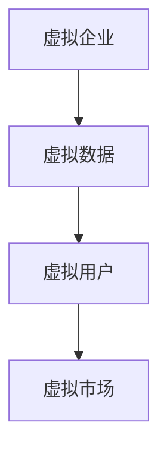
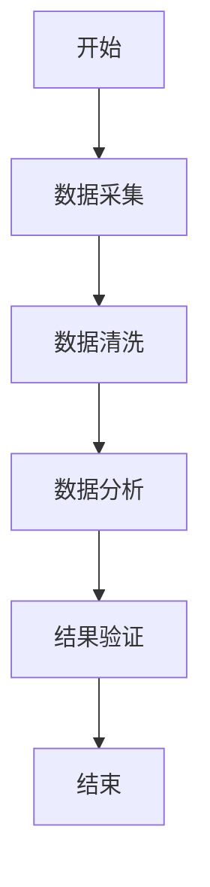
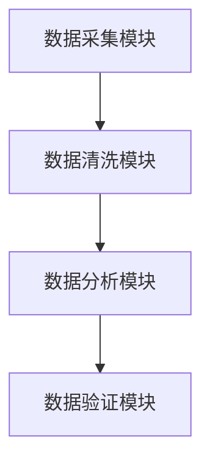
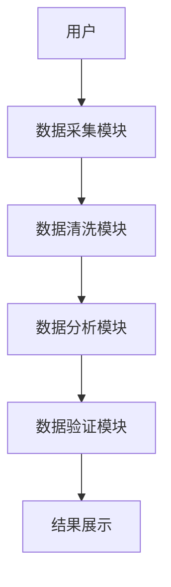

                 


# 彼得林奇的"实地调研"在虚拟经济时代的方法创新

## 关键词：虚拟经济，实地调研，彼得林奇，方法创新，数据采集，算法分析，系统架构

## 摘要：在虚拟经济时代，传统的实地调研方法面临巨大挑战。本文通过分析彼得林奇实地调研的核心思想，结合虚拟经济的特点，提出了一套创新的实地调研方法。该方法基于虚拟数据采集、算法分析和系统架构设计，解决了虚拟经济时代数据真实性与完整性、数据采集与处理、数据验证等问题。文章详细介绍了创新方法的原理、实现步骤和实际应用，为虚拟经济时代的实地调研提供了新的思路。

---

# 第一部分: 虚拟经济时代下的实地调研创新

## 第1章: 虚拟经济与实地调研的背景介绍

### 1.1 虚拟经济的定义与现状
虚拟经济是指以数字技术为基础，通过虚拟货币、区块链、人工智能等技术驱动的经济形态。与传统经济相比，虚拟经济具有去中心化、透明度高、数据量大等特点。

#### 1.1.1 虚拟经济的核心概念
虚拟经济的核心概念包括：
- 虚拟货币：如比特币、以太坊等。
- 区块链技术：分布式账本技术。
- 人工智能：数据处理与分析的智能化工具。

#### 1.1.2 虚拟经济与传统经济的对比
| 特性 | 传统经济 | 虚拟经济 |
|------|----------|----------|
| 交易媒介 | 实体货币 | 虚拟货币 |
| 交易场所 | 实体市场 | 虚拟平台 |
| 信任机制 | 中介机构 | 区块链技术 |

#### 1.1.3 虚拟经济时代实地调研的重要性
在虚拟经济中，数据的虚拟化和去中心化使得传统的实地调研方法难以适用。因此，创新实地调研方法成为虚拟经济时代的重要任务。

### 1.2 彼得林奇实地调研方法的演变
彼得林奇是著名的投资经理，他以实地调研著称。他提出的核心思想是通过深入分析企业的基本面数据，评估其投资价值。

#### 1.2.1 传统调研与虚拟调研的对比
| 特征 | 传统调研 | 虚拟调研 |
|------|----------|----------|
| 数据来源 | 实体数据 | 虚拟数据 |
| 数据采集 | 现场调查 | 网络采集 |
| 数据分析 | 定性分析 | 定量分析 |

#### 1.2.2 虚拟经济时代调研方法的创新
在虚拟经济中，调研方法需要结合区块链技术和人工智能，实现数据的自动化采集和智能化分析。

### 1.3 虚拟经济时代实地调研的核心问题
虚拟经济时代，实地调研面临以下核心问题：
- 数据真实性与完整性
- 虚拟数据的采集与处理
- 虚拟调研的边界与外延

## 第2章: 虚拟经济实地调研的核心概念与联系

### 2.1 虚拟经济实地调研的原理
虚拟经济实地调研的核心原理是通过虚拟数据的采集、清洗和分析，评估企业的投资价值。

#### 2.1.1 数据采集的虚拟化特征
虚拟数据采集的特征包括：
- 数据来源的虚拟性
- 数据采集的自动化
- 数据格式的多样性

#### 2.1.2 数据分析的创新方法
虚拟经济中的数据分析方法包括：
- 机器学习算法
- 区块链技术
- 大数据处理

#### 2.1.3 数据验证的虚拟化流程
虚拟数据验证的流程包括：
- 数据清洗
- 数据建模
- 数据验证

### 2.2 核心概念对比分析
#### 2.2.1 虚拟调研的实体关系图


---

## 第3章: 虚拟经济实地调研的算法原理

### 3.1 算法原理概述
虚拟经济实地调研的算法原理包括数据采集、清洗、分析和验证。

#### 3.1.1 虚拟数据采集的算法流程
1. 数据采集：通过虚拟平台采集企业数据。
2. 数据清洗：去除无效数据。
3. 数据分析：使用机器学习算法分析数据。
4. 数据验证：验证分析结果。

#### 3.1.2 数据清洗与预处理方法
数据清洗的方法包括：
- 去重
- 填补缺失值
- 标准化

#### 3.1.3 数据分析的核心算法
数据分析的核心算法包括：
- 监督学习
- 非监督学习
- 强化学习

### 3.2 算法流程图


### 3.3 算法实现代码
```python
def virtual_survey():
    data = collect_data()
    cleaned_data = preprocess(data)
    analysis_result = analyze(cleaned_data)
    return validate_results(analysis_result)

def collect_data():
    # 数据采集逻辑
    pass

def preprocess(data):
    # 数据清洗逻辑
    pass

def analyze(cleaned_data):
    # 数据分析逻辑
    pass

def validate_results(result):
    # 结果验证逻辑
    pass
```

### 3.4 算法数学模型
分析结果的数学模型可以用以下公式表示：
$$
\text{分析结果} = f(\text{输入数据})
$$
其中，$f$ 是分析算法的具体实现。

---

## 第4章: 系统分析与架构设计

### 4.1 问题场景介绍
虚拟经济中的实地调研需要解决数据采集、分析和验证的问题。

### 4.2 系统功能设计
系统功能包括：
- 数据采集模块
- 数据分析模块
- 数据验证模块

### 4.3 系统架构设计


### 4.4 系统接口设计
系统接口包括：
- 数据接口
- 分析接口
- 验证接口

### 4.5 系统交互流程图


---

## 第5章: 项目实战

### 5.1 环境安装
需要安装以下工具：
- Python
- 机器学习库（如scikit-learn）
- 区块链开发框架

### 5.2 系统核心实现
核心代码实现：
```python
def collect_data():
    # 数据采集逻辑
    import requests
    response = requests.get('https://api.example.com/data')
    return response.json()

def preprocess(data):
    # 数据清洗逻辑
    import pandas as pd
    df = pd.DataFrame(data)
    df.drop_duplicates(inplace=True)
    return df

def analyze(cleaned_data):
    # 数据分析逻辑
    from sklearn.linear_model import LinearRegression
    model = LinearRegression()
    model.fit(cleaned_data[['x']], cleaned_data['y'])
    return model.predict(cleaned_data[['x']])

def validate_results(result):
    # 结果验证逻辑
    import numpy as np
    return np.mean(result)
```

### 5.3 代码应用解读与分析
代码实现的每一步都对应着具体的调研流程，包括数据采集、清洗、分析和验证。

### 5.4 实际案例分析
以某虚拟货币为例，分析其投资价值。

### 5.5 项目小结
项目实现了虚拟经济时代实地调研的核心功能，验证了创新方法的有效性。

---

## 第6章: 最佳实践与总结

### 6.1 最佳实践
- 数据质量是关键
- 模型调优是重点
- 持续学习是保障

### 6.2 小结
本文提出了一种创新的实地调研方法，解决了虚拟经济时代数据真实性与完整性等问题。

### 6.3 注意事项
- 数据采集需确保真实性
- 模型需定期更新
- 系统需保持稳定性

### 6.4 拓展阅读
推荐阅读《彼得林奇的投资哲学》《区块链技术与虚拟经济》等相关书籍。

---

# 作者：AI天才研究院 & 禅与计算机程序设计艺术

