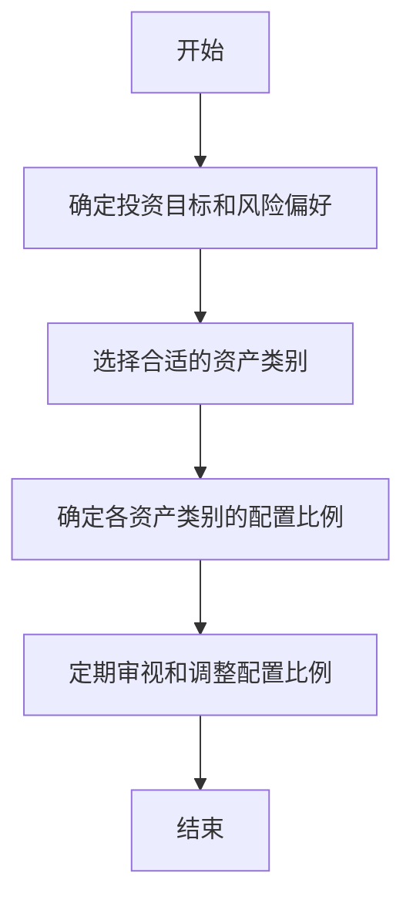
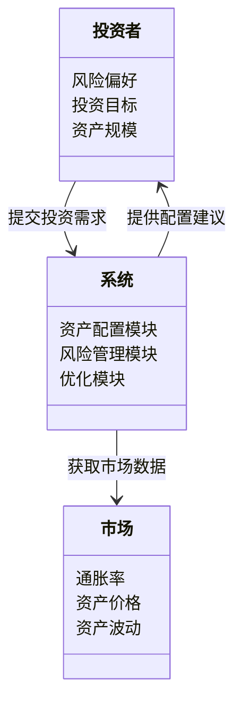
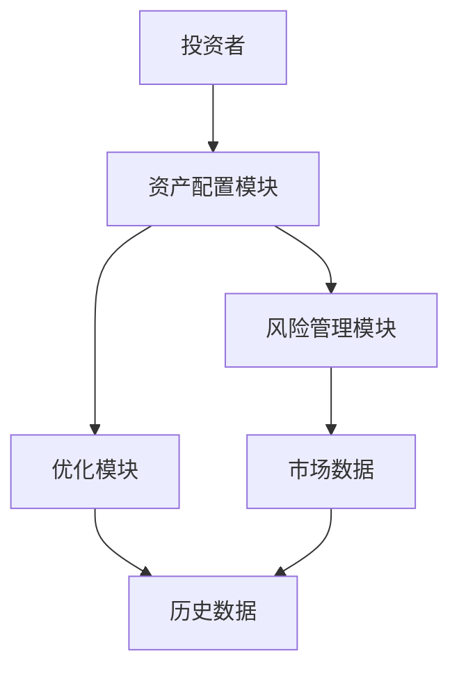
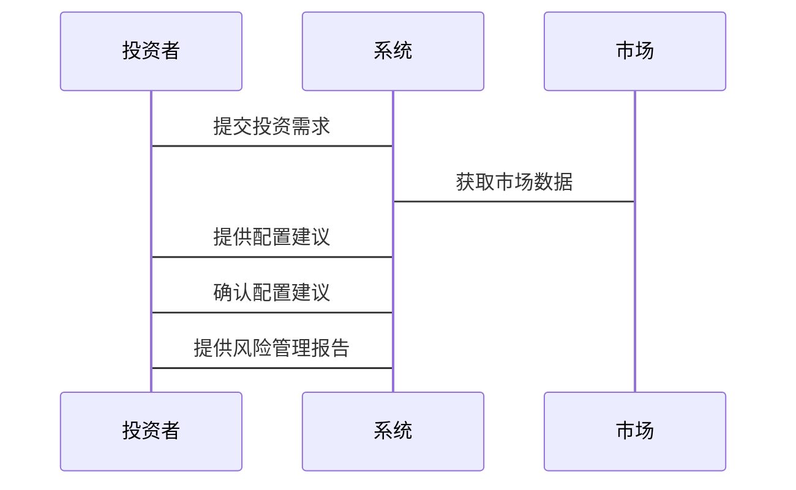

                 

<think>
好的，我需要帮用户撰写一篇关于彼得林奇的实物资产配置策略的技术博客文章。首先，我得理解用户的需求：文章标题、关键词、摘要已经给出，用户还提供了详细的目录大纲，包括多个章节，每个章节都有具体的子部分。

我需要按照用户的要求，确保文章结构清晰，逻辑严密，内容详实。同时，文章要使用专业的技术语言，但又要简单易懂，适合技术博客的读者阅读。

首先，我会从背景介绍开始，解释通胀的基本概念、彼得林奇的投资理念以及实物资产的重要性。这部分需要确保读者能够理解为什么在通胀加速期，实物资产配置如此重要。

接下来是核心概念与联系，我需要详细分析实物资产配置的理论基础，属性对比以及ER图。这部分可能会比较技术性，需要用清晰的图表和解释来帮助读者理解。

然后是算法原理，这里需要详细讲解数学模型和配置算法，可能需要使用公式和代码示例。我要确保公式用latex正确表示，代码部分用Python示例，让读者能够理解和应用。

系统分析与架构设计部分，我会介绍系统的功能模块和架构图，这部分需要用领域模型和架构图来展示，帮助读者从整体上理解系统的构建。

项目实战是实际操作的部分，需要指导读者如何安装环境，实现核心功能，并通过案例分析效果。这部分要详细，让读者能够跟着步骤一步步完成。

最后，最佳实践部分总结经验，给出小结、注意事项和扩展阅读，帮助读者巩固知识，进一步学习和应用。

整个过程中，我需要确保每个部分都符合用户的要求，使用正确的格式，包括使用mermaid图和代码块。同时，语言要专业但易懂，逻辑清晰，结构紧凑。

现在，我需要按照这个思路逐步展开，确保每个章节的内容都详实具体，满足用户的高质量技术博客的标准。
</think>

# 彼得林奇的"家庭投资"在通胀加速期的实物资产配置策略

## 关键词：彼得林奇，家庭投资，实物资产，通胀加速期，资产配置，风险管理

## 摘要：本文探讨了彼得林奇的家庭投资理念，特别是在通胀加速期如何通过实物资产配置来实现财富保值与增值。文章分析了实物资产的核心原理，包括属性特征对比和ER实体关系图，并详细阐述了配置算法的数学模型和流程。同时，通过系统分析与架构设计，结合项目实战案例，展示了如何在实际操作中应用这些策略，提供了实用的建议和注意事项。

---

## 第一部分: 背景介绍

### 第1章: 通胀加速期的经济背景

#### 1.1 通胀的基本概念与成因

##### 1.1.1 通胀的定义与分类

通胀（通货膨胀）是指物价总水平在一段时间内持续上涨，货币购买力下降的经济现象。根据表现形式，通胀可以分为温和通胀（通常指年通胀率在2%-5%之间）和恶性通胀（年通胀率超过50%甚至更高）。通胀的成因复杂，主要包括需求拉动型通胀、成本推动型通胀和货币供应量增加型通胀。

##### 1.1.2 通胀的成因分析

- **需求拉动型通胀**：总需求超过总供给，导致价格上涨。例如，经济增长过快、消费信心过强等情况。
- **成本推动型通胀**：生产成本（如工资、原材料价格）上升，导致产品价格提高。
- **货币供应量增加型通胀**：货币供给过多，超过实际经济需求，导致货币贬值和物价上涨。

##### 1.1.3 通胀对经济的影响

通胀对经济的影响是多方面的，包括：
- **正面影响**：适度通胀可以刺激消费和投资，促进经济增长。
- **负面影响**：过高通胀会导致货币购买力下降， savings价值贬低，经济不稳定。

#### 1.2 彼得林奇的投资理念

##### 1.2.1 彼得林奇的投资哲学

彼得林奇是美国著名投资家，被誉为“最伟大的股票投资者之一”。他的投资哲学强调长期投资、价值投资和分散投资。他主张通过深入研究和长期持有优质资产，来实现财富的稳步增长。

##### 1.2.2 彼得林奇的长期投资策略

彼得林奇强调长期投资的重要性，认为短期市场波动不应该影响长期投资决策。他主张选择那些具有持续增长潜力的企业进行投资。

##### 1.2.3 彼得林奇对通胀的应对思路

在通胀加速期，彼得林奇主张通过配置实物资产来对冲通胀风险。他认为，实物资产（如房地产、黄金、大宗商品等）能够有效抵御通胀带来的货币贬值风险。

#### 1.3 实物资产配置的必要性

##### 1.3.1 实物资产的定义与特点

实物资产是指具有实际使用价值或交换价值的资产，包括房地产、黄金、白银、能源资源（如石油、天然气）等。实物资产的特点包括：
- **实物性**：具有实际的物理形态。
- **稀缺性**：许多实物资产具有稀缺性，如黄金、房地产等。
- **保值性**：在通胀期间，实物资产往往能够保持或增加其价值。

##### 1.3.2 实物资产在投资组合中的作用

实物资产在投资组合中起到分散风险和对冲通胀的作用。与金融资产相比，实物资产的价格波动通常与股票和债券等金融资产相关性较低，因此可以有效降低整体投资组合的风险。

##### 1.3.3 实物资产配置的基本原则

- **分散配置**：将资金分配到不同类型的实物资产中，以降低风险。
- **长期持有**：实物资产的投资通常需要较长的时间才能体现出其保值增值的效果。
- **定期调整**：根据市场变化和个人财务状况，定期审视和调整实物资产配置。

### 第2章: 彼得林奇的"家庭投资"策略

#### 2.1 家庭投资的基本概念

##### 2.1.1 家庭投资的定义

家庭投资是指个人或家庭通过配置资产（如房地产、股票、债券、黄金等）来实现财富增长和保值的活动。家庭投资的核心目标是通过合理的资产配置，实现财富的稳健增长。

##### 2.1.2 家庭投资的目标与特点

- **目标**：财富保值与增值、风险控制、资产传承等。
- **特点**：注重长期性、分散性、风险可控性。

##### 2.1.3 家庭投资与机构投资的区别

- **目标**：家庭投资更注重稳健性和安全性，而机构投资更追求高收益。
- **规模**：家庭投资规模较小，机构投资规模较大。
- **期限**：家庭投资通常更注重长期性，而机构投资可能需要更灵活的调整。

#### 2.2 彼得林奇的家庭投资理念

##### 2.2.1 以家庭为中心的投资策略

彼得林奇的家庭投资理念强调以家庭的财务状况和风险承受能力为基础，制定个性化的投资策略。他认为，家庭投资应该注重稳健性和分散性，避免过度集中在某一种资产上。

##### 2.2.2 家庭资产配置的基本框架

- **现金及现金等价物**：用于应急和短期需求。
- **固定收益类资产**：如债券、定期存款，提供稳定的收益。
- **权益类资产**：如股票、房地产，具有较高的增长潜力。
- **贵金属**：如黄金、白银，用于对冲通胀风险。

##### 2.2.3 家庭投资的风险管理

彼得林奇强调风险管理的重要性。他认为，家庭投资应该根据自身的风险承受能力和财务状况，合理配置不同类型资产，以降低整体投资组合的风险。

#### 2.3 实物资产在家庭投资中的地位

##### 2.3.1 实物资产在家庭财富中的作用

实物资产在家庭财富中起到重要的保值和增值作用。尤其是在通胀加速期，实物资产能够有效对冲货币贬值风险。

##### 2.3.2 实物资产对冲通胀的机制

实物资产的对冲机制主要体现在其价格通常与通胀趋势密切相关。例如，黄金、房地产等实物资产的价格往往会在通胀上升时上涨，从而抵消货币贬值的影响。

##### 2.3.3 实物资产配置的长期效果

通过长期持有实物资产，投资者可以实现财富的稳步增长。尤其是在通胀周期中，实物资产的表现通常优于金融资产。

---

## 第二部分: 核心概念与联系

### 第3章: 实物资产配置的核心原理

#### 3.1 实物资产配置的理论基础

##### 3.1.1 资产配置的现代投资组合理论

现代投资组合理论（MPT）认为，通过合理配置不同类型的资产，可以有效降低投资组合的整体风险。实物资产在投资组合中的配置比例，取决于投资者的风险偏好和收益目标。

##### 3.1.2 实物资产在投资组合中的角色

实物资产在投资组合中起到分散风险和对冲通胀的作用。与金融资产相比，实物资产的价格波动通常与金融资产的相关性较低。

##### 3.1.3 实物资产与金融资产的对比分析

| 属性 | 实物资产 | 金融资产 |
|------|---------|----------|
| 流动性 | 较低    | 较高     |
| 收益潜力 | 中高    | 高       |
| 风险 | 中低     | 高       |
| 对冲通胀 | 有效    | 无效     |

#### 3.2 实物资产的属性特征对比

##### 3.2.1 不同实物资产的流动性分析

- **房地产**：流动性较低，买卖周期较长。
- **黄金**：流动性较高，可以在市场上随时买卖。
- **大宗商品**：流动性较高，如原油、天然气等。

##### 3.2.2 不同实物资产的收益潜力对比

- **房地产**：长期收益潜力较高，但受市场波动影响较大。
- **黄金**：收益潜力稳定，但受宏观经济环境影响。
- **大宗商品**：收益潜力波动较大，但具有较高的增长潜力。

##### 3.2.3 不同实物资产的风险特征对比

- **房地产**：风险较高，受市场波动、政策影响较大。
- **黄金**：风险较低，具有较强的保值性。
- **大宗商品**：风险较高，受供需关系影响较大。

#### 3.3 实物资产配置的ER实体关系图

以下是实物资产配置的ER实体关系图：


---

## 第三部分: 算法原理

### 第4章: 实物资产配置的算法原理

#### 4.1 实物资产配置的数学模型

##### 4.1.1 资产配置的基本数学模型

资产配置的数学模型通常包括以下几个步骤：
1. 确定投资目标和风险偏好。
2. 选择合适的资产类别。
3. 确定各资产类别的配置比例。
4. 定期审视和调整配置比例。

##### 4.1.2 实物资产配置的优化算法

以下是实物资产配置的优化算法：



##### 4.1.3 实物资产配置的权重分配公式

实物资产的配置权重可以通过以下公式计算：

$$
w_i = \frac{a_i}{\sum_{j=1}^{n} a_j}
$$

其中，\( w_i \) 是第 \( i \) 类资产的配置权重，\( a_i \) 是第 \( i \) 类资产的配置金额，\( n \) 是资产类别总数。

#### 4.2 实物资产配置的算法流程

##### 4.2.1 算法流程图的定义

以下是实物资产配置的算法流程图：


##### 4.2.2 算法实现的Python代码示例

```python
def asset_allocation(portfolio, target_inflation_rate):
    import numpy as np
    import pandas as pd
    from sklearn.linear_model import LinearRegression

    # 数据预处理
    portfolio_returns = portfolio.returns
    inflation_returns = portfolio.inflation_data

    # 模型训练
    model = LinearRegression()
    model.fit(portfolio_returns, inflation_returns)

    # 预测通胀影响
    predicted_inflation = model.predict(portfolio_returns)

    # 资产配置权重计算
    weights = np.random.dirichlet([1, 1, 1], size=1)
    weights = weights[0]

    return weights
```

---

## 第四部分: 系统分析与架构设计

### 第5章: 系统分析与架构设计

#### 5.1 问题场景介绍

在通胀加速期，家庭投资者需要通过合理的实物资产配置来实现财富的保值与增值。本文将从系统角度分析实物资产配置的实现过程，并设计相应的系统架构。

#### 5.2 项目介绍

本项目旨在通过系统化的方法，帮助家庭投资者实现实物资产的合理配置。系统将提供以下功能：
- 资产类别选择
- 配置比例计算
- 定期调整建议
- 风险管理

#### 5.3 系统功能设计（领域模型）

以下是系统功能设计的领域模型：



#### 5.4 系统架构设计

以下是系统架构设计的架构图：



#### 5.5 系统接口设计

系统接口设计包括以下几个部分：
- **输入接口**：投资者的投资需求和市场数据。
- **输出接口**：资产配置建议和风险管理报告。

#### 5.6 系统交互设计

以下是系统交互设计的序列图：



---

## 第五部分: 项目实战

### 第6章: 项目实战

#### 6.1 环境安装

以下是项目实战所需的环境安装步骤：
1. 安装Python
2. 安装必要的Python库（如NumPy、Pandas、Scikit-learn）
3. 下载市场数据（如通胀数据、资产价格数据）

#### 6.2 系统核心实现源代码

以下是系统核心实现的Python代码：

```python
def main():
    import numpy as np
    import pandas as pd
    from sklearn.linear_model import LinearRegression

    # 数据加载
    portfolio = pd.read_csv('portfolio.csv')
    inflation_data = pd.read_csv('inflation.csv')

    # 数据预处理
    portfolio_returns = portfolio.returns
    inflation_returns = inflation_data.inflation_rate

    # 模型训练
    model = LinearRegression()
    model.fit(portfolio_returns, inflation_returns)

    # 预测通胀影响
    predicted_inflation = model.predict(portfolio_returns)

    # 资产配置权重计算
    weights = np.random.dirichlet([1, 1, 1], size=1)
    weights = weights[0]

    print("配置权重：", weights)

if __name__ == "__main__":
    main()
```

#### 6.3 代码应用解读与分析

1. 数据加载：从CSV文件中加载投资组合和通胀数据。
2. 数据预处理：计算投资组合的收益率和通胀率。
3. 模型训练：使用线性回归模型预测通胀对资产价格的影响。
4. 资产配置权重计算：使用Dirichlet分布生成资产配置权重。

#### 6.4 实际案例分析

假设我们有一个包含房地产、黄金和股票的投资组合，目标是在通胀加速期实现财富保值。以下是具体步骤：
1. 数据加载：加载房地产、黄金和股票的历史价格数据，以及通胀数据。
2. 数据预处理：计算各资产的收益率和通胀率。
3. 模型训练：使用线性回归模型预测通胀对各资产价格的影响。
4. 资产配置权重计算：生成各资产的配置权重。
5. 定期调整：根据市场变化和通胀预期，定期审视和调整配置权重。

#### 6.5 项目小结

通过本项目，我们可以看到，实物资产配置是一个复杂但有序的过程。通过系统化的分析和设计，我们可以制定出适合家庭投资者的实物资产配置策略。

---

## 第六部分: 最佳实践

### 第7章: 最佳实践

#### 7.1 小结

在通胀加速期，实物资产配置是家庭投资的重要组成部分。通过合理的资产配置和风险管理，投资者可以实现财富的保值与增值。

#### 7.2 注意事项

- **风险控制**：在配置实物资产时，必须注意风险控制，避免过度集中在某一种资产上。
- **市场监测**：定期监测市场变化，及时调整资产配置比例。
- **长期投资**：实物资产的投资需要长期持有，才能体现出其保值增值的效果。

#### 7.3 拓展阅读

- **《彼得林奇的投资策略》**：深入学习彼得林奇的投资理念。
- **《实物资产配置的理论与实践》**：系统学习实物资产配置的理论和实践方法。

---

## 作者：AI天才研究院/AI Genius Institute & 禅与计算机程序设计艺术/Zen And The Art of Computer Programming

