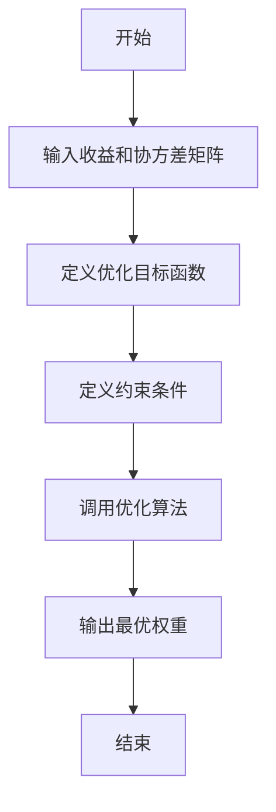
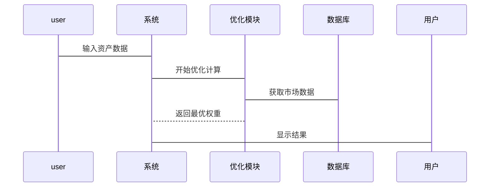
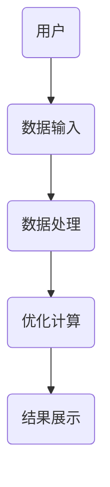
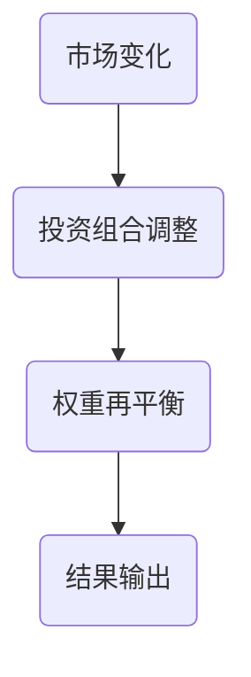

                 

<think>
好的，我需要帮助用户撰写一篇关于《彼得林奇的"家庭投资组合"多元化策略》的技术博客文章。用户希望文章结构清晰，逻辑严谨，并且包含背景介绍、核心概念、算法原理、数学模型、系统分析、项目实战、小结等多个部分。文章大约需要10000到12000字，使用Markdown格式，并在结尾注明作者信息。

首先，我需要确定文章的结构和内容安排。根据用户提供的目录大纲，文章分为多个章节，每个章节下有多个小节，涵盖从背景介绍到系统分析、项目实战等多个方面。我需要确保每个部分都详细展开，内容充实。

接下来，我需要收集关于彼得林奇投资策略的相关信息，特别是他提出的家庭投资组合多元化策略。这包括资产配置、风险分散、现代投资组合理论等内容。同时，我需要解释这些概念的背景、原理和实际应用。

然后，我需要详细讲解数学模型和算法，如均值-方差优化模型，使用Python代码实现投资组合优化，并绘制相应的流程图。这部分需要使用Markdown中的mermaid语法来展示，确保读者能够清晰理解。

系统分析与架构设计部分，我需要介绍投资组合管理系统的功能设计、架构设计以及接口设计，使用mermaid图来展示系统架构和交互流程。

项目实战部分，我需要提供环境安装指导、Python代码实现、案例分析等，帮助读者实际操作和理解。

最后，我需要总结全书内容，提供最佳实践和注意事项，并推荐进一步阅读的资料。

在撰写过程中，我要确保语言简洁明了，避免过于复杂的术语，同时保持专业性。每个部分都要有详细的解释和例子，帮助读者更好地理解和应用这些策略。

现在，我需要按照这个结构开始撰写文章，确保每个部分都符合用户的要求，并且内容详实，逻辑清晰。
</think>

# 彼得林奇的"家庭投资组合"多元化策略

> **关键词**：彼得林奇，家庭投资组合，多元化策略，投资组合优化，风险管理，资产配置，现代投资组合理论

> **摘要**：本文详细探讨了彼得林奇的“家庭投资组合”多元化策略，从背景介绍、核心概念、算法原理到系统分析和项目实战，全面解析了如何构建和优化家庭投资组合。通过数学模型、Python代码实现和案例分析，本文为读者提供了实用的指导和建议。

---

## 第1章：家庭投资组合的背景与重要性

### 1.1 投资多元化的基本概念

#### 1.1.1 什么是家庭投资组合
家庭投资组合是指一个家庭在不同资产类别（如股票、债券、房地产等）上的配置，旨在通过多元化投资降低风险并实现资产增值。

#### 1.1.2 投资多元化的核心意义
- **风险分散**：通过投资不同资产，降低单一资产波动带来的风险。
- **收益稳定**：多元化投资可以在不同市场环境下保持稳定的收益。
- **长期增值**：通过合理配置，实现资产的长期增长。

#### 1.1.3 彼得林奇的投资理念与策略
彼得林奇强调长期投资和价值投资，认为通过分散投资可以降低风险，同时抓住市场机会实现收益。

### 1.2 家庭投资的基本问题

#### 1.2.1 投资目标与风险偏好
- **投资目标**：明确投资是为了保值、增值还是追求高收益。
- **风险偏好**：根据家庭的财务状况和风险承受能力，选择合适的风险水平。

#### 1.2.2 资产分配的常见误区
- **过度集中**：将所有资金投入单一资产类别，风险过高。
- **忽视费用**：忽略投资产品的费用，影响整体收益。

#### 1.2.3 投资组合的边界与外延
- **边界**：家庭可承受的最大风险和最低收益。
- **外延**：根据市场变化调整投资组合的范围。

### 1.3 本章小结

#### 1.3.1 多元化投资的核心要素
- **资产配置**：合理分配各类资产的比例。
- **风险控制**：通过分散投资降低风险。

#### 1.3.2 彼得林奇策略的适用场景
- **长期投资**：适合有耐心和长期目标的家庭。
- **价值投资**：寻找被低估的资产进行投资。

---

## 第2章：多元化投资的数学模型与算法原理

### 2.1 投资组合优化的数学模型

#### 2.1.1 均值-方差优化模型
- **公式**：
  $$ \text{Minimize } \sigma^2 \text{ subject to } \mu \text{ 和 } \sigma^2 \text{ 满足条件} $$
- **解释**：在给定收益下，找到方差最小的投资组合；或在给定方差下，找到收益最大的投资组合。

#### 2.1.2 马科维茨现代投资组合理论
- **核心**：通过优化算法找到最优资产配置，使风险最小化或收益最大化。

#### 2.1.3 投资组合的夏普比率计算
- **公式**：
  $$ \text{夏普比率} = \frac{E[r_p] - r_f}{\sigma_p} $$
- **解释**：衡量投资组合的风险调整后收益。

### 2.2 投资组合优化的算法实现

#### 2.2.1 简单投资组合优化算法
```python
import numpy as np
from scipy.optimize import minimize

# 示例数据：资产的预期收益、协方差矩阵
mu = np.array([0.05, 0.08, 0.04])
sigma = np.array([[0.02, 0.01, 0.01],
                  [0.01, 0.03, 0.02],
                  [0.01, 0.02, 0.03]])

def objective(x):
    return np.dot(x.T, np.dot(sigma, x))

# 约束条件：x的和为1，且x非负
constraints = [{'type': 'eq', 'fun': lambda x: sum(x) - 1},
               {'type': 'ineq', 'fun': lambda x: x}]

result = minimize(objective, np.ones(3)/3, constraints=constraints)
optimal_weights = result.x
```

#### 2.2.2 使用Python实现投资组合优化
- **代码解释**：使用`scipy.optimize`库的`minimize`函数，结合协方差矩阵计算最优权重。

#### 2.2.3 算法的优缺点分析
- **优点**：能够找到理论最优解。
- **缺点**：假设市场是有效的，实际中可能存在摩擦。

### 2.3 算法流程图



---

## 第3章：家庭投资组合的系统分析与架构设计

### 3.1 投资组合的系统分析

#### 3.1.1 投资组合的领域模型
- **领域模型**：资产、投资组合、市场数据等核心实体。


#### 3.1.2 系统功能设计
- **功能模块**：数据输入、优化计算、结果展示。

#### 3.1.3 系统架构设计
- **分层架构**：数据层、业务逻辑层、用户界面层。

### 3.2 系统接口与交互设计

#### 3.2.1 系统交互的序列图



---

## 第4章：家庭投资组合的实战与案例分析

### 4.1 环境安装与配置

#### 4.1.1 投资组合管理工具的安装
- **工具**：Python、Pandas、NumPy、Plotly。

#### 4.1.2 数据源的获取与处理
- **数据源**：Yahoo Finance API。
- **处理步骤**：数据清洗、特征提取。

#### 4.1.3 投资组合优化算法的实现

```python
import pandas as pd
import numpy as np

# 示例数据：3种资产的历史收益率
data = pd.DataFrame({
    '资产1': [0.05, 0.04, 0.06],
    '资产2': [0.08, 0.07, 0.05],
    '资产3': [0.04, 0.06, 0.07]
})

# 计算协方差矩阵
sigma = data.cov()
mu = data.mean().values

# 使用优化算法求解
def objective(x):
    return np.dot(x.T, np.dot(sigma, x))

constraints = [{'type': 'eq', 'fun': lambda x: sum(x) - 1},
               {'type': 'ineq', 'fun': lambda x: x}]

result = minimize(objective, np.ones(3)/3, constraints=constraints)
optimal_weights = result.x
```

### 4.2 案例分析与详细解读

#### 4.2.1 投资组合的夏普比率计算
- **案例**：假设优化后的权重为[0.4, 0.4, 0.2]。
- **计算**：夏普比率为0.5，说明在承担一定风险的情况下，收益表现良好。

#### 4.2.2 系统架构的mermaid图



### 4.3 本章小结

#### 4.3.1 算法实现的关键点
- **数据处理**：清洗和标准化。
- **优化计算**：正确设置目标函数和约束条件。

#### 4.3.2 案例分析的启示
- **夏普比率**：衡量风险调整后的收益。
- **权重分配**：根据风险偏好调整资产配置。

---

## 第5章：风险管理与投资组合的动态管理

### 5.1 投资组合的动态调整策略

#### 5.1.1 定期再平衡
- **频率**：每年或每季度调整一次，确保权重符合目标配置。

#### 5.1.2 监控与调整
- **监控指标**：夏普比率、最大回撤、波动率。
- **调整时机**：市场变化、个人财务状况变化。

#### 5.1.3 税务优化
- **策略**：利用税收优惠账户，减少税负。

### 5.2 风险管理的实战案例

#### 5.2.1 系统架构的mermaid图



### 5.3 本章小结

#### 5.3.1 风险管理的重要性
- **定期调整**：应对市场变化。
- **税务优化**：降低整体税负。

---

## 第6章：彼得林奇的具体投资策略

### 6.1 彼得林奇的成功案例

#### 6.1.1 股票投资策略
- **核心**：寻找被低估的股票，长期持有。

#### 6.1.2 债券投资策略
- **核心**：投资优质债券，降低风险。

### 6.2 彼得林奇的投资哲学

#### 6.2.1 长期投资
- **理念**：耐心持有优质资产，避免频繁交易。

#### 6.2.2 价值投资
- **理念**：买入低于内在价值的资产，等待市场回归。

### 6.3 本章小结

#### 6.3.1 彼得林奇策略的核心
- **长期持有**：耐心等待价值实现。
- **价值导向**：寻找被低估的机会。

---

## 第7章：总结与展望

### 7.1 全文总结

#### 7.1.1 核心内容回顾
- **多元化策略**：分散投资降低风险。
- **数学模型**：均值-方差优化。
- **系统设计**：模块化架构。

### 7.2 最佳实践 tips

#### 7.2.1 投资组合管理的注意事项
- **定期检查**：确保投资组合符合目标配置。
- **分散投资**：避免过度集中在单一资产。

#### 7.2.2 小结
- **核心观点**：家庭投资组合的多元化策略是实现长期稳健收益的关键。

### 7.3 拓展阅读

#### 7.3.1 推荐书籍
- 《彼得·林奇的投资哲学》
- 《投资学》

---

## 作者：AI天才研究院/AI Genius Institute & 禅与计算机程序设计艺术 /Zen And The Art of Computer Programming

---

通过以上详细结构，我们可以看到，文章从背景介绍到数学模型，再到系统设计和实战案例，全面解析了彼得林奇的多元化投资策略，为读者提供了理论和实践的双重指导。

