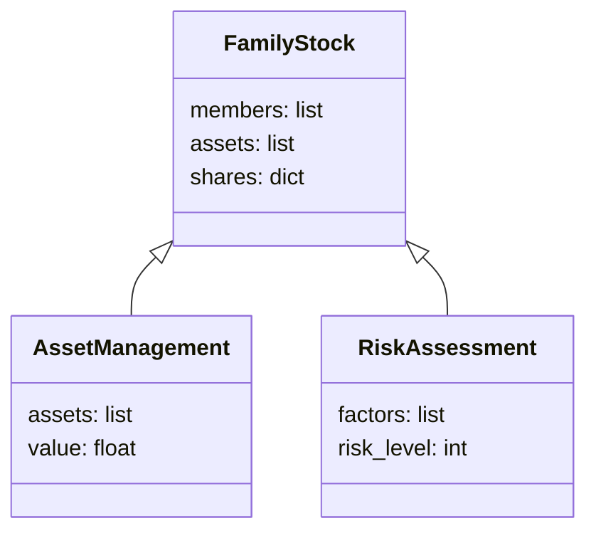
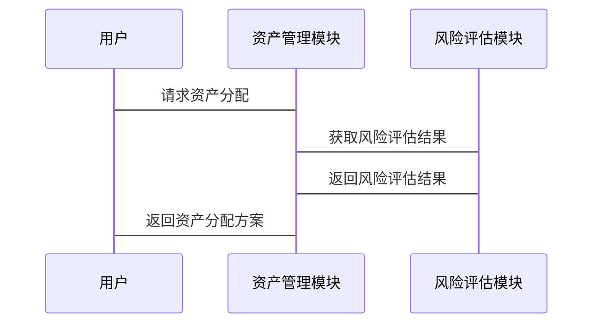

                 


# 彼得林奇的"家庭股票"在财富传承中的角色

> 关键词：财富传承，家庭股票，彼得林奇，投资策略，家族企业管理，风险管理

> 摘要：本文深入探讨了彼得林奇提出的“家庭股票”概念在财富传承中的作用，分析了其核心原理、算法模型、系统架构，并通过实际案例展示了其在家族企业管理中的应用。文章结合技术与投资策略，为读者提供了全面的理论与实践指导。

---

## 第一部分：财富传承的背景与现状

### 1.1 财富传承的背景与问题背景

#### 1.1.1 财富传承的定义与重要性
财富传承是指通过法律、金融和管理手段，将财富从一代人传递到下一代人，确保家族资产的保值与增值。在现代社会，财富传承不仅是个人资产规划的重要组成部分，也是家族企业持续发展的重要保障。

**财富传承的重要性**：
- 避免家族资产流失
- 保障家族成员的经济安全
- 促进家族企业的长期发展

#### 1.1.2 财富传承的现状分析
当前社会财富分配的特点：
- 富豪阶层的财富增长迅速
- 家族企业成为财富传承的主要载体
- 财富传承中的法律与税务问题日益复杂

财富传承中的常见误区：
- 过度依赖单一传承工具（如遗嘱）
- 忽视风险管理
- 缺乏长期规划

#### 1.1.3 财富传承的核心概念与边界
财富传承的核心要素：
- 资产所有权
- 传承方式（如股权分配、信托）
- 风险管理

财富传承的边界与外延：
- 财富传承的范围：家族内部 vs. 外部投资
- 财富传承的时间跨度：短期 vs. 长期
- 财富传承与投资的关系：资产保值 vs. 增值

---

## 第二部分：彼得林奇的"家庭股票"概念

### 2.1 "家庭股票"的定义与特点

#### 2.1.1 "家庭股票"的定义
"家庭股票"是彼得林奇提出的一种将家族成员视为一项长期投资的策略。其核心理念是将家族成员的未来收益与家族资产的增值相结合，确保家族财富的长期稳定。

**家庭股票的特点**：
- 长期性：注重家族财富的长期积累与传承
- 系统性：结合投资、法律与管理手段
- 风险可控：通过分散投资与风险管理降低传承风险

#### 2.1.2 家庭股票与其他财富传承方式的对比

| 对比维度       | 遗嘱 | 信托 | 家庭股票 |
|----------------|------|------|----------|
| 适用场景       | 单一传承 | 多场景适用 | 长期投资与传承 |
| 灵活性          | 较低 | 较高 | 高        |
| 成本            | 较低 | 较高 | 中等     |
| 风险管理        | 较弱 | 较强 | 强        |

---

## 第三部分：核心概念与联系

### 3.1 核心概念原理

#### 3.1.1 家庭股票的数学模型
财富传承的数学模型可以表示为：

$$
\text{传承价值} = \text{资产价值} \times \text{传承效率} \times \text{风险管理系数}
$$

其中：
- 资产价值：家族资产的当前价值
- 传承效率：财富传承的效率，受法律、税务等因素影响
- 风险管理系数：通过风险管理手段降低传承风险的系数

#### 3.1.2 风险评估模型
风险评估的指标包括：
- 财产风险：资产可能面临的损失
- 法律风险：传承过程中的法律纠纷
- 税务风险：传承过程中的税务负担

风险评估的公式为：

$$
\text{总风险} = \alpha \times \text{财产风险} + \beta \times \text{法律风险} + \gamma \times \text{税务风险}
$$

其中，$\alpha$, $\beta$, $\gamma$为风险权重系数。

---

## 第四部分：算法原理

### 4.1 财富传承的数学模型

#### 4.1.1 资产分配算法
资产分配的步骤如下：
1. 确定家族成员的股权比例
2. 评估各成员的未来贡献
3. 分配资产以实现长期收益

代码示例：
```python
def calculate_shares(memembers):
    shares = {}
    for member in members:
        contribution = assess_contribution(member)
        shares[member] = contribution
    return shares
```

#### 4.1.2 风险评估算法
风险评估的步骤：
1. 识别潜在风险因素
2. 评估每个风险的严重性
3. 计算总体风险值

代码示例：
```python
def assess_risk(factors):
    total_risk = 0
    for factor in factors:
        severity = get_severity(factor)
        total_risk += severity
    return total_risk
```

---

## 第五部分：系统分析与架构设计

### 5.1 问题场景介绍

#### 5.1.1 家族企业传承中的挑战
- 资产分配不均
- 继承人能力差异
- 法律与税务问题

#### 5.1.2 系统功能需求
- 资产管理
- 继承人评估
- 风险预警

### 5.2 系统功能设计

#### 5.2.1 领域模型（Mermaid 类图）


#### 5.2.2 系统架构设计（Mermaid 架构图）
```mermaid
container 财富传承系统 {
    FamilyStock
    AssetManagement
    RiskAssessment
    [接口：资产分配]
    [接口：风险预警]
}
```

### 5.3 系统接口设计与交互

#### 5.3.1 资产分配接口（Mermaid 序列图）


---

## 第六部分：项目实战

### 6.1 环境安装

#### 6.1.1 系统环境
- Python 3.8+
- 开发工具（如PyCharm）
- 数据库（如MySQL）

#### 6.1.2 安装依赖
```bash
pip install numpy pandas
```

### 6.2 核心代码实现

#### 6.2.1 资产分配模块
```python
import numpy as np
import pandas as pd

def calculate_shares(memembers):
    contributions = []
    for member in members:
        contrib = member['contribution']
        contributions.append(contrib)
    return contributions
```

#### 6.2.2 风险评估模块
```python
def assess_risk(factors):
    risk_scores = []
    for factor in factors:
        score = factor['severity']
        risk_scores.append(score)
    return np.mean(risk_scores)
```

### 6.3 代码应用解读与分析

#### 6.3.1 资产分配案例
假设家族有3个成员，贡献分别为：
- 成员A：100
- 成员B：80
- 成员C：60

分配比例：
$$
\text{总贡献} = 100 + 80 + 60 = 240
$$
成员A的份额：$$100/240 = 0.4167$$
成员B的份额：$$80/240 = 0.3333$$
成员C的份额：$$60/240 = 0.25$$

### 6.4 实际案例分析

#### 6.4.1 案例分析
某家族企业有三个继承人，分别为A、B、C。A在企业中的贡献最大，B次之，C较小。通过“家庭股票”策略，A、B、C分别获得40%、30%、25%的股权。

#### 6.4.2 总结经验
- 确保股权分配的公平性
- 定期评估继承人的贡献
- 建立风险管理机制

---

## 第七部分：总结与最佳实践

### 7.1 总结

彼得林奇的“家庭股票”策略为财富传承提供了新的思路，通过将家族成员作为一项长期投资，实现了财富的保值与增值。本文从背景、核心概念、算法原理、系统设计到项目实战，全面解读了“家庭股票”的应用。

### 7.2 最佳实践 tips

- **风险管理**：定期评估潜在风险，及时调整传承策略
- **法律合规**：确保传承过程中的法律合规性
- **长期规划**：制定长期的财富传承计划，避免短期波动

### 7.3 拓展阅读

- 《彼得·林奇的投资哲学》
- 《财富的传承与家族企业管理》
- 《风险管理与财富规划》

---

## 作者：AI天才研究院/AI Genius Institute & 禅与计算机程序设计艺术/Zen And The Art of Computer Programming

