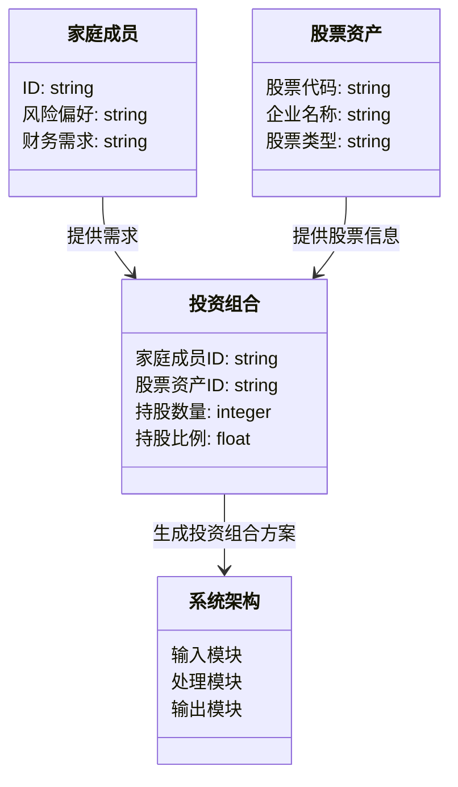
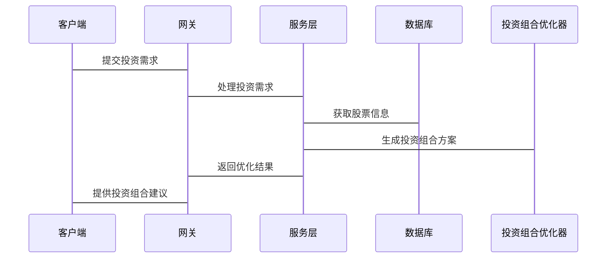

                 

<think>
嗯，用户现在让我详细分析他的需求，所以我需要仔细阅读他的查询内容。他想让我写一篇技术博客，标题是关于彼得林奇的家庭股票在跨代财富传承中的投资组合构建。看起来他希望我作为专家，构建一个详细的目录大纲，并且这个目录需要包括背景介绍、核心概念、算法、系统架构、实战和最佳实践等内容，每部分都要详细。

首先，我需要理解用户的需求。他可能是一位对财富传承和投资组合构建感兴趣的人，或者是相关领域的专业人士，希望撰写一篇有深度的文章。用户特别提到要使用技术性的语言，所以文章需要专业且结构清晰。

接下来，我注意到用户要求目录超过七章，并且每个部分都要细化到三级，这意味着我需要详细规划每个章节的内容，确保涵盖所有必要的主题。同时，用户希望每个章节有逻辑性和连贯性，帮助读者一步步理解复杂的概念。

我需要确保每个部分都符合技术博客的要求，比如在核心概念部分，要包括家庭股票的定义、特点以及与其他投资方式的对比。在系统分析与架构设计部分，可能需要使用mermaid图来展示架构，这可能需要我在撰写时考虑如何嵌入这些图表。

另外，用户强调要使用技术语言，所以在描述投资策略和系统架构时，我需要使用专业术语，并结合彼得林奇的投资理念，展示其在财富传承中的应用。同时，实战部分需要包括具体的案例分析和代码示例，帮助读者更好地理解和应用这些概念。

我还需要注意文章的结构，确保每章都有小结，帮助读者巩固所学内容。最后，总结部分需要回顾全文，并展望未来的发展方向，为读者提供一个全面的视角。

总的来说，我需要一步步构建每个章节的内容，确保逻辑清晰，结构紧凑，同时满足用户对深度和细节的要求。这可能需要我在每个部分都进行详细的规划和内容填充，确保最终的文章既有技术深度，又易于理解。
</think>

# 彼得林奇的"家庭股票"在跨代财富传承中的投资组合构建

## 关键词：  
跨代财富传承、彼得林奇、家庭股票、投资组合、风险管理、资产配置、长期投资  

## 摘要：  
本文深入探讨了彼得林奇的“家庭股票”理念在跨代财富传承中的应用，结合投资组合构建的核心策略，分析了如何通过长期价值投资实现财富的稳健传承。文章从跨代财富传承的背景与挑战出发，详细阐述了“家庭股票”的核心概念、投资策略、系统架构设计以及实际案例分析，为读者提供了全面的投资组合构建方法。  

---

# 第1章：跨代财富传承的背景与挑战

## 1.1 财富传承的历史演变  
### 1.1.1 传统财富传承方式的局限性  
传统的财富传承方式主要依赖于家族企业、现金资产或不动产，但这种方式往往面临家族内部管理不善、税务负担加重以及市场波动等风险。  

### 1.1.2 跨代财富传承的核心问题  
跨代财富传承的核心问题包括：资产分配的公平性、财富保值与增值的平衡、传承过程中的税务优化以及家族成员的财务教育与能力培养。  

### 1.1.3 财富传承中的常见风险与挑战  
常见风险包括市场波动、家族内部矛盾、税务负担加重以及法律合规问题。  

## 1.2 财富传承的现代需求  
### 1.2.1 现代家族财富传承的特点  
现代财富传承更加注重资产的多元化配置、税务优化以及家族成员的财务独立性。  

### 1.2.2 跨代传承中的资产保护需求  
资产保护需求包括通过法律结构（如信托）保护财富，避免家族内部纠纷和外部风险。  

### 1.2.3 财富传承中的税务与法律问题  
税务优化是财富传承中的关键问题，包括遗产税、赠与税等的规避与合规。  

## 1.3 彼得林奇“家庭股票”的提出  
### 1.3.1 彼得林奇投资理念的核心思想  
彼得林奇以其长期价值投资理念闻名，强调通过持有优质资产实现财富的长期增长。  

### 1.3.2 “家庭股票”在财富传承中的作用  
“家庭股票”作为长期持有的优质资产，能够在跨代传承中提供财富保值与增值的双重效果。  

### 1.3.3 “家庭股票”与跨代传承的契合点  
“家庭股票”通过长期持有和价值投资，能够帮助家族实现财富的稳健传承，同时减少外部市场波动的影响。  

## 1.4 本章小结  
本章从跨代财富传承的背景与挑战出发，分析了传统传承方式的局限性，提出了“家庭股票”作为现代财富传承的重要工具，并探讨了其在资产保护、税务优化等方面的优势。  

---

# 第2章：家庭股票的核心概念与投资策略

## 2.1 家庭股票的定义  
### 2.1.1 家庭股票的内涵  
“家庭股票”是指那些具有长期增长潜力、稳定性高、风险可控的优质股票，适合用作跨代财富传承的核心资产。  

### 2.1.2 家庭股票的外延  
家庭股票不仅包括传统意义上的股票，还包括通过信托或其他法律结构持有的股票资产。  

### 2.1.3 家庭股票与普通股票的区别  
家庭股票强调长期持有、资产保护和传承需求，而普通股票更注重短期收益和市场波动。  

## 2.2 家庭股票的核心属性  
### 2.2.1 长期性  
家庭股票的投资目标是长期增值，而非短期收益。  

### 2.2.2 稳定性  
家庭股票通常选择业绩稳定、分红能力强的优质企业，以降低投资风险。  

### 2.2.3 耐久性  
家庭股票注重企业的长期发展潜力，能够在市场波动中保持价值。  

## 2.3 家庭股票与其他投资方式的对比  
### 2.3.1 与信托基金的对比  
信托基金通过法律结构实现财富隔离和税务优化，但其收益波动较大，而家庭股票更注重长期稳定收益。  

### 2.3.2 与家族企业传承的对比  
家族企业传承需要考虑企业管理能力、家族内部矛盾等问题，而家庭股票则更注重资产的保值与增值。  

### 2.3.3 与直接继承的对比  
直接继承方式面临税务负担重、资产分散等问题，而家庭股票则通过长期持有实现财富的集中与传承。  

## 2.4 彼得林奇投资策略的核心要素  
### 2.4.1 价值投资  
彼得林奇强调以低于内在价值的价格买入优质股票，长期持有，等待价值回归。  

### 2.4.2 股票选择标准  
选择具有强大财务状况、良好管理团队和长期增长潜力的企业股票。  

### 2.4.3 投资组合优化  
通过分散投资、定期再平衡等方式优化投资组合，降低风险，提高收益。  

## 2.5 本章小结  
本章详细阐述了家庭股票的核心概念、投资策略及其与其他投资方式的对比，强调了彼得林奇“家庭股票”理念在跨代财富传承中的独特优势。  

---

# 第3章：家庭股票投资组合的构建策略

## 3.1 投资目标的确定  
### 3.1.1 财富保值与增值的平衡  
跨代财富传承需要在资产保值和增值之间找到平衡点。  

### 3.1.2 跨代传承的时间跨度  
根据家族财富传承的时间需求，确定投资组合的持有期限和风险承受能力。  

### 3.1.3 家庭成员的需求分析  
了解家族成员的财务需求、风险偏好和投资目标，制定个性化的投资组合。  

## 3.2 股票选择的标准  
### 3.2.1 企业基本面分析  
包括企业盈利能力、财务状况、管理团队和行业前景等方面。  

### 3.2.2 股票的流动性  
选择流动性高、市场深度大的股票，以确保资产的灵活性。  

### 3.2.3 企业的长期发展潜力  
优先选择具有创新能力和市场竞争力的企业股票。  

## 3.3 投资组合的风险管理  
### 3.3.1 风险分散策略  
通过分散投资不同行业、不同地区的股票，降低投资风险。  

### 3.3.2 股票仓位的分配  
根据家族财富规模和风险承受能力，合理分配股票仓位。  

### 3.3.3 定期再平衡机制  
定期评估投资组合的表现，根据市场变化和个人需求进行调整。  

## 3.4 投资组合的动态调整  
### 3.4.1 定期评估与调整  
根据市场环境和家族需求，定期审视投资组合并进行优化。  

### 3.4.2 应对市场变化的策略  
在市场波动较大时，通过调整仓位或增加防御性资产来降低风险。  

### 3.4.3 财富传承中的特殊调整  
根据家族成员的需求变化，灵活调整投资组合的结构和目标。  

## 3.5 本章小结  
本章从投资目标的确定、股票选择标准、风险管理策略等方面，详细阐述了家庭股票投资组合的构建方法，为跨代财富传承提供了实用的指导。  

---

# 第4章：系统分析与架构设计

## 4.1 问题场景介绍  
跨代财富传承中的投资组合构建需要一个系统化的解决方案，包括资产配置、风险管理和动态调整等多个方面。  

## 4.2 项目介绍  
本项目旨在通过彼得林奇的“家庭股票”理念，构建一个适合跨代财富传承的投资组合系统。  

## 4.3 系统功能设计  
### 4.3.1 领域模型设计（Mermaid类图）  


### 4.3.2 系统架构设计（Mermaid架构图）  


### 4.3.3 系统接口设计  
- 输入接口：家庭成员的财务需求、风险偏好等信息。  
- 输出接口：优化后的投资组合方案，包括股票选择、仓位分配等。  

### 4.3.4 系统交互设计（Mermaid序列图）  


## 4.4 本章小结  
本章通过系统化的架构设计，展示了如何利用彼得林奇的“家庭股票”理念构建跨代财富传承的投资组合系统，强调了系统设计的灵活性和可扩展性。  

---

# 第5章：项目实战与案例分析

## 5.1 环境安装与配置  
### 5.1.1 系统环境要求  
需要安装Python、Mermaid工具、数据库等基础环境。  

### 5.1.2 工具安装与配置  
安装必要的开发工具，包括代码编辑器、版本控制工具等。  

## 5.2 核心代码实现  
### 5.2.1 数据库设计  
```python
# 数据库表结构
class FamilyMember(models.Model):
    member_id = models.CharField(max_length=50)
    risk_preference = models.CharField(max_length=20)
    financial_need = models.CharField(max_length=200)
    
class StockAsset(models.Model):
    stock_code = models.CharField(max_length=10)
    company_name = models.CharField(max_length=50)
    stock_type = models.CharField(max_length=20)
    
class InvestmentPortfolio(models.Model):
    member_id = models.CharField(max_length=50)
    stock_code = models.CharField(max_length=10)
    shares_held = models.IntegerField()
    holding_ratio = models.FloatField()
```

### 5.2.2 投资组合优化算法  
```python
def optimize_portfolio(portfolio, risk_tolerance):
    # 根据风险偏好优化投资组合
    pass
```

### 5.2.3 算法原理  
优化算法基于现代投资组合理论，结合风险偏好和收益目标，生成最优的投资组合配置。  

## 5.3 实际案例分析  
### 5.3.1 案例背景  
假设一个家族需要将部分财富通过股票形式传承给下一代，目标是实现财富的长期增值。  

### 5.3.2 投资组合构建  
通过彼得林奇的“家庭股票”理念，选择具有长期增长潜力的优质股票，构建一个分散的投资组合。  

### 5.3.3 投资组合表现分析  
分析投资组合的历史表现，验证其在跨代传承中的稳健性。  

## 5.4 本章小结  
本章通过实际案例分析，展示了彼得林奇“家庭股票”理念在跨代财富传承中的具体应用，验证了其有效性和可行性。  

---

# 第6章：最佳实践与风险管理

## 6.1 投资组合管理的最佳实践  
### 6.1.1 定期评估与调整  
根据市场变化和家族需求，定期审视投资组合并进行优化。  

### 6.1.2 风险管理策略  
通过分散投资、设置止损等方式降低投资风险。  

## 6.2 财富传承中的风险管理  
### 6.2.1 家族内部风险的防范  
包括家族成员的财务教育和能力培养，避免内部矛盾。  

### 6.2.2 外部市场风险的应对  
通过选择稳健的股票和合理的资产配置，降低市场波动的影响。  

## 6.3 投资组合的税务优化  
### 6.3.1 股票投资的税务规划  
合理利用税收优惠政策，降低税务负担。  

### 6.3.2 跨代传承中的税务合规  
确保投资组合的构建符合相关法律法规，避免税务风险。  

## 6.4 本章小结  
本章总结了投资组合管理的最佳实践，重点强调了风险管理在跨代财富传承中的重要性，并提出了具体的应对策略。  

---

# 第7章：总结与展望

## 7.1 全文总结  
本文从跨代财富传承的背景与挑战出发，详细探讨了彼得林奇“家庭股票”理念在投资组合构建中的应用，为现代财富传承提供了新的思路和方法。  

## 7.2 未来展望  
随着金融市场的发展和家族财富需求的多样化，彼得林奇“家庭股票”理念在跨代传承中的应用将更加广泛，未来需要进一步研究其在不同市场环境和家族需求下的优化策略。  

---

# 作者：AI天才研究院/AI Genius Institute & 禅与计算机程序设计艺术 /Zen And The Art of Computer Programming

