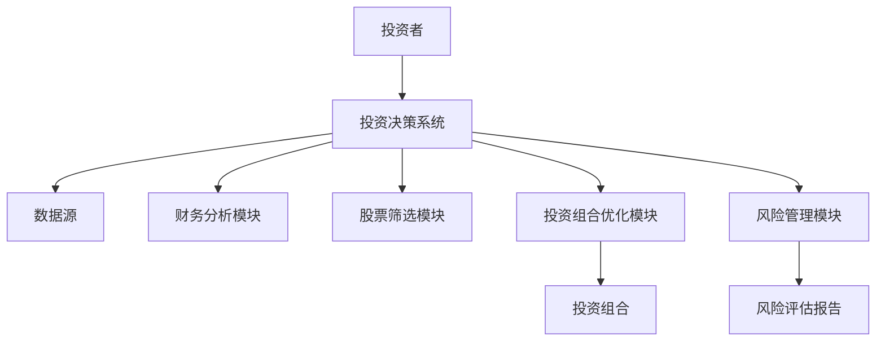
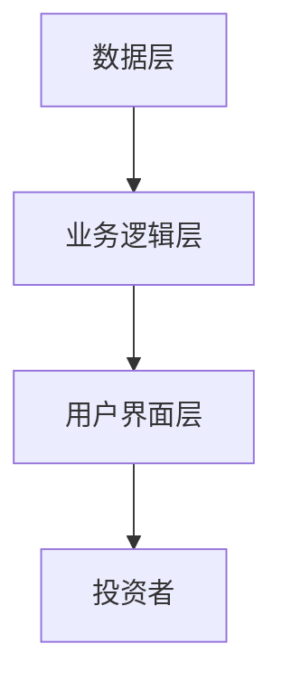
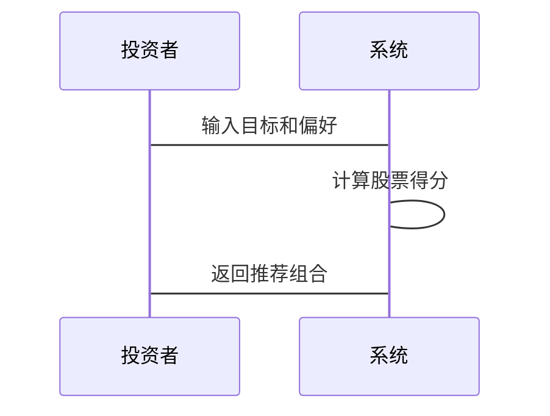

                 


# 彼得林奇的"家庭股票"投资策略

> 关键词：彼得·林奇，家庭股票，投资策略，股票选择，投资组合，风险管理

> 摘要：本文深入探讨了彼得·林奇的“家庭股票”投资策略，分析其核心概念、算法原理、系统架构，并通过案例实战展示其应用。文章旨在为普通投资者提供一种简单有效的投资方法，帮助他们在股票市场中实现稳健收益。

---

## 第一部分：彼得林奇的“家庭股票”投资策略概述

### 第1章：彼得林奇与“家庭股票”投资策略背景

#### 1.1 彼得林奇的背景与投资理念

- **彼得·林奇的生平简介**
  彼得·林奇（Peter Lynch）是美国著名的投资专家，曾任富达投资集团（Fidelity）的基金经理。他以卓越的投资业绩和通俗易懂的投资理念闻名，尤其擅长帮助普通投资者实现财富增长。

- **林奇的投资哲学与方法**
  林奇强调长期投资和价值发现。他认为，成功的投资不在于频繁交易，而在于选择那些具有稳定增长潜力的公司。他建议投资者关注那些自己熟悉、业务模式简单且财务健康的公司。

- **为什么“家庭股票”策略适合普通投资者**
  “家庭股票”策略的目标是帮助普通投资者通过长期持有优质股票，实现财富的稳步增长。这种策略不需要复杂的金融知识，适合那些不具备专业投资能力的个人和家庭。

#### 1.2 “家庭股票”投资策略的核心概念

- **定义与特点**
  “家庭股票”策略是指通过选择那些具备良好基本面、稳定增长潜力和合理估值的公司股票进行投资。该策略强调长期持有，避免频繁交易，以减少交易成本和税收负担。

- **与其他投资策略的对比**
  与主动管理和被动投资相比，“家庭股票”策略更注重个股选择和长期持有。它结合了主动管理的选股优势和被动投资的长期持有特点，适合普通投资者。

- **策略的适用场景与边界**
  该策略适用于中长期投资，尤其适合那些希望获得稳健收益而非短期暴利的投资者。由于强调个股选择，因此在市场波动较大时，投资者需要具备一定的心理承受能力。

---

### 第2章：“家庭股票”投资策略的核心要素

#### 2.1 投资目标与风险偏好

- **投资目标的设定**
  投资目标包括财务自由、保值增值、风险控制等。明确的目标有助于投资者制定合理的投资计划。

- **风险偏好的分类**
  风险偏好分为保守型、稳健型和激进型。不同风险偏好的投资者应选择不同风险等级的股票组合。

- **目标与风险的匹配**
  根据投资目标和风险偏好，选择合适股票组合。例如，保守型投资者应选择低波动、高分红的股票。

#### 2.2 股票选择的标准

- **公司基本面分析**
  重点分析公司的财务状况、盈利能力、成长能力和行业地位。关注收入增长、利润 margins 和现金流等指标。

- **财务指标筛选**
  通过市盈率（P/E）、市净率（P/B）、股息率等指标筛选具有合理估值的股票。

- **行业与市场定位**
  选择处于成长期的行业，具有竞争优势的公司。避免选择夕阳行业和竞争激烈的领域。

#### 2.3 投资组合的构建

- **股票组合的构成**
  通常包括5-10只股票，涵盖不同行业，分散投资风险。

- **组合的风险分散**
  通过多样化投资，降低单一股票或行业的风险。同时，保持足够的流动性，以便应对突发事件。

- **组合的动态调整**
  定期审视投资组合，根据市场变化和个人财务状况进行调整。例如，当某只股票表现不佳或公司基本面恶化时，及时卖出。

---

### 第3章：“家庭股票”投资策略的数学模型与算法原理

#### 3.1 投资组合优化的数学模型

- **基本公式与模型**
  现代投资组合理论（MPT）是投资组合优化的基础。假设无套利机会，市场风险可通过多样化投资降低。

- **风险与收益的平衡**
  在给定风险水平下，选择预期收益最高的组合；或在给定收益下，选择风险最小的组合。

- **数学模型的简化应用**
  通过均值-方差优化模型，计算出最优投资组合。但由于复杂性，本文采用简化模型，仅考虑财务指标筛选。

#### 3.2 股票筛选算法的实现

- **基于财务指标的筛选**
  使用过滤法，筛选市盈率低于行业平均水平且盈利增长稳定的公司。

- **股票评分模型的设计**
  根据财务指标（如ROE、毛利率、增长性）给股票打分，选择分数最高的作为投资标的。

- **算法实现的Python代码示例**

```python
import pandas as pd

# 假设df是包含股票数据的DataFrame，包含以下列：'PE', 'ROE', 'Growth', 'Score'
def calculate_score(row):
    pe_weight = 0.3
    roe_weight = 0.3
    growth_weight = 0.4
    score = row['PE'] * pe_weight + row['ROE'] * roe_weight + row['Growth'] * growth_weight
    return score

df['Score'] = df.apply(calculate_score, axis=1)
top_stocks = df[df['Score'] > df['Score'].mean()].sort_values('Score', ascending=False)
```

- **代码解读与应用**
  该代码根据市盈率、ROE和增长性三个指标计算股票得分，筛选出高于平均分的股票作为投资标的。

---

### 第4章：系统分析与架构设计

#### 4.1 投资决策系统的功能设计

- **系统目标与范围**
  开发一个基于“家庭股票”策略的投资决策支持系统，帮助用户筛选股票、构建投资组合。

- **功能模块划分**
  1. 数据采集：获取股票数据。
  2. 财务分析：计算各项财务指标。
  3. 股票筛选：根据筛选标准选出候选股票。
  4. 投资组合优化：生成最优投资组合。
  5. 风险管理：评估组合风险并提出调整建议。

- **领域模型的Mermaid类图**



#### 4.2 系统架构设计

- **分层架构设计**
  系统分为数据层、业务逻辑层和用户界面层。

- **模块间的交互关系**
  数据层提供基础数据，业务逻辑层处理数据并生成结果，用户界面层展示结果并接收用户输入。

- **系统架构的Mermaid图**



#### 4.3 接口与交互设计

- **系统接口定义**
  通过API获取股票数据，包括实时价格、财务指标等。

- **用户交互流程**
  用户输入投资目标和风险偏好，系统根据算法生成推荐股票组合。

- **交互序列的Mermaid图**



---

### 第5章：项目实战与案例分析

#### 5.1 环境安装与配置

- **开发环境的选择**
  使用Python 3.8及以上版本，安装pandas、numpy、scikit-learn等库。

- **必要工具的安装**
  安装Jupyter Notebook用于数据分析和可视化。

- **代码示例**

```python
import pandas as pd
import numpy as np

# 获取股票数据
data = pd.read_csv('stock_data.csv')

# 计算财务指标
data['PE'] = data['Price'] / data['Earnings']
data['ROE'] = data['Net Profit'] / data['Equity']
data['Growth'] = (data['Revenue Growth'] / 100)

# 计算股票得分
data['Score'] = 0.3 * data['PE'] + 0.3 * data['ROE'] + 0.4 * data['Growth']

# 筛选股票
top_stocks = data[data['Score'] > data['Score'].mean()].sort_values('Score', ascending=False)
```

---

## 第六章：总结与展望

### 6.1 最佳实践 tips

- **分散投资，避免过度集中**
- **长期持有，避免频繁交易**
- **定期审视，及时调整**

### 6.2 小结

彼得·林奇的“家庭股票”策略为普通投资者提供了一种简单有效的投资方法。通过选择优质股票并长期持有，投资者可以在市场中实现稳健收益。

### 6.3 注意事项

- **避免情绪化投资**
- **不要盲目跟风**
- **定期审视投资组合**

### 6.4 拓展阅读

- 《彼得·林奇的成功投资》
- 《股票投资实战技巧》
- 《投资学基础》

---

## 作者：AI天才研究院 & 禅与计算机程序设计艺术

---

通过以上结构和内容，您可以撰写一篇完整且详细的技术博客文章，深入探讨彼得·林奇的“家庭股票”投资策略。

