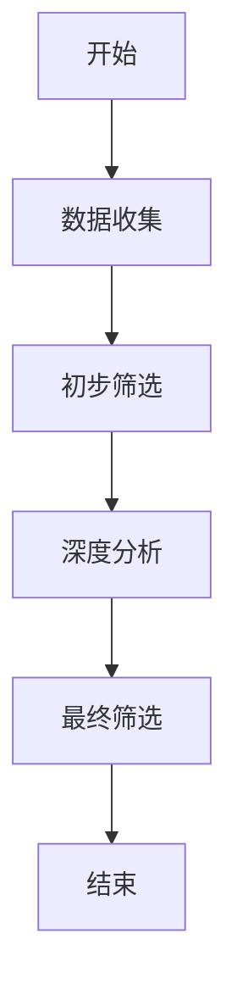

                 


# 彼得林奇的"小盘成长股"在不同市场环境下的筛选策略

> 关键词：小盘成长股、彼得林奇、投资策略、市场环境、筛选标准、算法模型

> 摘要：本文详细探讨了彼得林奇的“小盘成长股”投资策略在不同市场环境下的筛选方法。首先介绍了彼得林奇的投资理念和小盘成长股的定义，接着分析了小盘成长股的核心筛选标准，包括定量和定性分析。然后，结合数学模型和算法，详细阐述了在牛市、熊市和经济周期波动等不同市场环境下的策略调整方法。最后，通过项目实战和系统架构设计，展示了如何将小盘成长股策略应用于实际投资中，并提供了最佳实践建议。

---

## 第一部分: 小盘成长股的核心概念与筛选标准

### 第1章: 彼得林奇的“小盘成长股”策略概述

#### 1.1 彼得林奇的投资理念
彼得·林奇是全球著名投资家，以其独特的“小盘成长股”策略闻名。他主张寻找那些具有持续增长潜力的中小型企业，这些企业通常市值较小，但具备强大的竞争优势和成长空间。

#### 1.2 小盘成长股的定义
小盘成长股是指市值较小、但具有较高成长性的公司股票。这类股票通常具有较高的市盈率，但其营业收入和净利润增长率较高，且公司基本面良好。

#### 1.3 筛选小盘成长股的意义
在市场波动中，小盘成长股因其高增长潜力，往往能够在长期为投资者带来超额收益。尤其是在经济周期的上升阶段，小盘成长股的表现尤为突出。

---

### 第2章: 小盘成长股的筛选标准

#### 2.1 定量筛选标准
1. **市盈率（P/E）**：市盈率应处于合理区间，通常低于行业平均水平。
2. **营业收入增长率**：过去三年年均增长率应高于行业平均水平。
3. **净利润增长率**：过去三年净利润年均增长率应高于行业平均水平。
4. **ROE（净资产收益率）**：ROE应高于行业平均水平，且呈上升趋势。

#### 2.2 定性分析标准
1. **行业前景**：选择具有广阔市场空间和增长潜力的行业。
2. **管理团队**：公司管理层应具备较强的专业能力和良好的企业治理。
3. **竞争优势**：公司应具备独特的竞争优势，如技术壁垒、成本优势等。

#### 2.3 筛选流程
1. **数据收集**：收集目标行业内的所有符合条件的公司数据。
2. **初步筛选**：基于定量指标进行初步筛选，剔除不符合条件的公司。
3. **深度分析**：对通过初步筛选的公司进行定性分析，评估其行业前景和竞争优势。
4. **最终筛选**：综合定量和定性分析结果，确定最终的候选公司。

---

## 第二部分: 不同市场环境下的策略调整

### 第3章: 牛市环境下的小盘成长股策略

#### 3.1 牛市环境的特点
1. **市场情绪高涨**：投资者信心较强，资金流入股市较多。
2. **估值中枢上移**：整体市场估值水平较高，但优质成长股仍具备上涨空间。
3. **行业轮动加快**：资金倾向于追逐高增长行业。

#### 3.2 策略调整
1. **行业偏好**：优先选择高增长的成长型行业，如科技、消费等。
2. **估值容忍度**：适当提高对市盈率的要求，但避免选择估值过高的股票。
3. **仓位调整**：增加对小盘成长股的配置比例，同时保持适当的流动性。

### 第4章: 熊市环境下的小盘成长股策略

#### 4.1 熊市环境的特点
1. **市场情绪低迷**：投资者信心不足，资金倾向于撤离股市。
2. **估值中枢下移**：整体市场估值水平较低，但优质成长股可能被低估。
3. **行业风险加大**：部分行业可能面临较大的下行压力。

#### 4.2 策略调整
1. **行业选择**：优先选择具有防御性的行业，如医疗、公用事业等。
2. **估值优先**：降低对市盈率的要求，注重公司基本面的稳定性。
3. **仓位控制**：减少对小盘成长股的配置比例，转而配置防御性资产。

### 第5章: 经济周期波动下的小盘成长股策略

#### 5.1 经济周期对小盘成长股的影响
1. **经济繁荣期**：小盘成长股表现优异，因其高增长特性。
2. **经济衰退期**：小盘成长股可能面临较大的估值压力和流动性风险。
3. **经济复苏期**：小盘成长股可能因市场预期复苏而出现反弹。

#### 5.2 策略调整
1. **行业轮动**：根据经济周期变化，调整行业配置。
2. **估值与成长的平衡**：在不同周期阶段，动态调整对估值和成长性的关注权重。
3. **风险管理**：通过分散投资和动态调整仓位，降低整体投资风险。

---

## 第三部分: 小盘成长股筛选策略的数学模型与算法

### 第6章: 小盘成长股筛选的数学模型

#### 6.1 模型构建思路
小盘成长股筛选模型基于以下假设：
1. 公司的财务指标能够反映其成长性和盈利能力。
2. 行业前景和竞争优势是公司长期增长的重要驱动因素。

#### 6.2 模型输入与输出
- **输入**：公司财务数据（如收入、利润、ROE等）、行业前景评分。
- **输出**：公司成长潜力评分，以及是否符合小盘成长股筛选标准。

#### 6.3 模型公式
成长潜力评分公式：
$$
\text{成长潜力评分} = 0.5 \times (\text{营业收入增长率} - \text{行业均值}) + 0.5 \times (\text{净利润增长率} - \text{行业均值})
$$

---

### 第7章: 筛选算法的设计与实现

#### 7.1 算法流程图


#### 7.2 算法实现步骤
1. **数据收集**：收集目标行业内的所有公司数据。
2. **初步筛选**：基于定量指标（如市盈率、营业收入增长率等）进行初步筛选。
3. **深度分析**：对通过初步筛选的公司进行定性分析，评估其行业前景和竞争优势。
4. **最终筛选**：综合定量和定性分析结果，确定最终的候选公司。

#### 7.3 算法优化
1. **动态调整**：根据市场环境变化，动态调整筛选标准。
2. **数据更新**：定期更新公司数据，确保筛选结果的准确性。

---

## 第四部分: 系统架构与项目实战

### 第8章: 系统架构设计

#### 8.1 系统功能设计
1. **数据采集模块**：负责采集目标行业内的公司数据。
2. **筛选模块**：基于定量和定性指标，进行公司筛选。
3. **报告生成模块**：生成筛选结果报告，提供投资建议。

#### 8.2 系统架构图


#### 8.3 接口设计
1. **数据接口**：与数据源（如金融数据库）对接，获取公司数据。
2. **用户接口**：提供友好的用户界面，方便用户查看筛选结果。

---

### 第9章: 项目实战

#### 9.1 环境配置
1. **编程语言**：Python
2. **库的安装**：pandas、numpy、scikit-learn

#### 9.2 核心实现代码
```python
import pandas as pd
import numpy as np

def calculate_growth_score(revenue_growth, net_profit_growth):
    industry_mean_revenue = np.mean(revenue_growth)
    industry_mean_profit = np.mean(net_profit_growth)
    revenue_score = (revenue_growth - industry_mean_revenue).mean()
    profit_score = (net_profit_growth - industry_mean_profit).mean()
    return 0.5 * revenue_score + 0.5 * profit_score

# 示例数据
data = {
    '公司': ['公司A', '公司B', '公司C'],
    '营业收入增长率': [20, 15, 10],
    '净利润增长率': [15, 10, 5]
}
df = pd.DataFrame(data)
df['成长潜力评分'] = df.apply(lambda x: calculate_growth_score(x['营业收入增长率'], x['净利润增长率']), axis=1)

print(df)
```

#### 9.3 案例分析
以某行业为例，展示如何通过代码实现小盘成长股的筛选，并分析筛选结果。

---

## 第五部分: 最佳实践与总结

### 第10章: 小结与注意事项

#### 10.1 小结
本文详细介绍了彼得林奇的“小盘成长股”策略在不同市场环境下的筛选方法，并结合数学模型和系统架构设计，展示了如何将策略应用于实际投资中。

#### 10.2 注意事项
1. **数据质量**：确保数据来源可靠，避免因数据错误导致的误判。
2. **市场变化**：定期更新筛选模型，以适应市场环境的变化。
3. **风险管理**：合理控制仓位，避免过度集中投资。

### 第11章: 拓展阅读与深入思考

#### 11.1 拓展阅读
推荐相关书籍和文献，供读者深入学习。

#### 11.2 深入思考
鼓励读者结合实际情况，探索更多小盘成长股筛选策略的优化方法。

---

## 作者信息

作者：AI天才研究院/AI Genius Institute & 禅与计算机程序设计艺术 /Zen And The Art of Computer Programming

---

通过以上结构，我们可以系统地分析和实施彼得林奇的“小盘成长股”筛选策略，为投资者在不同市场环境下提供科学的指导。

