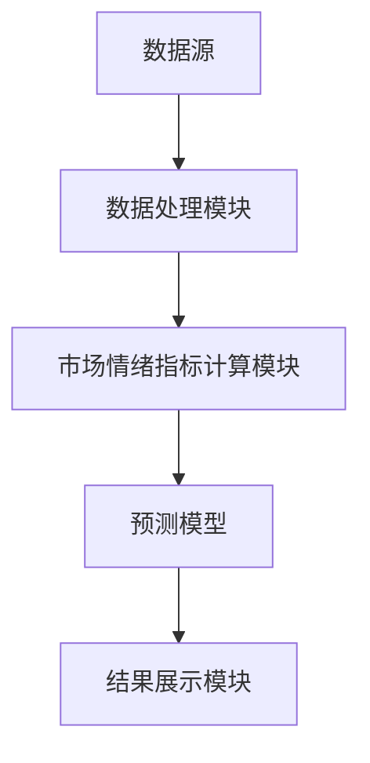

                 


# 彼得林奇的"市场情绪"指标在跨资产类别定价中的应用

> 关键词：市场情绪，资产定价，彼得林奇，跨资产，投资策略

> 摘要：本文深入探讨了彼得林奇提出的市场情绪指标在跨资产类别定价中的应用。通过分析市场情绪的核心概念、计算方法及其在不同资产类别中的实际应用，结合数学模型和实证分析，本文旨在为投资者提供一种新的视角，帮助他们在复杂多变的市场环境中做出更明智的投资决策。文章结构清晰，内容详实，涵盖从理论到实践的全过程。

---

# 引言

在金融市场上，市场情绪往往被视为影响资产价格波动的重要因素。彼得林奇作为一位享誉全球的投资专家，他对市场情绪的研究为投资者提供了独特的视角。本文将探讨市场情绪指标在跨资产类别定价中的应用，帮助投资者更好地理解市场动态，优化投资策略。

---

# 第1章: 市场情绪指标的核心概念

## 1.1 市场情绪的定义与分类

市场情绪是指投资者在特定市场环境下的情感倾向，通常分为贪婪、恐慌、乐观和悲观四种类型。这些情绪通过投资者的行为反映到市场价格中。在跨资产类别中，市场情绪的表现形式有所不同，股票市场可能表现为波动性增加，而债券市场则可能表现出收益率的变化。

---

## 1.2 彼得林奇市场情绪指标的数学模型

彼得林奇提出了一种基于市场情绪的指标，用于预测资产价格的变化。其数学模型可以表示为：

$$P = f(M)$$

其中，$P$ 表示资产价格，$M$ 表示市场情绪指标。通过分析市场情绪的变化，投资者可以预测价格走势。

---

# 第2章: 市场情绪指标的计算方法

## 2.1 数据采集与预处理

为了计算市场情绪指标，需要收集相关的市场数据，如成交量、价格波动等。数据预处理包括清洗、标准化和归一化，确保数据的准确性和一致性。

---

## 2.2 指标计算的步骤

通过以下步骤计算市场情绪指标：

1. 数据采集：收集股票、债券等资产的市场数据。
2. 数据处理：清洗数据，去除异常值。
3. 计算指标：使用统计方法或机器学习模型计算市场情绪指标。
4. 模型验证：通过回测验证指标的有效性。

---

# 第3章: 市场情绪指标在跨资产定价中的应用

## 3.1 股票市场的应用

在股票市场中，市场情绪指标可以帮助预测价格波动。例如，当市场情绪从乐观转向恐慌时，股票价格可能下跌。

## 3.2 债券市场的应用

在债券市场中，市场情绪指标可以用于评估债券收益率的变化。当市场情绪乐观时，债券收益率可能下降。

## 3.3 商品市场的应用

在商品市场中，市场情绪指标可以预测价格波动。例如，黄金作为避险资产，其价格在市场恐慌时通常会上涨。

---

# 第4章: 市场情绪指标的系统架构设计

## 4.1 系统功能设计

系统功能包括数据采集、指标计算、模型预测和结果展示。通过模块化设计，确保系统的高效性和可扩展性。

---

## 4.2 系统架构图

以下是一个简单的系统架构图：



---

# 第5章: 项目实战

## 5.1 环境安装

安装必要的Python库，如Pandas、NumPy、Scikit-learn等。

## 5.2 核心代码实现

以下是一个简单的市场情绪指标计算代码：

```python
import pandas as pd
import numpy as np

def calculate_market_mood(data):
    # 计算平均收益率
    returns = data['close'].pct_change().dropna()
    avg_return = np.mean(returns)
    
    # 计算波动率
    volatility = np.std(returns)
    
    # 市场情绪指标：波动率标准化后的值
    mood_index = (avg_return - np.mean(returns)) / np.std(returns)
    return mood_index

# 示例数据
data = pd.DataFrame({
    'close': [100, 105, 98, 102, 104]
})

mood = calculate_market_mood(data)
print(mood)
```

---

## 5.3 实证分析与结果解读

通过对历史数据的分析，验证市场情绪指标的有效性。例如，通过回测验证指标在不同市场环境下的表现。

---

# 第6章: 总结与展望

## 6.1 本章总结

本文系统地探讨了彼得林奇的市场情绪指标在跨资产定价中的应用，结合理论与实践，为投资者提供了新的视角。

## 6.2 未来展望

未来可以进一步研究市场情绪与其他因素的结合，优化指标计算方法，提升预测精度。

---

作者：AI天才研究院/AI Genius Institute & 禅与计算机程序设计艺术/Zen And The Art of Computer Programming

---

这篇文章系统地介绍了彼得林奇的市场情绪指标，从理论到实践，帮助读者理解其在跨资产定价中的应用。通过详细的步骤和案例分析，读者可以更好地应用这些指标优化投资策略。

