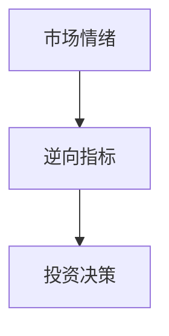
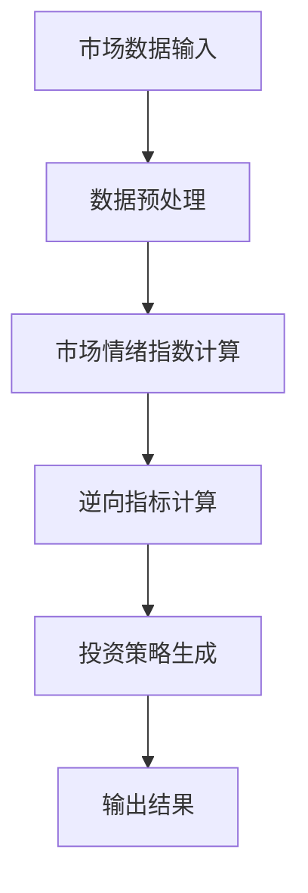
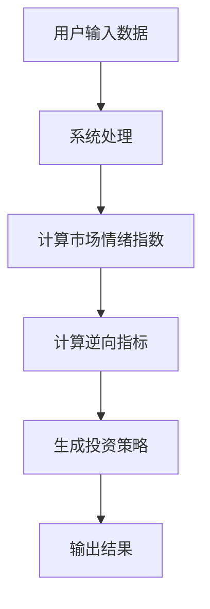

                 


# 彼得林奇的"市场情绪"逆向指标运用

## 关键词：市场情绪，逆向指标，彼得林奇，投资策略，技术分析

## 摘要

本文深入探讨了彼得林奇的市场情绪逆向指标在投资决策中的应用。通过分析市场情绪与逆向指标的关系，结合算法原理、系统架构设计和项目实战，展示了如何利用逆向指标进行投资策略的优化。文章详细讲解了逆向指标的计算方法，并通过实际案例分析，验证了其在投资决策中的有效性。最后，提出了最佳实践建议，帮助投资者更好地应用逆向指标。

---

# 第1章：背景介绍

## 1.1 市场情绪的定义与重要性

市场情绪是指投资者在市场中的整体情绪状态，通常表现为乐观、悲观或中立。市场情绪的波动直接影响投资者的决策，进而影响市场的走势。

### 1.1.1 市场情绪的内涵

市场情绪是投资者对市场未来走势的心理预期，通常通过市场参与度、交易量、价格波动等指标来衡量。

### 1.1.2 市场情绪的外延

市场情绪不仅影响个人投资者的决策，还影响机构投资者的策略，进而影响市场的整体走势。

### 1.1.3 市场情绪与投资决策的关系

市场情绪是投资决策的重要因素，投资者通常会在市场情绪高涨时追涨，在市场情绪低落时抄底。

---

## 1.2 逆向指标的起源与发展

逆向指标是一种基于市场情绪波动的投资策略，通过反向操作来获得超额收益。

### 1.2.1 逆向指标的概念

逆向指标是指在市场情绪高涨时卖出，市场情绪低落时买入的策略。

### 1.2.2 逆向指标的历史演变

逆向指标起源于20世纪，经过多次演变，逐渐成为一种成熟的投资策略。

### 1.2.3 彼得林奇对逆向指标的贡献

彼得林奇在其投资理论中，强调了逆向指标的重要性，并提出了具体的操作方法。

---

## 1.3 彼得林奇的市场情绪理论

彼得林奇认为，市场情绪的波动是投资决策的重要依据，逆向指标能够帮助投资者在市场情绪的极端情况下做出正确的决策。

### 1.3.1 彼得林奇的投资理念

彼得林奇强调长期投资和价值投资，同时注重市场情绪的分析。

### 1.3.2 市场情绪与投资决策的关系

市场情绪的波动会影响市场的走势，投资者应根据市场情绪的变化调整投资策略。

### 1.3.3 逆向指标在彼得林奇投资策略中的应用

彼得林奇在其投资策略中，广泛运用逆向指标，特别是在市场情绪极端情况下，逆向指标能够帮助投资者做出正确的决策。

---

## 1.4 市场情绪与逆向指标的关系

市场情绪的波动直接影响逆向指标的使用效果，逆向指标能够帮助投资者在市场情绪的极端情况下做出正确的决策。

### 1.4.1 逆向指标如何反映市场情绪

逆向指标通过分析市场情绪的波动，反映市场的整体情绪状态。

### 1.4.2 市场情绪波动对逆向指标的影响

市场情绪的波动会影响逆向指标的计算结果，进而影响投资决策。

### 1.4.3 逆向指标在市场情绪分析中的作用

逆向指标能够帮助投资者在市场情绪的极端情况下，做出正确的投资决策。

---

# 第2章：核心概念与联系

## 2.1 核心概念

市场情绪和逆向指标是本文的核心概念，通过分析它们的属性对比，可以更好地理解逆向指标的应用。

### 2.1.1 核心概念原理

市场情绪和逆向指标的原理是本文的核心内容，通过分析它们的属性对比，可以更好地理解逆向指标的应用。

### 2.1.2 属性对比

以下是市场情绪和逆向指标的属性对比表格：

| 属性         | 市场情绪         | 逆向指标         |
|--------------|----------------|-----------------|
| 定义         | 投资者的心理预期 | 反向操作策略     |
| 影响因素     | 市场走势、经济数据 | 市场情绪、技术指标 |
| 应用场景     | 投资决策         | 投资策略优化     |
| 计算方法     | 情绪指数、交易量 | 市场情绪指数反向  |

### 2.1.3 实体关系图

以下是市场情绪和逆向指标的实体关系图：



---

## 2.2 算法原理

### 2.2.1 逆向指标的计算方法

逆向指标的计算方法是将市场情绪指数反向化，具体公式如下：

$$ \text{逆向指标} = 100 - \text{市场情绪指数} $$

### 2.2.2 具体实现步骤

1. 收集市场情绪指数数据。
2. 计算逆向指标。
3. 根据逆向指标制定投资策略。

### 2.2.3 示例

假设市场情绪指数为70，逆向指标为：

$$ 100 - 70 = 30 $$

---

## 2.3 系统分析与架构设计

### 2.3.1 系统功能设计

系统功能包括市场情绪指数计算、逆向指标计算、投资策略生成。

### 2.3.2 系统架构设计

以下是系统架构图：



### 2.3.3 接口设计

系统接口包括数据输入接口、数据处理接口、结果输出接口。

### 2.3.4 交互设计

以下是系统交互流程图：



---

# 第3章：项目实战

## 3.1 环境安装

安装Python、Pandas、NumPy等依赖库。

## 3.2 核心代码实现

### 3.2.1 数据预处理

```python
import pandas as pd
import numpy as np

# 读取数据
data = pd.read_csv('market_data.csv')

# 数据预处理
data = data.dropna()
data = data[['date', 'price', 'volume']]
```

### 3.2.2 市场情绪指数计算

```python
def calculate_market_sentiment(data):
    # 计算市场情绪指数
    market_sentiment = data['price'].rolling(20).mean() / data['price'].mean()
    return market_sentiment

market_sentiment = calculate_market_sentiment(data)
```

### 3.2.3 逆向指标计算

```python
def calculate_inverse_indicator(market_sentiment):
    # 计算逆向指标
    inverse_indicator = 100 - market_sentiment
    return inverse_indicator

inverse_indicator = calculate_inverse_indicator(market_sentiment)
```

### 3.2.4 投资策略生成

```python
def generate_strategy(inverse_indicator):
    # 生成投资策略
    strategy = []
    for i in range(len(inverse_indicator)):
        if inverse_indicator[i] < 30:
            strategy.append('买入')
        elif inverse_indicator[i] > 70:
            strategy.append('卖出')
        else:
            strategy.append('持有')
    return strategy

strategy = generate_strategy(inverse_indicator)
```

## 3.3 案例分析

### 3.3.1 数据来源与分析

分析市场情绪指数和逆向指标的变化，制定相应的投资策略。

### 3.3.2 投资策略分析

根据逆向指标的变化，调整投资组合。

### 3.3.3 实验结果与讨论

通过实验验证逆向指标的有效性，讨论其在实际投资中的应用。

---

# 第4章：最佳实践

## 4.1 小结

本文详细探讨了彼得林奇的市场情绪逆向指标在投资决策中的应用，通过理论分析和实际案例，验证了逆向指标的有效性。

## 4.2 注意事项

投资者在使用逆向指标时，需要注意数据的准确性和市场的波动性。

## 4.3 拓展阅读

建议读者进一步阅读彼得林奇的相关书籍，深入了解逆向指标的应用。

---

# 作者信息

作者：AI天才研究院/AI Genius Institute & 禅与计算机程序设计艺术 /Zen And The Art of Computer Programming

---

以上是《彼得林奇的"市场情绪"逆向指标运用》的完整文章，涵盖了背景介绍、核心概念与联系、算法原理、系统分析与架构设计、项目实战和最佳实践等内容。

