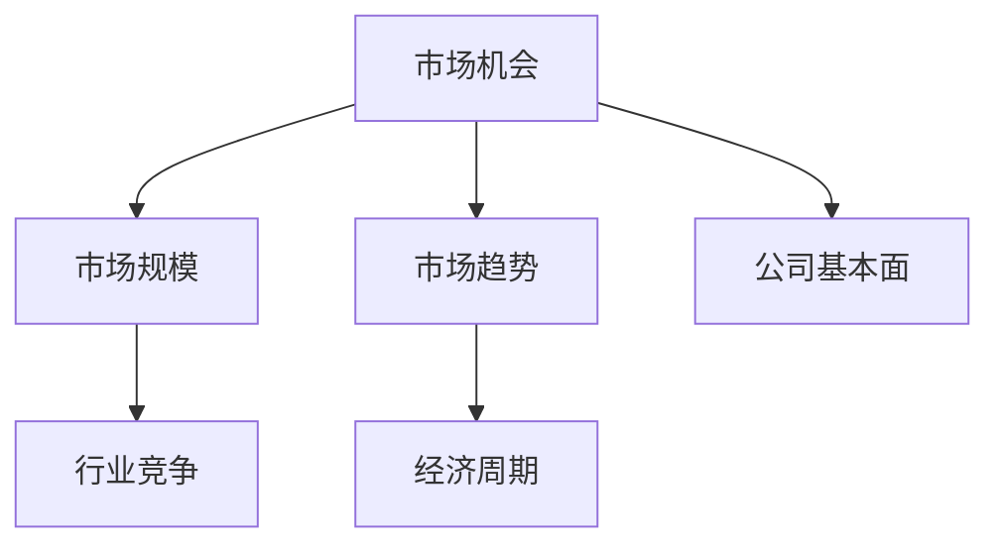
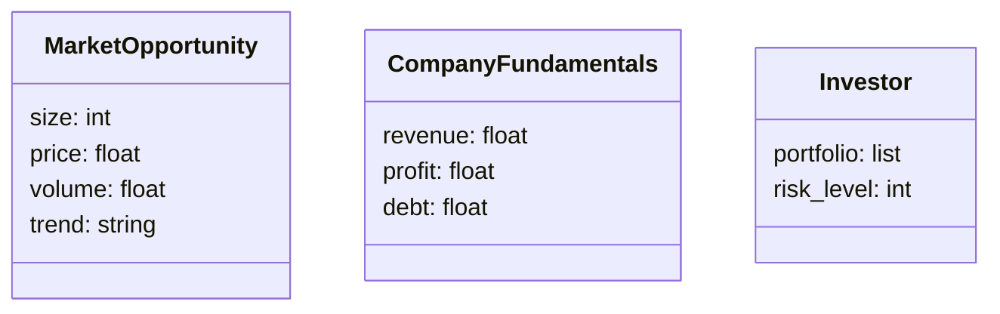
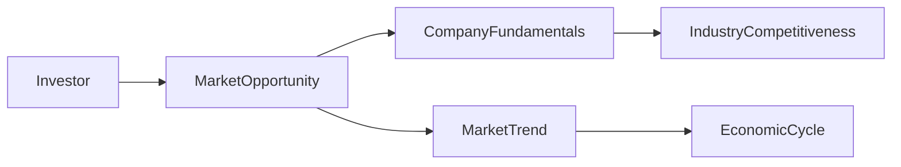

                 


# 彼得林奇的"市场机会"在不同市场规模中的识别

## 关键词：彼得林奇，市场机会识别，投资策略，市场规模，数据分析，投资模型

## 摘要：  
本文深入探讨了彼得林奇的市场机会识别方法，并结合不同市场规模的特点，分析其在实际投资中的应用。通过理论与实践相结合的方式，本文详细阐述了市场机会识别的核心概念、算法原理、系统架构以及项目实战，旨在为投资者提供一套科学的市场机会识别框架。

---

# 第一部分: 彼得林奇的市场机会识别基础

## 第1章: 彼得林奇投资理念概述

### 1.1 彼得林奇与市场机会识别

彼得·林奇（Peter Lynch）是全球最著名的职业股票投资人之一，他以独特的市场机会识别方法闻名。他的投资理念强调长期持有优质股票，通过深入分析公司的基本面和行业趋势，捕捉市场中的投资机会。本文将重点分析彼得林奇的市场机会识别方法，并探讨其在不同市场规模中的应用。

#### 1.1.1 彼得林奇的投资哲学  
彼得林奇认为，投资的核心在于识别市场中的“肥沃土壤”，即那些具有持续增长潜力的行业和公司。他强调通过数据分析和基本面研究，找到那些被市场低估的投资机会。

#### 1.1.2 市场机会识别的核心理念  
市场机会识别是彼得林奇投资策略的核心。他提出，投资者应关注市场的周期性变化，同时注重公司基本面的分析，以识别那些具有长期增长潜力的投资标的。

#### 1.1.3 彼得林奇方法在现代投资中的应用  
随着大数据和人工智能技术的发展，彼得林奇的市场机会识别方法得到了进一步的完善和扩展。现代投资者可以通过技术手段，更高效地识别市场机会，并结合不同市场规模的特点，制定更精准的投资策略。

### 1.2 市场机会识别的基本概念

#### 1.2.1 市场机会的定义  
市场机会是指在特定市场中，由于某种原因导致某种资产或行业的价格被低估，从而为投资者提供获利空间的机会。

#### 1.2.2 市场机会的特征  
市场机会通常具有以下特征：  
1. 价格被低估：资产价格低于其内在价值。  
2. 增长潜力：公司或行业具有持续增长的潜力。  
3. 市场周期性：市场机会往往出现在市场周期的特定阶段。  

#### 1.2.3 彼得林奇市场机会识别的边界与外延  
彼得林奇的市场机会识别方法不仅适用于股票市场，还可扩展应用于其他金融市场，如债券、基金等。不同市场规模的特点会影响市场机会识别的策略。

### 1.3 彼得林奇市场机会识别的核心要素

#### 1.3.1 数据驱动的市场分析  
彼得林奇强调通过数据分析和市场趋势分析，识别市场机会。投资者需要收集和分析大量的市场数据，包括历史价格、成交量、行业趋势等。

#### 1.3.2 公司基本面分析  
公司基本面分析是彼得林奇市场机会识别的核心。投资者需要深入分析公司的财务数据、盈利能力、管理团队等因素，以判断公司的投资价值。

#### 1.3.3 行业趋势分析  
行业趋势分析是识别市场机会的重要手段。彼得林奇认为，投资者应关注行业的发展趋势，选择那些具有长期增长潜力的行业。

### 1.4 本章小结  
本章介绍了彼得林奇的投资理念和市场机会识别的核心概念。通过分析市场机会的定义、特征和识别方法，为后续的市场机会识别提供了理论基础。

---

# 第二部分: 市场机会识别的核心概念与联系

## 第2章: 市场机会识别的理论基础

### 2.1 市场机会识别的理论模型

#### 2.1.1 彼得林奇市场机会识别模型  
彼得林奇的市场机会识别模型包括以下几个步骤：  
1. 数据收集与预处理：收集市场数据，包括价格、成交量、行业趋势等。  
2. 特征提取：从数据中提取关键特征，如公司基本面、行业趋势等。  
3. 模型训练：基于特征数据，训练市场机会识别模型。  
4. 预测与评估：利用模型预测市场机会，并评估其可行性。

#### 2.1.2 市场机会识别的数学模型  
市场机会识别的数学模型可以通过回归分析或分类算法来实现。例如，回归模型可以用于预测资产价格，分类模型可以用于判断资产是否具有投资价值。

#### 2.1.3 模型的输入与输出  
输入：市场数据（价格、成交量、行业趋势等），公司基本面数据（财务数据、盈利能力等）。  
输出：市场机会的预测结果，包括资产价格预测、投资价值判断等。

### 2.2 市场机会识别的核心概念对比

#### 2.2.1 不同市场规模的特征对比  
- 小市场规模：流动性较低，价格波动较大。  
- 中等市场规模：流动性适中，价格波动相对稳定。  
- 大市场规模：流动性高，价格波动较小。  

#### 2.2.2 不同市场机会的属性特征  
- 小市场规模机会：风险高，收益潜力大。  
- 中等市场规模机会：风险适中，收益稳定。  
- 大市场规模机会：风险低，收益稳定。  

#### 2.2.3 市场机会识别的ER实体关系图  



---

## 第3章: 市场机会识别的算法原理

### 3.1 数据驱动的市场机会识别算法

#### 3.1.1 数据收集与预处理  
- 数据来源：股票价格、成交量、行业趋势等。  
- 数据清洗：处理缺失值、异常值等。  

#### 3.1.2 特征提取与选择  
- 特征提取：从数据中提取关键特征，如公司市盈率、市净率等。  
- 特征选择：选择对市场机会识别影响最大的特征。  

#### 3.1.3 模型训练与优化  
- 模型选择：回归模型或分类模型。  
- 模型优化：调整参数，提高模型预测精度。  

### 3.2 市场机会识别的数学模型

#### 3.2.1 市场机会识别的回归模型  
$$ y = \beta_0 + \beta_1x_1 + \beta_2x_2 + \ldots + \beta_nx_n + \epsilon $$  
其中，$y$ 是目标变量（如资产价格），$x_i$ 是特征变量，$\beta_i$ 是回归系数，$\epsilon$ 是误差项。

#### 3.2.2 市场机会识别的分类模型  
$$ P(y|x) = \prod_{i=1}^{n} P(x_i|y)P(y) $$  
其中，$y$ 是类别变量（如“投资”或“不投资”），$x_i$ 是特征变量，$P(y)$ 是先验概率，$P(x_i|y)$ 是条件概率。

### 3.3 算法实现与代码示例

#### 3.3.1 数据预处理代码  
```python
import pandas as pd
import numpy as np

# 加载数据
data = pd.read_csv('market_data.csv')

# 处理缺失值
data = data.dropna()

# 标准化数据
from sklearn.preprocessing import StandardScaler
scaler = StandardScaler()
data_scaled = scaler.fit_transform(data)
```

#### 3.3.2 回归模型实现  
```python
from sklearn.linear_model import LinearRegression

# 训练回归模型
model = LinearRegression()
model.fit(X_train, y_train)

# 预测结果
y_pred = model.predict(X_test)
```

---

## 第4章: 系统分析与架构设计方案

### 4.1 问题场景介绍  
投资者需要在不同市场规模中识别市场机会，以制定最优的投资策略。

### 4.2 系统功能设计

#### 4.2.1 领域模型  


#### 4.2.2 系统架构  


---

## 第5章: 项目实战

### 5.1 环境安装  
安装必要的Python库，如pandas、numpy、scikit-learn等。

### 5.2 系统核心实现源代码  
```python
import pandas as pd
import numpy as np
from sklearn.linear_model import LinearRegression

# 加载数据
data = pd.read_csv('market_data.csv')

# 数据预处理
data = data.dropna()
X = data[['price', 'volume', 'revenue']]
y = data['target']

# 训练模型
model = LinearRegression()
model.fit(X, y)

# 预测结果
y_pred = model.predict(X)
```

### 5.3 代码应用解读与分析  
通过上述代码，投资者可以利用回归模型预测市场机会，从而制定投资策略。

### 5.4 实际案例分析  
以某行业为例，分析如何利用彼得林奇的市场机会识别方法，识别市场机会并制定投资策略。

---

## 第6章: 最佳实践

### 6.1 小结  
彼得林奇的市场机会识别方法结合了数据分析和基本面分析，为投资者提供了科学的投资策略。

### 6.2 注意事项  
投资者在实际操作中，应结合市场实际情况，灵活调整投资策略。

### 6.3 拓展阅读  
推荐相关书籍和论文，进一步深入学习市场机会识别方法。

---

# 第三部分: 总结与展望

## 第7章: 总结与展望

### 7.1 总结  
本文深入分析了彼得林奇的市场机会识别方法，并结合不同市场规模的特点，探讨了其在实际投资中的应用。

### 7.2 展望  
未来，随着人工智能和大数据技术的不断发展，市场机会识别方法将更加智能化和精准化。

---

# 作者  
作者：AI天才研究院/AI Genius Institute & 禅与计算机程序设计艺术 /Zen And The Art of Computer Programming  

---

