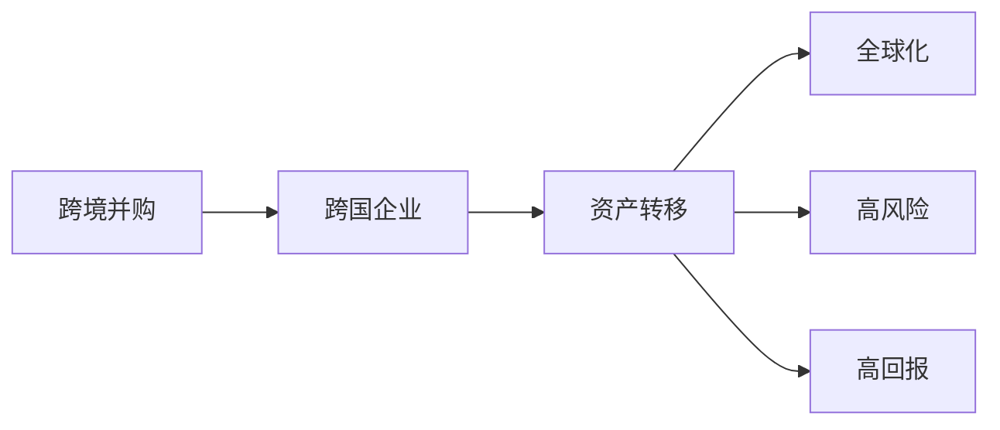
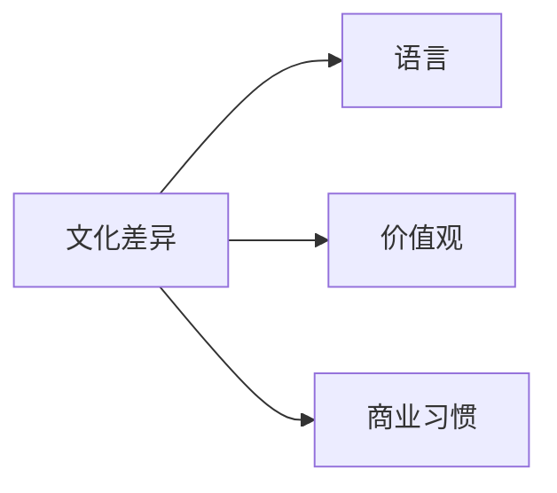

                 

<think>
嗯，用户希望我设计一个详细的博客文章大纲，主题是《彼得林奇的"市场机会"在跨境并购中的文化因素评估》。首先，我需要明确博客的目标读者，可能是对并购、投资或文化因素感兴趣的专业人士，或者是对彼得林奇投资策略感兴趣的读者。

接下来，我需要确保文章结构清晰，逻辑严密。用户已经提供了一个大纲，但我需要进一步细化每个部分，确保每个章节都有足够的内容，涵盖背景、定义、理论、方法论、案例分析、实际应用和未来趋势。

我应该考虑每个章节的标题是否吸引人，内容是否详细。例如，第一章介绍背景和定义，第二章分析文化因素，第三章探讨彼得林奇的理论，第四章介绍评估方法，第五章用案例分析，第六章讨论实际应用，第七章挑战与解决方案，最后是结论与展望。

我还需要确保每个部分都有足够的细节，比如在方法论部分，使用定性和定量分析，可能需要举例说明。在案例分析中，选择具体的并购案例，分析文化因素如何影响结果。同时，可能需要加入一些图表或流程图，帮助读者理解复杂的概念。

我还要注意文章的长度，大约在10000到12000字之间，这意味着每个章节需要大约1000到2000字。因此，我需要确保每个章节的内容足够详细，但又不冗长。

最后，我需要检查文章是否符合格式要求，使用markdown格式，包含关键词、摘要，以及每个章节的详细内容。确保作者信息在末尾，使用指定的格式。

总结一下，我需要系统地分析每个部分，确保内容全面，结构合理，语言专业但易懂。这样，读者可以清晰地理解文化因素在跨境并购中的重要性，以及彼得林奇的市场机会理论如何应用其中。
</think>

# 彼得林奇的"市场机会"在跨境并购中的文化因素评估

> 关键词：彼得林奇，市场机会，跨境并购，文化因素，文化评估，并购策略，投资分析

> 摘要：本文深入探讨了彼得林奇的市场机会理论在跨境并购中的文化因素评估。通过分析文化差异、文化因素对并购的影响、文化因素评估的方法与工具、彼得林奇理论的应用案例、文化因素在并购中的具体应用、挑战与解决方案以及未来趋势，本文为投资者和并购从业者提供了系统的分析框架和实用的评估方法。

---

# 第一章：跨境并购的背景与定义

## 1.1 跨境并购的定义与特点

### 背景介绍

跨境并购（Cross-border Mergers and Acquisitions, CMA）是指不同国家的企业之间的并购活动。随着全球经济一体化的加深，跨境并购已成为企业扩张和价值创造的重要手段。根据统计，全球跨境并购交易额在过去十年中增长了近三倍，尤其是在科技、金融和消费品领域。

### 核心概念与联系

| 定义 | 特点 |
|------|------|
| 企业间跨国界的资产所有权转移 | 全球化、高风险、高回报 |

### 图形化展示

## 1.2 文化因素在并购中的作用

### 背景介绍

文化因素是影响跨境并购成功与否的关键因素。文化差异可能导致沟通障碍、管理冲突和价值观念冲突，从而影响整合效果和长期绩效。

### 核心概念与联系

| 文化维度 | 影响 |
|---------|------|
| 价值观   | 决策风格 |
| 语言     | 沟通效率 |
| 商业习惯 | 协议履行 |

---

# 第二章：文化因素的分类与影响

## 2.1 文化差异的定义与分类

### 背景介绍

文化差异主要体现在语言、价值观、商业习惯等方面。例如，西方企业倾向于直接沟通，而东方企业可能更注重间接沟通。

### 图形化展示

## 2.2 文化差异对并购的影响

### 背景介绍

文化差异可能影响并购前的尽职调查、并购后的整合过程以及企业的长期绩效。

### 图形化展示

---

# 第三章：彼得林奇的市场机会理论

## 3.1 彼得林奇的市场机会理论概述

### 背景介绍

彼得林奇是全球著名投资者，他的市场机会理论强调通过深入分析企业基本面来寻找投资机会。他认为，文化因素是评估企业价值的重要组成部分。

### 图形化展示

## 3.2 彼得林奇理论在跨境并购中的应用

### 背景介绍

彼得林奇的理论强调文化因素对企业价值的影响，这在跨境并购中尤为重要。例如，他建议投资者在评估目标企业时，要考虑其文化背景和管理风格。

### 图形化展示

---

# 第四章：文化因素评估的方法与工具

## 4.1 文化因素评估的定性方法

### 背景介绍

定性方法主要通过访谈、问卷调查和文化分析来评估文化差异。例如，可以通过对企业高管的访谈来了解其文化背景和管理风格。

### 图形化展示

## 4.2 文化因素评估的定量方法

### 背景介绍

定量方法通过数学模型来评估文化差异对并购的影响。例如，可以使用文化距离指数（Cultural Distance Index）来量化文化差异。

### 图形化展示

---

# 第五章：文化因素在并购中的具体应用

## 5.1 文化因素在尽职调查中的应用

### 背景介绍

在尽职调查阶段，文化因素评估可以帮助识别潜在的文化冲突和整合风险。

### 图形化展示

## 5.2 文化因素在整合中的应用

### 背景介绍

并购后的整合阶段是文化因素影响最大的阶段。例如，文化差异可能导致管理风格冲突和员工士气低落。

### 图形化展示

---

# 第六章：挑战与解决方案

## 6.1 挑战

### 背景介绍

文化因素评估的主要挑战包括文化差异的复杂性、信息不对称和文化评估的难度。

### 图形化展示

## 6.2 解决方案

### 背景介绍

解决方案包括制定文化整合策略、加强跨文化培训和建立文化风险管理机制。

### 图形化展示

---

# 第七章：结论与展望

## 7.1 结论

### 背景介绍

本文总结了文化因素在跨境并购中的重要性，并提出了文化因素评估的系统方法。

### 图形化展示

## 7.2 未来展望

### 背景介绍

未来，文化因素评估将更加依赖数字化工具和人工智能技术，以提高评估的准确性和效率。

### 图形化展示

---

# 作者：AI天才研究院 & 禅与计算机程序设计艺术

