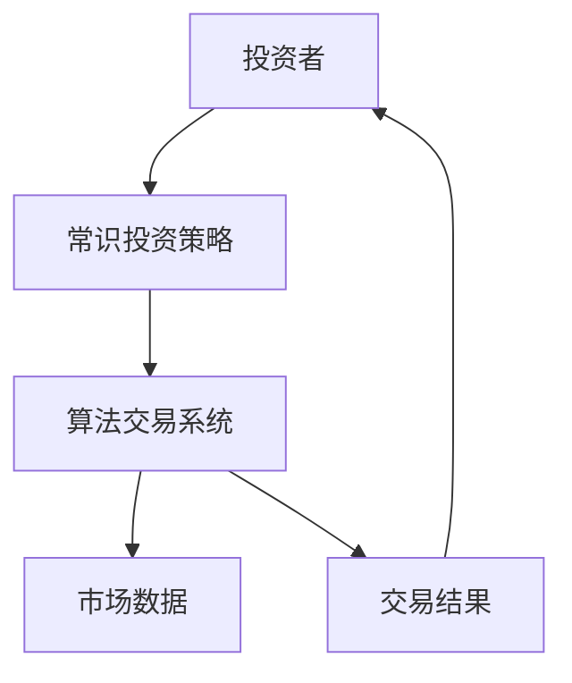
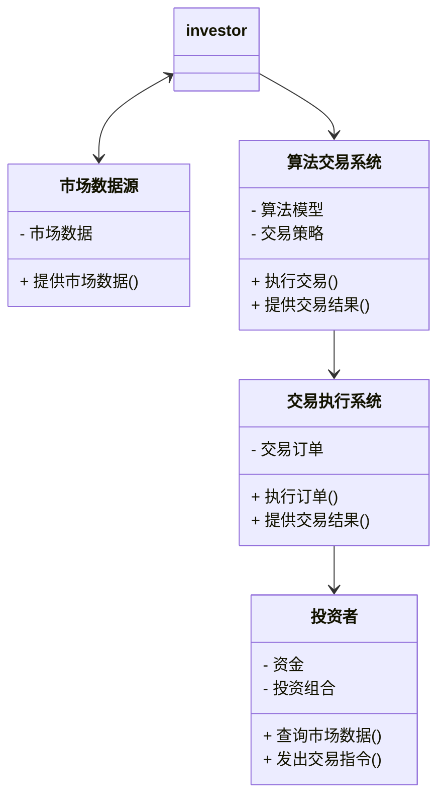
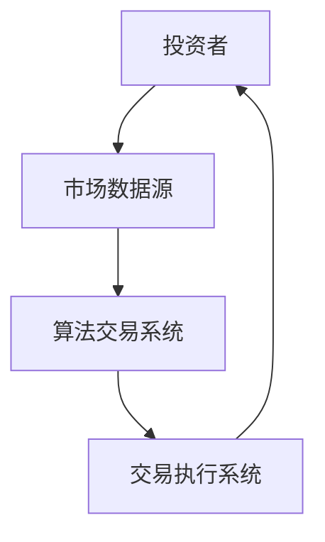
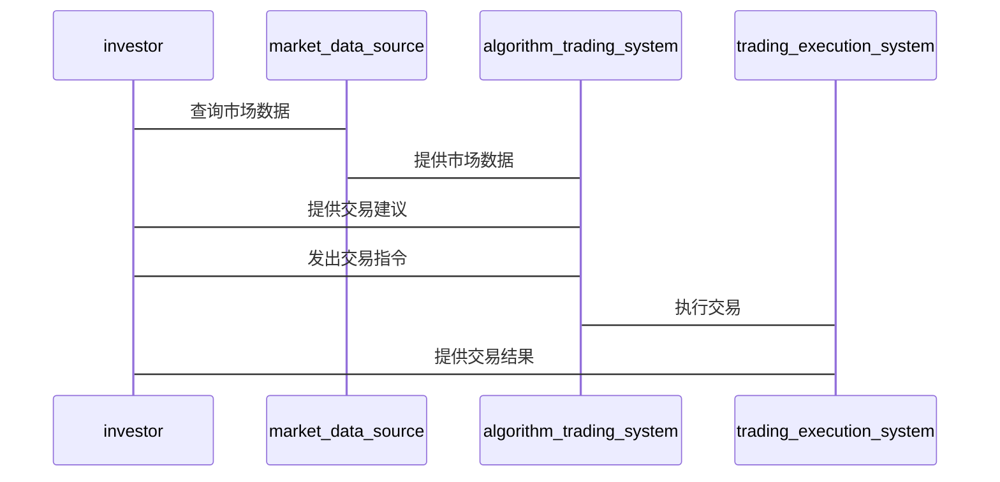

                 


# 彼得林奇的"常识投资"在算法交易盛行时代的重新定位

> 关键词：算法交易，常识投资，彼得·林奇，金融投资，系统架构

> 摘要：本文探讨了彼得·林奇的常识投资理念在算法交易盛行时代的应用与挑战。通过分析算法交易的基本原理和系统架构，结合实际案例，展示了如何将常识投资与算法交易相结合，实现更高效的金融投资策略。

---

## 第1章：彼得·林奇的常识投资理念

### 1.1 常识投资的定义与核心原则

#### 1.1.1 什么是常识投资
常识投资是一种长期投资策略，强调选择优质公司进行投资，并长期持有。这种方法注重基本面分析，避免频繁交易，以降低交易成本和市场波动的影响。

#### 1.1.2 常识投资的核心原则
- **价值投资**：寻找具有长期竞争优势和良好财务状况的公司。
- **长期持有**：避免短期波动，关注公司的长期增长。
- **分散投资**：通过投资多个行业和公司降低风险。

#### 1.1.3 常识投资的适用场景
适用于市场波动较小、公司基本面稳定的环境。在经济周期的低迷阶段，常识投资策略表现尤为突出。

### 1.2 彼得·林奇的投资风格

#### 1.2.1 彼得·林奇的投资哲学
林奇认为，投资的关键在于找到那些具有持续增长潜力的公司，并长期持有。他强调对公司管理层的信任和公司财务状况的深入分析。

#### 1.2.2 他的成功案例分析
例如，他成功投资于像可口可乐这样的公司，通过长期持有实现了显著的收益。

#### 1.2.3 彼得·林奇的长期投资策略
他倡导投资者关注公司的内在价值，而不是市场的短期波动。这种策略在市场低迷时表现尤为稳健。

---

## 第2章：算法交易的兴起与现状

### 2.1 算法交易的基本概念

#### 2.1.1 什么是算法交易
算法交易是利用数学模型和计算机程序，根据市场数据自动进行交易决策和执行的交易方式。它依赖高频交易和复杂算法，能够在极短时间内完成大量交易。

#### 2.1.2 算法交易的类型
- **高频交易**：利用算法在极短时间内进行大量交易，捕捉短期价格波动。
- **统计套利**：基于统计模型寻找市场中的套利机会。
- **算法驱动的市场中性策略**：通过算法寻找市场中性头寸，降低市场风险。

#### 2.1.3 算法交易的历史发展
从20世纪80年代开始，随着计算机技术的发展，算法交易逐渐成为金融市场的重要组成部分。如今，大部分交易量都由算法驱动。

### 2.2 算法交易在现代金融中的作用

#### 2.2.1 算法交易的优势
- **高效性**：能够在 microseconds 时间内完成交易决策和执行。
- **准确性**：通过算法减少人为情绪影响，提高决策的准确性。
- **降低成本**：自动化交易减少了人工干预，降低了交易成本。

#### 2.2.2 算法交易的潜在风险
- **市场波动加剧**：算法交易可能导致市场的过度波动。
- **系统性风险**：算法错误或故障可能导致市场崩盘。
- **监管难度**：算法交易的高速性和复杂性增加了监管的难度。

#### 2.2.3 算法交易对市场的整体影响
算法交易提高了市场的流动性和价格发现效率，但也可能导致市场的不稳定性。在某些情况下，算法交易可能加剧市场的波动，增加系统性风险。

---

## 第3章：常识投资与算法交易的核心原理

### 3.1 常识投资的原理分析

#### 3.1.1 长期投资的核心要素
- **公司基本面分析**：包括财务状况、管理层素质、行业地位等。
- **市场周期分析**：在市场低迷时买入，在市场高估时卖出。

#### 3.1.2 优质公司的识别标准
- **持续盈利能力**：公司应有稳定的盈利能力和增长潜力。
- **竞争优势**：公司在行业内应有独特的竞争优势。
- **财务健康状况**：公司应有健康的财务状况，低债务负担。

#### 3.1.3 市场波动与投资决策的关系
常识投资策略强调忽略短期波动，关注长期趋势。投资者应避免因短期市场波动而做出错误的投资决策。

### 3.2 算法交易的数学模型

#### 3.2.1 时间序列分析模型
时间序列分析用于预测未来的市场走势。常用的模型包括ARIMA和GARCH。

- **ARIMA模型**：自回归积分滑动平均模型，用于预测时间序列数据。
- **GARCH模型**：广义自回归条件异方差模型，用于预测金融资产的波动性。

#### 3.2.2 统计套利模型
统计套利模型通过寻找资产之间的统计关系，利用价格偏差进行套利。常用的统计套利策略包括配对交易和均值回归策略。

- **配对交易**：将两只相关资产配对，当它们的价格偏离历史均值时，进行反向交易。
- **均值回归策略**：假设资产价格会回归其历史均值，当价格偏离均值时进行交易。

#### 3.2.3 机器学习在算法交易中的应用
机器学习算法，如支持向量机和神经网络，被用于预测市场走势和识别交易机会。这些算法能够处理大量的非结构化数据，发现潜在的市场信号。

### 3.3 对比分析表格

| **对比维度** | **常识投资** | **算法交易** |
|--------------|--------------|--------------|
| 投资理念      | 长期持有优质资产 | 短期高频交易 |
| 决策依据      | 公司基本面分析 | 市场数据和算法模型 |
| 交易频率      | 低频          | 高频          |
| 风险管理      | 通过分散投资降低风险 | 通过算法模型控制风险 |
| 适用场景      | 市场稳定，长期增长 | 市场波动大，短期机会 |

### 3.4 实体关系图（ER图）



---

## 第4章：算法交易的数学模型与公式

### 4.1 时间序列分析模型

#### 4.1.1 ARIMA模型

ARIMA模型由自回归（AR）部分和移动平均（MA）部分组成，用于预测时间序列数据。

- **AR模型**：当前值与过去值相关联。
  $$ AR(p): X_t = \epsilon_t + \sum_{i=1}^{p} \phi_i X_{t-i} $$
  
- **MA模型**：当前值与过去误差相关联。
  $$ MA(q): X_t = \epsilon_t + \sum_{i=1}^{q} \theta_i \epsilon_{t-i} $$

- **ARIMA模型**：结合了AR和MA模型。
  $$ ARIMA(p, d, q): (1 - B)^d X_t = \phi(B) \theta(B) Z_t $$

#### 4.1.2 GARCH模型

GARCH模型用于预测金融资产的波动性。

- **GARCH模型**：
  $$ GARCH(n, m): \sigma_t^2 = \alpha_0 + \sum_{i=1}^{n} \alpha_i r_{t-i}^2 + \sum_{j=1}^{m} \beta_j \sigma_{t-j}^2 $$

- **ARCH模型**：
  $$ ARCH(n): \sigma_t^2 = \alpha_0 + \sum_{i=1}^{n} \alpha_i r_{t-i}^2 $$

### 4.2 统计套利模型

#### 4.2.1 配对交易策略

配对交易策略通过寻找两只相关资产的价格偏差，进行反向交易。

- **配对交易的信号生成**：
  当两只资产的价格偏离其历史平均差值时，进行交易。
  $$ \text{信号} = Z \times \text{差值} $$

- **交易策略**：
  - 当差值大于均值时，卖出较贵的资产，买入较便宜的资产。
  - 当差值小于均值时，买入较贵的资产，卖出较便宜的资产。

#### 4.2.2 均值回归策略

均值回归策略假设资产价格会回归其历史均值。

- **均值回归的信号生成**：
  $$ \text{信号} = Z \times (\text{当前价格} - \text{历史均值}) $$

- **交易策略**：
  - 当价格高于均值时，卖出资产。
  - 当价格低于均值时，买入资产。

### 4.3 机器学习在算法交易中的应用

#### 4.3.1 支持向量机（SVM）

支持向量机用于分类和回归问题，可以用于预测市场走势和识别交易机会。

- **SVM分类**：
  $$ y = \text{sign}(\sum_{i=1}^{n} \alpha_i y_i x_i \cdot x + b) $$

- **SVM回归**：
  $$ y = \sum_{i=1}^{n} \alpha_i y_i x_i \cdot x + b $$

#### 4.3.2 神经网络

神经网络可以用于模式识别和预测，可以处理大量的非结构化数据，发现潜在的市场信号。

- **神经网络结构**：
  $$ y = f(W_2 f(W_1 x + b_1) + b_2) $$

---

## 第5章：系统分析与架构设计

### 5.1 系统功能设计

#### 5.1.1 领域模型



### 5.2 系统架构设计



### 5.3 接口设计

- **投资者接口**：
  - 查询市场数据
  - 发出交易指令
  - 接收交易结果

- **市场数据源接口**：
  - 提供市场数据
  - 更新市场数据

- **算法交易系统接口**：
  - 执行交易
  - 提供交易结果

- **交易执行系统接口**：
  - 执行订单
  - 提供交易结果

### 5.4 交互流程图



---

## 第6章：项目实战

### 6.1 环境安装

为了实现结合常识投资和算法交易的系统，您需要以下环境：

- **编程语言**：Python
- **库**：Pandas, NumPy, Scikit-learn, PyTorch
- **交易平台**：Interactive Brokers, QuantTrader
- **开发工具**：Jupyter Notebook, VS Code

### 6.2 核心实现源代码

#### 6.2.1 时间序列分析模型

```python
import pandas as pd
from statsmodels.tsa.arima_model import ARIMA

# 加载数据
data = pd.read_csv('market_data.csv')

# 训练ARIMA模型
model = ARIMA(data['price'], order=(5,1,0))
model_fit = model.fit(disp=0)

# 预测未来价格
forecast = model_fit.forecast(steps=10)
print(forecast)
```

#### 6.2.2 统计套利策略

```python
import pandas as pd
import numpy as np

# 加载数据
data = pd.read_csv('market_data.csv')

# 计算配对交易信号
mean_diff = np.mean(data['stock1'] - data['stock2'])
std_diff = np.std(data['stock1'] - data['stock2'])
signal = (data['stock1'] - data['stock2'] - mean_diff) / std_diff

# 生成交易指令
positions = np.where(signal > 1, -1, np.where(signal < -1, 1, 0))
print(positions)
```

### 6.3 案例分析

假设我们有两只股票A和B，它们的历史价格差异如下：

| 日期   | 股票A价格 | 股票B价格 | 价格差异 |
|--------|-----------|-----------|----------|
| 2023-01| 100       | 90        | 10       |
| 2023-02| 105       | 92        | 13       |
| 2023-03| 110       | 95        | 15       |
| 2023-04| 115       | 98        | 17       |

假设历史平均差异为12，标准差为3。

当2023-04的价格差异为17，超过均值+1个标准差，触发配对交易信号，卖出股票A，买入股票B。

### 6.4 代码应用解读与分析

通过上述代码，我们可以实现对市场数据的分析和交易信号的生成。ARIMA模型用于预测价格走势，统计套利策略用于寻找套利机会。投资者可以根据这些信号做出投资决策，结合长期投资策略，优化投资组合。

### 6.5 项目小结

通过实际案例分析，我们展示了如何将算法交易与常识投资策略结合起来，实现更高效的金融投资。投资者可以根据市场环境和自身需求，灵活调整投资策略，降低风险，提高收益。

---

## 第7章：总结与展望

### 7.1 全文总结

本文探讨了彼得·林奇的常识投资理念在算法交易盛行时代的应用与挑战。通过分析算法交易的基本原理和系统架构，结合实际案例，展示了如何将常识投资与算法交易相结合，实现更高效的金融投资策略。

### 7.2 未来展望

随着人工智能和大数据技术的不断发展，算法交易将更加智能化和自动化。投资者需要不断学习和适应新的技术和市场环境，结合长期投资策略，优化投资组合。未来，结合常识投资和算法交易的系统将更加智能化，能够根据市场变化自动调整策略，实现更优的投资效果。

### 7.3 最佳实践 tips

- **学习先进技术**：投资者应不断学习新的技术和工具，如机器学习和大数据分析，以适应市场变化。
- **风险管理**：无论采用何种策略，风险管理都是投资成功的关键。
- **保持灵活性**：投资者应根据市场环境和自身需求，灵活调整投资策略。

---

## 作者：AI天才研究院/AI Genius Institute & 禅与计算机程序设计艺术 /Zen And The Art of Computer Programming

---

这篇文章详细探讨了彼得·林奇的常识投资理念在算法交易时代的应用，通过理论分析、数学模型、系统架构和实际案例，帮助读者理解如何在现代金融市场中重新定位和应用常识投资策略。希望对投资者和金融从业者有所帮助！

