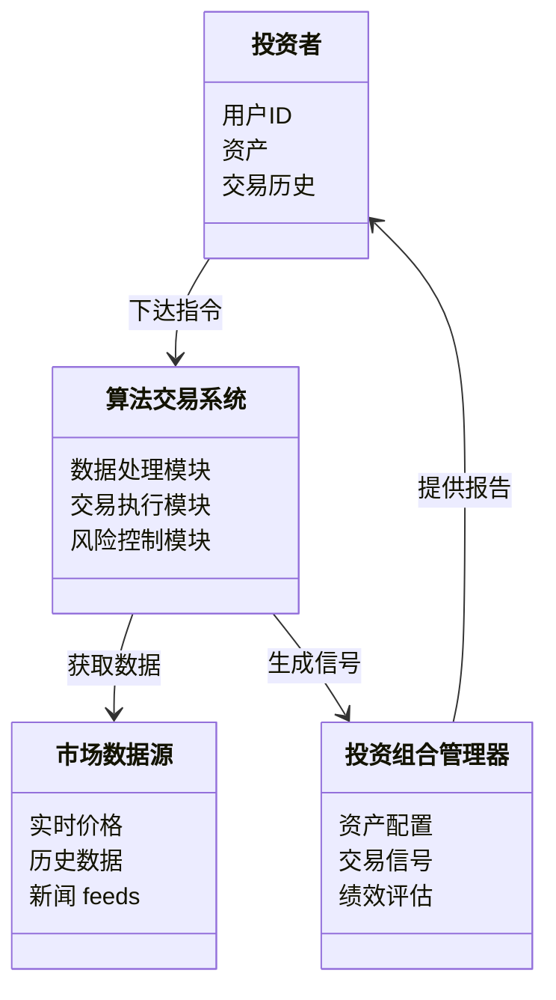
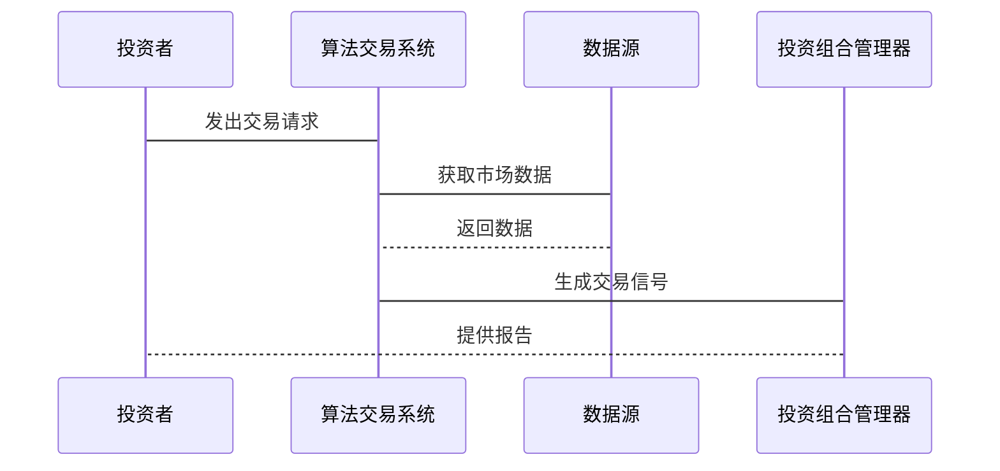

                 


# 彼得林奇的"常识投资"在算法交易盛行时代的重要性

> 关键词：算法交易，常识投资，彼得林奇，金融模型，风险管理

> 摘要：本文探讨了彼得·林奇的常识投资理念在当前算法交易盛行时代的相关性和重要性。通过分析算法交易的数学模型和系统架构，结合实际案例，展示了如何将常识投资的原则与现代技术相结合，以实现更高效、更稳健的金融投资。文章还详细介绍了系统的实现过程，并提出了最佳实践建议。

---

## 第一部分：常识投资与算法交易的背景

### 第1章：常识投资与算法交易的背景介绍

#### 1.1 常识投资的基本概念

常识投资是一种基于基本面分析和市场逻辑的投资策略，强调利用常识和经验判断来选择具有长期增长潜力的公司。其核心理念是寻找那些具有强大竞争优势、良好管理团队和合理估值的公司。

- **定义**：常识投资不依赖复杂的数学模型，而是通过研究公司财务报表、行业地位和市场趋势等基本面因素，做出投资决策。
- **哲学基础**：彼得·林奇认为，投资者应选择自己能够理解的公司，长期持有，避免频繁交易和短期波动的干扰。

#### 1.2 算法交易的发展历程

算法交易是指利用计算机程序和数学模型自动执行交易决策的过程。自20世纪80年代以来，算法交易经历了从简单到复杂的演变，尤其是在高频交易和机器学习技术的应用下，算法交易占据了金融市场的主导地位。

- **起源**：算法交易起源于20世纪80年代，最初用于解决订单执行问题。
- **现状**：目前，算法交易占据了全球金融市场交易量的大部分，高频交易、统计套利和机器学习模型成为主流。
- **未来趋势**：随着人工智能和大数据技术的进步，算法交易将更加智能化和个性化。

#### 1.3 常识投资与算法交易的融合

常识投资与算法交易的结合并非简单地将两者叠加，而是通过技术手段将常识投资的原则转化为可量化的指标和模型，从而提高决策的效率和准确性。

- **联系**：两者都追求稳定的投资回报，但实现方式不同。
- **区别**：常识投资依赖人类判断，而算法交易依赖计算机程序。
- **融合现状**：当前，许多投资者尝试将常识投资的理念融入算法交易模型中，以平衡长期价值与短期交易机会。

---

## 第二部分：算法交易的数学模型与原理

### 第2章：算法交易的核心算法

#### 2.1 简单的算法交易模型

- **均值回归模型**：假设价格会回归长期平均值，基于统计学原理进行交易。
- **动量模型**：基于价格趋势进行交易，买入上涨趋势中的资产，卖出下跌趋势中的资产。
- **趋势跟踪模型**：通过技术指标（如移动平均线）判断市场趋势，进行买卖决策。

#### 2.2 高频交易的数学模型

- **时间序列分析**：利用历史价格数据预测未来走势。
- **波动性模型**：基于波动率进行交易决策。
- **机器学习模型**：使用深度学习算法分析市场数据，识别复杂模式。

#### 2.3 常识投资的数学基础

- **基本面分析**：通过财务报表分析公司盈利能力、成长性和估值。
- **市场情绪分析**：通过新闻、社交媒体等数据估计市场情绪。
- **风险评估**：使用VaR（在险价值）模型评估投资组合风险。

---

### 第3章：系统分析与架构设计

#### 3.1 系统场景介绍

- **典型场景**：投资者利用算法交易系统执行基于常识投资策略的交易，系统实时分析市场数据并自动执行交易指令。

#### 3.2 领域模型设计

- **mermaid类图**：展示系统中的主要实体及其关系。



#### 3.3 系统架构设计

- **mermaid架构图**：展示系统的整体架构。


#### 3.4 系统接口设计

- **算法交易接口**：用于接收交易信号并执行交易。
- **常识投资接口**：用于提供基本面分析数据。
- **数据接口**：用于获取实时市场数据。

#### 3.5 系统交互设计

- **mermaid序列图**：展示系统交互流程。



---

## 第三部分：项目实战

### 第4章：项目实战

#### 4.1 环境安装与配置

- **Python环境**：安装Python 3.8+，并安装Pandas、NumPy、Matplotlib、Scikit-learn等库。
- **数据源**：使用Yahoo Finance获取实时数据。

#### 4.2 核心代码实现

```python
import pandas as pd
import numpy as np
from sklearn.linear_model import LinearRegression
import matplotlib.pyplot as plt

# 示例：基于线性回归的简单算法交易策略
def simple_algorithm(data, window=20):
    # 计算短期移动平均线
    short_ma = data['Close'].rolling(window=window).mean()
    # 计算长期移动平均线
    long_ma = data['Close'].rolling(window=50).mean()
    # 生成交易信号
    data['Signal'] = 0
    data['Signal'][short_ma > long_ma] = 1
    data['Signal'][short_ma < long_ma] = -1
    return data

# 示例：基于机器学习的复杂算法
model = LinearRegression()
model.fit(X_train, y_train)
predicted_prices = model.predict(X_test)
```

#### 4.3 案例分析

- **案例1**：使用均值回归模型预测股票价格。
- **案例2**：利用动量模型进行交易策略测试。

---

## 第四部分：最佳实践与总结

### 第5章：最佳实践与总结

#### 5.1 最佳实践

- **风险管理**：始终优先考虑风险管理，避免过度杠杆和集中投资。
- **模型更新**：定期更新和优化算法模型，以适应市场变化。
- **数据质量**：确保数据来源可靠，避免使用低质量数据。

#### 5.2 小结

本文详细探讨了彼得·林奇的常识投资理念与算法交易的结合，展示了如何通过技术手段将常识投资的原则转化为可执行的交易策略。通过实际案例和系统设计，证明了这种结合的有效性和可行性。

---

## 第五部分：注意事项与拓展阅读

### 第6章：注意事项

- **技术风险**：算法交易系统可能存在技术故障，导致交易失败或损失。
- **市场风险**：算法交易可能加剧市场波动，导致系统性风险。
- **合规风险**：需遵守相关法律法规，避免操纵市场。

### 第7章：拓展阅读

- **书籍推荐**：《彼得·林奇的投资哲学》、《算法交易：机缘巧合》。
- **在线资源**：量化交易平台（如QuantInstinct）、金融数据分析工具（如Pandas）。

---

## 作者：AI天才研究院 & 禅与计算机程序设计艺术

---

通过以上结构，文章详细探讨了彼得·林奇的常识投资理念与算法交易的结合，展示了如何通过技术手段将常识投资的原则转化为可执行的交易策略。通过实际案例和系统设计，证明了这种结合的有效性和可行性。

