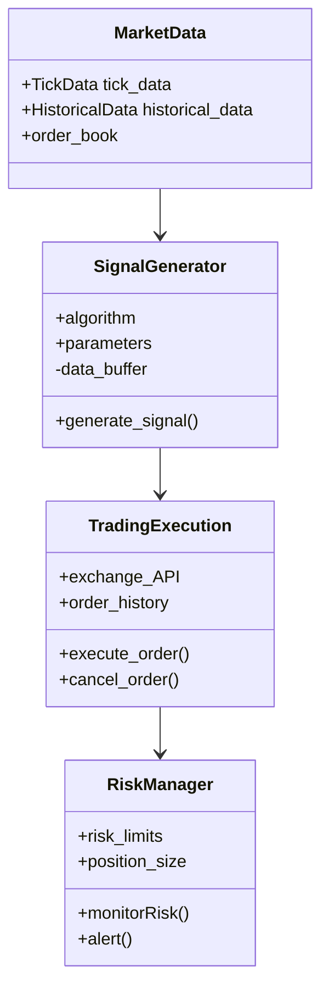
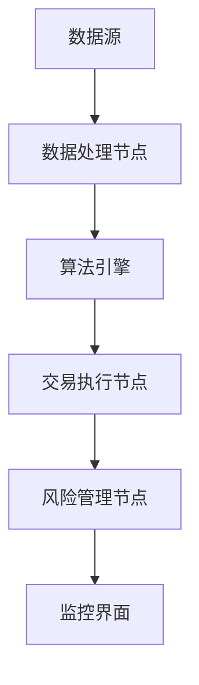
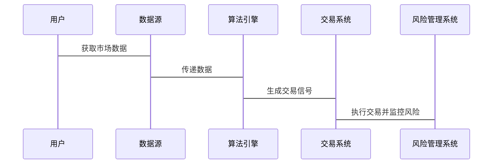

                 


# 彼得林奇的"常识投资"在高频交易时代的价值重估

> 关键词：高频交易，常识投资，算法交易，统计套利，机器学习，彼得林奇，投资策略

> 摘要：本文探讨了彼得·林奇的“常识投资”方法在高频交易时代的适应性。通过分析高频交易的核心原理、算法交易的实现方式以及系统架构设计，结合实际案例，评估了传统投资策略在现代金融市场中的价值。文章从背景介绍、算法原理、系统架构、项目实战到最佳实践，全面阐述了如何在高频交易时代重估和优化常识投资策略。

---

## 第一部分：高频交易与常识投资的背景

### 第1章：高频交易的背景与现状

#### 1.1 高频交易的定义与特点

高频交易（High-Frequency Trading, HFT）是指通过计算机算法在极短时间内进行大量金融资产交易的策略。其核心特点包括：

- **高速性**：交易速度极快，通常在 milliseconds 级别完成。
- **自动化**：依赖算法自动决策和执行交易。
- **数据驱动**：利用高频数据和大数据分析技术进行交易决策。
- **低延迟**：对交易系统的要求极高，需要极低的网络延迟和计算延迟。

高频交易的市场影响包括提高市场流动性、降低买卖价差，但也可能引发市场波动和系统性风险。

#### 1.2 彼得林奇的常识投资方法

彼得·林奇（Peter Lynch）是全球著名的职业基金经理人，他倡导的“常识投资”方法强调：

- **长期投资**：基于对公司基本面的深入研究，长期持有优质股票。
- **价值发现**：寻找那些被市场低估的公司，等待其价值回归。
- **分散投资**：通过投资多个行业和公司降低风险。

林奇的策略在传统市场中取得了显著成功，但面对高频交易时代的市场变化，其方法是否还能适应？

#### 1.3 高频交易与传统投资的对比

| 特性 | 高频交易 | 常识投资 |
|------|----------|----------|
| 时间框架 | 短期、高频 | 长期、低频 |
| 决策依据 | 算法、数据 | 基本面分析 |
| 交易频率 | 每秒多次 | 每月/季度调整 |
| 风险管理 | 算法控制 | 人工控制 |

高频交易依赖技术优势，而常识投资依赖基本面分析。两者的结合点在于如何利用高频数据辅助基本面分析。

#### 1.4 高频交易时代下的投资新趋势

- 数据驱动的投资决策：高频数据和大数据分析技术的应用，使得投资者能够捕捉更多市场信号。
- 技术在投资中的应用：算法交易、机器学习等技术逐渐成为主流。
- 市场结构的变化：高频交易推动了市场微观结构的变化，如订单簿分析的重要性增加。

---

### 第2章：高频交易中的算法分析

#### 2.1 算法交易的核心原理

算法交易是一种依赖数学模型和计算机程序自动执行交易的策略。其核心步骤包括：

1. 数据采集与处理：从高频数据源获取实时市场数据。
2. 信号生成：通过算法分析数据，生成买入或卖出信号。
3. 交易执行：根据信号自动下单，确保最优执行价格。
4. 风险控制：实时监控交易风险，调整策略参数。

#### 2.2 统计套利算法

统计套利是一种通过寻找资产价格偏离均值的机会进行交易的策略。常用算法包括：

- **均值回归模型**：假设资产价格会回归其历史均值。
- **配对交易**：选取相关资产对，利用价差波动进行交易。

**代码示例**：

```python
import numpy as np

def mean_reversion_strategy(prices, window=20):
    # 计算短期均值
    short_ma = prices.rolling(window=window).mean()
    # 计算长期均值
    long_ma = prices.rolling(window=window*2).mean()
    # 生成信号
    signal = np.where(short_ma > long_ma, -1, 1)
    return signal
```

#### 2.3 机器学习算法在高频交易中的应用

机器学习算法，如支持向量机（SVM）和随机森林（Random Forest），可以用于预测市场走势和生成交易信号。例如，使用LSTM神经网络进行时间序列预测：

**代码示例**：

```python
import tensorflow as tf
from tensorflow.keras.layers import LSTM, Dense

model = tf.keras.Sequential([
    LSTM(64, input_shape=(timesteps, features)),
    Dense(1, activation='sigmoid')
])
model.compile(optimizer='adam', loss='binary_crossentropy')
```

---

### 第3章：高频交易系统的架构设计

#### 3.1 系统构成与功能设计

高频交易系统通常包括以下几个模块：

1. **数据源模块**：实时获取市场数据。
2. **信号生成模块**：通过算法生成交易信号。
3. **交易执行模块**：根据信号执行交易。
4. **风险管理模块**：监控和管理交易风险。

**领域模型类图**：



#### 3.2 系统架构设计

高频交易系统的架构通常采用分布式架构，包括数据源、计算引擎和执行引擎。

**系统架构图**：



#### 3.3 系统接口设计

- **数据接口**：与交易所API对接，获取实时数据。
- **交易接口**：与交易系统对接，执行交易指令。
- **风险管理接口**：与风险管理系统对接，监控交易风险。

#### 3.4 系统交互流程

**交互流程图**：



---

## 第四部分：项目实战

### 第4章：高频交易系统的实现

#### 4.1 环境安装

- **安装Python**：确保安装Python 3.8及以上版本。
- **安装依赖库**：`numpy`, `pandas`, `tensorflow`, `quandl`, `ccxt`。

#### 4.2 系统核心实现

**信号生成模块代码**：

```python
import pandas as pd
import numpy as np

def generate_signal(data, window=20):
    # 计算短期和长期移动平均线
    short_ma = data['close'].rolling(window).mean()
    long_ma = data['close'].rolling(window*2).mean()
    # 生成信号：短期均线上穿长期均线为买入信号
    signal = np.where(short_ma > long_ma, 1, -1)
    return signal
```

**交易执行模块代码**：

```python
import ccxt

def execute_trade(pair, signal):
    # 初始化交易对
    exchange = ccxt.binance()
    # 获取当前价格
    current_price = exchange.fetch_ticker(pair)['last']
    # 执行交易
    if signal == 1:
        exchange.create_order(pair, 'buy', 0.01, current_price)
    elif signal == -1:
        exchange.create_order(pair, 'sell', 0.01, current_price)
```

#### 4.3 案例分析与解读

通过实际交易数据，分析算法的盈利能力和稳定性。例如，使用均值回归策略在某段时间内的表现。

---

## 第五部分：最佳实践与总结

### 第5章：高频交易中的注意事项

- **风险管理**：高频交易的风险极高，需严格控制头寸和杠杆。
- **算法优化**：定期优化算法模型，适应市场变化。
- **技术保障**：确保交易系统的低延迟和高可用性。

### 第5.1 章：未来投资策略的发展方向

- **人工智能的深化应用**：利用更复杂的AI模型进行预测。
- **多策略结合**：将高频交易与基本面分析结合。
- **监管与合规**：应对日益严格的高频交易监管。

### 第5.2 章：总结

高频交易时代下，彼得林奇的“常识投资”仍具有重要价值。通过结合现代技术手段，传统投资策略可以在高频交易中找到新的应用场景。然而，投资者需警惕技术风险和市场波动，合理配置投资策略。

---

## 附录

### 附录A：高频交易常用工具与平台

- 数据源：Quandl、Yahoo Finance、Bloomberg。
- 开发框架：ccxt、TradingView、Backtrader。
- 云服务：AWS、Google Cloud、Azure。

### 附录B：相关书籍与资源

- 《The New Algorithmic Trading》
- 《Machine Learning for Algorithmic Trading》

---

## 作者

作者：AI天才研究院/AI Genius Institute & 禅与计算机程序设计艺术 /Zen And The Art of Computer Programming

