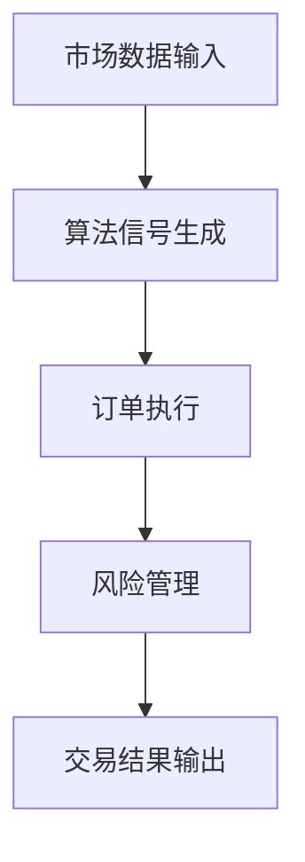
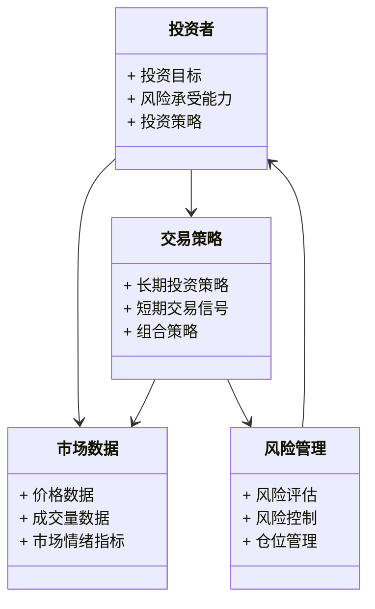
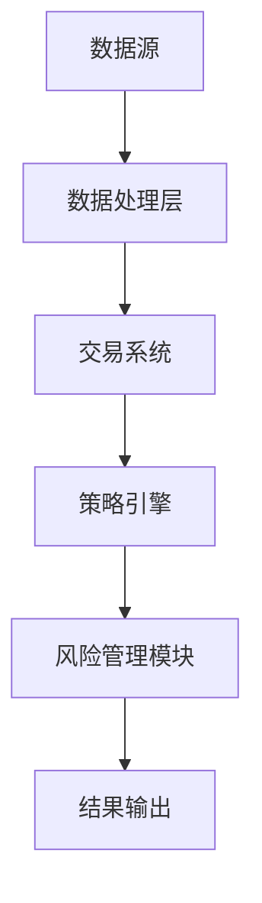

                 

<think>
好的，我需要撰写一篇关于《彼得林奇的"慢牛"投资在高频交易环境中的心态管理》的技术博客文章。首先，我需要理解彼得林奇的“慢牛”投资策略和高频交易的环境特点。

彼得林奇以其长期价值投资著称，注重基本面分析和长期持有优质股票。而高频交易则是利用算法和高速计算机在极短时间内进行大量交易，强调短期市场波动和快速决策。

这两者的结合点在于心态管理。在高频交易的快节奏和高压力环境中，保持彼得林奇的长期投资心态显得尤为重要。这涉及到如何在快速变化的市场中保持冷静，避免情绪化决策，同时坚持长期投资的纪律。

接下来，我需要分析高频交易环境下的投资者心态问题，探讨如何将“慢牛”投资理念应用到高频交易中。这可能包括制定明确的投资目标、建立风险管理机制、保持耐心和纪律等。

然后，我会研究高频交易中常见的心理陷阱，如贪婪和恐惧，以及如何通过心态管理来克服这些障碍。此外，我还需要探讨技术工具和策略在心态管理中的作用，比如使用算法来辅助决策，减少人为情绪的干扰。

最后，我将总结高频交易环境中心态管理的关键要点，并给出实际操作的建议，帮助投资者在快节奏的交易中保持长期投资的稳定性。

在整个思考过程中，我需要确保逻辑清晰，步骤分明，并且结合实际案例和数学模型来支持论点。这将有助于读者更好地理解和应用这些策略。
</think>

# 彼得林奇的"慢牛"投资在高频交易环境中的心态管理

> 关键词：彼得林奇，慢牛投资，高频交易，心态管理，投资策略

> 摘要：本文探讨了彼得林奇的“慢牛”投资理念在高频交易环境中的应用，重点分析了在这种高压力、快节奏的交易环境中，投资者如何管理心态，保持长期投资的纪律性，避免情绪化决策，并结合实际案例和数学模型，提出了有效的心理调适策略和具体的操作建议。

---

## 第一部分: 背景介绍

### 第1章: 彼得林奇"慢牛"投资概述

#### 1.1 "慢牛"投资的核心概念
- **投资的长期视角**：彼得林奇强调长期价值投资，关注企业的基本面，寻找具有持续增长潜力的公司，避免短期市场波动的干扰。
- **"慢牛"投资的定义与特点**：慢牛投资是指在较长的时间内，以稳定的速度积累投资收益，注重 compound effect（复利效应），而非追求短期暴利。
- **"慢牛"投资与传统投资的区别**：传统投资可能更注重短期收益和市场趋势，而慢牛投资则强调长期持有、价值发现和耐心等待。

#### 1.2 高频交易环境的定义与特点
- **高频交易的基本概念**：高频交易是指通过计算机算法在极短时间内进行大量的买卖交易，利用微小的价格波动赚取利润。
- **高频交易的技术实现**：依赖高速网络、低延迟硬件和复杂算法，通常涉及算法交易、高频交易策略和自动化交易系统。
- **高频交易的市场影响**：高频交易可以提高市场的流动性和价格发现效率，但也可能加剧市场的波动性，导致“闪崩”等现象。

### 第2章: "慢牛"投资与高频交易的结合
- **两者结合的背景与意义**：在现代金融市场中，高频交易已经成为主流交易方式之一，但其高风险和快节奏的特点使得许多投资者难以长期坚持自己的投资策略。彼得林奇的“慢牛”投资理念提供了一种长期稳定的视角，可以帮助投资者在高频交易环境中保持冷静和纪律。
- **高频交易环境下的投资心态管理**：在高频交易中，市场的短期波动可能非常剧烈，投资者容易受到情绪的影响，做出非理性的决策。因此，心态管理尤为重要。
- **"慢牛"投资在高频交易中的应用价值**：通过慢牛投资的理念，投资者可以在高频交易中找到一种平衡，既不过度追求短期收益，也不盲目跟随市场的短期波动，而是坚持长期价值投资的策略。

---

## 第二部分: 核心概念与联系

### 第3章: 核心概念原理

#### 3.1 "慢牛"投资的原理
- **长期价值投资的核心要素**：彼得林奇强调选择优质企业，关注公司的财务状况、行业地位和管理团队，而不是市场的短期波动。
- **市场波动与投资策略的关系**：市场波动是投资机会的表现，但投资者应避免被短期波动所迷惑，坚持长期投资的纪律。
- **投资者心态对策略执行的影响**：心态管理是慢牛投资成功的关键，投资者需要保持耐心、纪律和冷静，避免贪婪和恐惧的情绪干扰。

#### 3.2 高频交易的原理
- **算法交易的数学模型**：高频交易依赖于复杂的数学模型和算法，例如统计套利、算法交易策略等。这些模型通常基于市场的微观结构分析，寻找短期价格波动的机会。
- **高频交易的技术实现**：高频交易需要高速网络、低延迟硬件和高效的交易系统。交易者通常使用定制化的交易平台和算法来执行交易。
- **高频交易与市场流动性的关系**：高频交易可以提高市场的流动性，但也可能导致市场的不稳定性，尤其是在市场出现剧烈波动时。

### 第4章: 核心概念对比与联系

#### 4.1 "慢牛"投资与高频交易的对比分析
- **战略目标对比**：慢牛投资的目标是长期稳定收益，而高频交易的目标是通过短期波动获取利润。
- **时间框架对比**：慢牛投资的时间框架是长期的，通常以年为单位；而高频交易的时间框架是短期的，通常以分钟或秒为单位。
- **风险管理对比**：慢牛投资注重长期风险管理，关注投资组合的稳定性；而高频交易注重短期风险管理，关注交易策略的波动性和收益能力。

#### 4.2 核心概念的ER实体关系图
```mermaid
erDiagram
慢牛投资 --|{投资策略} 高频交易环境
高频交易环境 --|{市场数据} 慢牛投资
```

---

## 第三部分: 算法原理讲解

### 第5章: 算法原理分析
- **高频交易中的算法交易流程**：高频交易通常使用算法来自动执行交易决策，流程包括数据采集、信号生成、订单执行和风险管理等步骤。
- **数学模型与算法**：高频交易中的算法通常基于统计套利、高频信号分析和机器学习等技术。例如，可以使用时间序列分析模型来预测价格波动，或者使用机器学习算法来识别市场模式。

#### 5.1 算法交易流程


#### 5.2 数学模型与公式
- **统计套利模型**：统计套利模型通常基于均值回归假设，寻找价格偏离长期均值的资产，并在价格回归均值时进行交易。例如，使用均值回归模型来预测价格变化：
  $$ P_{t+1} = \alpha P_t + \beta \epsilon_t $$
  其中，$\alpha$ 是回归系数，$\epsilon_t$ 是随机误差项。

- **机器学习模型**：机器学习模型可以用于高频交易中的模式识别和预测。例如，使用LSTM（长短期记忆网络）模型来预测未来的价格变化：
  $$ y_t = \sigma(W_{hh} h_{t-1} + W_{xh} x_t + b_h) $$
  其中，$h_t$ 是隐藏层状态，$x_t$ 是输入数据，$W_{hh}$ 和 $W_{xh}$ 是权重矩阵，$b_h$ 是偏置项，$\sigma$ 是激活函数。

---

## 第四部分: 系统分析与架构设计方案

### 第6章: 系统分析
- **问题场景介绍**：在高频交易环境中，投资者需要处理大量的市场数据和快速变化的市场状况，这对交易系统的性能和稳定性提出了很高的要求。
- **系统功能设计**：慢牛投资与高频交易的结合需要一个综合的交易系统，能够同时处理长期投资策略和短期交易信号。
- **领域模型设计**：使用Mermaid类图描述系统的领域模型，包括投资者、市场数据、交易策略和风险管理模块。

#### 6.1 领域模型设计


### 第7章: 系统架构设计
- **系统架构设计**：慢牛投资与高频交易结合的系统架构需要考虑高性能计算、低延迟通信和复杂的算法实现。使用Mermaid架构图描述系统的整体架构，包括数据源、交易系统、策略引擎和风险管理模块。

#### 7.1 系统架构图


---

## 第五部分: 项目实战

### 第8章: 项目实战
- **环境安装**：安装高频交易所需的工具和库，例如Python的量化交易库（如pandas、numpy、backtrader等）。
- **核心代码实现**：编写慢牛投资与高频交易结合的策略代码，例如结合长期投资策略和短期交易信号的组合策略。
- **代码应用解读与分析**：分析代码的实现细节，解释策略的逻辑和实现方法。
- **实际案例分析和详细讲解剖析**：通过具体案例分析策略的实现效果和优化方向。
- **项目小结**：总结项目的实现过程和心得体会，提出改进建议。

#### 8.1 核心代码实现
```python
import pandas as pd
import numpy as np

def slow_bull_strategy(prices, slow_period=20, fast_period=5):
    # 计算慢均线和快均线
    slow_ma = prices.rolling(slow_period).mean()
    fast_ma = prices.rolling(fast_period).mean()
    
    # 生成交易信号
    signals = pd.Series(index=prices.index)
    signals[slow_ma > fast_ma] = 1
    signals[slow_ma < fast_ma] = -1
    signals[signals.isna()] = 0
    
    return signals

# 示例数据
data = pd.read_csv('market_data.csv')
prices = data['close']

# 生成信号
signals = slow_bull_strategy(prices)

# 执行交易
positions = pd.Series(index=prices.index, dtype='int64')
positions[0] = 0
for i in range(1, len(prices)):
    if signals.iloc[i] == 1:
        positions[i] = 1
    elif signals.iloc[i] == -1:
        positions[i] = 0
    else:
        positions[i] = positions[i-1]

# 计算收益
returns = (prices.shift(-1) - prices) * positions.shift(1)
cumulative_returns = (1 + returns).cumprod()
```

---

## 第六部分: 最佳实践

### 第9章: 最佳实践
- **心态管理的 tips**：在高频交易中，投资者需要保持冷静，避免情绪化决策。可以通过制定明确的投资计划、定期回顾和调整策略、培养耐心和纪律性等方法来管理心态。
- **注意事项**：在实际操作中，需要注意市场风险、交易成本和系统性能等问题。特别是在高频交易中，需要确保交易系统的稳定性和高效性。
- **拓展阅读**：推荐相关书籍和资料，帮助读者进一步了解彼得林奇的投资理念和高频交易的实现技术。

---

## 附录

### 附录A: 工具安装与配置
- **Python环境的安装与配置**：介绍如何安装Python和常用的量化交易库。
- **高频交易平台的推荐**：推荐一些常用的高频交易平台和工具。

### 附录B: 术语表
- 解释文中涉及的专业术语，如“慢牛投资”、“高频交易”、“算法交易”等。

---

## 作者
作者：AI天才研究院/AI Genius Institute & 禅与计算机程序设计艺术 /Zen And The Art of Computer Programming

---

### 总结
本文从彼得林奇的“慢牛”投资理念出发，探讨了其在高频交易环境中的应用，重点分析了心态管理的重要性，并结合数学模型和实际案例，提出了有效的策略和建议。希望本文能够帮助投资者在高频交易的复杂环境中保持冷静和纪律，实现长期稳定的收益。

