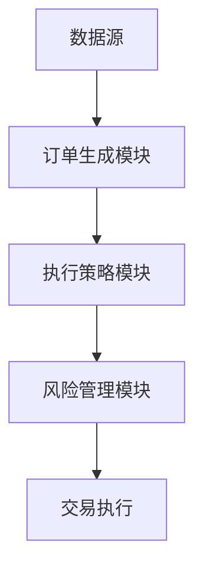

                 


# 彼得林奇的"慢牛"投资在高频交易环境中的执行策略

## 关键词：高频交易，彼得林奇，慢牛投资，执行策略，算法优化

## 摘要：本文探讨了彼得林奇的“慢牛”投资策略在高频交易环境中的应用。通过分析高频交易的特点和“慢牛”投资理念的结合，提出了一种优化的执行策略，包括订单生成、执行算法和风险管理等方面，并通过具体案例展示了策略的实现过程和效果。

---

## 第一部分: 背景介绍与核心概念

### 第1章: 高频交易与"慢牛"投资概述

#### 1.1 高频交易的定义与特点
高频交易是一种依赖高速计算机和复杂算法的交易方式，通过快速捕捉市场中的微小价格差异来获利。其主要特点包括：
- **高速性**：利用算法自动执行交易，速度极快。
- **自动化**：从订单生成到执行完全自动化。
- **高频性**：在短时间内进行大量交易。

#### 1.2 彼得林奇的"慢牛"投资策略
彼得林奇是著名的投资经理，他提倡的“慢牛”投资策略强调长期、稳健的投资，避免短期波动，寻找具有持续增长潜力的公司进行投资。

---

### 第2章: 高频交易环境中的执行策略

#### 2.1 高频交易中的执行策略
执行策略是高频交易的核心，主要目标是将大额订单分解成多个小订单，以最小化市场冲击和交易成本。常见的执行策略包括TWAP（时间加权平均价格）和VWAP（体积加权平均价格）。

#### 2.2 "慢牛"投资在高频交易中的应用
将“慢牛”投资理念应用于高频交易，需要平衡长期稳健与短期高频操作。通过优化订单生成和执行算法，可以在高频交易中实现类似“慢牛”的效果。

---

## 第二部分: 核心概念与算法原理

### 第3章: 高频交易中的订单生成与执行

#### 3.1 订单生成的原理
订单生成是高频交易的关键步骤，需要根据市场数据和策略模型生成订单。彼得林奇的“慢牛”策略要求订单生成基于长期价值判断，但在高频交易中需要快速生成大量订单。

#### 3.2 执行算法的实现
以下是TWAP和VWAP算法的实现：

```python
import pandas as pd
import numpy as np

# TWAP算法实现
def calculate_twap(volume_data, period):
    twap = volume_data.rolling(period).mean()
    return twap

# VWAP算法实现
def calculate_vwap(price_data, volume_data, period):
    vwap = (price_data.rolling(period).mean() * volume_data.rolling(period).mean())
    return vwap

# 示例数据
price_data = pd.DataFrame({'price': [100, 101, 102, 101, 100, 99]})
volume_data = pd.DataFrame({'volume': [100, 200, 150, 50, 200, 100]})

twap = calculate_twap(volume_data['volume'], 3)
vwap = calculate_vwap(price_data['price'], volume_data['volume'], 3)

print("TWAP:", twap)
print("VWAP:", vwap)
```

---

### 第4章: 高频交易中的数学模型与算法优化

#### 4.1 TWAP和VWAP的数学模型
- **TWAP**：$TWAP = \frac{1}{T} \int_{t_0}^{t_0+T} v(t) dt$
- **VWAP**：$VWAP = \frac{\int_{t_0}^{t_0+T} p(t) \cdot v(t) dt}{\int_{t_0}^{t_0+T} v(t) dt}$

#### 4.2 算法优化
通过优化TWAP和VWAP算法，可以减少市场冲击，降低交易成本。例如，使用更精细的时间分割和动态调整订单大小。

---

## 第三部分: 系统架构与项目实战

### 第5章: 高频交易系统架构设计

#### 5.1 系统架构
系统架构包括数据源、订单生成模块、执行策略模块和风险管理模块。以下是架构图：



#### 5.2 系统实现
实现高频交易系统需要选择合适的技术栈，例如使用Python的异步框架如asyncio，结合数据库进行数据存储和处理。

### 第6章: 项目实战

#### 6.1 环境安装
需要安装以下工具和库：
- Python 3.8+
- pandas, numpy, matplotlib
- 异步交易库如asyncio

#### 6.2 数据获取与处理
使用API获取高频数据，并进行清洗和预处理。

#### 6.3 策略实现
实现彼得林奇的“慢牛”策略，结合高频交易算法，编写代码：

```python
import asyncio
import aiohttp

async def fetch_data(url):
    async with aiohttp.ClientSession() as session:
        async with session.get(url) as response:
            return await response.json()

async def main():
    data = await fetch_data('https://api.example.com/markets')
    # 处理数据并执行交易策略

asyncio.run(main())
```

#### 6.4 结果分析
分析交易结果，评估策略的有效性和风险。

---

## 第四部分: 最佳实践与总结

### 第7章: 最佳实践

#### 7.1 风险管理
在高频交易中，风险管理至关重要。需要设置止损点和监控市场波动。

#### 7.2 算法选择
根据市场环境选择合适的算法，定期优化和调整策略参数。

#### 7.3 系统维护
确保交易系统的稳定性和安全性，定期更新和维护。

### 第8章: 总结

彼得林奇的“慢牛”投资策略在高频交易中的应用，通过优化订单生成和执行算法，可以在高频环境中实现稳健的投资效果。然而，这也需要面对高频交易的高风险和高复杂性，需要投资者具备专业的知识和技能。

---

## 作者：AI天才研究院/AI Genius Institute & 禅与计算机程序设计艺术 /Zen And The Art of Computer Programming

