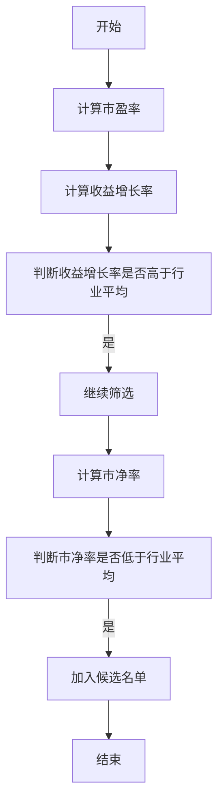
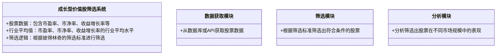

                 


# 彼得林奇的"成长型价值股"在不同市场规模中的表现

## 关键词：彼得林奇、成长型价值股、市场规模、投资策略、股票分析

## 摘要：本文深入分析彼得林奇的成长型价值股投资策略在不同市场规模中的表现，探讨其在小盘股、中盘股和大盘股中的应用，结合数学模型和实证案例，评估其优缺点及适用性。

---

## 第1章: 成长型价值股的基本概念

### 1.1 成长型价值股的定义

#### 1.1.1 什么是成长型股票
成长型股票是指那些预期收益增长率高于市场平均水平的公司股票。这类股票通常来自新兴行业或高增长潜力的公司。

#### 1.1.2 什么是价值型股票
价值型股票是指市场价格低于其内在价值的股票，通常市盈率、市净率等估值指标低于行业平均水平。

#### 1.1.3 成长型价值股的结合
成长型价值股是结合了成长股和价值股特点的股票，即具有较高的成长性和较低的估值。

---

### 1.2 彼得林奇的成长型投资理念

#### 1.2.1 彼得林奇的投资哲学
彼得林奇主张投资于具有持续增长潜力的公司，同时关注其估值是否合理。

#### 1.2.2 成长与价值的平衡
他强调在选择股票时，既要考虑公司的成长性，也要考虑其估值是否处于合理区间。

#### 1.2.3 投资策略的核心要素
- 盈利能力
- 市场地位
- 管理团队
- 未来增长潜力

---

## 第2章: 不同市场规模的定义与特点

### 2.1 市场规模的分类

#### 2.1.1 小盘股、中盘股和大盘股的定义
- **小盘股**：市值较小，通常在50亿以下。
- **中盘股**：市值中等，通常在50亿至500亿之间。
- **大盘股**：市值较大，通常在500亿以上。

#### 2.1.2 各类市场的特点与区别
- **小盘股**：高增长潜力，但风险较高，流动性较差。
- **中盘股**：平衡性较好，风险和回报介于小盘和大盘之间。
- **大盘股**：稳定性高，风险较低，流动性好，但增长潜力有限。

---

## 第3章: 成长型价值股的筛选指标

### 3.1 常用的股票筛选指标

#### 3.1.1 市盈率（P/E）
公式：$$ P/E = \frac{Price}{Earnings} $$
解释：市盈率低且收益增长率高的股票更符合成长型价值股的特征。

#### 3.1.2 市净率（P/B）
公式：$$ P/B = \frac{Price}{Book\ Value} $$
解释：市净率低的股票通常被认为是被低估的。

#### 3.1.3 净利润增长率
公式：$$ Growth\ Rate = \frac{Current\ Net\ Profit - Previous\ Net\ Profit}{Previous\ Net\ Profit} $$
解释：净利润增长率高的公司具有较高的成长潜力。

#### 3.1.4 营业收入增长率
公式：$$ Revenue\ Growth\ Rate = \frac{Current\ Revenue - Previous\ Revenue}{Previous\ Revenue} $$
解释：营业收入增长率高的公司表明其业务正在扩张。

---

### 3.2 彼得林奇的筛选标准

#### 3.2.1 低市盈率与高增长的结合
寻找市盈率低于行业平均水平，同时收益增长率高于行业平均水平的公司。

#### 3.2.2 净利润与收入的匹配性
净利润增长率应与营业收入增长率相匹配，避免利润虚增。

#### 3.2.3 公司规模与成长性的平衡
选择规模适中、具有稳定增长潜力的公司，避免过小或过大的极端情况。

---

## 第4章: 算法原理与流程图

### 4.1 筛选算法的数学模型

#### 4.1.1 市盈率与收益增长率的公式
$$ P/E = \frac{Price}{Earnings} $$
$$ Growth\ Rate = \frac{Current\ Earnings - Previous\ Earnings}{Previous\ Earnings} $$

#### 4.1.2 算法流程图


---

## 第5章: 系统分析与架构设计方案

### 5.1 问题场景介绍

#### 5.1.1 问题背景
在不同市场规模中，成长型价值股的表现可能存在差异，需要通过系统化的分析来验证。

#### 5.1.2 项目介绍
开发一个基于彼得林奇策略的投资分析系统，用于筛选和评估成长型价值股在不同市场规模中的表现。

---

### 5.2 系统功能设计

#### 5.2.1 领域模型


---

### 5.3 系统架构设计


---

## 第6章: 项目实战

### 6.1 环境安装

#### 6.1.1 安装Python和相关库
安装Python 3.x，安装Pandas、NumPy、Matplotlib、Plotly等库。

#### 6.1.2 数据获取
使用Yahoo Finance API获取股票数据。

### 6.2 核心实现源代码

#### 6.2.1 数据获取与预处理
```python
import pandas as pd
import numpy as np

# 获取股票数据
def get_stock_data(ticker):
    # 使用Yahoo Finance API获取数据
    pass

# 计算市盈率和收益增长率
def calculate_metrics(data):
    pe = data['Close'] / data['Earnings']
    growth = (data['Earnings'].diff() / data['Earnings'].shift(1)).fillna(0)
    return pe, growth
```

#### 6.2.2 筛选逻辑
```python
def screen_stocks(pe, growth, industry_pe, industry_growth):
    selected = []
    for i in range(len(pe)):
        if pe[i] < industry_pe and growth[i] > industry_growth:
            selected.append(i)
    return selected
```

#### 6.2.3 可视化
```python
import matplotlib.pyplot as plt

# 绘制市盈率分布图
plt.hist(pe, bins=20)
plt.xlabel('市盈率')
plt.ylabel('数量')
plt.title('市盈率分布图')
plt.show()
```

---

### 6.3 应用解读与分析

#### 6.3.1 实际案例分析
以小盘股为例，分析筛选出的成长型价值股的表现。

#### 6.3.2 筛选结果解读
通过数据可视化工具展示筛选结果，分析其在不同市场规模中的表现。

---

## 第7章: 小结与展望

### 7.1 小结
彼得林奇的成长型价值股策略在不同市场规模中表现各异，小盘股具有较高的增长潜力，但风险也较大；大盘股表现相对稳定，但增长潜力有限；中盘股则在两者之间寻求平衡。

### 7.2 展望
未来可以进一步研究不同行业和市场环境下的策略表现，优化筛选模型，提高筛选的准确性和效率。

---

## 结语

彼得林奇的成长型价值股策略为投资者提供了一种有效的投资方法，但在不同市场规模中的表现需要结合具体情况进行分析。通过系统的分析和实证研究，可以帮助投资者更好地理解和应用这一策略。

---

## 作者：AI天才研究院/AI Genius Institute & 禅与计算机程序设计艺术 /Zen And The Art of Computer Programming

