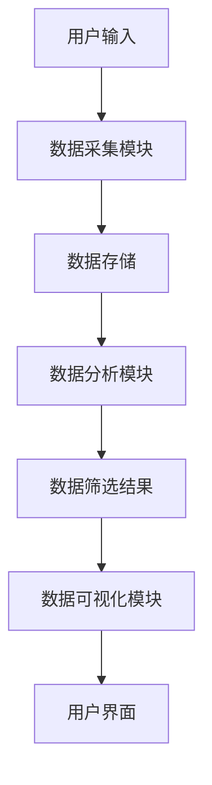

                 


# 彼得林奇的"成长型价值股"在不同行业的表现

---

## 关键词：  
彼得·林奇、成长型价值股、投资策略、行业分析、数学模型、股票筛选、系统架构

---

## 摘要：  
本文深入探讨了彼得·林奇提出的“成长型价值股”投资理念，并分析其在不同行业中的表现。通过结合投资理论、数学模型和系统架构，本文详细阐述了如何在不同行业中识别和评估成长型价值股，并通过实际案例和项目实战，展示了如何将这些理念应用于实际投资中。文章旨在为投资者提供一种系统化、科学化的投资方法，帮助他们在复杂多变的市场环境中做出明智的投资决策。

---

## 第1章：彼得·林奇与成长型价值股概述

### 1.1 彼得·林奇及其投资理念  
彼得·林奇是美国著名的投资家和基金经理，以其独特的成长型价值股投资策略闻名。他的投资理念强调长期持有优质股票，注重公司的基本面和成长性。林奇认为，投资成功的关键在于找到那些具有强大竞争优势、良好管理团队和持续增长潜力的公司。  

#### 1.1.1 成长型价值股的定义  
成长型价值股是指那些具有较高成长性，但当前估值相对较低的股票。这类股票通常属于处于成长阶段的公司，具有较高的盈利能力和市场扩展潜力。  

#### 1.1.2 成长型价值股的特征  
- **高成长性**：公司收入和利润持续增长，且增长速度高于行业平均水平。  
- **合理估值**：市盈率（P/E）、市净率（P/B）等估值指标低于行业平均水平。  
- **竞争优势**：公司在行业内具有独特的竞争优势，如技术优势、成本优势等。  
- **财务健康**：公司财务状况稳健，负债率低，现金流充足。  

---

## 第2章：成长型价值股在不同行业的表现  

### 2.1 不同行业的成长型价值股分析  

#### 2.1.1 高科技行业的成长型价值股  
高科技行业是成长型价值股的“沃土”。这些公司通常具有高增长潜力，但估值相对合理。例如，某些半导体公司或软件公司可能具有较高的成长性，但其估值尚未被市场充分反映。  

#### 2.1.2 消费行业的成长型价值股  
消费行业中的成长型价值股通常来自那些能够持续推出新产品、满足消费者需求的公司。例如，某些食品饮料公司或智能家居公司可能符合这一特征。  

#### 2.1.3 制造业的成长型价值股  
制造业中的成长型价值股往往来自那些能够通过技术创新或成本优化实现增长的公司。例如，某些高端装备制造公司可能符合这一特征。  

#### 2.1.4 金融行业的成长型价值股  
金融行业的成长型价值股通常来自那些能够通过规模扩张或业务创新实现增长的公司。例如，某些中小型银行或金融科技公司可能符合这一特征。  

---

### 2.2 不同行业成长型价值股的比较  

#### 2.2.1 不同行业成长型价值股的共同点  
- 高成长性：无论行业如何，成长型价值股的核心特征是高成长性。  
- 合理估值：估值相对较低，但具有较高的增长潜力。  
- 竞争优势：公司在行业内具有竞争优势。  

#### 2.2.2 不同行业成长型价值股的差异  
- **行业风险**：不同行业的成长型价值股面临的行业风险不同。例如，高科技行业可能面临技术风险，而制造业可能面临政策风险。  
- **增长周期**：不同行业的增长周期不同，成长型价值股的投资周期也不同。  

---

## 第3章：成长型价值股的投资策略与方法  

### 3.1 成长型价值股的投资策略  

#### 3.1.1 价值发现策略  
投资者需要通过基本面分析发现那些具有高成长性但估值较低的公司。  

#### 3.1.2 长期投资策略  
成长型价值股的投资需要耐心，因为公司的成长需要时间。  

#### 3.1.3 行业选择策略  
根据行业特点选择具有高成长潜力的行业，例如高科技行业和消费行业。  

---

### 3.2 成长型价值股的投资方法  

#### 3.2.1 基本面分析法  
基本面分析是成长型价值股投资的核心方法。通过分析公司的财务报表、盈利能力、成长性和竞争优势，投资者可以筛选出具有投资价值的股票。  

#### 3.2.2 技术分析法  
技术分析可以帮助投资者判断股票的买卖时机，但需要结合基本面分析使用。  

#### 3.2.3 股票筛选法  
通过设定筛选标准，如市盈率低于行业平均水平、收入增长率高于行业平均水平等，投资者可以快速筛选出潜在的成长型价值股。  

---

## 第4章：彼得·林奇的成长型价值股投资模型  

### 4.1 成长型价值股的筛选标准  

#### 4.1.1 盈利能力分析  
盈利能力是成长型价值股的重要指标。常用的指标包括净利润率、毛利率等。  

#### 4.1.2 增长能力分析  
增长能力分析包括收入增长率、净利润增长率等指标。  

#### 4.1.3 财务健康状况分析  
财务健康状况分析包括资产负债率、现金流等指标。  

---

### 4.2 成长型价值股的投资组合构建  

#### 4.2.1 投资组合的构建原则  
- 分散投资：避免将所有资金投入到单一行业或公司。  
- 长期持有：成长型价值股需要时间来实现增长。  
- 定期调整：根据市场变化和公司基本面进行调整。  

#### 4.2.2 投资组合的优化与调整  
通过定期评估投资组合的表现，投资者可以优化和调整投资组合，以实现最佳收益。  

---

## 第5章：成长型价值股的数学模型与算法原理  

### 5.1 成长型价值股的估值模型  

#### 5.1.1 市盈率模型  
市盈率（P/E）= 股价 / 每股净利润  

#### 5.1.2 市净率模型  
市净率（P/B）= 股价 / 每股净资产  

#### 5.1.3 现金流折现模型  
企业价值 = 现金流的现值  

---

### 5.2 成长型价值股的筛选算法  

#### 5.2.1 基于机器学习的股票筛选算法  
通过机器学习模型，投资者可以筛选出具有高成长潜力的股票。  

#### 5.2.2 基于时间序列分析的股票预测算法  
时间序列分析可以帮助投资者预测股票的未来走势。  

---

## 第6章：成长型价值股的系统分析与架构设计  

### 6.1 系统分析  

#### 6.1.1 系统功能需求  
- 数据采集：从多个数据源获取股票数据。  
- 数据分析：通过算法筛选出成长型价值股。  
- 数据可视化：将分析结果以图表形式展示。  

#### 6.1.2 系统模块划分  
- 数据采集模块  
- 数据分析模块  
- 数据可视化模块  

---

### 6.2 系统架构设计  

#### 6.2.1 系统架构的分层设计  
- 数据层：存储股票数据。  
- 业务逻辑层：实现数据分析和筛选功能。  
- 用户界面层：展示分析结果。  

#### 6.2.2 系统架构的流程图设计  


---

## 第7章：成长型价值股的项目实战  

### 7.1 项目环境安装与数据准备  

#### 7.1.1 数据源的选择与获取  
- 数据源：从公开的股票数据库获取股票数据。  
- 数据格式：CSV或Excel格式。  

#### 7.1.2 数据清洗与预处理  
- 删除缺失值  
- 处理异常值  

---

### 7.2 系统核心实现  

#### 7.2.1 成长型价值股筛选  
```python
import pandas as pd
import numpy as np

# 数据加载
df = pd.read_csv('stock_data.csv')

# 数据清洗
df.dropna(inplace=True)

# 基于市盈率和收入增长率的筛选
df['P/E'] = df['股价'] / df['每股净利润']
df['收入增长率'] = (df['收入'] / df['上期收入']) - 1

# 筛选成长型价值股
成长型价值股 = df[(df['P/E'] < df['P/E'].mean()) & (df['收入增长率'] > 0.2)]
```

---

## 总结与展望  

彼得·林奇的成长型价值股投资理念为投资者提供了一种科学的投资方法。通过结合投资理论、数学模型和系统架构，投资者可以在不同行业中筛选出具有高成长潜力的股票。未来，随着技术的进步，成长型价值股的投资方法将更加智能化和个性化。  

---

## 作者：AI天才研究院/AI Genius Institute & 禅与计算机程序设计艺术 /Zen And The Art of Computer Programming

