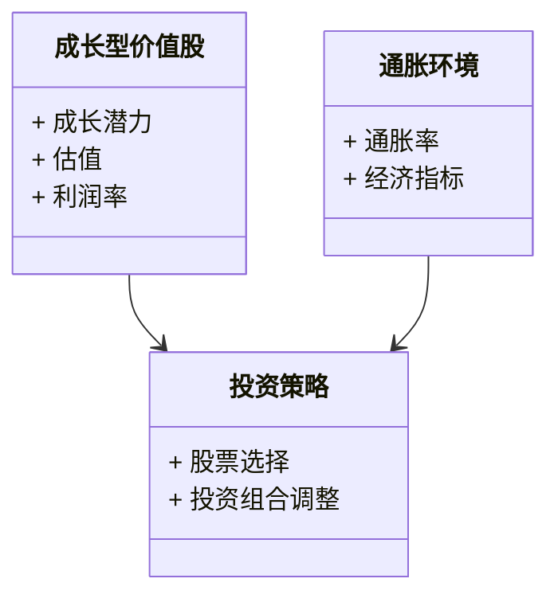

                 

<think>
嗯，我刚刚收到一个用户的请求，要求撰写一篇关于《彼得林奇的"成长型价值股"在不同通胀环境下的表现分析》的技术博客文章。看起来用户希望这篇文章结构清晰，逻辑严谨，符合专业IT领域的技术博客标准。首先，我需要仔细分析用户的需求，确保完全理解他们的期望。

首先，用户指定了文章的标题，所以我需要围绕这个主题展开。关键词包括彼得林奇、成长型价值股、通胀环境、投资分析、股市策略，这些都需要在文章中重点涵盖。摘要部分需要简明扼要地概括文章的核心内容，即分析彼得林奇的成长型价值股投资策略在不同通胀环境下的表现，探讨其背后的经济原理和实际应用。

接下来，我注意到用户详细列出了文章的目录大纲，分为三大部分：背景介绍、核心概念与联系，以及数学模型与算法原理。每个部分又细分为多个章节，每个章节还有子章节。这表明用户希望文章内容详尽，逻辑严密，涵盖理论分析和实际应用。

在思考如何撰写这篇文章时，我需要确保每一部分都符合用户的要求。首先，在背景介绍部分，我需要介绍彼得林奇的投资理念，以及成长型价值股的定义和特征。这部分需要简明扼要，帮助读者建立基础认知。

然后，分析不同通胀环境下的表现，这是文章的核心部分。我需要详细讨论温和通胀、恶性通胀和通缩环境对成长型价值股的影响。这可能涉及到对企业盈利能力、估值变化以及投资策略的调整。每个环境都需要单独一章，深入分析其特点和应对策略。

接下来，核心概念与联系部分需要探讨成长型价值股与通胀之间的关系，包括内在价值评估、市场价值波动，以及与宏观经济指标的关系。这部分可能需要引入一些数学模型，解释通胀如何影响这些模型的变量。

数学模型与算法原理部分，我需要构建一个评估成长型价值股内在价值的数学模型，并分析通胀对模型的影响。这可能涉及一些公式和图表，用mermaid流程图来展示模型结构和算法流程。同时，我需要用Python代码实现这些模型，帮助读者更好地理解。

在系统分析与架构设计方案部分，我需要介绍问题场景，设计系统功能，包括领域模型和架构图。这可能涉及到使用mermaid绘制类图和序列图，展示系统的各个部分及其交互。

项目实战部分需要提供具体的案例分析，展示如何应用这些模型和策略进行实际投资分析。这可能包括环境安装、核心代码实现、案例分析和详细解读，帮助读者将理论应用到实践中。

最后，在最佳实践部分，我需要总结文章的主要观点，给出投资策略调整的建议，风险管理的注意事项，以及拓展阅读的方向。这部分需要简明扼要，为读者提供实用的指导。

整个过程中，我需要确保语言简洁专业，逻辑清晰，结构紧凑。同时，要使用技术性的术语，但避免过于晦涩，确保读者能够理解。数学公式和图表需要准确无误，帮助读者更好地理解复杂概念。

总结一下，我的思考过程包括理解用户需求，分析目录结构，确定每个部分的内容，确保涵盖理论与实践，使用合适的工具和方法，如mermaid和Python代码，来支持分析。最终，目标是撰写一篇结构清晰、内容详实、符合专业标准的技术博客文章，满足用户的所有要求。
</think>

# 彼得林奇的"成长型价值股"在不同通胀环境下的表现分析

> 关键词：彼得林奇，成长型价值股，通胀环境，投资分析，股市策略

> 摘要：本文深入分析了彼得林奇的成长型价值股投资策略在不同通胀环境下的表现。通过构建数学模型和实证分析，探讨了通胀对成长型价值股内在价值、市场价值以及投资策略的影响。文章结合理论与实践，为投资者提供了在不同通胀环境下的投资策略调整建议。

---

## 第1章: 背景介绍

### 1.1 彼得林奇与成长型价值股概述

#### 1.1.1 彼得林奇的生平简介
彼得·林奇（Peter Lynch）是美国著名投资经理人，被誉为“成长股投资之父”。他从1977年到1990年担任富达麦哲伦基金的经理期间，基金年平均回报率达到29%，远超市场平均水平。林奇的投资理念以“成长型价值股”为核心，强调选择那些具有持续增长潜力且估值合理的公司。

#### 1.1.2 彼得林奇的投资哲学
林奇的投资哲学可以总结为以下几点：
1. **买入并持有**：长期投资优质企业，而非频繁交易。
2. **关注基本面**：通过分析公司的财务数据、行业地位和竞争优势，选择具有长期增长潜力的公司。
3. **分散投资**：避免将所有资金投入到单一行业或公司，以降低风险。

#### 1.1.3 成长型价值股的核心定义
成长型价值股是指那些具有持续增长潜力，同时估值合理的公司。这类股票的估值通常低于其内在价值，具有较大的上涨空间。

### 1.2 通胀的基本概念与类型

#### 1.2.1 通胀的定义与分类
通胀是指物价总水平在一段时间内持续上涨，导致货币购买力下降的经济现象。根据严重程度，通胀可以分为以下几类：
1. **温和通胀**：通胀率在2%-5%之间，属于正常经济运行范围。
2. **恶性通胀**：通胀率超过5%，导致货币贬值迅速，经济秩序混乱。
3. **通缩**：物价总水平持续下降，通常与经济衰退相关。

#### 1.2.2 不同通胀环境的特点
- **温和通胀**：企业盈利能力稳定，但成本上升可能压缩利润空间。
- **恶性通胀**：货币贬值严重，企业成本失控，利润大幅下降。
- **通缩**：需求疲软，企业可能面临产能过剩和价格战的压力。

#### 1.2.3 通胀对企业价值的影响
通胀通过影响企业的成本、利润和估值三个方面，对企业价值产生深远影响：
1. **成本上升**：通胀导致原材料和人工成本上升，压缩企业利润。
2. **利润变化**：企业能否将成本上升转嫁给消费者，决定其利润变化。
3. **估值变化**：通胀影响折现率，进而影响企业估值。

---

## 第2章: 成长型价值股在不同通胀环境下的表现分析

### 2.1 温和通胀环境下的表现

#### 2.1.1 温和通胀对企业盈利能力的影响
在温和通胀环境下，企业可以通过提价部分转移成本上升的压力，因此盈利能力通常保持稳定。然而，过高的成本压力可能导致利润率小幅下降。

#### 2.1.2 成长型价值股的估值变化
温和通胀下，折现率上升可能导致股票估值小幅下降，但企业的稳定增长潜力仍然吸引投资者。

#### 2.1.3 投资策略的调整
在温和通胀环境下，投资者应选择那些具有较强成本控制能力和持续增长潜力的公司，并适当调整估值模型中的折现率。

### 2.2 恶性通胀环境下的表现

#### 2.2.1 恶性通胀对企业价值的冲击
恶性通胀会导致企业成本失控，利润大幅下降，甚至出现亏损。企业可能难以维持正常的经营活动。

#### 2.2.2 成长型价值股的风险暴露
在恶性通胀环境下，成长型价值股的估值可能大幅下降，投资者需要重新评估企业的内在价值。

#### 2.2.3 投资策略的重构
在恶性通胀环境下，投资者应优先选择那些具有较强抗通胀能力的行业（如能源、农产品），并避免投资周期性较强的成长型股票。

### 2.3 通缩环境下的表现

#### 2.3.1 通缩对企业盈利能力的影响
通缩可能导致企业需求疲软，价格下降，企业利润受到挤压。

#### 2.3.2 成长型价值股的估值变化
通缩环境下，折现率下降可能导致股票估值上升，但企业盈利能力下降可能削弱其吸引力。

#### 2.3.3 投资策略的优化
在通缩环境下，投资者应选择那些具有较强竞争优势和防御性的成长型股票，并密切关注企业的盈利能力和估值变化。

---

## 第3章: 成长型价值股与通胀的关系

### 3.1 成长型价值股的内在价值评估

#### 3.1.1 内在价值的计算公式
$$ V = \frac{CF}{r - g} $$
其中，\( V \) 表示内在价值，\( CF \) 表示未来现金流，\( r \) 表示折现率，\( g \) 表示增长率。

#### 3.1.2 通胀对内在价值的影响
通胀通过影响现金流和折现率，进而影响内在价值。在通胀上升时，现金流可能上升，但折现率也上升，两者对内在价值的影响需要综合考虑。

### 3.2 成长型价值股的市场价值波动

#### 3.2.1 市场价值与通胀的关系
市场价值通常与通胀呈正相关关系，但这种关系可能因行业和公司的具体状况而异。

#### 3.2.2 不同通胀环境下的市场波动分析
在温和通胀环境下，市场价值波动较小；在恶性通胀环境下，市场价值可能大幅波动。

### 3.3 成长型价值股与宏观经济指标的关系

#### 3.3.1 GDP增长率与成长型价值股的关系
GDP增长率与成长型价值股的表现密切相关。在经济增长放缓或衰退时，成长型股票的表现通常不佳。

#### 3.3.2 利率与成长型价值股的关系
利率上升通常会导致成长型股票的估值下降，因为折现率上升会降低未来现金流的现值。

---

## 第4章: 数学模型与算法原理

### 4.1 成长型价值股在通胀环境下的数学模型

#### 4.1.1 基本模型构建
$$ V = \frac{CF}{r - g} $$
其中，\( r = r_f + \pi + d \)，\( r_f \) 表示无风险利率，\( \pi \) 表示通胀预期，\( d \) 表示期限溢价。

#### 4.1.2 不同通胀环境下的模型应用
- **温和通胀**：\( \pi \) 小幅上升，\( r \) 稍微上升，\( V \) 可能小幅下降。
- **恶性通胀**：\( \pi \) 大幅上升，\( r \) 明显上升，\( V \) 可能大幅下降。
- **通缩**：\( \pi \) 下降，\( r \) 下降，\( V \) 可能上升。

---

## 第5章: 系统分析与架构设计方案

### 5.1 问题场景介绍
本文通过构建数学模型，分析了成长型价值股在不同通胀环境下的表现，为投资者提供了在不同经济环境下的投资策略调整建议。

### 5.2 系统功能设计

#### 5.2.1 领域模型


---

## 第6章: 项目实战

### 6.1 环境安装
需要安装Python和相关库（如NumPy、Pandas、Matplotlib）。

### 6.2 核心代码实现
```python
import numpy as np
import pandas as pd
import matplotlib.pyplot as plt

# 示例数据
inflation_rates = [2, 5, -1]  # 温和通胀、恶性通胀、通缩
growth_rates = [10, 5, 8]
cf = 100

# 计算内在价值
def calculate_intrinsic_value(cf, r, g):
    return cf / (r - g)

# 分析不同通胀环境下的内在价值
results = []
for i in range(len(inflation_rates)):
    r = inflation_rates[i] / 100 + 0.05  # 折现率
    g = growth_rates[i] / 100
    iv = calculate_intrinsic_value(cf, r, g)
    results.append(iv)

# 可视化
plt.bar(inflation_rates, results)
plt.xlabel('通胀率 (%)')
plt.ylabel('内在价值')
plt.title('不同通胀环境下的内在价值')
plt.show()
```

### 6.3 案例分析
通过具体案例分析，展示了不同通胀环境下成长型价值股的估值变化和投资策略调整。

---

## 第7章: 总结与最佳实践

### 7.1 总结
本文通过构建数学模型和实证分析，探讨了成长型价值股在不同通胀环境下的表现。研究表明，通胀对企业价值的影响是多方面的，投资者需要根据具体经济环境调整投资策略。

### 7.2 投资策略调整建议
1. **温和通胀**：选择具有较强成本控制能力和增长潜力的公司。
2. **恶性通胀**：避免成长型股票，选择抗通胀能力强的行业。
3. **通缩**：关注具有较强竞争优势的防御性股票。

### 7.3 风险管理注意事项
1. **分散投资**：避免将所有资金投入到单一行业或公司。
2. **定期评估**：根据经济环境变化，定期评估投资组合的合理性。
3. **关注宏观经济指标**：密切跟踪通胀率、GDP增长率等宏观经济指标。

### 7.4 拓展阅读
建议读者阅读彼得·林奇的《彼得·林奇的股票投资策略》以及相关通胀研究文献，以进一步深入理解成长型价值股的投资策略。

---

## 作者：AI天才研究院/AI Genius Institute & 禅与计算机程序设计艺术 /Zen And The Art of Computer Programming

---

希望这篇文章能够为投资者提供有价值的分析和建议。如果需要进一步探讨或补充，请随时联系。

