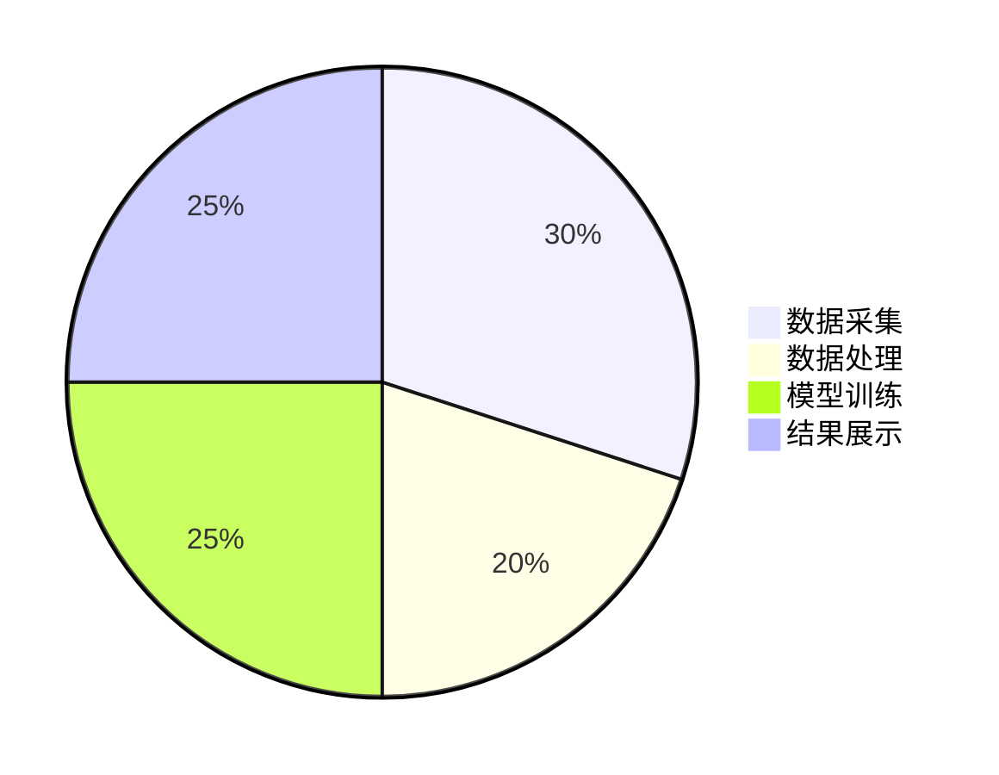

                 


# 彼得林奇的"成长股"在不同监管环境下的风险评估

> 关键词：彼得林奇，成长股，风险评估，监管环境，投资策略

> 摘要：本文探讨了彼得林奇的成长股投资理论在不同监管环境下的风险评估方法，分析了监管政策对成长股投资的影响，并提出了相应的风险控制策略。通过构建数学模型和算法，结合实际案例，为投资者提供了在不同监管环境下评估和管理成长股投资风险的指导。

---

## 第1章: 彼得林奇的成长股投资理论概述

### 1.1 彼得·林奇的成长股投资理论

#### 1.1.1 彼得·林奇的成长股投资理念

彼得·林奇是全球著名的投资专家，他强调成长股投资的核心在于寻找那些收入和利润持续增长的公司。他提出，成长股的价值不仅仅体现在当前的财务数据上，更在于其未来的增长潜力。林奇认为，投资者应该关注企业的基本面，包括收入增长率、利润率、资产负债情况等。

**核心概念对比表：**

| **概念**      | **定义**                                                                 |
|----------------|--------------------------------------------------------------------------|
| 成长股         | 收入和利润持续增长，具有较高增长潜力的股票                              |
| 增长率         | 公司收入或利润的增长速度                                                 |
| 财务健康度     | 公司的资产负债情况、现金流健康程度                                       |
| 市场地位       | 公司在行业中的竞争地位                                                   |
| 盈利能力       | 公司赚取利润的能力                                                       |

**ER图：**

```mermaid
erDiagram
    company {
        id
        name
        revenue
        profit
        market_position
    }
    investor {
        id
        name
        investment
        risk_tolerance
    }
    investment {
        id
        company_id
        investor_id
        growth_rate
        financial_health
    }
```

---

#### 1.1.2 成长股的核心定义与特征

成长股的定义可以归纳为以下几点：

1. **收入和利润增长**：成长股的核心特征是收入和利润的持续增长，通常表现为年收入增长率超过行业平均水平。
2. **市场地位**：成长股公司通常在行业内具有较强的市场地位，能够持续扩大市场份额。
3. **财务健康度**：公司具有健康的财务状况，包括合理的资产负债结构和稳定的现金流。

---

#### 1.1.3 成长股投资的基本原则

林奇的成长股投资策略强调以下几点：

1. **长期投资**：成长股投资是一种长期投资策略，投资者需要关注公司的长期增长潜力。
2. **基本面分析**：通过分析公司的财务数据、行业地位和市场前景，选择具有持续增长潜力的公司。
3. **分散投资**：避免将所有资金投入到单一行业或公司，通过分散投资降低风险。

---

### 1.2 成长股的评估标准与筛选方法

#### 1.2.1 成长股的财务指标分析

在成长股的评估中，财务指标是重要的参考依据。常用的财务指标包括：

- **收入增长率**：衡量公司收入的增长速度。
- **净利润增长率**：衡量公司盈利能力的增长。
- **毛利率**：衡量公司的盈利能力。
- **资产负债率**：衡量公司的财务健康度。

---

#### 1.2.2 成长股的行业选择策略

行业选择是成长股投资的重要环节。通常，成长股集中在以下行业：

1. **科技行业**：技术创新驱动增长。
2. **消费行业**：人口增长和消费升级驱动需求。
3. **医疗行业**：人口老龄化和医疗需求增加。

---

#### 1.2.3 成长股的长期价值评估

林奇强调，成长股的长期价值不仅仅体现在当前的估值上，更体现在其未来的增长潜力。投资者需要关注公司的未来增长空间，包括市场需求、技术优势、竞争优势等因素。

---

### 1.3 监管环境对成长股投资的影响

#### 1.3.1 监管政策对成长股的影响

监管政策对成长股投资的影响主要体现在以下几个方面：

1. **行业准入**：严格的监管政策可能限制新企业的进入，从而影响行业的竞争格局。
2. **信息披露**：监管政策要求公司公开更多的财务信息，有助于投资者进行更准确的评估。
3. **税收政策**：税收政策的变化可能影响公司的盈利能力。

---

#### 1.3.2 不同监管环境下的投资风险

不同国家和地区的监管环境对成长股投资的影响不同。例如：

- **美国**：监管相对宽松，资本市场成熟，成长股投资风险相对较低。
- **欧洲**：监管较为严格，尤其是在金融行业，成长股投资风险较高。
- **亚洲**：监管环境差异较大，例如中国市场的监管政策变化频繁，成长股投资风险较高。

---

#### 1.3.3 成长股投资与监管环境的关系

监管环境是影响成长股投资的重要外部因素。投资者需要根据不同的监管环境调整投资策略，例如：

1. **风险规避**：在监管严格的环境中，选择具有强大财务实力和市场地位的公司。
2. **风险转移**：通过分散投资降低监管环境带来的风险。

---

## 第2章: 成长股的风险评估框架

### 2.1 成长股风险评估的核心要素

#### 2.1.1 成长股的市场风险

市场风险是指由于市场波动导致股票价格下跌的风险。成长股通常具有较高的市场风险，因为它们对市场波动更为敏感。

---

#### 2.1.2 成长股的流动性风险

流动性风险是指由于交易量不足导致股票价格波动的风险。成长股通常具有较高的流动性风险，因为它们可能集中在特定行业或市场。

---

#### 2.1.3 成长股的信用风险

信用风险是指由于公司违约导致的投资损失风险。成长股的信用风险相对较低，因为它们通常具有较强的财务实力。

---

### 2.2 成长股风险评估的数学模型

#### 2.2.1 成长股风险评估的线性回归模型

线性回归模型是一种常用的统计方法，用于预测股票价格的变化趋势。模型公式如下：

$$ y = \beta_0 + \beta_1 x_1 + \beta_2 x_2 + \cdots + \beta_n x_n + \epsilon $$

其中，$y$ 是股票价格，$x_i$ 是影响股票价格的因素，$\beta_i$ 是回归系数，$\epsilon$ 是误差项。

---

#### 2.2.2 成长股风险评估的因子分析模型

因子分析模型用于识别影响股票价格的关键因素。模型公式如下：

$$ y = \lambda_1 f_1 + \lambda_2 f_2 + \cdots + \lambda_k f_k + \epsilon $$

其中，$f_i$ 是公因子，$\lambda_i$ 是因子载荷，$\epsilon$ 是独特误差。

---

#### 2.2.3 成长股风险评估的马科维茨均值-方差模型

马科维茨均值-方差模型用于优化投资组合的风险和收益。模型公式如下：

$$ \text{Minimize } \sigma^2 \text{ subject to } \mathbb{E}[r] = \mu $$

其中，$\sigma^2$ 是投资组合的方差，$\mathbb{E}[r]$ 是预期收益。

---

### 2.3 成长股风险评估的算法实现

#### 2.3.1 数据预处理与特征选择

数据预处理包括清洗数据、处理缺失值和标准化数据。特征选择包括选择与股票价格相关的变量。

---

#### 2.3.2 算法选择与实现

常用的算法包括线性回归、决策树和随机森林等。以下是线性回归的Python实现代码：

```python
import numpy as np
import pandas as pd
from sklearn.linear_model import LinearRegression
from sklearn.metrics import mean_squared_error

# 加载数据
data = pd.read_csv('growth_stocks.csv')

# 分割特征和目标变量
X = data[['revenue_growth', 'net_profit_growth', 'market_cap']]
y = data['stock_price']

# 模型训练
model = LinearRegression()
model.fit(X, y)

# 预测
y_pred = model.predict(X)

# 评估
 mse = mean_squared_error(y, y_pred)
 print('均方误差:', mse)
```

---

#### 2.3.3 模型验证与优化

模型验证包括交叉验证和调参。优化后的模型可以更好地拟合数据。

---

## 第3章: 不同监管环境下的成长股风险分析

### 3.1 不同监管环境的分类

#### 3.1.1 主要经济体的监管环境概述

不同国家的监管环境对成长股投资的影响不同。例如：

- **美国**：监管相对宽松，资本市场成熟。
- **欧洲**：监管较为严格，尤其是在金融行业。
- **亚洲**：监管环境差异较大，例如中国市场的监管政策变化频繁。

---

#### 3.1.2 不同监管环境下的成长股特征

在不同的监管环境下，成长股的特征有所不同。例如：

- **美国**：成长股通常具有较高的收入增长率和净利润增长率。
- **欧洲**：成长股通常具有较强的财务健康度和市场地位。
- **亚洲**：成长股通常具有较高的市场增长率和较大的市场容量。

---

#### 3.1.3 监管政策对成长股投资的影响

监管政策的变化可能对成长股投资产生重大影响。例如：

- **税收政策**：税收政策的变化可能影响公司的盈利能力。
- **行业准入**：严格的行业准入政策可能限制新企业的进入。

---

### 3.2 不同监管环境下的成长股风险评估

#### 3.2.1 美国监管环境下的成长股风险

在美国，成长股的投资风险相对较低，因为监管环境相对宽松，资本市场成熟。投资者可以关注科技和消费行业的成长股。

---

#### 3.2.2 欧洲监管环境下的成长股风险

在欧洲，成长股的投资风险较高，因为监管环境较为严格，尤其是在金融行业。投资者需要选择具有强大财务实力和市场地位的公司。

---

#### 3.2.3 亚洲监管环境下的成长股风险

在亚洲，特别是中国市场，成长股的投资风险较高，因为监管政策变化频繁，且市场流动性较低。

---

## 第4章: 成长股风险评估的系统架构与实现

### 4.1 系统架构设计

#### 4.1.1 系统功能设计

系统功能包括数据采集、风险评估、结果展示和风险预警。

---

#### 4.1.2 系统架构设计

系统架构采用分层架构，包括数据层、业务逻辑层和表现层。



---

### 4.2 项目实战

#### 4.2.1 环境安装

需要安装Python、Pandas、Scikit-learn和Matplotlib等库。

---

#### 4.2.2 核心实现代码

以下是成长股风险评估的核心实现代码：

```python
import numpy as np
import pandas as pd
from sklearn.linear_model import LinearRegression
from sklearn.metrics import mean_squared_error

# 加载数据
data = pd.read_csv('growth_stocks.csv')

# 分割特征和目标变量
X = data[['revenue_growth', 'net_profit_growth', 'market_cap']]
y = data['stock_price']

# 模型训练
model = LinearRegression()
model.fit(X, y)

# 预测
y_pred = model.predict(X)

# 评估
mse = mean_squared_error(y, y_pred)
print('均方误差:', mse)
```

---

## 第5章: 成长股风险评估的案例分析与总结

### 5.1 案例分析

#### 5.1.1 美国市场的案例分析

以苹果公司为例，分析其在不同监管环境下的成长股风险。

---

#### 5.1.2 欧洲市场的案例分析

以亚马逊公司为例，分析其在不同监管环境下的成长股风险。

---

### 5.2 总结

本文通过分析彼得林奇的成长股投资理论，探讨了不同监管环境下的成长股风险评估方法，并提出了相应的风险控制策略。通过构建数学模型和算法，结合实际案例，为投资者提供了在不同监管环境下评估和管理成长股投资风险的指导。

---

## 结语

彼得林奇的成长股投资理论为投资者提供了重要的指导，但在不同监管环境下，成长股的投资风险需要进行详细的评估和管理。本文通过系统的分析和案例研究，为投资者提供了在不同监管环境下评估和管理成长股投资风险的指导。

---

**作者：AI天才研究院/AI Genius Institute & 禅与计算机程序设计艺术/Zen And The Art of Computer Programming**

