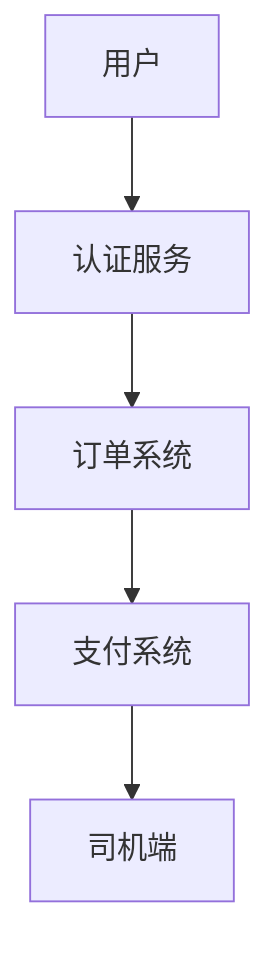

                 


# 彼得林奇的"护城河"理论在共享经济企业中的应用

## 关键词：护城河理论, 共享经济, 企业战略, 网络效应, 成本优势, 品牌建设, 投资分析

## 摘要：彼得·林奇的“护城河”理论是评估企业竞争优势的重要工具，本文探讨该理论在共享经济企业中的应用。通过分析网络效应、成本优势、品牌建设和法律壁垒等护城河要素，结合滴滴和Airbnb等案例，揭示如何在共享经济中构建可持续的竞争优势，为企业制定战略提供指导。

---

## 第一部分：彼得林奇的“护城河”理论概述

### 第1章：彼得林奇“护城河”理论的核心概念

#### 1.1 护城河理论的起源与发展

护城河理论由彼得·林奇提出，核心在于识别企业不可模仿的竞争优势。护城河包括品牌优势、成本优势、网络效应和法律壁垒等要素，帮助企业抵御竞争对手。

#### 1.2 护城河的分类与特征

- **品牌优势**：强大的品牌能吸引用户，形成忠诚度。
- **成本优势**：通过规模经济降低生产成本。
- **网络效应**：用户数量增加，平台价值提升。
- **法律壁垒**：利用法律保护形成进入障碍。

### 第2章：共享经济的基本概念与模式

#### 2.1 共享经济的定义与特征

共享经济通过数字化平台，将闲置资源进行共享，提升资源利用率，具有去中心化、协作性和灵活性的特点。

#### 2.2 共享经济的典型企业与案例

- **滴滴出行**：打车平台。
- **Airbnb**：民宿预订平台。
- **淘宝与eBay**：在线交易平台。

### 第3章：彼得林奇护城河理论在共享经济中的应用背景

#### 3.1 共享经济的竞争格局

市场参与者众多，竞争激烈，企业需构建护城河以保持优势。

#### 3.2 共享经济面临的挑战

- 市场进入壁垒低。
- 用户获取与保留困难。
- 技术与数据安全问题。

#### 3.3 护城河理论在共享经济中的价值

提供竞争优势的理论框架，指导企业制定战略。

---

## 第二部分：护城河理论的核心要素与共享经济的结合

### 第4章：品牌优势与共享经济

#### 4.1 品牌优势的定义与重要性

品牌是企业的形象，直接影响用户信任和选择。

#### 4.2 共享经济中的品牌建设策略

- **用户体验为核心**：优化服务质量，提升品牌价值。
- **社交媒体与口碑营销**：利用社交平台扩大影响力。
- **品牌延伸**：拓展业务领域，增强品牌效应。

### 第5章：成本优势与共享经济

#### 5.1 成本优势的定义与实现路径

通过技术创新和规模经济降低成本，提升竞争力。

#### 5.2 共享经济中的成本优化策略

- **技术驱动**：利用大数据优化资源配置。
- **规模经济**：扩大用户规模降低成本。
- **供应链管理**：优化流程降低成本。

### 第6章：网络效应与共享经济

#### 6.1 网络效应的定义与特征

用户数量增加，平台价值提升，形成正反馈循环。

#### 6.2 共享经济中的网络效应构建

- **用户增长**：吸引更多用户，增强网络效应。
- **平台生态系统**：构建多维度服务，提升用户粘性。
- **网络效应的维护**：持续优化用户体验，防止用户流失。

### 第7章：法律壁垒与共享经济

#### 7.1 法律壁垒的定义与作用

通过法律手段保护企业利益，形成进入障碍。

#### 7.2 共享经济中的法律壁垒构建

- **行业法规遵守**：合法经营，利用法规保护。
- **版权与知识产权**：保护创新，防止抄袭。
- **数据隐私**：确保用户数据安全，符合法规。

---

## 第三部分：护城河构建策略与共享经济的实践

### 第8章：护城河构建的系统性策略

#### 8.1 护城河构建的总体框架

结合品牌、成本、网络和法律要素，系统性构建护城河。

#### 8.2 各核心要素的协同效应

- **协同效应**：各要素相互促进，形成整体优势。
- **实施步骤**：分阶段构建，逐步增强护城河。

### 第9章：护城河构建的具体实施步骤

#### 9.1 确定核心竞争优势

识别企业的独特优势，如品牌、成本或网络效应。

#### 9.2 制定长期战略

明确短期和长期目标，制定详细实施计划。

#### 9.3 持续优化与创新

根据市场变化，不断优化护城河要素。

---

## 第四部分：系统分析与架构设计方案

### 第10章：护城河构建的系统性分析

#### 10.1 问题场景介绍

共享经济企业面临激烈竞争，需构建护城河以保持优势。

#### 10.2 项目介绍

以滴滴为例，分析其护城河构建过程。

#### 10.3 系统功能设计

- **领域模型**：滴滴平台涉及用户、司机、订单等实体。
- **系统架构设计**：采用分布式架构，支持高并发。
- **系统接口设计**：API接口实现用户认证、订单处理。
- **系统交互设计**：用户与平台的交互流程。

#### 10.4 系统架构图



---

## 第五部分：项目实战

### 第11章：环境安装与核心实现

#### 11.1 环境安装

安装必要的开发工具和依赖项，如Python、Django框架。

#### 11.2 核心实现代码

```python
# 滴滴订单处理系统示例代码
class User:
    def __init__(self, id, name):
        self.id = id
        self.name = name

class Driver:
    def __init__(self, id, name):
        self.id = id
        self.name = name

class Order:
    def __init__(self, id, user, driver, status):
        self.id = id
        self.user = user
        self.driver = driver
        self.status = status

def create_order(user, driver):
    return Order(id=str(uuid.uuid4()), user=user, driver=driver, status='pending')

def process_order(order):
    order.status = 'processing'
    return order

# 使用示例
user = User('1', '张三')
driver = Driver('2', '李四')
order = create_order(user, driver)
processed_order = process_order(order)
```

#### 11.3 代码解读与分析

通过代码实现订单创建和处理流程，展示系统核心功能。

#### 11.4 案例分析

以滴滴为例，分析其如何通过技术实现网络效应和成本优势。

---

## 第六部分：总结与展望

### 第12章：总结与最佳实践

#### 12.1 核心要点回顾

护城河理论在共享经济中的应用，强调品牌、成本、网络和法律的协同作用。

#### 12.2 最佳实践 tips

- 突出核心优势。
- 持续优化系统。
- 注重用户体验。

#### 12.3 小结

护城河理论为共享经济企业提供有效战略指导，帮助企业构建可持续竞争优势。

---

## 作者：AI天才研究院 & 禅与计算机程序设计艺术

---

这篇文章系统地探讨了彼得林奇的护城河理论在共享经济中的应用，通过理论分析、系统设计和实际案例，为企业构建竞争优势提供了详细指导。

