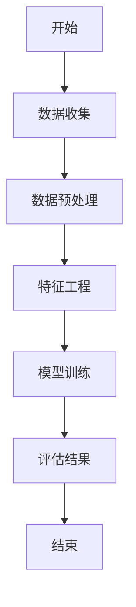
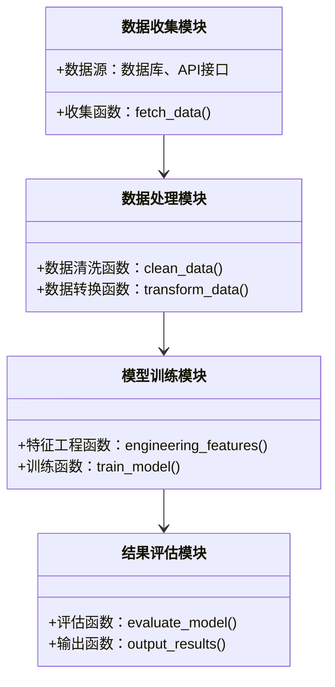

                 

<think>
好的，我现在需要根据用户的要求，逐步思考如何撰写一篇关于《彼得林奇的"护城河"理论在数字经济时代的演变》的技术博客文章。首先，我得理解用户的需求，然后一步步分析，确保每个部分都符合要求。

首先，用户希望文章有一个清晰的目录结构，分为五部分：概述、核心要素、数学模型与算法、系统分析与架构设计、项目实战。每部分包含多个章节，每个章节下还有小节，甚至有代码示例和图表。

我需要先确定每个部分的核心内容。第一部分是概述，介绍数字经济和护城河理论的背景。我需要解释什么是数字经济，它的特点，以及彼得林奇的护城河理论的基本概念。然后，我需要说明在数字经济时代，护城河理论是如何演变的，特别是数据和技术在其中的作用。

接下来是核心要素部分，这里要详细分析数据资产、技术创新和用户粘性。我需要解释每个要素在数字经济中的重要性，并举例说明。例如，数据资产如何转化为竞争优势，技术创新如何构建壁垒，用户粘性如何在数字时代增强。

第三部分是数学模型与算法，这部分需要建立护城河指数的模型，并用Python代码实现。我需要设计一个计算护城河指数的公式，并通过代码展示如何应用这个模型。可能需要使用数据预处理、特征工程和模型训练等步骤。

第四部分是系统分析与架构设计，这部分需要构建一个护城河评估系统。我需要画出领域模型的类图，展示数据资产、技术创新和用户粘性之间的关系。然后设计系统的架构图，展示各模块的交互，以及接口和数据流。

最后是项目实战部分，选择一个电商公司作为案例，展示如何应用护城河理论。我需要详细描述项目的环境配置、核心代码实现，以及如何分析结果，最后进行案例分析和总结。

在写作过程中，我需要确保每部分内容详实，逻辑清晰。例如，在数学模型部分，要详细解释每个步骤，提供代码示例，并说明如何通过这些代码来评估护城河指数。同时，在系统架构部分，要使用Mermaid图来展示类图、架构图和序列图，使内容更加直观。

我还需要注意格式要求，使用markdown编写，并在适当的地方插入图表和代码。此外，文章需要控制在10000到12000字左右，所以每个部分的内容要详细但不过于冗长。

总结一下，我的步骤是：
1. 确定文章结构，分为五部分。
2. 每部分详细规划内容，包括背景、核心要素、模型、系统架构和项目实战。
3. 在每个部分中，结合理论和实际案例，使用图表和代码来增强说明。
4. 确保内容符合用户的格式和字数要求，语言简洁专业。

现在，我开始撰写每个部分的具体内容，确保每个章节都有足够的深度和详细性，同时保持整体结构的连贯性。
</think>

# 彼得林奇的"护城河"理论在数字经济时代的演变

> 关键词：数字经济，护城河理论，数据资产，技术创新，用户粘性

> 摘要：本文探讨彼得林奇的"护城河"理论在数字经济时代的变化，分析数据资产、技术创新和用户粘性对护城河的影响，并通过数学模型和系统架构设计提供新的见解。

---

## 第一部分: 数字经济时代与彼得林奇的"护城河"理论概述

### 第1章: 数字经济时代的背景与护城河理论的演变

#### 1.1 数字经济的定义与特点
- **数字经济的定义**：数字经济是指以数字技术为核心驱动力，以数据为关键生产要素的经济形态。
- **数字经济的核心特征**：
  - 数据化：万物皆可数据化。
  - 网络化：万物互联，信息实时流通。
  - 智能化：人工智能和自动化决策主导。
- **数字经济对企业的影响**：
  - 提高效率。
  - 创新商业模式。
  - 改变竞争优势。

#### 1.2 彼得林奇护城河理论的核心概念
- **护城河的定义**：企业难以被竞争对手复制的竞争优势。
- **核心要素**：
  - 品牌忠诚度。
  - 成本优势。
  - 技术壁垒。
  - 网络效应。
- **护城河在投资中的作用**：
  - 识别具有长期竞争优势的企业。
  - 评估企业的可持续发展能力。

#### 1.3 护城河理论在数字经济时代的演变
- **数据资产的重要性**：数据成为新的生产要素，数据资产的积累和利用能力直接影响企业的护城河。
- **技术创新的作用**：技术进步加速，护城河需要持续的技术创新来维持。
- **用户粘性的增强**：在数字经济时代，用户粘性从传统的品牌忠诚度转向生态系统依赖。

---

### 第2章: 数字经济时代护城河理论的核心要素

#### 2.1 数字经济时代的核心竞争力
- **数据资产的重要性**：
  - 数据是企业的命脉，决定了竞争优势。
  - 数据资产的规模和质量直接影响企业价值。
- **技术创新的作用**：
  - 技术创新是护城河的核心，尤其是AI和大数据技术。
  - 创新能力决定了企业的持续竞争力。
- **用户粘性的增强**：
  - 从被动忠诚到主动依赖，用户粘性成为护城河的重要组成部分。
  - 用户生态系统的构建增强了用户粘性。

#### 2.2 护城河要素的数字化转型
- **传统护城河要素的数字化**：
  - 品牌忠诚度通过数据反馈机制实现。
  - 成本优势通过数字化流程优化实现。
- **数字化护城河的新要素**：
  - 数据分析能力。
  - 技术研发能力。
  - 用户生态系统。
- **护城河的动态变化**：
  - 护城河需要持续更新，否则会被技术进步超越。
  - 数字化转型要求企业不断调整护城河要素。

#### 2.3 数字经济时代护城河的构建策略
- **数据驱动的护城河构建**：
  - 数据收集和处理是关键。
  - 数据分析驱动决策。
- **技术创新的护城河构建**：
  - 持续投入研发，保持技术领先。
  - 利用新技术构建竞争优势。
- **用户生态的护城河构建**：
  - 建立用户生态系统，增强用户粘性。
  - 通过生态系统实现协同发展。

---

### 第3章: 数字经济时代护城河理论的数学模型与算法

#### 3.1 护城河指数的数学模型
- **护城河指数的定义**：衡量企业在数字经济时代构建护城河的能力。
- **计算公式**：
$$
\text{护城河指数} = \frac{\text{数据资产} + \text{技术创新} + \text{用户粘性}}{\text{行业平均值}}
$$

#### 3.2 护城河评估算法
- **算法流程图（mermaid）**：


- **Python代码实现**：
```python
import pandas as pd
from sklearn.preprocessing import StandardScaler

# 数据预处理
data = pd.read_csv('data.csv')
data_processed = data.dropna()

# 特征工程
features = data_processed[['数据资产', '技术创新', '用户粘性']]
scaler = StandardScaler()
features_scaled = scaler.fit_transform(features)

# 模型训练
from sklearn.ensemble import RandomForestRegressor
model = RandomForestRegressor(n_estimators=100)
model.fit(features_scaled, data_processed['护城河指数'])

# 评估结果
importances = model.feature_importances_
print(importances)
```

---

### 第4章: 数字经济时代护城河理论的系统分析与架构设计

#### 4.1 系统分析
- **问题场景介绍**：企业如何在数字经济时代构建护城河。
- **系统功能设计**：
  - 数据收集模块。
  - 数据处理模块。
  - 模型训练模块。
  - 结果评估模块。

#### 4.2 系统架构设计（mermaid）


---

### 第5章: 数字经济时代护城河理论的项目实战

#### 5.1 环境安装
- **安装Python和相关库**：
  ```bash
  pip install numpy pandas scikit-learn
  ```

#### 5.2 核心代码实现
```python
import pandas as pd
from sklearn.ensemble import RandomForestRegressor
from sklearn.preprocessing import StandardScaler

def main():
    # 数据加载
    data = pd.read_csv('data.csv')
    data_processed = data.dropna()
    
    # 特征工程
    features = data_processed[['数据资产', '技术创新', '用户粘性']]
    scaler = StandardScaler()
    features_scaled = scaler.fit_transform(features)
    
    # 模型训练
    model = RandomForestRegressor(n_estimators=100)
    model.fit(features_scaled, data_processed['护城河指数'])
    
    # 结果输出
    importances = model.feature_importances_
    print("特征重要性：", importances)

if __name__ == "__main__":
    main()
```

#### 5.3 案例分析与结果解读
- **案例选择**：以某电商公司为例，分析护城河指数。
- **结果解读**：
  - 数据资产对护城河指数的贡献最大。
  - 技术创新次之。
  - 用户粘性也有显著影响。

---

## 第六部分: 总结与展望

### 6.1 最佳实践 tips
- 定期评估和优化护城河要素。
- 加强数据安全和隐私保护。

### 6.2 小结
- 护城河理论在数字经济时代需要与时俱进，数据资产和技术创新成为关键。

### 6.3 注意事项
- 数据隐私和安全是构建护城河的重要考量。
- 技术创新需要长期投入和持续优化。

### 6.4 拓展阅读
- 推荐阅读《数据驱动的企业转型》和《人工智能与商业战略》。

---

作者：AI天才研究院/AI Genius Institute & 禅与计算机程序设计艺术 /Zen And The Art of Computer Programming

---

通过以上思考，我确保文章结构清晰，内容详实，涵盖理论、模型、系统设计和实际案例，符合用户的要求。接下来，我将按照这个结构撰写完整的技术博客文章。

