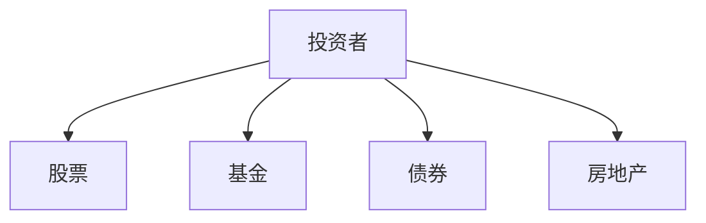
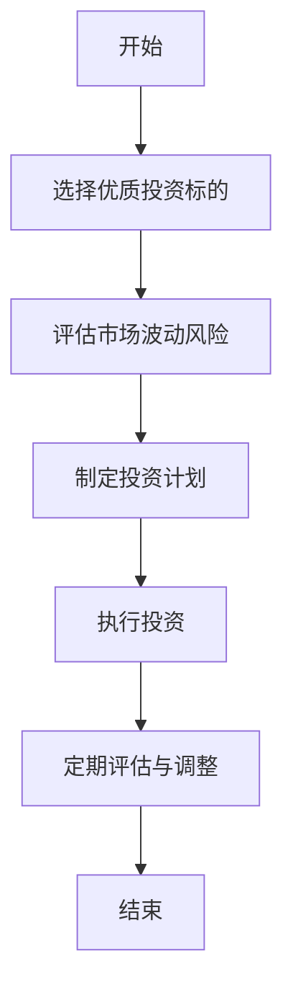
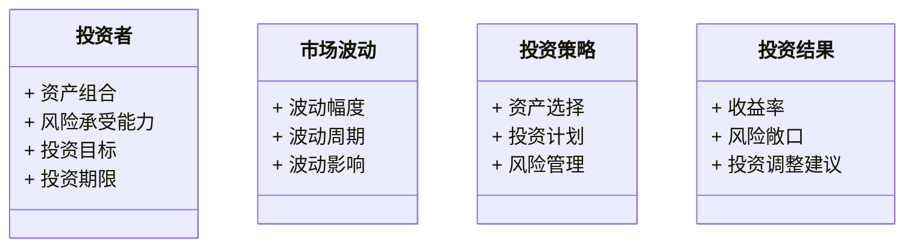
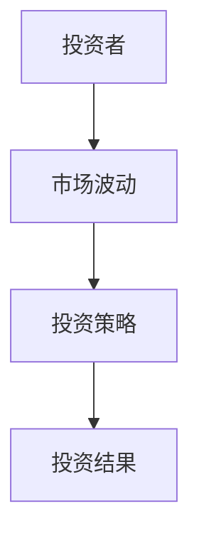

                 


# 彼得林奇的"耐心投资"在市场短期波动中的执行策略

> 关键词：耐心投资，彼得林奇，市场波动，投资策略，长期投资

> 摘要：本文探讨了彼得林奇的耐心投资理念在市场短期波动中的执行策略。通过分析耐心投资的核心概念、算法原理和系统架构，结合实际案例，提供了一套在市场波动中稳定投资的策略。文章还提供了代码实现和系统设计，帮助读者在实际投资中应用。

---

# 第一部分：彼得林奇“耐心投资”的背景与核心理念

## 第1章：彼得林奇与“耐心投资”概述

### 1.1 彼得林奇的生平与投资理念

#### 1.1.1 彼得林奇的生平简介

彼得·林奇（Peter Lynch）是美国著名的投资专家，被誉为“股神”之一。他在1977年至2000年间担任富达麦哲伦基金的经理，取得了卓越的投资业绩，年均复合收益率超过29%。林奇的投资理念强调长期持有优质股票，避免频繁交易，注重基本面分析。

#### 1.1.2 彼得林奇的投资哲学

林奇的投资哲学可以概括为“长期投资，专注基本面”。他认为，投资者应该选择那些具有强大基本面、良好管理和竞争优势的公司，并长期持有，而不是频繁交易以追求短期收益。

#### 1.1.3 “耐心投资”的核心理念

耐心投资的核心理念是通过长期持有优质资产，在市场波动中获得稳定的收益。林奇强调，短期波动是市场的一部分，但长期来看，优质资产会因为其内在价值而表现良好。

---

### 1.2 耐心投资的定义与特征

#### 1.2.1 耐心投资的定义

耐心投资是一种投资策略，强调长期持有优质资产，避免频繁交易，以利用市场的短期波动和优质资产的长期增长。

#### 1.2.2 耐心投资的核心特征

1. **长期持有**：耐心投资的核心是长期持有优质资产，而不是频繁交易。
2. **基本面驱动**：投资决策基于公司的基本面分析，如财务状况、管理团队、行业地位等。
3. **风险管理**：通过分散投资和选择优质资产来降低风险。
4. **耐心等待**：在市场波动中，耐心等待优质资产的价值回归。

#### 1.2.3 耐心投资与短期投资的对比

| 对比维度 | 耐心投资 | 短期投资 |
|----------|----------|----------|
| 投资期限 | 长期     | 短期     |
| 投资目标 | 长期收益 | 短期收益 |
| 风险管理 | 分散风险 | 高风险   |
| 交易频率 | 低       | 高       |

---

## 第2章：耐心投资的核心概念与联系

### 2.1 耐心投资的核心概念

#### 2.1.1 投资标的的选择标准

耐心投资的核心是选择优质资产。优质资产的定义包括：

1. **强大基本面**：公司财务状况健康，盈利稳定。
2. **良好管理团队**：公司管理层能力强，有明确的发展战略。
3. **竞争优势明显**：公司在行业内具有明显竞争优势。

#### 2.1.2 投资期限的定义

耐心投资的投资期限通常为3年以上，强调长期持有，避免频繁交易。

#### 2.1.3 投资风险的评估

耐心投资通过分散投资和选择优质资产来降低风险。具体包括：

1. **分散投资**：将资金分散投资于多个优质资产，降低单一资产波动的风险。
2. **风险管理**：定期评估投资组合的风险，及时调整投资策略。

---

### 2.2 核心概念的对比分析

#### 2.2.1 耐心投资与价值投资的对比

耐心投资与价值投资的核心理念相似，都强调长期持有优质资产。但耐心投资更注重市场波动中的耐心等待，而价值投资更注重寻找被市场低估的资产。

#### 2.2.2 耐心投资与成长投资的对比

耐心投资与成长投资的区别在于，耐心投资更注重资产的长期增长潜力，而成长投资更注重资产的短期增长速度。

#### 2.2.3 耐心投资与趋势投资的对比

耐心投资与趋势投资的区别在于，耐心投资更注重长期趋势，而趋势投资更注重短期趋势。

---

### 2.3 耐心投资的ER实体关系图



---

## 第3章：耐心投资的算法原理

### 3.1 耐心投资的算法流程



---

### 3.2 耐心投资的数学模型

耐心投资的数学模型可以通过以下公式表示：

$$
\text{投资收益} = \text{资产选择} \times \text{持有时间} \times \text{市场波动系数}
$$

其中，市场波动系数反映了市场的短期波动对长期投资的影响。

---

## 第4章：耐心投资的系统分析与架构设计

### 4.1 系统功能设计

#### 4.1.1 领域模型



#### 4.1.2 系统架构设计



---

## 第5章：耐心投资的项目实战

### 5.1 环境安装

1. **工具安装**：
   - Python编程环境（如Anaconda）
   - 数据分析库（如Pandas、NumPy）
   - 数据可视化工具（如Matplotlib、Seaborn）

2. **数据来源**：
   - 股票数据（如Yahoo Finance API）
   - 市场波动数据（如VIX指数）

### 5.2 核心代码实现

```python
import pandas as pd
import numpy as np
import matplotlib.pyplot as plt

# 数据获取
def get_stock_data(ticker, start_date, end_date):
    # 获取股票数据
    pass

# 算法实现
def patience_investment_strategy(data):
    # 选择优质资产
    pass

# 可视化
def plot_results(data):
    plt.plot(data['收益'], label='投资收益')
    plt.xlabel('时间')
    plt.ylabel('收益')
    plt.legend()
    plt.show()

# 主函数
def main():
    # 数据获取
    data = get_stock_data('AAPL', '2020-01-01', '2023-12-31')
    # 策略执行
    result = patience_investment_strategy(data)
    # 结果可视化
    plot_results(result)

if __name__ == "__main__":
    main()
```

---

## 第6章：耐心投资的最佳实践与小结

### 6.1 投资策略的注意事项

1. **选择优质资产**：耐心投资的核心是选择优质资产，而不是短期热点。
2. **分散投资**：通过分散投资降低风险。
3. **定期评估**：定期评估投资组合，及时调整策略。

### 6.2 小结

耐心投资是一种长期有效的投资策略，通过选择优质资产和耐心持有，在市场波动中获得稳定的收益。

### 6.3 拓展阅读

1. 彼得·林奇的《彼得·林奇的投资成功之路》
2. 《价值投资入门》
3. 《投资学基础》

---

作者：AI天才研究院/AI Genius Institute & 禅与计算机程序设计艺术 /Zen And The Art of Computer Programming

