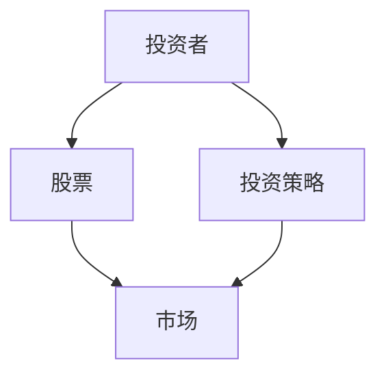
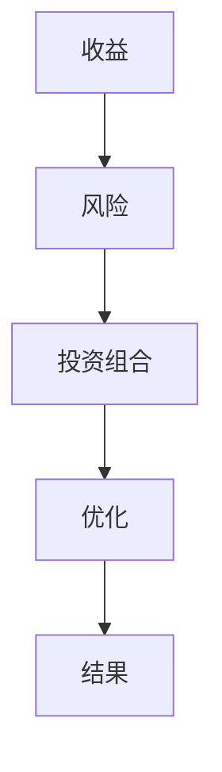
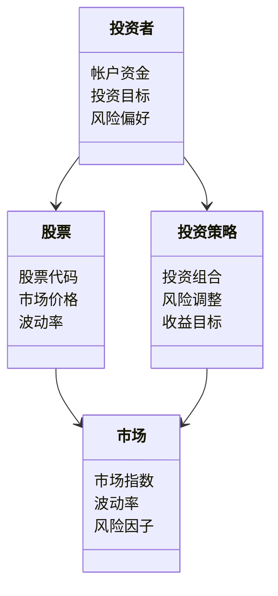

                 


# 彼得林奇的"耐心投资"在市场高波动期的执行策略优化

> 关键词：耐心投资，市场波动，投资策略，彼得林奇，风险管理，投资组合优化

> 摘要：本文深入分析了彼得林奇的耐心投资理念，并探讨了其在市场高波动期的执行策略优化。通过数学建模、系统架构设计和实际案例分析，本文提出了基于耐心投资的优化策略，并详细阐述了其在高波动环境下的应用。

---

## 第一部分: 背景介绍与核心概念

### 第1章: 耐心投资与市场高波动期概述

#### 1.1 耐心投资的定义与核心理念

耐心投资是一种长期投资策略，强调通过持有优质资产，逐步实现资本增值。其核心理念包括：

1. **长期视角**：关注企业的长期价值，而非短期市场波动。
2. **价值发现**：寻找具有竞争优势和成长潜力的企业。
3. **分散风险**：通过多元化投资降低个体资产的风险。
4. **避免频繁交易**：减少交易成本和情绪化决策的影响。

#### 1.2 市场高波动期的定义与特征

市场高波动期是指金融资产价格在短时间内剧烈波动的时期。其主要特征包括：

1. **价格波动剧烈**：资产价格在短时间内出现大幅波动。
2. **市场情绪不稳定**：投资者情绪从极度乐观转向恐慌。
3. **信息噪音多**：市场充斥着大量不准确或误导性的信息。

#### 1.3 耐心投资在高波动期的必要性

在高波动期，耐心投资的优势体现在以下方面：

1. **减少短期损失**：避免因频繁交易导致的亏损。
2. **捕捉长期价值**：高波动期后，优质资产往往能恢复或超越之前的高点。
3. **降低情绪干扰**：耐心投资策略有助于投资者在市场恐慌时保持冷静。

---

### 第2章: 耐心投资的核心概念与联系

#### 2.1 耐心投资的核心原理

耐心投资的核心原理包括：

1. **价值评估**：通过基本面分析，识别具有持续增长潜力的企业。
2. **分散投资**：通过投资不同类型资产降低风险。
3. **长期持有**：避免短期波动干扰长期投资目标。

#### 2.2 耐心投资与其他投资策略的对比

| 投资策略 | 核心特征 | 适合场景 |
|----------|----------|----------|
| 价值投资 | 侧重于基本面分析，寻找被市场低估的资产 | 稳定市场环境 |
| 技术分析 | 侧重于价格和成交量的变化 | 短期交易 |
| 股票投资 | 侧重于个股选择 | 长期投资 |

#### 2.3 耐心投资的ER实体关系图



---

## 第二部分: 数学模型与系统架构设计

### 第3章: 耐心投资的数学模型与公式

#### 3.1 耐心投资的风险承受能力模型

$$ R = \sqrt{250 \times \text{波动率}^2 \times \text{投资期限}} $$

其中，$R$ 表示年化波动率，$\text{波动率}$ 是资产的每日波动率，$\text{投资期限}$ 是投资时间（以年为单位）。

#### 3.2 耐心投资的收益目标公式

$$ R_{\text{目标}} = \mu \times t + \sigma \times \sqrt{t} \times Z $$

其中，$\mu$ 是资产的平均收益率，$t$ 是投资时间（以年为单位），$\sigma$ 是资产的年化波动率，$Z$ 是标准正态分布变量。

#### 3.3 耐心投资的波动率优化模型



---

### 第4章: 耐心投资的系统分析与架构设计

#### 4.1 系统功能设计



---

## 第三部分: 项目实战与优化策略

### 第5章: 项目实战

#### 5.1 环境安装与配置

```bash
pip install pandas numpy matplotlib
```

#### 5.2 核心代码实现

```python
import numpy as np
import pandas as pd
import matplotlib.pyplot as plt

def calculate_risk(reports):
    # 计算波动率
    returns = reports['return'].values
    volatility = np.std(returns)
    return volatility

def optimize_strategy(portfolio, target_volatility):
    # 根据波动率优化投资组合
    current_volatility = calculate_risk(portfolio)
    if current_volatility > target_volatility:
        return '减少高波动资产'
    else:
        return '保持当前组合'

# 示例数据
reports = pd.DataFrame({
    'return': [0.02, -0.01, 0.03, -0.02, 0.01],
    'risk': [0.05, 0.06, 0.04, 0.07, 0.05]
})

target_volatility = 0.05
result = optimize_strategy(reports, target_volatility)
print(result)
```

---

### 第6章: 总结与展望

#### 6.1 总结

耐心投资在市场高波动期的执行策略优化，需要结合数学建模、系统架构设计和实际案例分析。通过优化投资组合和风险管理，投资者可以在高波动环境中实现长期稳健的投资回报。

#### 6.2 展望

未来的研究可以进一步结合人工智能和大数据分析，优化耐心投资策略，提升其在复杂市场环境下的适应性。

---

## 作者

作者：AI天才研究院/AI Genius Institute & 禅与计算机程序设计艺术 /Zen And The Art of Computer Programming

