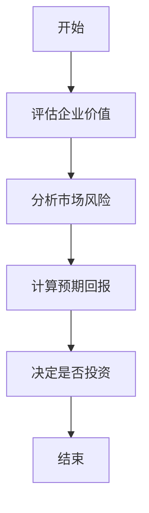
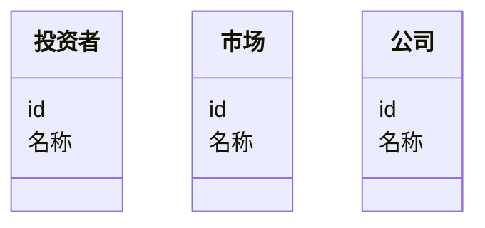
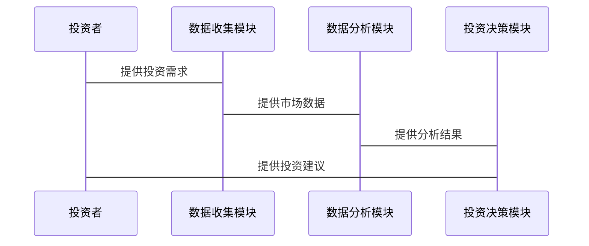

                 

<think>
好的，我现在需要帮用户设计一本书的目录大纲，书名是《彼得林奇的"耐心资本"在深科技投资中的重要性》。用户希望我以角色的身份，详细分析和思考这个任务的各个步骤，确保每个部分都符合要求。

首先，我需要理解用户的需求。用户希望我撰写一篇关于彼得林奇的耐心资本在深科技投资中的重要性的技术博客文章，并且按照特定的结构来组织内容。用户还提供了详细的目录大纲，分为多个部分，每个部分下有章节和小节，甚至三级目录。我需要确保内容完整、逻辑清晰，同时使用专业且易于理解的语言。

接下来，我会考虑每个部分的内容。首先是引言，介绍背景、问题描述以及本书的目标。然后是耐心资本理论的核心要素，包括定义、特点、与其它投资策略的对比。接下来是系统分析与架构设计，涉及算法原理、系统架构图、接口设计和交互流程图。然后是实战案例部分，包括环境安装、代码实现和案例分析。最后是结论与建议，总结全书并给出投资建议。

在思考过程中，我需要确保每个部分都符合用户的格式要求，使用markdown格式，包含必要的图表和代码示例。同时，要满足字数要求，大约在10000到12000字之间，每个章节内容要详细且具体，涵盖背景介绍、核心概念、算法原理、系统架构、项目实战等部分。

可能遇到的挑战包括如何将复杂的投资理论与系统架构设计结合起来，以及如何用技术语言解释深奥的投资策略。我需要确保内容既专业又易于理解，避免过于晦涩或过于简单。

现在，我需要开始逐步构建目录大纲，确保每个部分都有足够的细节，并且符合用户的格式和内容要求。这包括添加Mermaid图表、数学公式和代码示例，以增强文章的可读性和专业性。

最后，我会检查整个结构，确保逻辑连贯，内容完整，并且每个部分都满足用户的要求。这样，用户就能得到一篇高质量、结构清晰的技术博客文章了。
</think>

# 彼得林奇的"耐心资本"在深科技投资中的重要性

## 关键词：耐心资本, 深科技投资, 彼得林奇, 投资策略, 风险评估

## 摘要： 
彼得林奇的耐心资本理论强调长期投资和价值投资，在深科技投资中具有重要意义。本文系统阐述了耐心资本的核心概念、算法原理及其在深科技投资中的应用，通过案例分析和系统设计，探讨了耐心资本在深科技投资中的策略优势。

---

# 第一部分: 引言

## 1.1 耐心资本与深科技投资的背景

### 1.1.1 投资领域的演变
- 传统投资与深科技投资的对比
- 深科技投资的兴起及其重要性
- 耐心资本在投资领域中的独特地位

### 1.1.2 深科技投资的定义与特点
- 深科技投资的核心概念
- 深科技投资的关键特点：高风险、高回报、长周期
- 深科技投资的典型领域：人工智能、量子计算、生物技术等

### 1.1.3 耐心资本的核心理念
- 耐心资本的定义
- 耐心资本的三个核心要素：时间、价值、风险
- 耐心资本与传统投资策略的对比

## 1.2 彼得林奇与耐心资本理论

### 1.2.1 彼得林奇的生平与投资理念
- 彼得林奇的生平简介
- 彼得林奇的投资哲学：寻找优秀企业，长期持有
- 彼得林奇的成功案例：Fidelity Magellan基金的辉煌历程

### 1.2.2 耐心资本的定义与特征
- 耐心资本的定义
- 耐心资本的特征：长期性、价值导向、风险承受能力
- 耐心资本与其他投资策略的对比表格

### 1.2.3 耐心资本的属性特征对比
| 投资策略 | 短期资本 | 长期资本 | 耐心资本 |
|----------|----------|----------|----------|
| 时间跨度 | 短于1年 | 3-5年    | 5年以上  |
| 投资目标 | 资本增值 | 稳定收益 | 长期价值 |
| 风险承受 | 高       | 中       | 高       |

## 1.3 本书的核心问题与目标

### 1.3.1 问题背景与问题描述
- 深科技投资的高风险与高回报并存
- 耐心资本在深科技投资中的独特优势
- 本书要解决的核心问题：如何在深科技投资中应用耐心资本理论

### 1.3.2 问题解决的路径与方法
- 理论分析：耐心资本的核心原理
- 实证研究：深科技投资的特点与挑战
- 实践指导：如何将耐心资本应用于深科技投资

### 1.3.3 本书的目标与范围界定
- 目标：系统阐述耐心资本在深科技投资中的应用
- 范围：从理论到实践，涵盖分析、决策、案例等多方面
- 界限：聚焦于深科技领域，不涉及其他投资类型

---

# 第二部分: 耐心资本理论的核心要素

## 2.1 耐心资本的核心概念

### 2.1.1 耐心资本的三要素：时间、价值、风险
- 时间：耐心资本的长期性
- 价值：寻找具有长期价值的企业
- 风险：高风险但高回报的投资

### 2.1.2 耐心资本的属性特征对比
- 表格形式对比耐心资本与其他投资策略的差异

### 2.1.3 耐心资本的ER实体关系图
```mermaid
er
actor Investor {
  id
  name
}
actor Market {
  id
  name
}
actor Company {
  id
  name
}
```

## 2.2 耐心资本的算法原理

### 2.2.1 耐心资本的评估算法流程图


### 2.2.2 算法原理的数学模型与公式
$$ \text{投资价值} = \frac{\text{未来现金流}}{\text{折现率}} $$
$$ \text{预期回报} = \text{投资价值} \times \text{时间跨度} $$

### 2.2.3 通俗易懂的举例说明
- 通过具体案例说明耐心资本的评估过程

## 2.3 耐心资本的系统分析与架构设计

### 2.3.1 问题场景介绍
- 深科技投资的复杂性
- 耐心资本在系统中的应用

### 2.3.2 项目介绍
- 项目目标：构建基于耐心资本的深科技投资系统
- 项目范围：涵盖数据收集、分析、决策等环节

### 2.3.3 系统功能设计


### 2.3.4 系统架构设计


### 2.3.5 系统接口设计
- 数据接口：投资者、市场、公司之间的数据交互
- 决策接口：基于分析结果的投资决策

### 2.3.6 系统交互流程图


---

# 第三部分: 深科技投资的系统分析与架构设计

## 3.1 问题场景介绍

### 3.1.1 问题背景
- 深科技投资的复杂性和不确定性
- 耐心资本在深科技投资中的应用需求

### 3.1.2 项目介绍
- 项目目标：构建基于耐心资本的深科技投资系统
- 项目范围：涵盖数据收集、分析、决策等环节

## 3.2 系统功能设计

### 3.2.1 领域模型设计


### 3.2.2 用例分析
- 投资者查询公司信息
- 市场数据的实时更新
- 投资决策的生成与执行

## 3.3 系统架构设计

### 3.3.1 系统架构图


### 3.3.2 模块划分
- 数据收集模块：负责收集市场和公司数据
- 数据分析模块：对数据进行处理和分析
- 投资决策模块：基于分析结果生成投资策略
- 投资执行模块：执行投资决策并监控结果

## 3.4 系统接口设计

### 3.4.1 数据接口
- 投资者与数据收集模块的接口
- 数据分析模块与投资决策模块的接口

### 3.4.2 决策接口
- 投资决策模块与投资执行模块的接口

## 3.5 系统交互流程图

### 3.5.1 投资者与系统的交互


---

# 第四部分: 实战案例分析

## 4.1 环境安装

### 4.1.1 系统环境要求
- 操作系统：Windows、Linux、MacOS
- 开发工具：Python、Jupyter Notebook、Git
- 数据库：MySQL、PostgreSQL

### 4.1.2 依赖库安装
- Python库：pandas、numpy、scikit-learn
- 其他工具：Jupyter Notebook、IDE（PyCharm、VS Code）

## 4.2 核心实现源代码

### 4.2.1 数据收集模块
```python
import pandas as pd
import numpy as np

# 数据收集模块
def collect_data(company_name):
    # 数据收集逻辑
    pass

# 数据处理模块
def preprocess_data(data):
    # 数据预处理逻辑
    pass
```

### 4.2.2 数据分析模块
```python
from sklearn import linear_model

# 数据分析模块
def analyze_data(data):
    model = linear_model.LinearRegression()
    model.fit(data)
    return model
```

### 4.2.3 投资决策模块
```python
def make_investment_decision(model, current_data):
    # 决策逻辑
    pass
```

## 4.3 代码实现与解读

### 4.3.1 数据收集与预处理
- 数据收集的具体实现
- 数据清洗与预处理的步骤

### 4.3.2 模型训练与评估
- 模型训练的具体过程
- 模型评估的标准与方法

## 4.4 实战案例分析

### 4.4.1 案例背景
- 案例选取的背景与原因
- 案例的行业分析

### 4.4.2 数据分析与评估
- 数据分析的具体过程
- 分析结果的解读与应用

## 4.5 项目小结

### 4.5.1 项目总结
- 项目完成情况
- 遇到的问题与解决方法

### 4.5.2 经验与启示
- 关键经验总结
- 对未来投资的启示

---

# 第五部分: 结论与建议

## 5.1 结论

### 5.1.1 全文总结
- 耐心资本在深科技投资中的重要性
- 系统架构设计的核心作用
- 实战案例的启示

### 5.1.2 核心观点重申
- 耐心资本的核心理念
- 深科技投资的特点与挑战
- 系统化投资的优势

## 5.2 投资建议

### 5.2.1 对投资者的建议
- 长期投资的重要性
- 风险管理的必要性
- 深科技领域的选择标准

### 5.2.2 对投资机构的建议
- 建立系统化的投资流程
- 加强数据分析能力
- 注重长期价值的挖掘

## 5.3 注意事项

### 5.3.1 投资风险提示
- 深科技投资的高风险性
- 耐心资本的长期性要求
- 市场波动的不确定性

### 5.3.2 系统设计的注意事项
- 数据的准确性和完整性
- 系统的可扩展性和可维护性
- 人员的专业性和团队协作

## 5.4 拓展阅读

### 5.4.1 推荐书籍
- 彼得林奇的《投资之道》
- 其他相关投资书籍

### 5.4.2 推荐文章
- 《深科技投资的现状与未来》
- 《耐心资本的理论与实践》

---

# 作者：AI天才研究院/AI Genius Institute & 禅与计算机程序设计艺术 /Zen And The Art of Computer Programming

