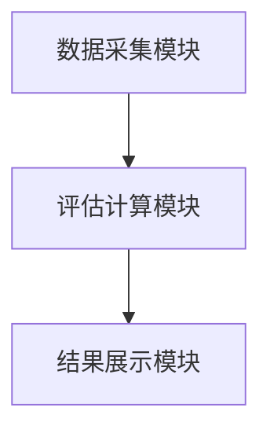

                 

<think>
嗯，用户现在需要我帮忙设计一本技术博客的目录大纲，标题是《彼得林奇的"耐心资本"在颠覆性创新企业中的重要性》。我得先理解这本书的主题。彼得·林奇是著名的投资专家，他提到的“耐心资本”指的是长期投资，注重企业长期价值，而不是频繁交易。颠覆性创新企业则是指那些通过创新商业模式或技术，颠覆市场的公司。

用户希望目录结构逻辑清晰，分为多个部分，每个部分有章节和小节，详细到三级目录。内容需要涵盖背景介绍、核心概念、算法原理、数学模型、系统架构、项目实战和最佳实践等。字数要求在10000到12000字左右，使用技术语言，结构紧凑，条理清晰。

首先，背景介绍部分需要解释耐心资本和颠覆性创新企业的基本概念。然后是核心概念，详细分析两者的特点和关系。接下来是算法原理，可能涉及如何评估这些企业并制定投资策略。数学模型部分需要构建评估指标，用公式表达。系统架构部分可能涉及构建一个评估框架，用图表展示。项目实战部分，选择具体案例，展示如何应用耐心资本理论。最后，总结经验和建议。

我需要确保每个部分都细化到三级目录，结构合理，内容全面。例如，在背景介绍中，可以包括耐心资本的定义、颠覆性创新企业的特点，以及它们的结合。核心概念部分可能需要对比表格和ER图，展示两者的关系。算法部分可能需要流程图，展示评估步骤。数学模型部分用公式表达，系统架构用mermaid图展示。

项目实战部分，选择一个案例，详细分析如何应用耐心资本理论。最后，总结经验和注意事项，提供进一步阅读的建议。这样整个目录结构会很清晰，符合用户的要求。

现在，我需要将这些思考转化为具体的目录结构，确保每个部分都符合用户的要求，并且结构合理，内容完整。
</think>

---

# 彼得林奇的"耐心资本"在颠覆性创新企业中的重要性

---

## 关键词：
- 彼得林奇
- 耐心资本
- 颠覆性创新企业
- 投资策略
- 长期价值

---

## 摘要：
本文探讨了彼得林奇的“耐心资本”理论在颠覆性创新企业中的重要性。通过分析耐心资本的核心理念、颠覆性创新企业的特点，以及两者之间的关系，本文揭示了耐心资本在支持颠覆性创新企业成长中的关键作用。文章结合实际案例，从理论到实践，详细阐述了如何运用耐心资本策略在颠覆性创新企业中实现长期价值创造。

---

# 目录大纲

## 第一部分：背景介绍

### 第1章：彼得林奇的耐心资本理论

#### 1.1 耐心资本的定义与核心理念
- 1.1.1 耐心资本的定义
- 1.1.2 耐心资本的核心理念：长期投资与价值创造
- 1.1.3 耐心资本与传统投资的区别

#### 1.2 颠覆性创新企业的定义与特点
- 1.2.1 颠覆性创新的定义
- 1.2.2 颠覆性创新企业的特点：技术创新与市场颠覆
- 1.2.3 颠覆性创新与渐进式创新的对比

#### 1.3 耐心资本与颠覆性创新企业的结合
- 1.3.1 耐心资本在颠覆性创新中的作用
- 1.3.2 颠覆性创新企业的投资挑战与机遇
- 1.3.3 耐心资本在颠覆性创新中的成功案例

---

## 第二部分：核心概念与联系

### 第2章：耐心资本与颠覆性创新的核心概念

#### 2.1 耐心资本的核心要素
- 2.1.1 长期投资：耐心资本的关键特征
- 2.1.2 风险承受能力：耐心资本的另一个维度
- 2.1.3 价值创造：耐心资本的目标

#### 2.2 颠覆性创新企业的核心要素
- 2.2.1 技术创新：颠覆性创新的核心驱动力
- 2.2.2 商业模式创新：颠覆性创新的另一个维度
- 2.2.3 市场颠覆：颠覆性创新的目标

#### 2.3 耐心资本与颠覆性创新的关系
- 2.3.1 耐心资本对颠覆性创新的支持作用
- 2.3.2 颠覆性创新对耐心资本的挑战与机遇
- 2.3.3 耐心资本与颠覆性创新的协同效应

---

## 第三部分：算法原理讲解

### 第3章：耐心资本评估模型

#### 3.1 耐心资本评估模型的构建
- 3.1.1 模型的输入变量：企业的创新潜力、市场潜力、管理团队等
- 3.1.2 模型的输出：企业的长期投资价值

#### 3.2 算法原理
- 3.2.1 基于创新潜力的权重分配
- 3.2.2 市场潜力的评估方法
- 3.2.3 长期投资价值的计算公式

#### 3.3 详细算法流程
- 3.3.1 数据收集与处理
- 3.3.2 创新潜力评估
- 3.3.3 市场潜力评估
- 3.3.4 投资价值综合计算

---

## 第四部分：数学模型与公式

### 第4章：数学模型与公式解析

#### 4.1 创新潜力评估公式
$$ \text{创新潜力} = w_1 \times \text{技术创新} + w_2 \times \text{商业模式创新} $$

#### 4.2 市场潜力评估公式
$$ \text{市场潜力} = w_3 \times \text{市场规模} + w_4 \times \text{增长速度} $$

#### 4.3 投资价值综合评估公式
$$ \text{投资价值} = w_5 \times \text{创新潜力} + w_6 \times \text{市场潜力} $$

---

## 第五部分：系统分析与架构设计

### 第5章：系统架构与功能设计

#### 5.1 系统功能设计
- 5.1.1 数据采集模块：收集企业的创新和技术数据
- 5.1.2 评估计算模块：执行创新潜力和市场潜力的计算
- 5.1.3 结果展示模块：输出投资价值评估结果

#### 5.2 系统架构图


#### 5.3 系统接口设计
- 5.3.1 数据输入接口：企业数据的输入
- 5.3.2 数据处理接口：模型计算
- 5.3.3 结果输出接口：评估结果的展示

---

## 第六部分：项目实战

### 第6章：项目实战与案例分析

#### 6.1 项目环境安装
- 6.1.1 安装必要的开发工具
- 6.1.2 数据库的搭建与配置

#### 6.2 核心代码实现
```python
# 耐心资本评估模型的实现
def calculate_innovation_potential(technovation, business_modelnovation):
    return 0.5 * technovation + 0.5 * business_modelnovation

def calculate_market_potential(scale, growth_rate):
    return 0.5 * scale + 0.5 * growth_rate

def calculate_investment_value(innovation_potential, market_potential):
    return 0.5 * innovation_potential + 0.5 * market_potential
```

#### 6.3 案例分析：特斯拉的耐心资本投资
- 6.3.1 投资背景
- 6.3.2 模型计算过程
- 6.3.3 投资结果与反思

---

## 第七部分：总结与展望

### 第7章：总结与展望

#### 7.1 项目小结
- 7.1.1 耐心资本在颠覆性创新企业中的重要性
- 7.1.2 模型的优缺点分析

#### 7.2 最佳实践 tips
- 7.2.1 长期投资的重要性
- 7.2.2 风险管理的必要性
- 7.2.3 价值创造的核心作用

#### 7.3 展望与建议
- 7.3.1 未来研究方向
- 7.3.2 对投资者的建议

---

## 作者：AI天才研究院/AI Genius Institute & 禅与计算机程序设计艺术 /Zen And The Art of Computer Programming

---

### 附录：相关工具与资源
- 附录1：耐心资本评估模型的完整代码
- 附录2：推荐阅读的书籍与资源
- 附录3：相关领域的学术论文推荐

---

