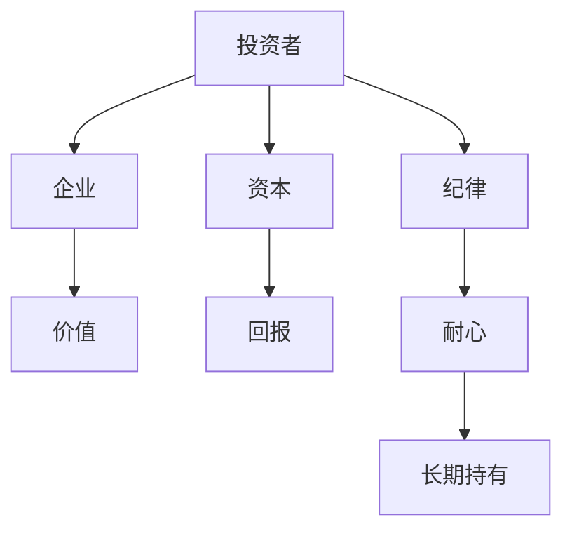
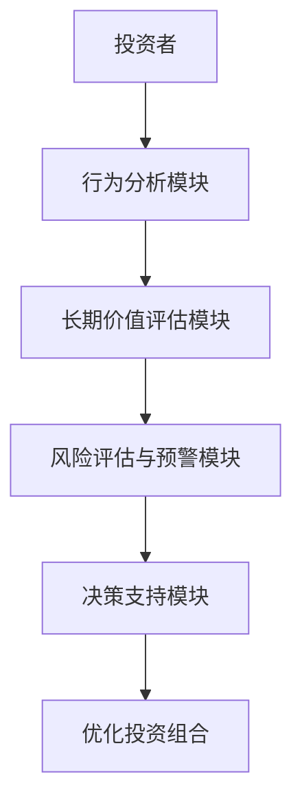

                 


# 彼得林奇的"耐心资本"概念

> 关键词：耐心资本，彼得林奇，投资策略，长期投资，价值投资

> 摘要：本文深入探讨了彼得林奇提出的“耐心资本”概念，分析其在投资策略中的核心地位，结合实际案例和系统架构，详细阐述了耐心资本的原理、应用场景及其在现代投资中的重要性。

---

## 第一章：耐心资本的背景与概念

### 1.1 耐心资本的定义与内涵

#### 1.1.1 耐心资本的定义
耐心资本（Patient Capital）是一种长期投资策略，强调投资者在投资过程中保持耐心，不因短期市场波动而改变投资决策。其核心在于通过长期持有优质资产，实现价值的稳步增长。

#### 1.1.2 耐心资本的核心内涵
耐心资本不仅仅是一种投资策略，更是一种投资心态。它要求投资者具备足够的耐心和纪律，能够在市场波动中保持冷静，避免被短期利益驱动。

#### 1.1.3 耐心资本与传统资本的区别
| 要素 | 耐心资本 | 传统资本 |
|------|----------|-----------|
| 投资期限 | 长期 | 短期 |
| 投资目标 | 实现长期价值增长 | 追求短期收益 |
| 风险承受能力 | 较高 | 较低 |

### 1.2 彼得林奇与耐心资本的关系

#### 1.2.1 彼得林奇的生平简介
彼得·林奇（Peter Lynch）是美国著名投资经理，曾管理富达麦哲伦基金（Fidelity Magellan Fund），创造了辉煌的投资业绩。他的投资理念以“价值投资”和“长期持有”为核心。

#### 1.2.2 彼得林奇对耐心资本的贡献
彼得林奇通过长期投资优质企业，验证了耐心资本的有效性。他强调，成功的投资需要耐心等待企业的成长，而不是频繁交易以追求短期收益。

#### 1.2.3 彼得林奇投资理念的核心思想
- **价值投资**：寻找具有长期增长潜力的公司。
- **长期持有**：避免频繁交易，降低交易成本。
- **分散投资**：通过投资多个优质企业降低风险。

### 1.3 耐心资本的背景与问题背景

#### 1.3.1 当代投资环境的变化
现代金融市场波动剧烈，短期资本追求快速收益，导致投资行为短期化。这种趋势忽视了企业的长期成长，影响了投资的可持续性。

#### 1.3.2 高速投资与短期收益的局限性
短期投资容易受到市场波动的影响，难以实现稳定的收益。同时，频繁交易增加了成本，降低了净收益。

#### 1.3.3 耐心资本在长期投资中的重要性
在经济全球化和企业长期成长的背景下，耐心资本能够更好地捕捉企业的长期增长机会，实现稳定的投资回报。

---

## 第二章：耐心资本的核心概念与原理

### 2.1 耐心资本的核心要素

#### 2.1.1 投资心态：耐心与纪律
耐心资本要求投资者具备耐心，能够在市场低谷中坚持持有，避免因恐慌卖出。同时，纪律性确保投资者遵循既定的投资策略，避免情绪化决策。

#### 2.1.2 投资策略：长期价值导向
耐心资本的核心策略是寻找具有长期增长潜力的企业，通过长期持有实现价值增长。这种策略强调对企业基本面的深入研究。

#### 2.1.3 投资对象：优质企业的选择标准
- **行业地位**：选择行业龙头或具有竞争优势的企业。
- **财务健康**：关注企业的盈利能力、资产负债情况和现金流。
- **管理团队**：优秀的管理团队是企业长期增长的关键。

### 2.2 耐心资本的属性特征对比

#### 2.2.1 耐心资本与风险资本的对比
| 要素 | 耐心资本 | 风险资本 |
|------|----------|-----------|
| 投资目标 | 实现长期稳定回报 | 追求高风险高回报 |
| 投资期限 | 长期 | 短期 |
| 资本退出方式 | 股权转让或分红 | 通过 IPO 或并购退出 |

#### 2.2.2 耐心资本与杠杆资本的对比
| 要素 | 耐心资本 | 杠杆资本 |
|------|----------|-----------|
| 财务杠杆 | 无杠杆或低杠杆 | 高杠杆 |
| 风险 | 低风险 | 高风险 |
| 收益 | 稳定回报 | 高风险高回报 |

#### 2.2.3 耐心资本与短期资本的对比
| 要素 | 耐心资本 | 短期资本 |
|------|----------|-----------|
| 投资期限 | 长期 | 短期 |
| 风险承受能力 | 高 | 低 |
| 投资目标 | 长期价值增长 | 短期收益 |

### 2.3 耐心资本的ER实体关系图



---

## 第三章：耐心资本的算法与数学模型

### 3.1 耐心资本的评估模型

#### 3.1.1 资本回报率（ROI）的计算公式
$$ ROI = \frac{\text{净利润}}{\text{初始投资}} \times 100\% $$

#### 3.1.2 投资期限与回报的关系
$$ R = P \times (1 + r)^n $$
其中，$R$ 为最终回报，$P$ 为初始投资，$r$ 为年化回报率，$n$ 为投资期限。

### 3.2 耐心资本的风险评估模型

#### 3.2.1 风险调整后的资本资产定价模型（CAPM）
$$ R_i = R_f + \beta_i (R_m - R_f) $$
其中，$R_i$ 为资产的期望回报率，$R_f$ 为无风险利率，$\beta_i$ 为资产的贝塔系数，$R_m$ 为市场期望回报率。

#### 3.2.2 风险调整后的投资组合优化
通过引入风险调整因子，优化投资组合的回报与风险比。例如，使用均值-方差优化模型：
$$ \text{Minimize } \sigma^2 \text{ subject to } \mu \geq \text{目标回报率} $$

---

## 第四章：耐心资本的系统分析与架构设计

### 4.1 问题场景介绍

#### 4.1.1 投资者面临的挑战
- 市场波动导致投资决策困难。
- 短期收益与长期价值的权衡。

#### 4.1.2 系统功能设计
- 投资者行为分析模块。
- 长期价值评估模块。
- 风险评估与预警模块。

### 4.2 系统架构设计

#### 4.2.1 系统架构图


#### 4.2.2 领域模型类图
```mermaid
classDiagram
    class 投资者 {
        +资金: 资金量
        +风险偏好: 风险等级
        +投资目标: 收益目标
    }
    class 企业 {
        +行业: 行业
        +财务状况: 财务数据
        +管理团队: 团队信息
    }
    class 长期价值 {
        +增长潜力: 评估指标
        +竞争优势: 核心优势
    }
    class 风险评估 {
        +波动风险: 评估结果
        +市场风险: 评估结果
    }
   抽彖抽彖抽彖抽彖抽彖抽彖抽彖抽彖抽彖抽彖抽彖抽彖抽彖抽彖抽彖抽彖抽彖抽彖抽彖抽彖抽彖抽彖抽彖抽彖抽彖抽彖抽彖抽彖抽彖抽彖抽彖抽彖抽彖抽彖抽彖抽彖抽彖抽彖抽彖抽彖抽彖抽彖抽彖抽彖抽彖抽彖抽彖抽彖抽彖抽彖抽彖抽彖抽彖抽彖抽彖抽彖抽彖抽彖抽彖抽彖抽彖抽彖抽彖抽彖抽彖抽彖抽彖抽彖抽彖抽彖抽彖抽彖抽彖抽彖抽彖抽彖抽彖抽彖抽彖抽彖抽彖抽彖抽彖抽彖抽彖抽彖抽彖抽彖抽彖抽彖抽彖抽彖抽彖抽彖抽彖抽彖抽彖抽彖抽彖抽彖抽彖抽彖抽彖抽彖抽彖抽彖抽彖抽彖抽彖抽彖抽彖抽彖抽彖抽彖抽彖抽彖抽彖抽彖抽彖抽彖抽彖抽彖抽彖抽彖抽彖抽彖抽彖抽彖抽彖抽彖抽彖抽彖抽彖抽彖抽彖抽彖抽彖抽彖抽彖抽彖抽彖抽彖抽彖抽彖抽彖抽彖抽彖抽彖抽彖抽彖抽彖抽彖抽彖抽彖抽彖抽彖抽彖抽彖抽彖抽彖抽彖抽彖抽彖抽彖抽彖抽彖抽彖抽彖抽彖抽彖抽彖抽彖抽彖抽彖抽彖抽彖抽彖抽彖抽彖抽彖抽彖抽彖抽彖抽彖抽彖抽彖抽彖抽彖抽彖抽彖抽彖抽彖抽彖抽彖抽彖抽彖抽彖抽彖抽彖抽彖抽彖抽彖抽彖抽彖抽彖抽彖抽彖抽彖抽彖抽彖抽彖抽彖抽彖抽彖抽彖抽彖抽彖抽彖抽彖抽彖抽彖抽彖抽彖抽彖抽彖抽彖抽彖抽彖抽彖抽彖抽彖抽彖抽彖抽彖抽彖抽彖抽彖抽彖抽彖抽彖抽彖抽彖抽彖抽彖抽彖抽彖抽彖抽彖抽彖抽彖抽彖抽彖抽彖抽彖抽彖抽彖抽彖抽彖抽彖抽彖抽彖抽彖抽彖抽彖抽彖抽彖抽彖抽彖抽彖抽彖抽彖抽彖抽彖抽彖抽彖抽彖抽彖抽彖抽彖抽彖抽彖抽彖抽彖抽彖抽彖抽彖抽彖抽彖抽彖抽彖抽彖抽彖抽彖抽彖抽彖抽彖抽彖抽彖抽彖抽彖抽彖抽彖抽彖抽彖抽彖抽彖抽彖抽彖抽彖抽彖抽彖抽彖抽彖抽彖抽彖抽彖抽彖抽彖抽彖抽彖抽彖抽彖抽彖抽彖抽彖抽彖抽彖抽彖抽彖抽彖抽彖抽彖抽彖抽彖抽彖抽彖抽彖抽彖抽彖抽彖抽彖抽彖抽彖抽彖抽彖抽彖抽彖抽彖抽彖抽彖抽彖抽彖抽彖抽彖抽彖抽彖抽彖抽彖抽彖抽彖抽彖抽彖抽彖抽彖抽彖抽彖抽彖抽彖抽彖抽彖抽彖抽彖抽彖抽彖抽彖抽彖抽彖抽彖抽彖抽彖抽彖抽彖抽彖抽彖抽彖抽彖抽彖抽彖抽彖抽彖抽彖抽彖抽彖抽彖抽彖抽彖抽彖抽彖抽彖抽彖抽彖抽彖抽彖抽彖抽彖抽彖抽彖抽彖抽彖抽彖抽彖抽彖抽彖抽彖抽彖抽彖抽彖抽彖抽彖抽彖抽彖抽彖抽彖抽彖抽彖抽彖抽彖抽彖抽彖抽彖抽彖抽彖抽彖抽彖抽彖抽彖抽彖抽彖抽彖抽彖抽彖抽彖抽彖抽彖抽彖抽彖抽彖抽彖抽彖抽彖抽彖抽彖抽彖抽彖抽彖抽彖抽彖抽彖抽彖抽彖抽彖抽彖抽彖抽彖抽彖抽彖抽彖抽彖抽彖抽彖抽彖抽彖抽彖抽彖抽彖抽彖抽彖抽彖抽彖抽彖抽彖抽彖抽彖抽彖抽彖抽彖抽彖抽彖抽彖抽彖抽彖抽彖抽彖抽彖抽彖抽彖抽彖抽彖抽彖抽彖抽彖抽彖抽彖抽彖抽彖抽彖抽彖抽彖抽彖抽彖抽彖抽彖抽彖抽彖抽彖抽彖抽彖抽彖抽彖抽彖抽彖抽彖抽彖抽彖抽彖抽彖抽彖抽彖抽彖抽彖抽彖抽彖抽彖抽彖抽彖抽彖抽彖抽彖抽彖抽彖抽彖抽彖抽彖抽彖抽彖抽彖抽彖抽彖抽彖抽彖抽彖抽彖抽彖抽彖抽彖抽彖抽彖抽彖抽彖抽彖抽彖抽彖抽彖抽彖抽彖抽彖抽彖抽彖抽彖抽彖抽彖抽彖抽彖抽彖抽彖抽彖抽彖抽彖抽彖抽彖抽彖抽彖抽彖抽彖抽彖抽彖抽彖抽彖抽彖抽彖抽彖抽彖抽彖抽彖抽彖抽彖抽彖抽彖抽彖抽彖抽彖抽彖抽彖抽彖抽彖抽彖抽彖抽彖抽彖抽彖抽彖抽彖抽彖抽彖抽彖抽彖抽彖抽彖抽彖抽彖抽彖抽彖抽彖抽彖抽彖抽彖抽彖抽彖抽彖抽彖抽彖抽彖抽彖抽彖抽彖抽彖抽彖抽彖抽彖抽彖抽彖抽彖抽彖抽彖抽彖抽彖抽彖抽彖抽彖抽彖抽彖抽彖抽彖抽彖抽彖抽彖抽彖抽彖抽彖抽彖抽彖抽彖抽彖抽彖抽彖抽彖抽彖抽彖抽彖抽彖抽彖抽彖抽彖抽彖抽彖抽彖抽彖抽彖抽彖抽彖抽彖抽彖抽彖抽彖抽彖抽彖抽彖抽彖抽彖抽彖抽彖抽彖抽彖抽彖抽彖抽彖抽彖抽彖抽彖抽彖抽彖抽彖抽彖抽彖抽彖抽彖抽彖抽彖抽彖抽彖抽彖抽彖抽彖抽彖抽彖抽彖抽彖抽彖抽彖抽彖抽彖抽彖抽彖抽彖抽彖抽彖抽彖抽彖抽彖抽彖抽彖抽彖抽彖抽彖抽彖抽彖抽彖抽彖抽彖抽彖抽彖抽彖抽彖抽彖抽彖抽彖抽彖抽彖抽彖抽彖抽彖抽彖抽彖抽彖抽彖抽彖抽彖抽彖抽彖抽彖抽彖抽彖抽彖抽彖抽彖抽彖抽彖抽彖抽彖抽彖抽彖抽彖抽彖抽彖抽彖抽彖抽彖抽彖抽彖抽彖抽彖抽彖抽彖抽彖抽彖抽彖抽彖抽彖抽彖抽彖抽彖抽彖抽彖抽彖抽彖抽彖抽彖抽彖抽彖抽彖抽彖抽彖抽彖抽彖抽彖抽彖抽彖抽彖抽彖抽彖抽 transistor

