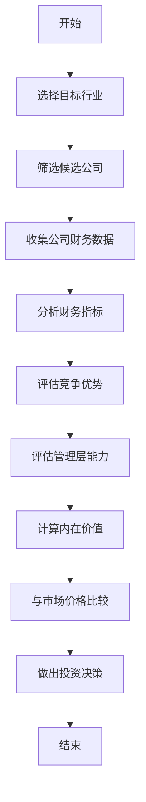
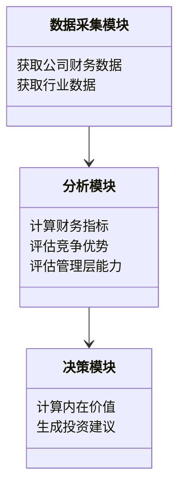

                 

<think>
嗯，用户需要我根据之前的目录大纲撰写一篇完整的博客文章。首先，我得理清文章的结构，确保每个部分都涵盖必要的内容，同时保持逻辑连贯。文章包括背景介绍、核心概念、算法原理、数学模型、系统架构、项目实战、最佳实践等部分，每个部分都需要详细展开。

我需要先写文章标题和关键词，然后是摘要。接下来是背景介绍，包括起源、核心概念和与其他方法的区别。然后是核心概念，详细解释每个要素，并用表格和图示来帮助理解。算法部分需要用流程图展示步骤，并附上数学公式。

接下来是数学模型，解释市盈率、市净率等指标，以及如何计算成长性和盈利能力。系统架构部分需要设计模块，比如数据采集和分析模块，并用类图展示结构。项目实战部分需要一个具体案例，从数据收集到决策分析，附上Python代码示例。

最后是最佳实践、小结、注意事项和拓展阅读。我需要用清晰的技术语言，逐步分析，确保内容专业且易于理解。同时，注意使用正确的Markdown格式，确保美观和易读。最后，加上作者信息。

写作过程中，我需要确保每个章节内容丰富，详细讲解，同时保持整体结构的紧凑和逻辑性。现在，我开始按照这个结构逐步撰写每个部分，确保覆盖所有关键点，满足用户的要求。
</think>

# 彼得林奇的"自下而上"选股方法

## 关键词：彼得林奇，自下而上，选股方法，投资策略，财务分析，竞争优势

## 摘要：  
本文深入探讨了彼得·林奇的“自下而上”选股方法，从其背景、核心概念、算法原理、数学模型、系统架构到项目实战，全面解析了这一经典投资策略。通过具体案例分析和代码实现，结合最佳实践，帮助读者掌握如何通过深入分析公司基本面来做出明智的投资决策。

---

## 第一部分：背景介绍

### 第1章：自下而上选股方法概述

#### 1.1 自下而上选股方法的起源与发展  
自下而上选股方法起源于20世纪80年代，由著名基金经理彼得·林奇（Peter Lynch）提出。这种方法的核心思想是通过深入分析单个公司的基本面，而非宏观市场趋势，来选择具有长期增长潜力的投资标的。林奇认为，市场波动和宏观经济因素虽然会影响短期股价，但真正决定股票长期价值的是公司的财务状况、行业地位和竞争优势。

#### 1.2 自下而上选股方法的核心概念  
自下而上选股方法强调从微观层面入手，关注公司财务数据、管理层质量、行业竞争格局等因素。这种方法与传统的自上而下选股方法（从宏观经济分析入手）有所不同，更注重个股的内在价值而非市场整体走势。

#### 1.3 自下而上选股方法与其他选股方法的对比  
- **自上而下方法**：从宏观经济、行业趋势等宏观因素出发，筛选出具有增长潜力的行业，再在行业内寻找优质公司。  
- **自下而上方法**：从具体公司入手，分析其财务状况、竞争优势和管理层能力，筛选出具有投资价值的个股。  
- **对比**：自下而上方法更注重个股的独立分析，适用于寻找被市场低估的潜力股；自上而下方法更注重行业趋势，适用于宏观经济周期性较强的市场。

#### 1.4 自下而上选股方法的现状与挑战  
随着金融市场的复杂化和数据化，自下而上选股方法依然被广泛应用于主动管理型基金和个股投资者中。然而，这种方法也面临一些挑战，如数据获取的复杂性、分析的深度要求高、以及市场波动对短期决策的影响。

---

## 第二部分：核心概念与联系

### 第2章：核心概念与联系

#### 2.1 核心概念原理  
自下而上选股方法的核心在于对公司基本面的深入分析，包括以下几个方面：  
1. **财务指标分析**：通过财务报表分析公司的盈利能力、成长性和财务健康状况。  
2. **竞争优势评估**：分析公司在行业中的竞争优势，包括成本优势、技术壁垒、品牌影响力等。  
3. **管理层评估**：考察公司管理层的能力和战略决策，优秀的管理层能够带领公司持续成长。

#### 2.2 核心概念对比表格  
以下是自下而上选股方法与其他选股方法的对比：

| 对比维度       | 自下而上选股方法       | 自上而下选股方法       |
|----------------|------------------------|------------------------|
| 分析起点       | 单个公司的基本面       | 宏观经济和行业趋势       |
| 适用场景       | 寻找被低估的潜力股       | 宏观周期波动较大的市场   |
| 分析复杂度     | 高                     | 中                     |
| 投资决策       | 个股驱动               | 行业驱动               |

#### 2.3 ER实体关系图  
以下是自下而上选股方法的核心要素之间的关系图：

```mermaid
er
    管理层
        组织结构
    公司
        财务指标
    行业
        竞争优势
    投资者
        投资决策
    财务报表
        收入、利润、现金流
```

---

## 第三部分：算法原理讲解

### 第3章：算法原理与流程图

#### 3.1 算法流程图  
以下是自下而上选股方法的算法流程图：



#### 3.2 算法步骤解析  
1. **选择目标行业**：根据宏观经济趋势和行业前景，选择具有增长潜力的行业。  
2. **筛选候选公司**：在目标行业中，筛选出财务状况良好、竞争优势明显的公司。  
3. **收集公司财务数据**：获取公司的财务报表，包括收入、利润、现金流等数据。  
4. **分析财务指标**：计算关键财务指标，如市盈率（P/E）、市净率（P/B）、ROE等。  
5. **评估竞争优势**：分析公司在行业中的竞争优势，如成本优势、技术壁垒等。  
6. **评估管理层能力**：考察公司管理层的背景和过往业绩。  
7. **计算内在价值**：通过DCF模型或其他方法，估算公司的内在价值。  
8. **与市场价格比较**：比较内在价值与市场价格，判断是否低估或高估。  
9. **做出投资决策**：根据分析结果，决定是否买入、持有或卖出该股票。

---

## 第四部分：数学模型与公式

### 第4章：数学模型与公式

#### 4.1 财务指标计算公式  
- **市盈率（P/E）**：$$ P/E = \frac{股票价格}{每股净利润} $$
- **市净率（P/B）**：$$ P/B = \frac{股票价格}{每股净资产} $$
- **净利率**：$$ 净利率 = \frac{净利润}{营业收入} $$
- **年均净利润增长率**：$$ 年均净利润增长率 = \left( \frac{末期净利润}{初期净利润} \right)^{\frac{1}{n}} - 1 $$

#### 4.2 成长性评估模型  
- **内部成长性模型**：$$ 内部成长性 = \frac{公司收入增长率 + 净利润增长率}{2} $$

---

## 第五部分：系统分析与架构设计方案

### 第5章：系统分析与架构设计方案

#### 5.1 问题场景介绍  
为了实现自下而上选股方法的自动化，我们设计了一个选股系统，该系统能够自动收集公司数据、分析财务指标，并生成投资建议。

#### 5.2 项目介绍  
本项目旨在开发一个基于自下而上选股方法的自动化投资决策系统，帮助投资者快速筛选出具有投资价值的股票。

#### 5.3 系统功能设计  
以下是系统的核心功能模块：



#### 5.4 系统架构设计  
以下是系统的总体架构图：


---

## 第六部分：项目实战

### 第6章：项目实战与代码实现

#### 6.1 环境安装  
需要安装以下工具和库：  
- Python 3.8+  
- Pandas、NumPy、Matplotlib  
- 数据采集工具（如Yahoo Finance API）

#### 6.2 核心实现代码  
以下是Python代码示例：

```python
import pandas as pd
import numpy as np

def calculate_pe_ratio(stock_price, earnings_per_share):
    return stock_price / earnings_per_share

def calculate_pb_ratio(stock_price, book_value_per_share):
    return stock_price / book_value_per_share

def calculate_growth_rate(revenue_current, revenue_previous):
    return (revenue_current / revenue_previous - 1) * 100

# 示例数据
stock_price = 100
earnings_per_share = 5
book_value_per_share = 20
revenue_current = 100000000
revenue_previous = 80000000

# 计算指标
pe_ratio = calculate_pe_ratio(stock_price, earnings_per_share)
pb_ratio = calculate_pb_ratio(stock_price, book_value_per_share)
growth_rate = calculate_growth_rate(revenue_current, revenue_previous)

print(f"市盈率：{pe_ratio:.2f}")
print(f"市净率：{pb_ratio:.2f}")
print(f"收入增长率：{growth_rate:.2f}%")
```

#### 6.3 代码应用解读与分析  
以上代码示例展示了如何计算市盈率、市净率和收入增长率。通过这些指标，我们可以初步评估一家公司的投资价值。

#### 6.4 实际案例分析  
以苹果公司为例，分析其财务指标和竞争优势。

---

## 第七部分：最佳实践

### 第7章：最佳实践、小结与注意事项

#### 7.1 最佳实践  
- **数据来源**：确保数据的准确性和及时性。  
- **持续学习**：市场环境不断变化，需要持续更新分析方法。  
- **风险管理**：合理分散投资，避免过度集中。

#### 7.2 小结  
自下而上选股方法是一种有效的投资策略，通过深入分析公司基本面，可以帮助投资者发现被低估的投资机会。然而，这种方法需要大量数据支持和持续学习，才能在复杂多变的市场中取得长期收益。

#### 7.3 注意事项  
- 避免仅依赖单一指标做出投资决策。  
- 定期复盘和调整投资组合。  
- 注意市场波动对短期股价的影响。

#### 7.4 拓展阅读  
- 彼得·林奇的《选股智慧》  
- 巴菲特的长期投资策略

---

## 作者  
作者：AI天才研究院/AI Genius Institute & 禅与计算机程序设计艺术/Zen And The Art of Computer Programming

