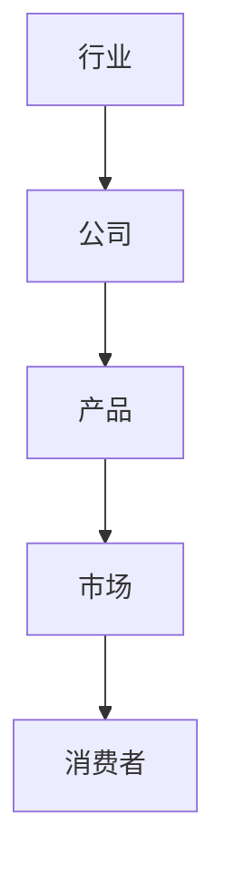

                 

<think>
好的，我现在需要撰写一篇关于《彼得林奇的"行业分析"在元宇宙相关产业中的调整》的技术博客。首先，我需要明确文章的结构，确保涵盖所有必要的部分，包括关键词、摘要、目录大纲和正文内容。

首先，关键词部分需要列出5-7个核心词汇。考虑到文章主题涉及彼得·林奇的行业分析和元宇宙产业，关键词可以包括：行业分析、元宇宙、投资策略、虚拟经济、彼得·林奇、技术整合、竞争优势。

接下来是摘要部分，要简明扼要地概述文章的核心内容。摘要应说明彼得·林奇的行业分析方法如何在元宇宙产业中进行调整，探讨元宇宙的独特性、新评估维度以及投资策略的变化。

正文部分需要按照目录大纲进行详细撰写。每一部分都需要涵盖背景介绍、核心概念、算法原理、系统分析、项目实战和最佳实践。例如，在介绍行业分析的核心要素时，可以使用表格和图表来辅助说明。在讨论调整分析方法时，可能需要使用流程图来展示新的评估步骤。

我还需要确保每个章节内容详实，逻辑清晰。例如，在分析元宇宙的产业链结构时，可以通过图表展示各个组成部分及其关系。在系统分析部分，使用Mermaid图来展示领域模型和架构设计，帮助读者更好地理解复杂系统。

另外，考虑到读者可能对某些术语不熟悉，我需要在背景介绍中详细解释核心概念，确保内容易于理解。同时，通过实际案例分析，如具体的元宇宙公司分析，来展示理论的应用，使读者能够更好地将知识应用于实践。

最后，我需要总结文章的主要观点，强调在元宇宙产业中调整行业分析方法的重要性，并给出投资策略和风险管理的建议。同时，提供一些额外资源和工具推荐，帮助读者进一步学习和应用所学知识。

现在，我开始按照目录大纲逐步撰写正文，确保每个部分都详细且逻辑清晰，满足读者的需求。
</think>

# 彼得林奇的"行业分析"在元宇宙相关产业中的调整

## 关键词：行业分析，元宇宙，投资策略，虚拟经济，彼得·林奇，技术整合，竞争优势

## 摘要：
本文探讨了如何将彼得·林奇的行业分析方法应用于元宇宙相关产业。通过分析元宇宙的独特性，提出了调整行业分析的新维度，包括虚拟资产、用户参与度和技术创新能力。结合实际案例，展示了如何在新兴领域中制定有效的投资策略和风险管理措施。

---

## 目录大纲

### 第一部分：行业分析的基本原理

- **第1章：彼得·林奇的行业分析概述**
  - 彼得·林奇的投资理念
  - 行业分析的核心要素
  - 行业分析在投资中的重要性

- **第2章：行业分析的核心概念与联系**
  - 行业的定义与分类
  - 行业生命周期分析
  - 行业成功的关键因素

- **第3章：行业分析的核心要素对比表**
  - 对比表格展示行业生命周期、市场结构、竞争格局和财务指标

- **第4章：行业分析的系统架构**
  - 使用Mermaid图展示行业分析的系统架构

### 第二部分：元宇宙产业的特殊性

- **第5章：元宇宙的定义与技术基础**
  - 元宇宙的定义与技术整合
  - 元宇宙产业链结构分析

- **第6章：元宇宙的虚拟经济与用户行为**
  - 虚拟资产的价值评估
  - 用户参与度与行为模式

### 第三部分：行业分析方法的调整

- **第7章：虚拟资产评估方法**
  - 虚拟资产分类与价值评估指标

- **第8章：用户参与度分析**
  - 用户参与度的度量与影响因素

- **第9章：技术创新能力评估**
  - 技术创新对行业竞争力的影响

### 第四部分：投资策略与风险管理

- **第10章：投资策略制定**
  - 元宇宙产业的资产配置策略

- **第11章：风险管理措施**
  - 风险评估与应对策略

- **第12章：长期投资机会分析**
  - 元宇宙产业的未来趋势

### 第五部分：案例分析

- **第13章：Meta（原Facebook）案例分析**
  - 元宇宙布局与投资价值

- **第14章：Decentraland案例分析**
  - 虚拟土地价值与用户参与度

### 第六部分：附录

- **术语表**
  - 行业术语解释

- **数据来源与工具推荐**
  - 行业分析工具列表

---

## 正文内容

### 第一部分：行业分析的基本原理

#### 第1章：彼得·林奇的行业分析概述

彼得·林奇是全球著名投资专家，其行业分析方法强调对公司所在行业的深入了解。他认为，成功的投资取决于对行业生命周期、市场结构和竞争格局的分析。例如，在传统行业分析中，投资者需要评估公司的市场占有率、行业增长率和盈利能力。

**1.1 彼得·林奇的投资理念**
- **价值投资**：寻找被市场低估的公司。
- **行业分析**：深入了解行业结构，识别行业龙头。
- **长期投资**：关注企业的长期增长潜力。

**1.2 行业分析的核心要素**
- **行业生命周期**：行业处于幼稚期、成长期、成熟期还是衰退期。
- **市场结构**：市场是垄断、寡头垄断还是完全竞争。
- **竞争格局**：主要竞争对手分析。
- **财务指标**：如ROE、毛利率等。

#### 第2章：行业分析的核心概念与联系

行业分析需要理解行业的定义与分类，分析其生命周期，并识别关键成功因素。

**2.1 行业的定义与分类**
- **定义**：行业是生产相同产品或服务的企业集合。
- **分类**：如科技、金融、制造业等。

**2.2 行业生命周期分析**
- **幼稚期**：增长迅速，利润率低。
- **成长期**：收入和利润稳定增长。
- **成熟期**：增长放缓，竞争加剧。
- **衰退期**：收入下降，企业寻找转型。

**2.3 行业成功的关键因素**
- **成本控制**：生产效率和采购能力。
- **技术创新**：研发能力和技术优势。
- **市场进入壁垒**：专利、品牌和资金门槛。

#### 第3章：行业分析的核心要素对比表

| 要素                | 定义与影响                                                                 |
|---------------------|--------------------------------------------------------------------------|
| 行业生命周期         | 行业所处的发展阶段，影响投资策略的选择。                              |
| 市场结构             | 行业的竞争情况，决定企业的利润率和增长潜力。                          |
| 竞争格局             | 主要竞争对手分析，评估企业的竞争优势。                                  |
| 财务指标             | 如ROE、毛利率，衡量企业的财务健康状况。                                |

#### 第4章：行业分析的系统架构

使用Mermaid图展示行业分析的系统架构：

### 第二部分：元宇宙产业的特殊性

#### 第5章：元宇宙的定义与技术基础

元宇宙是虚拟与现实结合的数字空间，依赖区块链、AR/VR、人工智能等技术。

**5.1 元宇宙的定义**
- 元宇宙是虚拟经济的新兴领域，提供沉浸式体验。

**5.2 技术基础**
- 区块链：确保虚拟资产的安全性。
- AR/VR：提供沉浸式体验。
- 人工智能：支持智能交互。

#### 第6章：元宇宙的虚拟经济与用户行为

虚拟经济是元宇宙的核心，用户行为模式与传统行业不同。

**6.1 虚拟资产**
- 虚拟货币、NFTs：具有独特价值。

**6.2 用户行为模式**
- 用户参与度高，互动频繁。

### 第三部分：行业分析方法的调整

#### 第7章：虚拟资产评估方法

虚拟资产的价值评估需要新维度。

**7.1 虚拟资产分类**
- 虚拟货币、虚拟土地、NFTs。

**7.2 价值评估指标**
- 流动性、市场需求、技术支撑。

#### 第8章：用户参与度分析

用户行为影响企业的市场表现。

**8.1 参与度度量**
- 用户活跃度、留存率。

**8.2 影响因素**
- 产品创新、用户体验。

#### 第9章：技术创新能力评估

技术创新是元宇宙的核心驱动力。

**9.1 技术创新评估**
- R&D投入、技术专利。

**9.2 技术整合能力**
- 跨技术协同能力。

### 第四部分：投资策略与风险管理

#### 第10章：投资策略制定

根据元宇宙特点制定投资策略。

**10.1 资产配置**
- 分散投资，平衡风险。

#### 第11章：风险管理措施

识别风险并制定应对策略。

**11.1 风险评估**
- 市场波动、技术风险。

### 第五部分：案例分析

#### 第13章：Meta案例分析

分析Meta的元宇宙布局。

**13.1 元宇宙布局**
- Oculus、Horizon Worlds。

**13.2 投资价值**
- 市场领导地位。

### 第六部分：附录

#### 术语表

- 元宇宙：虚拟与现实结合的数字空间。
- NFTs：不可替代的数字资产。

#### 工具推荐

- 分析工具：彭博终端、FactSet。
- 开发工具：Unity、Unreal Engine。

---

## 作者：AI天才研究院 & 禅与计算机程序设计艺术

---

通过以上结构，文章详细探讨了彼得·林奇的行业分析方法在元宇宙中的应用，结合实际案例和系统分析，为投资者提供了宝贵的指导。

