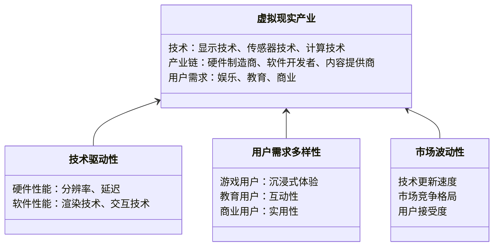
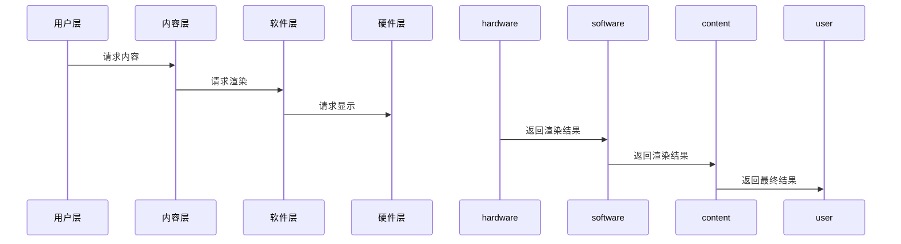

                 


# 彼得林奇的"行业分析"在虚拟现实产业中的调整

> **关键词**：彼得林奇，行业分析，虚拟现实，投资策略，产业调整

> **摘要**：本文详细探讨了如何将彼得林奇的经典行业分析方法应用于虚拟现实产业，并结合当前虚拟现实产业的特性，提出了相应的调整策略。文章从彼得林奇行业分析的核心概念出发，分析了虚拟现实产业的现状与挑战，提出了调整彼得林奇行业分析模型的具体步骤，并通过实际案例分析，展示了调整后的分析方法在虚拟现实产业中的应用效果。最后，文章总结了调整后的行业分析方法的优势，并展望了未来的发展方向。

---

## 第1章：彼得林奇的行业分析方法

### 1.1 彼得林奇行业分析的核心概念

#### 1.1.1 行业分析的基本定义

行业分析是指对某个行业内的市场结构、竞争格局、发展趋势等进行系统性研究的过程。彼得林奇作为投资大师，提出了许多独特的行业分析方法，这些方法的核心在于通过深入研究行业特征和企业基本面，寻找具有长期增长潜力的优质投资标的。

#### 1.1.2 彼得林奇的行业分析方法特点

彼得林奇的行业分析方法具有以下特点：
- **长期视角**：关注行业的长期发展趋势，而非短期波动。
- **基本面驱动**：强调对企业财务数据和市场地位的分析。
- **行业比较**：通过横向比较不同行业的表现，寻找具有竞争优势的行业。
- **动态调整**：根据市场变化和行业发展趋势，动态调整分析框架。

#### 1.1.3 行业分析在投资决策中的作用

行业分析在投资决策中起着至关重要的作用：
- **筛选优质行业**：通过行业分析，投资者可以识别出具有增长潜力的行业。
- **评估企业风险**：行业分析可以帮助投资者评估企业在行业中的竞争地位和潜在风险。
- **制定投资策略**：行业分析是制定投资策略的重要依据。

### 1.2 彼得林奇行业分析的核心要素

#### 1.2.1 行业生命周期分析

行业生命周期分析是彼得林奇行业分析的重要组成部分。行业生命周期通常分为以下几个阶段：
- **导入期**：行业刚刚进入市场，产品尚未成熟，竞争较小。
- **成长期**：行业需求快速增长，企业数量增加，竞争加剧。
- **成熟期**：行业需求趋于稳定，竞争格局基本形成。
- **衰退期**：行业需求下降，企业数量减少，技术更新缓慢。

#### 1.2.2 行业竞争结构分析

彼得林奇强调分析行业的竞争结构，以识别行业的竞争优势。主要的竞争因素包括：
- **市场集中度**：行业的市场集中度高，通常意味着行业竞争激烈。
- **进入壁垒**：行业的进入壁垒高，通常意味着行业竞争较少。
- **替代品威胁**：替代品的存在会削弱行业的竞争优势。

#### 1.2.3 行业财务指标分析

彼得林奇行业分析的核心在于财务数据的分析。以下是关键的财务指标：
- **收入增长率**：衡量行业的市场需求和增长潜力。
- **利润率**：衡量行业的盈利能力。
- **资产负债率**：衡量行业的财务健康状况。

### 1.3 彼得林奇行业分析的边界与外延

#### 1.3.1 行业分析的适用范围

彼得林奇的行业分析方法适用于所有行业，但特别适合那些具有明确市场结构和竞争格局的行业。

#### 1.3.2 行业分析的局限性

尽管彼得林奇的行业分析方法具有强大的理论基础，但也存在一些局限性：
- **行业特异性**：某些行业的特殊性可能导致分析方法的适用性降低。
- **数据依赖性**：分析结果高度依赖于数据的准确性和完整性。
- **主观性**：分析过程中涉及主观判断，可能导致结果偏差。

#### 1.3.3 行业分析与其他分析方法的区别

与其他分析方法相比，彼得林奇的行业分析方法更加注重行业的长期发展趋势和基本面因素，而非短期市场波动。

---

## 第2章：虚拟现实产业的现状与挑战

### 2.1 虚拟现实产业的定义与特点

#### 2.1.1 虚拟现实的基本概念

虚拟现实（Virtual Reality，VR）是一种通过计算机生成的三维虚拟环境，用户可以通过特定设备（如头显）与虚拟环境进行交互。

#### 2.1.2 虚拟现实产业的核心技术

虚拟现实产业的核心技术包括：
- **显示技术**：高分辨率屏幕、OLED等。
- **传感器技术**：惯性传感器、摄像头等。
- **计算技术**：高性能GPU、AI算法等。

#### 2.1.3 虚拟现实产业的市场现状

目前，虚拟现实产业处于快速发展阶段，市场容量巨大，但尚未完全成熟。

### 2.2 虚拟现实产业的主要参与者

#### 2.2.1 产业链结构分析

虚拟现实产业的产业链主要包括：
- **硬件制造商**：如 Oculus、HTC等。
- **软件开发者**：如Unity、Unreal等。
- **内容提供商**：如游戏开发商、影视制作公司等。

#### 2.2.2 主要企业的竞争格局

目前，虚拟现实产业的主要竞争格局如下：
- **硬件端**：Oculus、HTC、Sony等企业竞争激烈。
- **软件端**：Unity、Unreal等平台占据主导地位。

#### 2.2.3 产业链的关键环节分析

关键环节包括硬件制造、软件开发、内容制作等，每个环节都对整个产业的发展起着重要作用。

### 2.3 虚拟现实产业的挑战与机遇

#### 2.3.1 技术瓶颈与解决方案

当前虚拟现实产业面临的主要技术瓶颈包括：
- **硬件性能**：需要更高的分辨率和更低的延迟。
- **内容制作**：需要更多的优质内容以满足用户需求。

#### 2.3.2 市场需求与用户行为分析

虚拟现实产业的市场需求主要集中在以下几个方面：
- **娱乐**：如游戏、影视等。
- **教育**：如虚拟教室、模拟培训等。
- **商业**：如虚拟会议、虚拟展示等。

#### 2.3.3 产业政策与法规的影响

政府政策和法规对虚拟现实产业的发展具有重要影响，包括税收优惠、技术标准制定等。

---

## 第3章：彼得林奇行业分析方法在虚拟现实产业中的调整

### 3.1 虚拟现实产业的独特性对行业分析的影响

#### 3.1.1 虚拟现实产业的技术驱动性

虚拟现实产业的核心驱动力是技术创新，技术进步是推动产业发展的主要动力。

#### 3.1.2 虚拟现实产业的用户需求多样性

虚拟现实产业的用户需求具有多样性，不同用户群体的需求差异较大。

#### 3.1.3 虚拟现实产业的市场波动性

由于技术更新快、市场竞争激烈，虚拟现实产业的市场波动性较高。

### 3.2 彼得林奇行业分析模型的调整步骤

#### 3.2.1 确定调整目标

调整彼得林奇行业分析模型的目标是使其更适用于虚拟现实产业的特殊性。

#### 3.2.2 收集与整理数据

收集虚拟现实产业的相关数据，包括市场数据、技术数据、用户行为数据等。

#### 3.2.3 建立调整后的分析模型

调整后的分析模型应包含以下要素：
- **技术驱动性**：分析技术进步对行业的影响。
- **用户需求多样性**：分析不同用户群体的需求差异。
- **市场波动性**：分析市场波动对行业的影响。

### 3.3 调整后的行业分析方法的优势

#### 3.3.1 更强的技术分析能力

调整后的分析方法更注重技术驱动性，能够更好地把握虚拟现实产业的技术发展趋势。

#### 3.3.2 更精准的用户需求分析

调整后的分析方法能够更准确地分析用户需求，帮助企业制定更有效的市场策略。

#### 3.3.3 更强的市场波动适应能力

调整后的分析方法能够更好地应对市场波动，帮助企业制定更具前瞻性的投资策略。

---

## 第4章：虚拟现实产业的系统分析与架构设计

### 4.1 虚拟现实产业的系统分析

#### 4.1.1 领域模型

以下是虚拟现实产业的领域模型（Mermaid图）：



### 4.2 虚拟现实产业的架构设计

#### 4.2.1 系统架构

以下是虚拟现实产业的系统架构图（Mermaid图）：

```mermaid
container 虚拟现实产业 {
    component 硬件层 {
        头显设备
        手柄
        传感器
    }

    component 软件层 {
        操作系统
        应用程序
    }

    component 内容层 {
        游戏内容
        教育内容
        商业内容
    }

    component 用户层 {
        游戏用户
        教育用户
        商业用户
    }
}
```

### 4.3 虚拟现实产业的接口设计

以下是虚拟现实产业的接口设计（Mermaid图）：



---

## 第5章：虚拟现实产业的项目实战

### 5.1 项目背景

以一家虚拟现实硬件制造商为例，分析其市场定位和竞争策略。

### 5.2 项目环境安装

以下是项目环境安装步骤：

1. **安装开发工具**：安装Unity或Unreal Engine。
2. **安装硬件设备**：购买并配置头显设备。
3. **安装SDK**：安装相应的SDK和驱动程序。

### 5.3 项目核心代码实现

以下是项目的核心代码示例：

```python
import math

def calculate_field_of_view(focal_length, sensor_size):
    """计算视场角"""
    return 2 * math.atan(sensor_size / (2 * focal_length))
```

### 5.4 项目案例分析

通过具体案例分析，展示如何应用调整后的行业分析方法进行投资决策。

---

## 第6章：总结与展望

### 6.1 总结

本文详细探讨了如何将彼得林奇的行业分析方法应用于虚拟现实产业，并提出了相应的调整策略。调整后的分析方法能够更好地适应虚拟现实产业的技术驱动性、用户需求多样性和市场波动性。

### 6.2 未来展望

随着虚拟现实技术的不断发展，彼得林奇行业分析方法的调整也将不断完善。未来，虚拟现实产业的投资策略将更加依赖于对行业和技术的深入理解。

---

## 作者

作者：AI天才研究院/AI Genius Institute & 禅与计算机程序设计艺术 /Zen And The Art of Computer Programming

